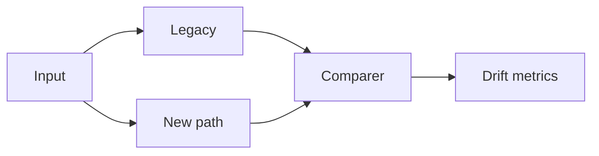

# Lesson 9.4 — Migration Risks and Dual-Run

**Module:** 09 — ESB Modernization  
**Duration:** 25–35 minutes  
**BayLearn philosophy:** WHY → WHEN → HOW. Pattern first. Technology second.

---

## Learning outcomes

By the end of this lesson you will be able to:

1. List semantic drift, missed consumers, replay, identity, and operational skill as risks.
2. Design dual-run with comparison metrics.
3. Budget a hypercare period.

---

## Enterprise scenario

New path posted cents; bus posted dollars. Dual-run without comparison is two wrongs.

> **Fiction notice:** Named companies in this course (Northbridge Bank, Harbor Retail, CareMesh Health, Atlas Manufacturing) are instructional fictions.

---

## WHY this exists

Risks: semantic drift in maps, consumers you did not know (they subscribed to the bus in 2014), identity differences (bus service account vs IAM), poison handling differences, replay differences, observability gaps, cost spikes, staff who only know the bus tool. Mitigations: inventory, dual-run, reconcilers, feature flags, training, kill-switch back to bus.

---

## WHEN an Enterprise Architect uses it

- Any money, identity, or clinical flow.
- Any flow with unknown subscribers.

### When NOT to use it

- Dual-run forever as a lifestyle.
- Comparison only of counts, not amounts.

---

## HOW — the pattern (vendor-neutral)

Compare: record counts, hash of key fields, amount totals, latency, error codes. Alert on drift. Time-box dual-run. Hypercare staffing. ADR lists risks and mitigations—Lab 8 requires this section.

### Architecture diagram

---

## HOW — AWS implementation (after the pattern)

Two DynamoDB tables or a recon file in S3. Lambda comparer. CloudWatch metrics DriftCount. Kill-switch parameter.

Do not start here. If you cannot explain the requirement and pattern without naming an AWS service, you are not ready to select technology.

---

## Anti-patterns

- No kill-switch.
- Turning off bus logs to save money during dual-run.

---

## Tradeoffs

| Dimension | Benefit | Cost / risk |
|-----------|---------|-------------|
| Dual-run | Evidence | Double cost and dual bugs |
| Instant switch | Cheap | Undetected semantic bugs |

---

## Architecture decision prompt

What kill-switch granularity do you need: per flow, per partner, or global?

Write four sentences: the requirement, the integration characteristics, the pattern, and why the rejected options fail the NFRs.

---

## Knowledge check

**Q1.** Why are counts insufficient comparison?

*Answer.* You can have the same number of rows with wrong amounts or swapped accounts.

---

## Architect's note

Dual-run is a scientific experiment. Write the hypothesis: “new path matches bus within $0.01 per day.”

---

## Next

Complete any architecture challenge attached to this lesson in the course player. Record an ADR fragment if the decision would survive a design review.
