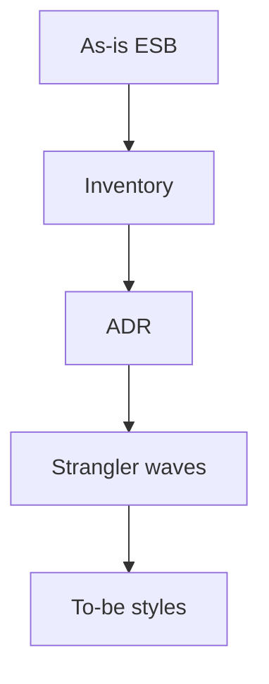

# Lesson 9.5 — Lab 8 Preview — Redesign and ADR

**Module:** 09 — ESB Modernization  
**Duration:** 25–35 minutes  
**BayLearn philosophy:** WHY → WHEN → HOW. Pattern first. Technology second.

---

## Learning outcomes

By the end of this lesson you will be able to:

1. Know the Lab 8 artifacts before opening the lab.
2. Refuse a single “target architecture” dump without keep/change.
3. Practice defending tradeoffs as if in an ARB.

---

## Enterprise scenario

Students receive a messy ESB diagram. The lab does not give the answer. This lesson tells you what “done” looks like.

> **Fiction notice:** Named companies in this course (Northbridge Bank, Harbor Retail, CareMesh Health, Atlas Manufacturing) are instructional fictions.

---

## WHY this exists

Done: current-state inventory, NFR table, keep/change/retire, strangler waves, target diagram using styles, AWS mapping as a *consequence*, risks, dual-run, cost, operations, security, and a full ADR. Implementation of a slice is optional extra; the architecture grade is the point.

---

## WHEN an Enterprise Architect uses it

- Before Lab 8.
- Before each capstone (same muscle).

### When NOT to use it

- Copying a reference architecture from the internet as the submission.

---

## HOW — the pattern (vendor-neutral)

Use the ADR template in templates/adr.md. Use the decision framework. Expect challenge questions: why not EventBridge for the 20 GB file? why not keep the bus for mobile? Answer with NFRs.

### Architecture diagram

---

## HOW — AWS implementation (after the pattern)

If you implement a slice, small Terraform is enough. Do not boil the ocean in the lab window.

Do not start here. If you cannot explain the requirement and pattern without naming an AWS service, you are not ready to select technology.

---

## Anti-patterns

- No as-is diagram.
- To-be that still is a hub with extra AWS logos.

---

## Tradeoffs

| Dimension | Benefit | Cost / risk |
|-----------|---------|-------------|
| Architecture-first lab | Matches EA job | Less time clicking AWS |
| Build-first | Demo | Shallow decisions |

---

## Architecture decision prompt

What would cause the ARB to reject your Lab 8 even if the diagram is pretty?

Write four sentences: the requirement, the integration characteristics, the pattern, and why the rejected options fail the NFRs.

---

## Knowledge check

**Q1.** Name the Lab 8 mandatory sections.

*Answer.* What stays, what changes, why, migration risks, strangler strategy—plus a complete ADR.

---

## Architect's note

If you cannot defend it aloud, it is not done. Module 14 will make you do this under time pressure.

---

## Next

Complete any architecture challenge attached to this lesson in the course player. Record an ADR fragment if the decision would survive a design review.
