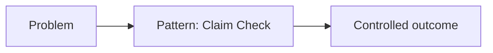

# Lesson 10.11 — Claim Check

**Module:** 10 — Enterprise Integration Patterns  
**Duration:** 25–35 minutes  
**BayLearn philosophy:** WHY → WHEN → HOW. Pattern first. Technology second.

---

## Learning outcomes

By the end of this lesson you will be able to:

1. Explain the problem Claim Check solves.
2. Draw a vendor-neutral architecture for the pattern.
3. Choose when not to use it and map a sensible AWS example.

---

## Enterprise scenario

Harbor/Northbridge incident: The payload is too large or sensitive to travel on the bus.

> **Fiction notice:** Named companies in this course (Northbridge Bank, Harbor Retail, CareMesh Health, Atlas Manufacturing) are instructional fictions.

---

## WHY this exists

Claim Check exists because The payload is too large or sensitive to travel on the bus. The pattern is a known, named response so architects can debate tradeoffs instead of inventing folklore. 

---

## WHEN an Enterprise Architect uses it

- Large files; images; optionally PHI stored aside with a pointer.

### When NOT to use it

- Claim-checking tiny JSON as ceremony; pointers without authz.

### Integration characteristics to inspect

- Problem presence
- Cost of the pattern
- Ops skill

---

## HOW — the pattern (vendor-neutral)

**Pattern:** Claim Check. Structure the design so the problem cannot recur silently. Include failure behavior in the diagram. Teach the pattern in reviews by name so teams share vocabulary.

### Architecture diagram

---

## HOW — AWS implementation (after the pattern)

**AWS example (after the pattern):** S3 object + event/message with bucket/key/version/checksum.

Do not start here. If you cannot explain the requirement and pattern without naming an AWS service, you are not ready to select technology.

---

## Anti-patterns

- Using Claim Check as decoration without the problem present.
- Renaming the pattern every project.

---

## Tradeoffs

| Dimension | Benefit | Cost / risk |
|-----------|---------|-------------|
| Apply pattern | Known failure modes | Over-engineering if the problem is absent |
| Ignore | Faster demo | Recurring incident class |

---

## Architecture decision prompt

What travels on EventBridge for a 10 GB object?

Write four sentences: the requirement, the integration characteristics, the pattern, and why the rejected options fail the NFRs.

---

## Knowledge check

**Q1.** In one sentence, what problem does Claim Check solve?

*Answer.* The payload is too large or sensitive to travel on the bus.

---

## Architect's note

Every pattern in this module must appear in at least one capstone ADR by name.

---

## Next

Complete any architecture challenge attached to this lesson in the course player. Record an ADR fragment if the decision would survive a design review.
