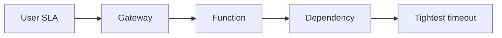

# Lesson 11.1 — Timeouts

**Module:** 11 — Reliability and Resiliency  
**Duration:** 25–35 minutes  
**BayLearn philosophy:** WHY → WHEN → HOW. Pattern first. Technology second.

---

## Learning outcomes

By the end of this lesson you will be able to:

1. Budget timeouts end-to-end.
2. Fail fast versus wait forever.
3. Align user SLA, gateway, function, and dependency timeouts.

---

## Enterprise scenario

Each layer waited 30 seconds. The user waited 2 minutes and retried. Timeouts that do not compose are a retry storm factory.

> **Fiction notice:** Named companies in this course (Northbridge Bank, Harbor Retail, CareMesh Health, Atlas Manufacturing) are instructional fictions.

---

## WHY this exists

Timeouts are how you bound waiting. They must **decrease** as you go down the stack so the caller fails first with a controlled error, or you explicitly design async. A missing timeout is an unbounded thread/concurrency leak.

---

## WHEN an Enterprise Architect uses it

- Every outbound call.
- Every API with a user SLA.

### When NOT to use it

- Timeout = 15 minutes on an interactive API.
- Timeout shorter than the legitimate p99 without a status pattern.

---

## HOW — the pattern (vendor-neutral)

Write a budget: user 2s, gateway 29s max but you use 2s, Lambda 3s, HTTP client 750ms. For long work, 202+status. Chaos lab will shrink timeouts.

### Architecture diagram

---

## HOW — AWS implementation (after the pattern)

API Gateway integration timeout, Lambda timeout, SDK socket timeouts, SQS visibility. Align them in Terraform comments as well as code.

Do not start here. If you cannot explain the requirement and pattern without naming an AWS service, you are not ready to select technology.

---

## Anti-patterns

- Default SDK timeouts in production unreviewed.

---

## Tradeoffs

| Dimension | Benefit | Cost / risk |
|-----------|---------|-------------|
| Short timeout | Protects resources | More fallbacks needed |
| Long timeout | Fewer transients surface | Pinned resources and worse storms |

---

## Architecture decision prompt

If p99 of payments is 1.2s and the API SLA is 300ms, what pattern changes besides timeout values?

Write four sentences: the requirement, the integration characteristics, the pattern, and why the rejected options fail the NFRs.

---

## Knowledge check

**Q1.** Should dependency timeout exceed caller timeout?

*Answer.* Generally no—the caller would give up while you still work, causing duplicates.

---

## Architect's note

Put the timeout budget in the ADR for any user-facing API.

---

## Next

Complete any architecture challenge attached to this lesson in the course player. Record an ADR fragment if the decision would survive a design review.
