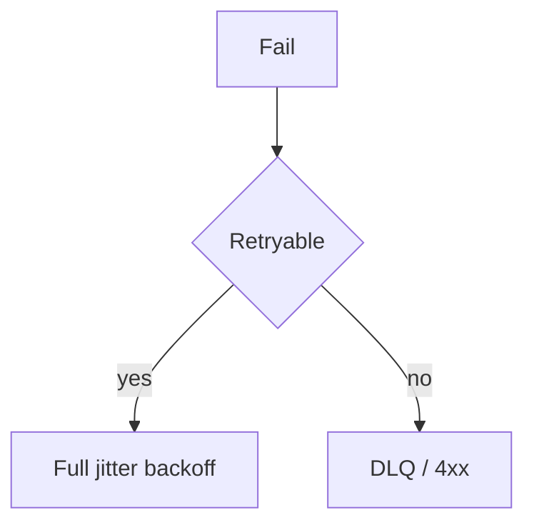

# Lesson 11.2 — Retries, Exponential Backoff, and Jitter

**Module:** 11 — Reliability and Resiliency  
**Duration:** 25–35 minutes  
**BayLearn philosophy:** WHY → WHEN → HOW. Pattern first. Technology second.

---

## Learning outcomes

By the end of this lesson you will be able to:

1. Retry only the retryable.
2. Exponential backoff.
3. Add jitter; cap attempts; count overlapping retry layers.

---

## Enterprise scenario

A region blip aligned every Lambda retry on the same second. Jitter exists because synchronized clients are a weapon against yourself.

> **Fiction notice:** Named companies in this course (Northbridge Bank, Harbor Retail, CareMesh Health, Atlas Manufacturing) are instructional fictions.

---

## WHY this exists

Backoff reduces rate. Exponential grows the sleep. Jitter randomizes to avoid herds. Caps protect the dependency. Classification prevents poison loops. You already saw this in Module 3; here it becomes a platform standard.

---

## WHEN an Enterprise Architect uses it

- Transient faults.
- 429/503.

### When NOT to use it

- Non-idempotent writes without keys.
- Sleeping inside a hot synchronous user request without a budget.

---

## HOW — the pattern (vendor-neutral)

Standard: max attempts, base delay, full jitter (random 0..cap). Document SDK + queue + app retries. Chaos lab: induce 500s and watch.

### Architecture diagram

---

## HOW — AWS implementation (after the pattern)

AWS SDK retry modes, SQS, Step Functions retry clauses with backoff. Prefer controlling retries in one layer when possible.

Do not start here. If you cannot explain the requirement and pattern without naming an AWS service, you are not ready to select technology.

---

## Anti-patterns

- retry=infinite.
- Backoff without jitter on a fleet of 1000 Lambdas.

---

## Tradeoffs

| Dimension | Benefit | Cost / risk |
|-----------|---------|-------------|
| Retry | Survive blips | Amplify outages if misclassified |

---

## Architecture decision prompt

Three layers retry 3 times each without jitter. Sketch the worst-case request multiplication.

Write four sentences: the requirement, the integration characteristics, the pattern, and why the rejected options fail the NFRs.

---

## Knowledge check

**Q1.** What is full jitter?

*Answer.* Random delay uniformly between 0 and the current cap, reducing synchronization.

---

## Architect's note

Make retry policy a shared library, not artisanal per function.

---

## Next

Complete any architecture challenge attached to this lesson in the course player. Record an ADR fragment if the decision would survive a design review.
