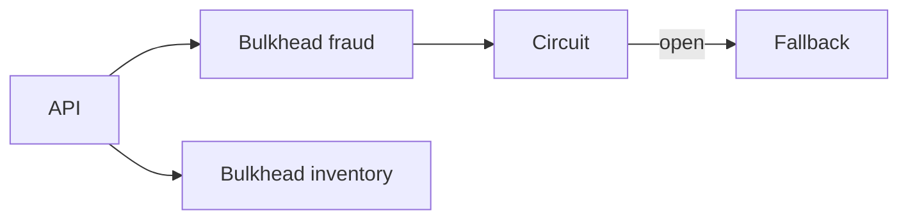

# Lesson 11.3 — Circuit Breakers and Bulkheads

**Module:** 11 — Reliability and Resiliency  
**Duration:** 25–35 minutes  
**BayLearn philosophy:** WHY → WHEN → HOW. Pattern first. Technology second.

---

## Learning outcomes

By the end of this lesson you will be able to:

1. Open the circuit on error rate, not on a single 500.
2. Isolate pools (bulkhead) so one dependency cannot take all concurrency.
3. Define half-open probes.

---

## Enterprise scenario

Fraud was down. Every checkout thread waited on fraud. Checkout died. Bulkheads exist so inventory still works.

> **Fiction notice:** Named companies in this course (Northbridge Bank, Harbor Retail, CareMesh Health, Atlas Manufacturing) are instructional fictions.

---

## WHY this exists

Circuit breakers stop calling a sick dependency for a cool-down, then probe. Bulkheads partition resources (separate queues, reserved concurrency). Together they implement failure isolation—the same idea as independent consumers.

---

## WHEN an Enterprise Architect uses it

- Unreliable or optional dependencies.
- Shared thread/concurrency pools.

### When NOT to use it

- Circuits that never half-open.
- One queue for all dependency types.

---

## HOW — the pattern (vendor-neutral)

Per-dependency queue or reserved concurrency. Metrics: error rate, latency. Fallback: cached response, skip optional check, or 503 with retry-after. Chaos: kill a dependency.

### Architecture diagram

---

## HOW — AWS implementation (after the pattern)

Lambda reserved concurrency, separate SQS, Step Functions catchers. There is no magic AWS “circuit breaker service”—it is a design.

Do not start here. If you cannot explain the requirement and pattern without naming an AWS service, you are not ready to select technology.

---

## Anti-patterns

- Global concurrency shared by all outbound calls.
- Fallback that returns “paid” when fraud is down.

---

## Tradeoffs

| Dimension | Benefit | Cost / risk |
|-----------|---------|-------------|
| Breaker | Protects caller | Need a fallback story |
| Bulkhead | Isolation | More capacity planning |

---

## Architecture decision prompt

Fraud is optional for orders under $20. How do open-circuit and business policy interact?

Write four sentences: the requirement, the integration characteristics, the pattern, and why the rejected options fail the NFRs.

---

## Knowledge check

**Q1.** What is half-open?

*Answer.* A state that allows a probe request to see if the dependency recovered before fully closing the circuit.

---

## Architect's note

Fallback is a product decision. Architects must drag product into the room.

---

## Next

Complete any architecture challenge attached to this lesson in the course player. Record an ADR fragment if the decision would survive a design review.
