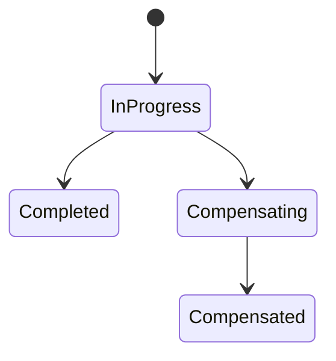

# Lesson 11.4 — Idempotency, Duplicates, and Partial Failure

**Module:** 11 — Reliability and Resiliency  
**Duration:** 25–35 minutes  
**BayLearn philosophy:** WHY → WHEN → HOW. Pattern first. Technology second.

---

## Learning outcomes

By the end of this lesson you will be able to:

1. Treat duplicates as normal.
2. Define partial failure in sagas and in batch files.
3. Make compensations idempotent too.

---

## Enterprise scenario

Inventory reserved; payment later failed; compensation released; a duplicate reserve arrived; stock drifted. Partial failure plus duplicates is the hard mode of integration.

> **Fiction notice:** Named companies in this course (Northbridge Bank, Harbor Retail, CareMesh Health, Atlas Manufacturing) are instructional fictions.

---

## WHY this exists

Distributed work fails in the middle. Architects define the unit of atomicity they actually have (usually one system). Across systems, sagas and compensations. Duplicates replay any of those steps. Therefore **every step and every compensation** needs an idempotency key. Partial file posts need a policy (Module 6).

---

## WHEN an Enterprise Architect uses it

- Any multi-step integration.
- Any at-least-once channel.

### When NOT to use it

- Hoping TCP is enough.
- Compensation that always refunds even if charge never succeeded.

---

## HOW — the pattern (vendor-neutral)

State machine: not-started, done, compensated. Keys on each. Chaos lab: duplicate event, duplicate file, timeout after commit.

### Architecture diagram

---

## HOW — AWS implementation (after the pattern)

DynamoDB transactions where local; Step Functions for saga visibility; conditional writes.

Do not start here. If you cannot explain the requirement and pattern without naming an AWS service, you are not ready to select technology.

---

## Anti-patterns

- Voiding a payment that was never authorized because the error was ambiguous.

---

## Tradeoffs

| Dimension | Benefit | Cost / risk |
|-----------|---------|-------------|
| Saga | Cross-system outcome | Complexity |
| Single ledger | ACID | Not always possible |

---

## Architecture decision prompt

Payment succeeds, inventory fails: list the messages you emit and which keys they use.

Write four sentences: the requirement, the integration characteristics, the pattern, and why the rejected options fail the NFRs.

---

## Knowledge check

**Q1.** Why must compensations be idempotent?

*Answer.* They are also retried. Double refund is a new incident.

---

## Architect's note

Capstone 2’s failure scenario is this lesson. Rehearse it.

---

## Next

Complete any architecture challenge attached to this lesson in the course player. Record an ADR fragment if the decision would survive a design review.
