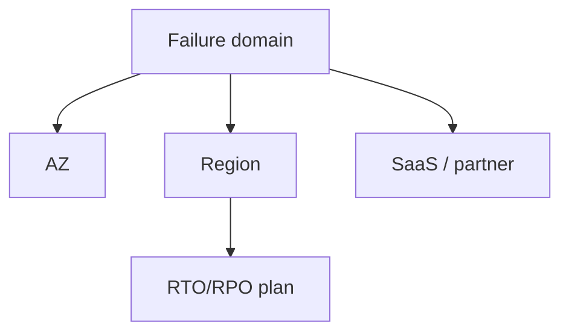

# Lesson 11.5 — Dependency and Regional Failure

**Module:** 11 — Reliability and Resiliency  
**Duration:** 25–35 minutes  
**BayLearn philosophy:** WHY → WHEN → HOW. Pattern first. Technology second.

---

## Learning outcomes

By the end of this lesson you will be able to:

1. Classify dependencies as required vs optional.
2. Plan degraded modes.
3. Talk honestly about regional failure (RPO/RTO) for integration platforms.

---

## Enterprise scenario

An entire region’s EventBridge was fine but DynamoDB in that region was not. “We are multi-AZ” did not help a regional table.

> **Fiction notice:** Named companies in this course (Northbridge Bank, Harbor Retail, CareMesh Health, Atlas Manufacturing) are instructional fictions.

---

## WHY this exists

Failure domains: instance, AZ, region, dependency SaaS, partner. Integration platforms often forget the partner is a failure domain. Regional failure requires data replication strategy, DNS, and idempotent replay of in-flight work. This is expensive; not every flow needs active-active.

---

## WHEN an Enterprise Architect uses it

- Critical money/health flows.
- When executives ask “are we DR ready?”

### When NOT to use it

- Active-active for a report that can be 24h late.
- Claiming multi-region because you use a global service name.

---

## HOW — the pattern (vendor-neutral)

Per flow: RTO/RPO, failover runbook, in-flight message story (they may replay). Chaos: disable a VPC endpoint, deny IAM, pause a partner.

### Architecture diagram

---

## HOW — AWS implementation (after the pattern)

DynamoDB global tables (with conflict rules), S3 RR, multi-region EventBridge, Route53. Cost in the ADR. Labs stay single-region for cost; capstones must *design* DR even if they do not deploy it.

Do not start here. If you cannot explain the requirement and pattern without naming an AWS service, you are not ready to select technology.

---

## Anti-patterns

- DR plan that is only a PowerPoint.
- Failing over producers but not consumers.

---

## Tradeoffs

| Dimension | Benefit | Cost / risk |
|-----------|---------|-------------|
| Active-active | Low RTO | Conflict and cost |
| Pilot light | Cheaper | Higher RTO, more runbook skill |

---

## Architecture decision prompt

What happens to SQS messages in a region you abandon, and how do you prevent double-post on failover?

Write four sentences: the requirement, the integration characteristics, the pattern, and why the rejected options fail the NFRs.

---

## Knowledge check

**Q1.** Is multi-AZ the same as regional DR?

*Answer.* No. Regional loss takes all AZs in that region.

---

## Architect's note

Write RTO/RPO per integration class, not one number for the company.

---

## Next

Complete any architecture challenge attached to this lesson in the course player. Record an ADR fragment if the decision would survive a design review.
