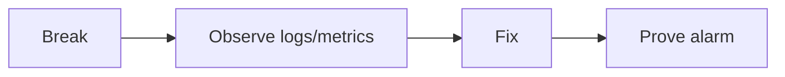

# Lesson 11.6 — Chaos Lab Playbook

**Module:** 11 — Reliability and Resiliency  
**Duration:** 25–35 minutes  
**BayLearn philosophy:** WHY → WHEN → HOW. Pattern first. Technology second.

---

## Learning outcomes

By the end of this lesson you will be able to:

1. Know the seven failure scenarios you will run.
2. Diagnose with logs and metrics before fixing.
3. Leave the system more alarmed than you found it.

---

## Enterprise scenario

The chaos lab is not vandalism. It is a scripted learning design: break, observe, fix, prove the alarm.

> **Fiction notice:** Named companies in this course (Northbridge Bank, Harbor Retail, CareMesh Health, Atlas Manufacturing) are instructional fictions.

---

## WHY this exists

Scenarios: Lambda failure, API timeout, consumer unavailable, invalid message, duplicate event, duplicate file, dependency outage. For each: expected user impact, expected metric, expected DLQ behavior, expected runbook step. If nothing alarms, the lab is incomplete.

---

## WHEN an Enterprise Architect uses it

- After Labs 2–7 exist.
- Before claiming production-readiness in capstones.

### When NOT to use it

- Breaking shared class accounts.
- Only breaking things you already know how to fix without looking at telemetry.

---

## HOW — the pattern (vendor-neutral)

Use the chaos lab workbook. Record screenshots of alarms. Add the missing alarm if it did not fire. That is the real deliverable.

### Architecture diagram

---

## HOW — AWS implementation (after the pattern)

Fault injection via bad payloads, IAM denies, reserved concurrency 0, shortened timeouts, re-sending files. Prefer these over attacking AWS itself.

Do not start here. If you cannot explain the requirement and pattern without naming an AWS service, you are not ready to select technology.

---

## Anti-patterns

- Fixing without looking at CloudWatch.
- Leaving injected poison in a shared bucket.

---

## Tradeoffs

| Dimension | Benefit | Cost / risk |
|-----------|---------|-------------|
| Chaos in lab accounts | Learning | Need cleanup |
| Only happy path | Fast | First production failure is the teacher |

---

## Architecture decision prompt

Which scenario is most likely to produce a silent success, and what metric would have caught it?

Write four sentences: the requirement, the integration characteristics, the pattern, and why the rejected options fail the NFRs.

---

## Knowledge check

**Q1.** What if the DLQ did not receive the poison message?

*Answer.* FAIL the lab until redrive policy and IAM are fixed—do not skip.

---

## Architect's note

Failure-first is a course differentiator. Take it seriously.

---

## Next

Complete any architecture challenge attached to this lesson in the course player. Record an ADR fragment if the decision would survive a design review.
