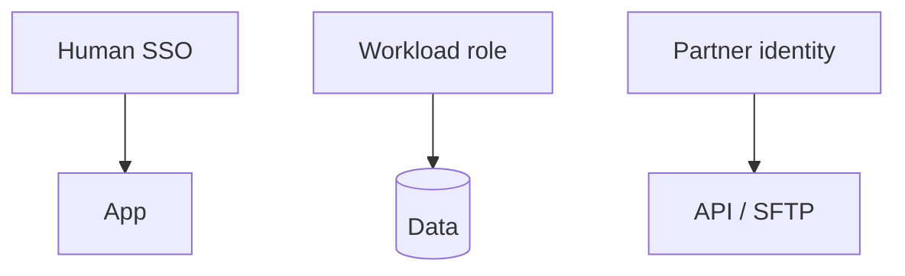

# Lesson 12.1 — Authn, Authz, IAM, Least Privilege

**Module:** 12 — Security  
**Duration:** 25–35 minutes  
**BayLearn philosophy:** WHY → WHEN → HOW. Pattern first. Technology second.

---

## Learning outcomes

By the end of this lesson you will be able to:

1. Separate human, partner, and workload identities.
2. Least privilege on every Lambda role.
3. No star policies on data planes.

---

## Enterprise scenario

The lab’s insecure architecture uses dynamodb:* and s3:* because the tutorial did. You will remove that.

> **Fiction notice:** Named companies in this course (Northbridge Bank, Harbor Retail, CareMesh Health, Atlas Manufacturing) are instructional fictions.

---

## WHY this exists

Identity is the new perimeter for cloud APIs, but files and events still need it too. Workload IAM should name tables, prefixes, and kms keys. Humans use SSO. Partners get scoped users/clients. Authorization continues in-app for object-level rules.

---

## WHEN an Enterprise Architect uses it

- Every lab and capstone.
- Cross-account integrations.

### When NOT to use it

- A shared “integration-admin” role in prod.
- Access keys in Lambda environment variables when roles exist.

---

## HOW — the pattern (vendor-neutral)

One role per function. Conditions on prefixes. Access Analyzer mentally. Security lab starts from a bad policy and ends at least privilege.

### Architecture diagram

---

## HOW — AWS implementation (after the pattern)

IAM roles, resource policies, permission boundaries if the platform requires. API Gateway authorizers. Transfer users mapped to scoped roles.

Do not start here. If you cannot explain the requirement and pattern without naming an AWS service, you are not ready to select technology.

---

## Anti-patterns

- AdministratorAccess on a processor.
- Checked-in keys.

---

## Tradeoffs

| Dimension | Benefit | Cost / risk |
|-----------|---------|-------------|
| Fine-grained IAM | Blast radius | More Terraform |
| Coarse roles | Speed | One leak is all data |

---

## Architecture decision prompt

Why is s3:GetObject on arn:aws:s3:::bucket/* different from a prefix condition for one partner?

Write four sentences: the requirement, the integration characteristics, the pattern, and why the rejected options fail the NFRs.

---

## Knowledge check

**Q1.** What is least privilege?

*Answer.* Only the actions and resources required for the function’s job, with conditions where possible.

---

## Architect's note

If Terraform uses * “to get it working,” the next lab step is to tighten, not to move on.

---

## Next

Complete any architecture challenge attached to this lesson in the course player. Record an ADR fragment if the decision would survive a design review.
