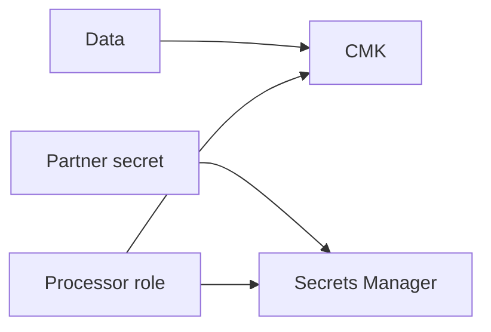

# Lesson 12.2 — Encryption, KMS, and Secrets

**Module:** 12 — Security  
**Duration:** 25–35 minutes  
**BayLearn philosophy:** WHY → WHEN → HOW. Pattern first. Technology second.

---

## Learning outcomes

By the end of this lesson you will be able to:

1. Encrypt in transit and at rest.
2. CMKs by data class.
3. Secrets Manager/SSM for secrets, never git.

---

## Enterprise scenario

A partner password in terraform.tfvars committed to a public fork. Secrets management is an integration concern because integrations are where credentials accumulate.

> **Fiction notice:** Named companies in this course (Northbridge Bank, Harbor Retail, CareMesh Health, Atlas Manufacturing) are instructional fictions.

---

## WHY this exists

TLS everywhere. KMS for S3, SQS, SNS, EventBridge, DynamoDB where offered. Envelope encryption for application-level fields if needed. Secrets: rotation, least privilege to GetSecretValue, no logging secrets. Transfer keys in Secrets Manager or parameter store with tight IAM.

---

## WHEN an Enterprise Architect uses it

- All labs that store data.
- Partner credentials.

### When NOT to use it

- Custom crypto without a review.
- A single CMK and a 200-person decrypt role.

---

## HOW — the pattern (vendor-neutral)

Default encryption in Terraform modules. tfvars gitignored. Rotation runbook. Security lab includes a secret in the wrong place for you to find.

### Architecture diagram

---

## HOW — AWS implementation (after the pattern)

AWS KMS, Secrets Manager, ACM for HTTP. S3 bucket keys to reduce KMS cost.

Do not start here. If you cannot explain the requirement and pattern without naming an AWS service, you are not ready to select technology.

---

## Anti-patterns

- KMS key policy *.
- Printing secrets in CloudWatch.

---

## Tradeoffs

| Dimension | Benefit | Cost / risk |
|-----------|---------|-------------|
| CMK per class | Control | Key sprawl |
| AWS-owned keys | Simple | Weaker isolation story for some regulators |

---

## Architecture decision prompt

Who can decrypt the payments CMK, and is that logged in CloudTrail?

Write four sentences: the requirement, the integration characteristics, the pattern, and why the rejected options fail the NFRs.

---

## Knowledge check

**Q1.** Why not put secrets in Lambda env vars?

*Answer.* They appear in console, logs, and deploy artifacts more easily; rotation and IAM to secrets APIs are weaker.

---

## Architect's note

Encryption is necessary, not sufficient. Combine with IAM and logging.

---

## Next

Complete any architecture challenge attached to this lesson in the course player. Record an ADR fragment if the decision would survive a design review.
