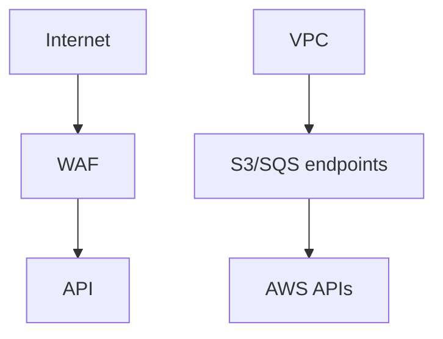

# Lesson 12.3 — API, SFTP, and Network Isolation

**Module:** 12 — Security  
**Duration:** 25–35 minutes  
**BayLearn philosophy:** WHY → WHEN → HOW. Pattern first. Technology second.

---

## Learning outcomes

By the end of this lesson you will be able to:

1. Private APIs for internal; public with WAF for external.
2. SFTP allow lists and key auth.
3. VPC endpoints for S3/SQS to avoid the public internet path.

---

## Enterprise scenario

A “private” API was still execute-api on the internet with a long-lived key. Network isolation is layered with identity, not a replacement.

> **Fiction notice:** Named companies in this course (Northbridge Bank, Harbor Retail, CareMesh Health, Atlas Manufacturing) are instructional fictions.

---

## WHY this exists

North-south: WAF, mTLS or JWT, rate limits. East-west: private APIs, VPC, no public RDS. SFTP: restricted IP where contracts allow, no FTP. Data planes: gateway endpoints so processors do not need NAT to reach S3. Cross-account: resource policies + ExternalId.

---

## WHEN an Enterprise Architect uses it

- Partner edges.
- High-sensitivity processors.

### When NOT to use it

- IP allow list as the only control.
- Public Transfer server without monitoring.

---

## HOW — the pattern (vendor-neutral)

Draw network diagrams for capstones. Labs may stay simple for cost (no NAT) using serverless public invoke + IAM. Document the production delta.

### Architecture diagram

---

## HOW — AWS implementation (after the pattern)

API Gateway private, VPC interface/gateway endpoints, Transfer security policies, WAF. Avoid NAT in labs.

Do not start here. If you cannot explain the requirement and pattern without naming an AWS service, you are not ready to select technology.

---

## Anti-patterns

- 0.0.0.0/0 on SFTP “temporarily.”
- Public NACL wide open plus a private story on slides.

---

## Tradeoffs

| Dimension | Benefit | Cost / risk |
|-----------|---------|-------------|
| Private + endpoints | Smaller attack surface | Cost/complexity |
| Public + strong IAM | Simple labs | Relies heavily on identity |

---

## Architecture decision prompt

Why might a lab omit VPC while a healthcare capstone diagram includes it?

Write four sentences: the requirement, the integration characteristics, the pattern, and why the rejected options fail the NFRs.

---

## Knowledge check

**Q1.** Does a VPC make IAM optional?

*Answer.* No. Identity still binds actions. Network is defense in depth.

---

## Architect's note

Show the production network in diagrams even when the lab is serverless-simple.

---

## Next

Complete any architecture challenge attached to this lesson in the course player. Record an ADR fragment if the decision would survive a design review.
