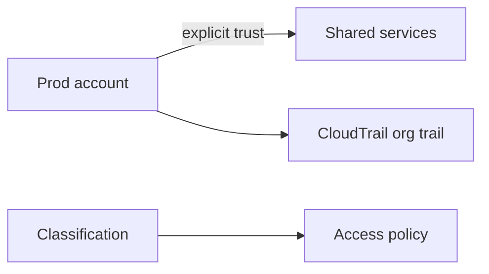

# Lesson 12.4 — Audit, Classification, and Cross-Account

**Module:** 12 — Security  
**Duration:** 25–35 minutes  
**BayLearn philosophy:** WHY → WHEN → HOW. Pattern first. Technology second.

---

## Learning outcomes

By the end of this lesson you will be able to:

1. Classify data (public, internal, confidential, restricted).
2. CloudTrail and application audit for who did what.
3. Cross-account as an explicit trust design.

---

## Enterprise scenario

A shared services account could read healthcare payloads because the bucket policy trusted the org. Cross-account is not a convenience flag.

> **Fiction notice:** Named companies in this course (Northbridge Bank, Harbor Retail, CareMesh Health, Atlas Manufacturing) are instructional fictions.

---

## WHY this exists

Classification drives encryption, retention, access, and whether an agent may see a field. Audit: API trail + file catalog + who approved reprocess. Cross-account: named principals, ExternalId, kms grants, no org-wide s3 trust. Capstone 3 is strict.

---

## WHEN an Enterprise Architect uses it

- All regulated capstones.
- Platform shared services.

### When NOT to use it

- Org-wide bucket policies.
- Agents as an audit bypass.

---

## HOW — the pattern (vendor-neutral)

Tag data and buses. Central log archive. Separate accounts for prod vs sandbox. Security lab includes a bad bucket policy.

### Architecture diagram

---

## HOW — AWS implementation (after the pattern)

CloudTrail, S3 access logs, DynamoDB streams for catalog audit, KMS grants, EventBridge resource policies.

Do not start here. If you cannot explain the requirement and pattern without naming an AWS service, you are not ready to select technology.

---

## Anti-patterns

- Classification in a wiki only.
- Agent with DynamoDB read on all tables for “support.”

---

## Tradeoffs

| Dimension | Benefit | Cost / risk |
|-----------|---------|-------------|
| Separate accounts | Blast radius | More integration policies |
| One account | Simple | One breach is everything |

---

## Architecture decision prompt

An analytics account wants copies of events. What is stripped, and who approves?

Write four sentences: the requirement, the integration characteristics, the pattern, and why the rejected options fail the NFRs.

---

## Knowledge check

**Q1.** What is ExternalId for?

*Answer.* To prevent confused-deputy when a third party assumes your role.

---

## Architect's note

The unacceptable AI→database line is also a classification and audit failure.

---

## Next

Complete any architecture challenge attached to this lesson in the course player. Record an ADR fragment if the decision would survive a design review.
