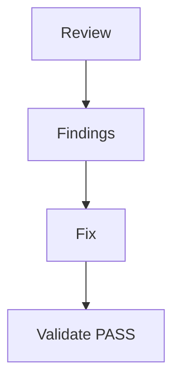

# Lesson 12.5 — Security Lab Method

**Module:** 12 — Security  
**Duration:** 25–35 minutes  
**BayLearn philosophy:** WHY → WHEN → HOW. Pattern first. Technology second.

---

## Learning outcomes

By the end of this lesson you will be able to:

1. Use a finding list: identity, encryption, network, secrets, audit, data path.
2. Fix and re-validate.
3. Do not add theater controls.

---

## Enterprise scenario

The insecure architecture is intentional. Your job is a professional review, not a hunt for a single bug.

> **Fiction notice:** Named companies in this course (Northbridge Bank, Harbor Retail, CareMesh Health, Atlas Manufacturing) are instructional fictions.

---

## WHY this exists

Walk the data: who can invoke, who can read, where secrets live, whether logs contain payloads, whether partners are isolated, whether KMS is used, whether public access is blocked, whether DLQ is readable by too many. Produce a findings table, then Terraform diffs.

---

## WHEN an Enterprise Architect uses it

- The security lab.
- Capstone security designs.

### When NOT to use it

- Only running a scanner and not tracing a file.

---

## HOW — the pattern (vendor-neutral)

Workbook checklist. Automated validate_lab.sh should fail until IAM is tight and public access blocked.

### Architecture diagram

---

## HOW — AWS implementation (after the pattern)

IAM Access Analyzer (conceptually), S3 PublicAccessBlock, policy diffs in git.

Do not start here. If you cannot explain the requirement and pattern without naming an AWS service, you are not ready to select technology.

---

## Anti-patterns

- Fixing only what the script checks and leaving a God role the script missed—extend the script.

---

## Tradeoffs

| Dimension | Benefit | Cost / risk |
|-----------|---------|-------------|
| Deep review | Real risk reduction | Time |
| Scanner only | Fast | Misses business data paths |

---

## Architecture decision prompt

Which finding would you severity-rate as critical in a payments platform?

Write four sentences: the requirement, the integration characteristics, the pattern, and why the rejected options fail the NFRs.

---

## Knowledge check

**Q1.** Why can a scanner miss partner prefix isolation?

*Answer.* It may see encryption on and public access off, yet one role still lists the whole bucket.

---

## Architect's note

If you find extra issues, add assertions. That is platform engineering.

---

## Next

Complete any architecture challenge attached to this lesson in the course player. Record an ADR fragment if the decision would survive a design review.
