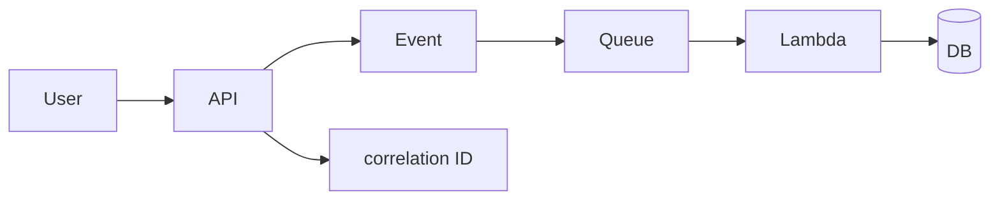

# Lesson 13.1 — Tracing a Transaction Across Styles

**Module:** 13 — Observability  
**Duration:** 25–35 minutes  
**BayLearn philosophy:** WHY → WHEN → HOW. Pattern first. Technology second.

---

## Learning outcomes

By the end of this lesson you will be able to:

1. Propagate a correlation ID from user or partner through API, event, queue, Lambda, DB, and file catalog.
2. Make support searchable by that ID.
3. Treat missing IDs as defects.

---

## Enterprise scenario

A user has a checkout ID. Ops has three log groups. Without a correlation ID, the dashboard is a collage.

> **Fiction notice:** Named companies in this course (Northbridge Bank, Harbor Retail, CareMesh Health, Atlas Manufacturing) are instructional fictions.

---

## WHY this exists

A single business transaction often crosses all styles. Observability is the ability to follow it. Correlation IDs (and trace IDs) must be accepted from callers or created at the edge, then copied into events, SQS attributes, S3 metadata, and log lines.

---

## WHEN an Enterprise Architect uses it

- Every production integration.
- Every lab from 2 onward.

### When NOT to use it

- A new ID at every hop with no link.
- Only X-Ray without structured logs (or vice versa) as religion.

---

## HOW — the pattern (vendor-neutral)

Standard header: x-correlation-id. Envelope field correlationId. File catalog field. Agent tools query by it. Lab 2 introduces it; Lab 13 visualizes it.

### Architecture diagram

---

## HOW — AWS implementation (after the pattern)

API Gateway access logs, Lambda powertools-style JSON logs, X-Ray/OTel traces, EventBridge put with the ID in detail, SQS message attributes.

Do not start here. If you cannot explain the requirement and pattern without naming an AWS service, you are not ready to select technology.

---

## Anti-patterns

- Logging the ID sometimes, under three different field names.

---

## Tradeoffs

| Dimension | Benefit | Cost / risk |
|-----------|---------|-------------|
| One ID everywhere | Supportable | Discipline |
| Hop-local IDs | Easy | Unsupportable |

---

## Architecture decision prompt

If a partner file has no ID, where do you mint one, and how do you return it in the ACK?

Write four sentences: the requirement, the integration characteristics, the pattern, and why the rejected options fail the NFRs.

---

## Knowledge check

**Q1.** Where is the ID born for an SFTP file?

*Answer.* At the landing processor if the partner did not send one; persist and ACK it.

---

## Architect's note

Standardize the field name in a platform guideline of one page.

---

## Next

Complete any architecture challenge attached to this lesson in the course player. Record an ADR fragment if the decision would survive a design review.
