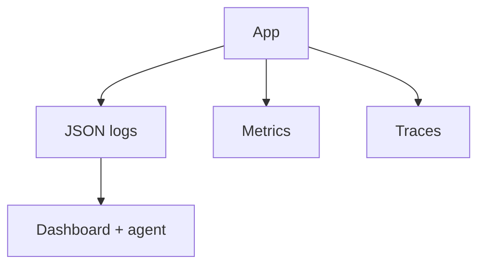

# Lesson 13.2 — Structured Logs, Metrics, and Traces

**Module:** 13 — Observability  
**Duration:** 25–35 minutes  
**BayLearn philosophy:** WHY → WHEN → HOW. Pattern first. Technology second.

---

## Learning outcomes

By the end of this lesson you will be able to:

1. Logs for details, metrics for SLOs, traces for topology.
2. JSON logs with level, service, correlationId, outcome.
3. Cardinality discipline on metrics.

---

## Enterprise scenario

Someone graphed customerId as a metric label. The bill and the UI died. Cardinality is an architecture concern.

> **Fiction notice:** Named companies in this course (Northbridge Bank, Harbor Retail, CareMesh Health, Atlas Manufacturing) are instructional fictions.

---

## WHY this exists

Three pillars still matter. Structured logs enable the ops agent (Module 15) to explain errors. Metrics: latency, errors, depth, files. Traces: hop timing. Do not emit unbounded label sets. Do not log payloads of restricted data.

---

## WHEN an Enterprise Architect uses it

- All services.
- Dashboards and agents.

### When NOT to use it

- Debug logs of PHI in prod.
- A unique metric name per partner without aggregation.

---

## HOW — the pattern (vendor-neutral)

Log schema. Metric catalog. Trace sampling. Redaction. Lab 13 requires JSON logs.

### Architecture diagram

---

## HOW — AWS implementation (after the pattern)

CloudWatch Logs, Embedded Metric Format or explicit PutMetric, X-Ray. Cost: log ingestion. Set retention.

Do not start here. If you cannot explain the requirement and pattern without naming an AWS service, you are not ready to select technology.

---

## Anti-patterns

- print(event) of a payment in prod.
- INFO logs without correlationId.

---

## Tradeoffs

| Dimension | Benefit | Cost / risk |
|-----------|---------|-------------|
| Verbose logs | Debuggability | Cost and leakage |
| Metrics only | Cheap SLO | Cannot explain a single failure |

---

## Architecture decision prompt

Which of customerId, partnerId, httpStatus belong on a metric dimension?

Write four sentences: the requirement, the integration characteristics, the pattern, and why the rejected options fail the NFRs.

---

## Knowledge check

**Q1.** Why is high cardinality expensive?

*Answer.* Each unique label set is a time series. Unbounded IDs explode cost and dashboards.

---

## Architect's note

The ops agent is only as good as your log schema.

---

## Next

Complete any architecture challenge attached to this lesson in the course player. Record an ADR fragment if the decision would survive a design review.
