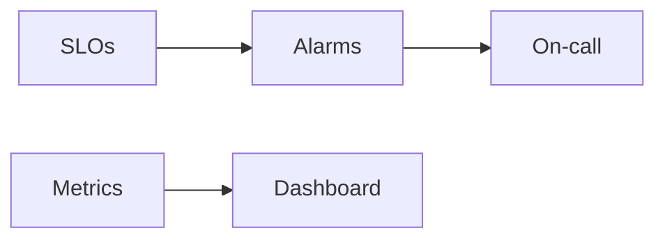

# Lesson 13.3 — Dashboards, Alerts, and SLOs

**Module:** 13 — Observability  
**Duration:** 25–35 minutes  
**BayLearn philosophy:** WHY → WHEN → HOW. Pattern first. Technology second.

---

## Learning outcomes

By the end of this lesson you will be able to:

1. Alert on symptoms customers feel, plus leading indicators (depth, DLQ).
2. Dashboard the course list: transactions, success, failure, latency, depth, DLQ, file counts, duration.
3. Page humans sparingly.

---

## Enterprise scenario

A CPU alarm paged at 3am while the DLQ silently grew. Alerts should match the operating model.

> **Fiction notice:** Named companies in this course (Northbridge Bank, Harbor Retail, CareMesh Health, Atlas Manufacturing) are instructional fictions.

---

## WHY this exists

SLOs: availability of APIs, lag of queues, time to process a file. Alerts: burn rate, DLQ > 0 for payments, error rate. Dashboards for humans and for executives (business metrics: files posted, dollars). Lab 13 builds this dashboard.

---

## WHEN an Enterprise Architect uses it

- Any production-like lab.
- Capstone ops design.

### When NOT to use it

- Paging on every 429.
- Dashboards nobody opens.

---

## HOW — the pattern (vendor-neutral)

Choose 5–9 golden signals. Run a game day. The chaos lab should trip these alerts.

### Architecture diagram

---

## HOW — AWS implementation (after the pattern)

CloudWatch dashboards and alarms. Optional email SNS. Keep it cheap. Terraform the dashboard so it is not click-ops.

Do not start here. If you cannot explain the requirement and pattern without naming an AWS service, you are not ready to select technology.

---

## Anti-patterns

- No DLQ alarm.
- Dashboard widgets that require a PhD to interpret at 3am.

---

## Tradeoffs

| Dimension | Benefit | Cost / risk |
|-----------|---------|-------------|
| Few alerts | Actionable | Risk of blind spots |
| Many alerts | Coverage theater | Ignored pages |

---

## Architecture decision prompt

Which two alarms are mandatory for a payment file pipeline?

Write four sentences: the requirement, the integration characteristics, the pattern, and why the rejected options fail the NFRs.

---

## Knowledge check

**Q1.** Name a leading indicator of a file SLA miss.

*Answer.* Queue depth or processing duration approaching cutoff, not only “file failed.”

---

## Architect's note

If chaos does not page, add the alarm before you leave the lab.

---

## Next

Complete any architecture challenge attached to this lesson in the course player. Record an ADR fragment if the decision would survive a design review.
