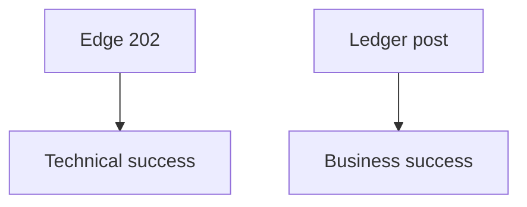

# Lesson 13.4 — Business vs Technical Metrics

**Module:** 13 — Observability  
**Duration:** 25–35 minutes  
**BayLearn philosophy:** WHY → WHEN → HOW. Pattern first. Technology second.

---

## Learning outcomes

By the end of this lesson you will be able to:

1. Count business outcomes (orders posted, files accepted) separately from HTTP 200s.
2. Use them in executive and agent answers.
3. Do not let a 200 on ingest equal “settled.”

---

## Enterprise scenario

The API success rate was 99.9%. Settlement was 0 because files quarantined. Technical metrics lied about the business.

> **Fiction notice:** Named companies in this course (Northbridge Bank, Harbor Retail, CareMesh Health, Atlas Manufacturing) are instructional fictions.

---

## WHY this exists

Technical: latency, 5xx, throttles, iterator age. Business: orders completed, payments authorized, files posted, duplicate rejects, compensation count. Architects define both. Agents should prefer business metrics for “how many failed?” questions.

---

## WHEN an Enterprise Architect uses it

- Every capstone.
- Ops agent tools.

### When NOT to use it

- Only 200 rates on a gateway that 202s everything.

---

## HOW — the pattern (vendor-neutral)

Emit business metrics at domain completion, not at edge receipt. Lab 13 includes file counts and transaction success.

### Architecture diagram

---

## HOW — AWS implementation (after the pattern)

CloudWatch custom metrics or EMF from processors. Names like PaymentsPosted, FilesQuarantined.

Do not start here. If you cannot explain the requirement and pattern without naming an AWS service, you are not ready to select technology.

---

## Anti-patterns

- Agent answering from gateway 200s.

---

## Tradeoffs

| Dimension | Benefit | Cost / risk |
|-----------|---------|-------------|
| Business metrics | Truth for execs/agents | Must instrument domain |
| Edge metrics only | Easy | False calm |

---

## Architecture decision prompt

Which metric answers “how many transactions failed for customer ABC?” and where is it stored?

Write four sentences: the requirement, the integration characteristics, the pattern, and why the rejected options fail the NFRs.

---

## Knowledge check

**Q1.** Why is HTTP 202 a poor “success” for payments?

*Answer.* It means accepted for processing, not posted to the ledger.

---

## Architect's note

Tool design for agents starts with metric naming.

---

## Next

Complete any architecture challenge attached to this lesson in the course player. Record an ADR fragment if the decision would survive a design review.
