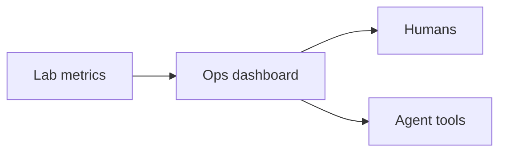

# Lesson 13.5 — Integration Operations Dashboard Lab

**Module:** 13 — Observability  
**Duration:** 25–35 minutes  
**BayLearn philosophy:** WHY → WHEN → HOW. Pattern first. Technology second.

---

## Learning outcomes

By the end of this lesson you will be able to:

1. Know the widgets you will build.
2. Wire them to real resources from prior labs or a dedicated stack.
3. Include DLQ and file counts.

---

## Enterprise scenario

The lab is the dashboard. If it is screenshots of empty graphs, you did not emit metrics.

> **Fiction notice:** Named companies in this course (Northbridge Bank, Harbor Retail, CareMesh Health, Atlas Manufacturing) are instructional fictions.

---

## WHY this exists

Widgets: transactions, success, failure, latency, queue depth, DLQ, file counts, processing duration. Filters by lab prefix. A note on cost of custom metrics. This dashboard is also what the agent in Module 15 should conceptually read.

---

## WHEN an Enterprise Architect uses it

- Lab 13.
- Capstone ops evidence.

### When NOT to use it

- A dashboard in a different account you cannot see.
- Widgets on AWS-generated metrics only if you never emitted business metrics.

---

## HOW — the pattern (vendor-neutral)

Terraform dashboard JSON. Validate script checks dashboard exists and sample metrics are present after a test transaction.

### Architecture diagram

---

## HOW — AWS implementation (after the pattern)

aws_cloudwatch_dashboard. Keep region consistent.

Do not start here. If you cannot explain the requirement and pattern without naming an AWS service, you are not ready to select technology.

---

## Anti-patterns

- Click-ops dashboard not in git.
- Empty widgets as “architecture.”

---

## Tradeoffs

| Dimension | Benefit | Cost / risk |
|-----------|---------|-------------|
| One dashboard | Shared view | Can get crowded |
| Many dashboards | Role-specific | Drift |

---

## Architecture decision prompt

Which widget would you show a VP of Payments vs an SRE, and why both still share correlation ID search?

Write four sentences: the requirement, the integration characteristics, the pattern, and why the rejected options fail the NFRs.

---

## Knowledge check

**Q1.** What does the validate script look for?

*Answer.* Dashboard exists and a test transaction produced expected metric/log evidence—PASS/FAIL.

---

## Architect's note

Treat the dashboard as code. It is part of the platform.

---

## Next

Complete any architecture challenge attached to this lesson in the course player. Record an ADR fragment if the decision would survive a design review.
