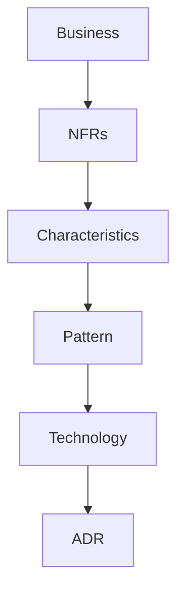

# Lesson 14.1 — From Requirement to ADR

**Module:** 14 — Architecture Decision Making  
**Duration:** 25–35 minutes  
**BayLearn philosophy:** WHY → WHEN → HOW. Pattern first. Technology second.

---

## Learning outcomes

By the end of this lesson you will be able to:

1. Walk Business → NFRs → characteristics → pattern → technology → architecture → ADR.
2. Refuse technology-first answers.
3. Use the course ADR template.

---

## Enterprise scenario

A stakeholder says “we need Kafka.” You answer with questions about volume, ordering, consumers, and skill. This module is the job.

> **Fiction notice:** Named companies in this course (Northbridge Bank, Harbor Retail, CareMesh Health, Atlas Manufacturing) are instructional fictions.

---

## WHY this exists

This is the differentiator module. You convert messy asks into ADRs executives can accept. The template in templates/adr.md is mandatory for capstones. Options considered must be real, including “do nothing” and “keep the ESB map.”

---

## WHEN an Enterprise Architect uses it

- Every non-trivial integration.
- All capstones and the final assessment.

### When NOT to use it

- ADRs after the fact to rubber-stamp.
- One-option ADRs.

---

## HOW — the pattern (vendor-neutral)

Fill: title, problem, requirements, options A/B/C, decision, rationale, tradeoffs, security, reliability, cost, operations, rejected alternatives. Practice aloud.

### Architecture diagram

---

## HOW — AWS implementation (after the pattern)

Technology appears in the options, not in the problem statement. AWS is an implementation of the chosen style.

Do not start here. If you cannot explain the requirement and pattern without naming an AWS service, you are not ready to select technology.

---

## Anti-patterns

- Problem statement that names the solution.

---

## Tradeoffs

| Dimension | Benefit | Cost / risk |
|-----------|---------|-------------|
| ADR discipline | Defensible estates | Time |
| Slack decisions | Fast | Unexplainable production |

---

## Architecture decision prompt

Write the problem statement for “we need Kafka” without naming Kafka.

Write four sentences: the requirement, the integration characteristics, the pattern, and why the rejected options fail the NFRs.

---

## Knowledge check

**Q1.** What is wrong with a one-option ADR?

*Answer.* It cannot show that alternatives were understood and rejected for NFR reasons.

---

## Architect's note

The final assessment grades this procedure, not memorized service limits.

---

## Next

Complete any architecture challenge attached to this lesson in the course player. Record an ADR fragment if the decision would survive a design review.
