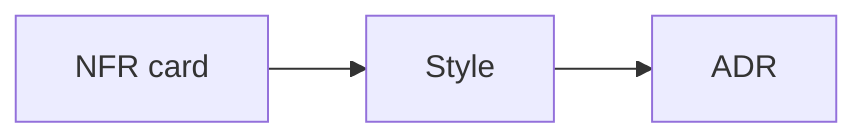

# Lesson 14.2 — NFR Scoring

**Module:** 14 — Architecture Decision Making  
**Duration:** 25–35 minutes  
**BayLearn philosophy:** WHY → WHEN → HOW. Pattern first. Technology second.

---

## Learning outcomes

By the end of this lesson you will be able to:

1. Score volume, payload, latency, reliability, ordering, security, availability, coupling, cost, scale, recovery, ops complexity.
2. Make the scores visible in the ADR.
3. Show how two different NFR sets yield two styles.

---

## Enterprise scenario

The same noun “customer update” is an API, an event, and a file depending on the scores.

> **Fiction notice:** Named companies in this course (Northbridge Bank, Harbor Retail, CareMesh Health, Atlas Manufacturing) are instructional fictions.

---

## WHY this exists

Create a 1–5 or qualitative score table. Do not fake precision. The point is comparison. A 20 GB nightly file scores opposite a 300 ms balance read. Twenty consumers of an address change score as an event. This lesson’s three challenges are the course spec’s examples.

---

## WHEN an Enterprise Architect uses it

- Architecture challenges.
- Capstones.

### When NOT to use it

- Scoring after choosing AWS.
- Identical scores for everything (you are not thinking).

---

## HOW — the pattern (vendor-neutral)

Keep a one-page NFR card. Reuse it. In the player, the three challenges force three different answers.

### Architecture diagram

---

## HOW — AWS implementation (after the pattern)

N/A as technology. If cost scores high, Transfer Family hours and NAT become disqualifiers.

Do not start here. If you cannot explain the requirement and pattern without naming an AWS service, you are not ready to select technology.

---

## Anti-patterns

- Copying last project’s NFR card without editing.

---

## Tradeoffs

| Dimension | Benefit | Cost / risk |
|-----------|---------|-------------|
| Visible scores | Teachable decisions | Can become checkbox theater if not discussed |

---

## Architecture decision prompt

Fill an NFR card for 20 GB × 50 orgs nightly vs 300 ms balances vs 20 systems on address change.

Write four sentences: the requirement, the integration characteristics, the pattern, and why the rejected options fail the NFRs.

---

## Knowledge check

**Q1.** Which NFR most disqualifies API Gateway for 20 GB files?

*Answer.* Payload/size (and timeout)—physics, not preference.

---

## Architect's note

If two options have the same scores, you missed a discriminator (usually ops skill or partner constraint).

---

## Next

Complete any architecture challenge attached to this lesson in the course player. Record an ADR fragment if the decision would survive a design review.
