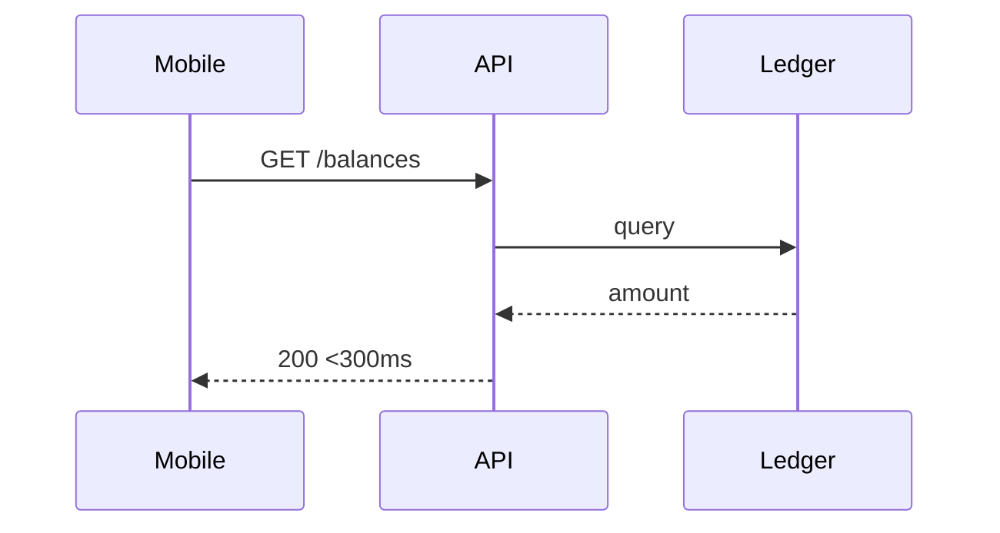

# Lesson 14.4 — Challenge: Balances within 300 ms

**Module:** 14 — Architecture Decision Making  
**Duration:** 25–35 minutes  
**BayLearn philosophy:** WHY → WHEN → HOW. Pattern first. Technology second.

---

## Learning outcomes

By the end of this lesson you will be able to:

1. Choose a synchronous API against a system of record or a fresh enough replica with an SLO.
2. Reject nightly files and high-lag event projections as the only read path.
3. Discuss caching carefully for money.

---

## Enterprise scenario

Account balances in 300 ms. Eventual consistency of 8 seconds is a defect here.

> **Fiction notice:** Named companies in this course (Northbridge Bank, Harbor Retail, CareMesh Health, Atlas Manufacturing) are instructional fictions.

---

## WHY this exists

Characteristics: tight latency, known consumer (app), small payload, high read volume, correctness of money. Style: API. Architecture: read path to ledger or a replica whose lag SLO << 300ms budget. Caching: dangerous if stale money; maybe cache non-money profile data only. Authz per customer.

---

## WHEN an Enterprise Architect uses it

- This challenge.
- Mobile/web reads.

### When NOT to use it

- Reading the analytics lake.
- Waiting for AddressChanged-style fan-out to update a projection as the only balance source.

---

## HOW — the pattern (vendor-neutral)

ADR: API Gateway + service + DynamoDB/Aurora as appropriate, timeouts budgeted, caching policy, load test. Not SQS.

### Architecture diagram

---

## HOW — AWS implementation (after the pattern)

API Gateway, possibly DynamoDB with DAX only if you can prove freshness; often skip cache for balances.

Do not start here. If you cannot explain the requirement and pattern without naming an AWS service, you are not ready to select technology.

---

## Anti-patterns

- “Event-driven balances” with no lag SLO.

---

## Tradeoffs

| Dimension | Benefit | Cost / risk |
|-----------|---------|-------------|
| Direct ledger read | Correctness | Load on SoR |
| Cached projection | Scale | Stale money risk |

---

## Architecture decision prompt

Would you serve balances from a 5-second event projection? Why or why not?

Write four sentences: the requirement, the integration characteristics, the pattern, and why the rejected options fail the NFRs.

---

## Knowledge check

**Q1.** What style?

*Answer.* API (request/reply), possibly with a carefully SLOed replica—not file, not queue.

---

## Architect's note

Latency numbers in the requirement are not decoration. They pick the style.

---

## Next

Complete any architecture challenge attached to this lesson in the course player. Record an ADR fragment if the decision would survive a design review.
