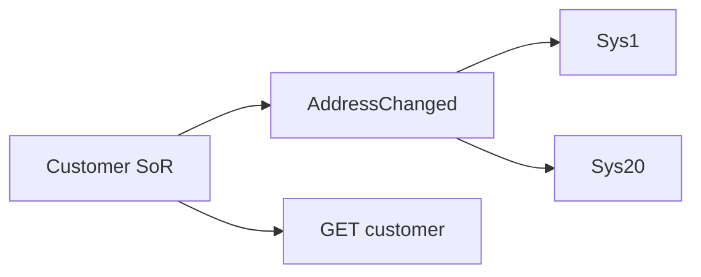

# Lesson 14.5 — Challenge: Twenty Systems Need Address Changes

**Module:** 14 — Architecture Decision Making  
**Duration:** 25–35 minutes  
**BayLearn philosophy:** WHY → WHEN → HOW. Pattern first. Technology second.

---

## Learning outcomes

By the end of this lesson you will be able to:

1. Choose event style with a schema and independent consumers.
2. Reject checkout-style point-to-point calls to 20 systems.
3. Provide a status API for the call center (sync read of SoR).

---

## Enterprise scenario

Twenty downstreams, one fact. If you pick an API the producer must call 20 times, you failed coupling.

> **Fiction notice:** Named companies in this course (Northbridge Bank, Harbor Retail, CareMesh Health, Atlas Manufacturing) are instructional fictions.

---

## WHY this exists

Characteristics: fan-out, unknown future consumers, modest payload, eventual consistency acceptable for most downstreams, call center needs immediate read of the source of truth. Architecture: AddressChanged event + SoR API for reads. Not a file nightly as the only path (too slow for many). Not an ESB map per consumer as the default (lead time).

---

## WHEN an Enterprise Architect uses it

- This challenge.
- Similar fan-out facts.

### When NOT to use it

- Producer HTTP loop.
- A 20-system distributed transaction.

---

## HOW — the pattern (vendor-neutral)

ADR: event backbone, schema, idempotent consumers, lag SLO, PII minimization, maybe filter by region. Call center uses GET on customer API.

### Architecture diagram

---

## HOW — AWS implementation (after the pattern)

EventBridge or SNS+SQS. Customer API on API Gateway for the authoritative read.

Do not start here. If you cannot explain the requirement and pattern without naming an AWS service, you are not ready to select technology.

---

## Anti-patterns

- ESB map #21 as the onboarding process.

---

## Tradeoffs

| Dimension | Benefit | Cost / risk |
|-----------|---------|-------------|
| Events | Decoupling | Lag |
| P2P APIs | Immediate per call | Quadratic coupling |

---

## Architecture decision prompt

How do you add the 21st system without changing the customer service?

Write four sentences: the requirement, the integration characteristics, the pattern, and why the rejected options fail the NFRs.

---

## Knowledge check

**Q1.** Why is a nightly address file insufficient as the only design?

*Answer.* Twenty systems that need to know “whenever” implies a fact in near real time, not T+1, unless their NFR is actually batch.

---

## Architect's note

Notice the combo: event for fan-out + API for authoritative read. Mixing styles is mature, not impure.

---

## Next

Complete any architecture challenge attached to this lesson in the course player. Record an ADR fragment if the decision would survive a design review.
