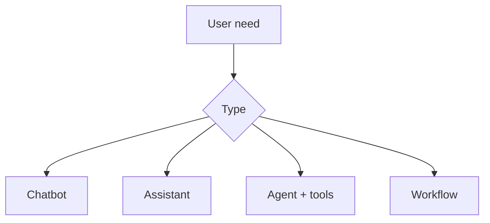

# Lesson 15.1 — Chatbot vs Assistant vs Agent vs Workflow

**Module:** 15 — Integration Architecture for AI Agents  
**Duration:** 25–35 minutes  
**BayLearn philosophy:** WHY → WHEN → HOW. Pattern first. Technology second.

---

## Learning outcomes

By the end of this lesson you will be able to:

1. Define the four: scripted bot, retrieval assistant, tool-using agent, deterministic workflow.
2. Place enterprise integration on tools and workflows, not on free-form model access.
3. Reserve agents for reasoning-plus-tools, not for TPS-critical posting.

---

## Enterprise scenario

A vendor demo “agent” was a prompt that SQL-injected production. Names matter.

> **Fiction notice:** Named companies in this course (Northbridge Bank, Harbor Retail, CareMesh Health, Atlas Manufacturing) are instructional fictions.

---

## WHY this exists

A chatbot replies with words. An assistant retrieves knowledge. An agent **chooses tools** to act. A workflow is a deterministic state machine. Enterprises need workflows for money movement and agents for **operations and orchestration of tools**. Confusing them produces either brittle bots or unbounded agents.

---

## WHEN an Enterprise Architect uses it

- When a human has a fuzzy ops question or a multi-tool investigation.
- When a model can usefully plan a sequence of **allowed** tools.

### When NOT to use it

- When the path must be deterministic and certified.
- When the model would be the system of record.

---

## HOW — the pattern (vendor-neutral)

Decision: if the steps are known and must not drift, Step Functions. If the user query is open-ended but actions are gated, agent + tools. If only Q&A on docs, assistant. Integration architects design the tools.

### Architecture diagram

---

## HOW — AWS implementation (after the pattern)

Bedrock agents or a custom tool loop; Step Functions still underneath writes. Do not start with a model hooked to IAM *.

Do not start here. If you cannot explain the requirement and pattern without naming an AWS service, you are not ready to select technology.

---

## Anti-patterns

- Calling every LLM feature an agent.
- Agent as synonym for Lambda.

---

## Tradeoffs

| Dimension | Benefit | Cost / risk |
|-----------|---------|-------------|
| Agent | Flexible ops UX | Governance burden |
| Workflow | Predictable | Less flexible language interface |

---

## Architecture decision prompt

Is “reprocess file” an agent decision or a workflow the agent may *request*?

Write four sentences: the requirement, the integration characteristics, the pattern, and why the rejected options fail the NFRs.

---

## Knowledge check

**Q1.** What distinguishes an agent?

*Answer.* It selects and calls tools (with policies), not merely generates text.

---

## Architect's note

Use precise language in ADRs. Reviewers will thank you.

---

## Next

Complete any architecture challenge attached to this lesson in the course player. Record an ADR fragment if the decision would survive a design review.
