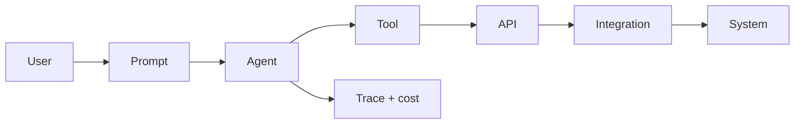

# Lesson 15.10 — Agent Observability

**Module:** 15 — Integration Architecture for AI Agents  
**Duration:** 25–35 minutes  
**BayLearn philosophy:** WHY → WHEN → HOW. Pattern first. Technology second.

---

## Learning outcomes

By the end of this lesson you will be able to:

1. Trace User → prompt → agent → tool → API → integration → system.
2. Measure cost (tokens) and safety (denied tools).
3. Use traces to debug wrong tool choice without copying secrets.

---

## Enterprise scenario

The agent gave a wrong file status. Without traces you cannot see it called the test catalog. Observability is how you operate agents as production components.

> **Fiction notice:** Named companies in this course (Northbridge Bank, Harbor Retail, CareMesh Health, Atlas Manufacturing) are instructional fictions.

---

## WHY this exists

Include: conversation ID, user, tool name, tool latency, tool HTTP status, correlation ID into the platform, token counts, guardrail hits, approval IDs. Redact prompts. Dashboard: tool error rate, HITL wait time, cost per question. This closes the loop with Module 13.

---

## WHEN an Enterprise Architect uses it

- Production agents.
- Lab 15 after tools work.

### When NOT to use it

- Storing raw prompts with PAN/PHI.
- No link from tool span to platform correlation ID.

---

## HOW — the pattern (vendor-neutral)

OpenTelemetry-style spans. CloudWatch metrics ToolInvocations, ToolErrors, TokensUsed. The ops dashboard gets a row for the agent.

### Architecture diagram

---

## HOW — AWS implementation (after the pattern)

Bedrock invocation logs (careful with data), custom spans in the tool Lambda, X-Ray. Prefer your tool logs as source of truth for side effects.

Do not start here. If you cannot explain the requirement and pattern without naming an AWS service, you are not ready to select technology.

---

## Anti-patterns

- Paste entire traces into tickets including payloads.
- Measuring only model latency and not tool latency.

---

## Tradeoffs

| Dimension | Benefit | Cost / risk |
|-----------|---------|-------------|
| Full traces | Debuggable | Privacy engineering required |
| No traces | Looks private | Unoperable |

---

## Architecture decision prompt

How do you answer “why did the agent say the file was missing?” with evidence?

Write four sentences: the requirement, the integration characteristics, the pattern, and why the rejected options fail the NFRs.

---

## Knowledge check

**Q1.** What metric is unique to agents vs APIs?

*Answer.* Token/cost per successful answer, denied tool calls, HITL wait—plus the usual latency/errors.

---

## Architect's note

You now have a complete platform: styles, labs, and a governed agent channel. Capstones ask you to use all of it.

---

## Next

Complete any architecture challenge attached to this lesson in the course player. Record an ADR fragment if the decision would survive a design review.
