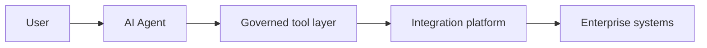

# Lesson 15.2 — Agents as Integration Consumers

**Module:** 15 — Integration Architecture for AI Agents  
**Duration:** 25–35 minutes  
**BayLearn philosophy:** WHY → WHEN → HOW. Pattern first. Technology second.

---

## Learning outcomes

By the end of this lesson you will be able to:

1. Draw User → Agent → Tool layer → Integration platform → Enterprise systems.
2. Never LLM → production database.
3. Treat tools as API products with authz.

---

## Enterprise scenario

The unacceptable architecture is in the spec. You will reproduce the good one until you can draw it from memory.

> **Fiction notice:** Named companies in this course (Northbridge Bank, Harbor Retail, CareMesh Health, Atlas Manufacturing) are instructional fictions.

---

## WHY this exists

Agents are a new **channel**, like mobile. They do not get a new privileged path into data. Tools wrap existing APIs, catalogs, and queues. The integration platform remains the place of audit, idempotency, and schema. This is the most important diagram in Module 15.

---

## WHEN an Enterprise Architect uses it

- Any enterprise agent proposal.
- The AI lab and all capstone agents.

### When NOT to use it

- Fine-tuning a model on database dumps as a substitute for tools.
- Giving the model AWS admin keys to “figure it out.”

---

## HOW — the pattern (vendor-neutral)

Tool catalog: file status, queue depth, errors, reprocess request. Each tool is a Lambda/API with IAM and input schema. Agent can only call listed tools. Writes go through approval tools.

### Architecture diagram

---

## HOW — AWS implementation (after the pattern)

Bedrock tool use / MCP servers wrapping API Gateway. Same APIs humans and other systems use where possible (don’t invent a shadow API with more privilege).

Do not start here. If you cannot explain the requirement and pattern without naming an AWS service, you are not ready to select technology.

---

## Anti-patterns

- Shadow copy of prod DB for the agent “for safety” that is still prod data without controls.

---

## Tradeoffs

| Dimension | Benefit | Cost / risk |
|-----------|---------|-------------|
| Tool reuse of platform APIs | One audit path | Must have those APIs |
| Special agent backdoors | Demo speed | Unreviewable privilege |

---

## Architecture decision prompt

Why is a read-only SQL tool still often unacceptable in healthcare?

Write four sentences: the requirement, the integration characteristics, the pattern, and why the rejected options fail the NFRs.

---

## Knowledge check

**Q1.** What is the forbidden edge?

*Answer.* LLM (or agent runtime) connecting directly to a production database with broad queries.

---

## Architect's note

If the tool is not on the architecture diagram, it does not exist—and must not be called.

---

## Next

Complete any architecture challenge attached to this lesson in the course player. Record an ADR fragment if the decision would survive a design review.
