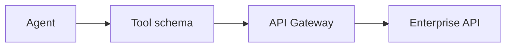

# Lesson 15.3 — Agents + APIs

**Module:** 15 — Integration Architecture for AI Agents  
**Duration:** 25–35 minutes  
**BayLearn philosophy:** WHY → WHEN → HOW. Pattern first. Technology second.

---

## Learning outcomes

By the end of this lesson you will be able to:

1. Map agent tools to API Gateway products.
2. Keep user identity and agent identity distinct.
3. Rate-limit tool calls.

---

## Enterprise scenario

The agent called GET /customers 800 times in a loop. Tools need limits too.

> **Fiction notice:** Named companies in this course (Northbridge Bank, Harbor Retail, CareMesh Health, Atlas Manufacturing) are instructional fictions.

---

## WHY this exists

API tools are just APIs with JSON schemas the model can read. Identity: the user is the subject; the agent runtime is a workload. Authz should be the intersection (cannot exceed the user’s rights). Correlation IDs on every tool call. Timeouts so the agent cannot hang a payment API.

---

## WHEN an Enterprise Architect uses it

- Status reads, catalog queries, documented GETs.
- POSTs only when idempotent and approved if high risk.

### When NOT to use it

- Unpaginated list-all APIs as tools.
- Delete APIs without HITL.

---

## HOW — the pattern (vendor-neutral)

OpenAPI → tool schema. Per-user credentials or on-behalf-of tokens. Lab 15 uses GET tools freely (authorized) and POST reprocess only after approval.

### Architecture diagram

---

## HOW — AWS implementation (after the pattern)

API Gateway + Lambda tools. Cognito user vs IAM role of the agent. WAF/rate limits on the tool APIs.

Do not start here. If you cannot explain the requirement and pattern without naming an AWS service, you are not ready to select technology.

---

## Anti-patterns

- A single GetAnything tool.
- No timeout on tool HTTP.

---

## Tradeoffs

| Dimension | Benefit | Cost / risk |
|-----------|---------|-------------|
| On-behalf-of | User-scoped authz | Token plumbing |
| Service role only | Simple | Over-privilege vs the user |

---

## Architecture decision prompt

If the user’s token cannot refund, can the agent’s role still refund “for convenience”?

Write four sentences: the requirement, the integration characteristics, the pattern, and why the rejected options fail the NFRs.

---

## Knowledge check

**Q1.** Should tool IAM exceed user rights?

*Answer.* No. Intersection of user and tool policy.

---

## Architect's note

Reuse Lab 2’s error envelope so the agent can explain failures.

---

## Next

Complete any architecture challenge attached to this lesson in the course player. Record an ADR fragment if the decision would survive a design review.
