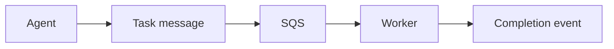

# Lesson 15.4 — Agents + Messaging

**Module:** 15 — Integration Architecture for AI Agents  
**Duration:** 25–35 minutes  
**BayLearn philosophy:** WHY → WHEN → HOW. Pattern first. Technology second.

---

## Learning outcomes

By the end of this lesson you will be able to:

1. Agent enqueues a command; worker does it; completion event returns.
2. Do not let the model block on a 10-minute job.
3. HITL can sit before the enqueue.

---

## Enterprise scenario

The agent “reprocessed” by looping in the prompt until a file finished. Tokens burned; no audit. Commands belong on queues.

> **Fiction notice:** Named companies in this course (Northbridge Bank, Harbor Retail, CareMesh Health, Atlas Manufacturing) are instructional fictions.

---

## WHY this exists

For long or side-effecting work, the tool should create a task message and return a task ID. The agent (or UI) follows status. This reuses Module 3. The model is bad at being a workflow engine; it is decent at starting one.

---

## WHEN an Enterprise Architect uses it

- Reprocess, retries, bulk actions.
- Any tool that would exceed interactive time.

### When NOT to use it

- Agent thread doing the posting itself via ad-hoc SDK calls.

---

## HOW — the pattern (vendor-neutral)

Tool: RequestReprocess → approval → SQS → worker → TaskCompleted event. Agent subscribes or polls status API.

### Architecture diagram

---

## HOW — AWS implementation (after the pattern)

SQS + Lambda worker + DynamoDB task store. EventBridge TaskCompleted. Same as any other producer, with extra audit fields (actor=agent, approver=human).

Do not start here. If you cannot explain the requirement and pattern without naming an AWS service, you are not ready to select technology.

---

## Anti-patterns

- Agent SDK sending raw SQS from the model host with admin creds.

---

## Tradeoffs

| Dimension | Benefit | Cost / risk |
|-----------|---------|-------------|
| Async tasks | Safe duration | More UX states |
| Sync tool | Simple | Timeouts and weak audit |

---

## Architecture decision prompt

What fields must the command include that a normal producer might omit?

Write four sentences: the requirement, the integration characteristics, the pattern, and why the rejected options fail the NFRs.

---

## Knowledge check

**Q1.** Who is the producer in this design?

*Answer.* The tool API, acting for the user+agent, writing a command message.

---

## Architect's note

If it is a command, it is a message—even if an agent requested it.

---

## Next

Complete any architecture challenge attached to this lesson in the course player. Record an ADR fragment if the decision would survive a design review.
