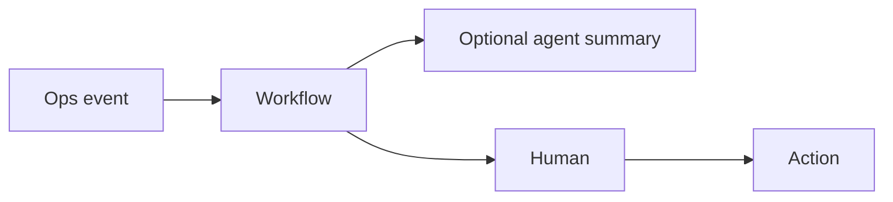

# Lesson 15.5 — Agents + Events

**Module:** 15 — Integration Architecture for AI Agents  
**Duration:** 25–35 minutes  
**BayLearn philosophy:** WHY → WHEN → HOW. Pattern first. Technology second.

---

## Learning outcomes

By the end of this lesson you will be able to:

1. Events can trigger agent workflows (investigate this failure).
2. Agents can emit facts (InvestigationOpened) not rumors.
3. Do not auto-emit emails from raw model text without controls.

---

## Enterprise scenario

DLQ depth event starts an investigation agent. That is useful. The agent then broadcasting unverified “root cause” as OrderFailed is not a fact.

> **Fiction notice:** Named companies in this course (Northbridge Bank, Harbor Retail, CareMesh Health, Atlas Manufacturing) are instructional fictions.

---

## WHY this exists

Inbound: operational events as triggers (with rate limits). Outbound: only named facts the platform understands. Summaries for humans are content, not bus facts, unless structured and validated.

---

## WHEN an Enterprise Architect uses it

- Ops automation.
- Enrichment suggestions, not silent ledger changes.

### When NOT to use it

- Model text as an event payload other systems parse as truth.
- Unbounded invocation on high-frequency events (cost).

---

## HOW — the pattern (vendor-neutral)

Rule: FileQuarantined → start investigation workflow (Step Functions) that may include an agent step for summarization. Human still approves actions.

### Architecture diagram

---

## HOW — AWS implementation (after the pattern)

EventBridge → Step Functions → optional Bedrock. Guardrails on output schema.

Do not start here. If you cannot explain the requirement and pattern without naming an AWS service, you are not ready to select technology.

---

## Anti-patterns

- Subscribe the agent to all events.

---

## Tradeoffs

| Dimension | Benefit | Cost / risk |
|-----------|---------|-------------|
| Event-triggered agent | Fast ops | Cost and noise |
| On-demand agent only | Controlled spend | Slower reaction |

---

## Architecture decision prompt

Should PaymentAuthorized trigger an agent? Why might that be a costly mistake?

Write four sentences: the requirement, the integration characteristics, the pattern, and why the rejected options fail the NFRs.

---

## Knowledge check

**Q1.** When is an agent output allowed on the enterprise bus?

*Answer.* When it is a structured, schema-validated fact with an owner—not free text.

---

## Architect's note

High-volume facts and LLMs are a FinOps incident.

---

## Next

Complete any architecture challenge attached to this lesson in the course player. Record an ADR fragment if the decision would survive a design review.
