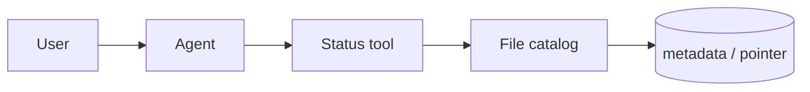

# Lesson 15.6 — Agents + File Transfers

**Module:** 15 — Integration Architecture for AI Agents  
**Duration:** 25–35 minutes  
**BayLearn philosophy:** WHY → WHEN → HOW. Pattern first. Technology second.

---

## Learning outcomes

By the end of this lesson you will be able to:

1. Answer “did today’s file arrive?” from the catalog, not from S3 list folklore.
2. Never dump file contents into the prompt if classified.
3. Reprocess is a write path with HITL.

---

## Enterprise scenario

The demo agent cat’d a claims file into the context window. That is a disclosure.

> **Fiction notice:** Named companies in this course (Northbridge Bank, Harbor Retail, CareMesh Health, Atlas Manufacturing) are instructional fictions.

---

## WHY this exists

File tools: GetFileStatus, ListMissingPartners, GetValidationErrors, RequestReprocess. They read metadata and reason codes. Content retrieval, if any, is redacted, sampled, and authorized. This is Capstone 1’s ops agent.

---

## WHEN an Enterprise Architect uses it

- MFT operations.
- Support.

### When NOT to use it

- Paste PHI/PAN into prompts.
- Agent SSH to Transfer Family.

---

## HOW — the pattern (vendor-neutral)

Implement tools on the catalog API from Module 6. Lab 15 does this. Capstones extend questions.

### Architecture diagram

---

## HOW — AWS implementation (after the pattern)

Lambda tools + DynamoDB catalog + S3 HeadObject for size. No GetObject of payloads into the model by default.

Do not start here. If you cannot explain the requirement and pattern without naming an AWS service, you are not ready to select technology.

---

## Anti-patterns

- s3:GetObject * as the agent role.

---

## Tradeoffs

| Dimension | Benefit | Cost / risk |
|-----------|---------|-------------|
| Metadata tools | Safe and fast | Cannot debug row-level without a controlled sample tool |
| Full content in prompt | Looks smart | Leakage and token cost |

---

## Architecture decision prompt

Which tool answers “why did it fail?” without opening the file bytes?

Write four sentences: the requirement, the integration characteristics, the pattern, and why the rejected options fail the NFRs.

---

## Knowledge check

**Q1.** Default tool for file body?

*Answer.* There should not be one. Sample/redact tools are explicit and rare.

---

## Architect's note

If the catalog cannot answer the question, improve the catalog—do not loosen the agent.

---

## Next

Complete any architecture challenge attached to this lesson in the course player. Record an ADR fragment if the decision would survive a design review.
