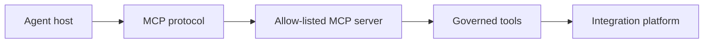

# Lesson 15.7 — MCP — Model Context Protocol

**Module:** 15 — Integration Architecture for AI Agents  
**Duration:** 25–35 minutes  
**BayLearn philosophy:** WHY → WHEN → HOW. Pattern first. Technology second.

---

## Learning outcomes

By the end of this lesson you will be able to:

1. Explain MCP as a standard for tool discovery, schemas, and context between hosts and servers.
2. Map MCP servers to governed integration tools.
3. Apply permissions and enterprise governance to MCP the same as any API.

---

## Enterprise scenario

A laptop running random MCP servers with prod credentials is shadow IT. Protocol does not imply safety.

> **Fiction notice:** Named companies in this course (Northbridge Bank, Harbor Retail, CareMesh Health, Atlas Manufacturing) are instructional fictions.

---

## WHY this exists

MCP is a **protocol** for exposing tools and resources to model hosts. Conceptually: servers advertise tools with JSON schemas; the host lets a model call them. In an enterprise, MCP servers should be **your** integration APIs with authn/z, logging, and network controls—not a zoo of unmanaged plugins. Discovery is not authorization.

---

## WHEN an Enterprise Architect uses it

- Standardizing tool interfaces across IDEs and agents.
- Where you want schema-first tool catalogs.

### When NOT to use it

- Equating MCP with bypassing the platform.
- Running community servers against prod because they are convenient.

---

## HOW — the pattern (vendor-neutral)

Build MCP servers that wrap the same tool Lambdas as Lab 15. Document allow-listed servers. Sign and pin versions. Correlate tool calls. Permissions: OAuth/IAM per server.

### Architecture diagram

---

## HOW — AWS implementation (after the pattern)

An MCP server in front of API Gateway; Bedrock or other hosts as clients. If MCP is not used in the lab runtime, still teach the mapping so students can evaluate vendor claims.

Do not start here. If you cannot explain the requirement and pattern without naming an AWS service, you are not ready to select technology.

---

## Anti-patterns

- MCP server with the developer’s AWS admin keys.
- Unmanaged marketplace servers in prod networks.

---

## Tradeoffs

| Dimension | Benefit | Cost / risk |
|-----------|---------|-------------|
| Standard protocol | Portable tools | More endpoints to govern |
| Proprietary tools only | Simpler now | Lock-in and duplicate catalogs |

---

## Architecture decision prompt

If an MCP server offers a raw SQL tool, is that an MCP problem or a governance problem?

Write four sentences: the requirement, the integration characteristics, the pattern, and why the rejected options fail the NFRs.

---

## Knowledge check

**Q1.** Does tool discovery grant permission?

*Answer.* No. Discovery advertises capability. Authz still decides if this user/host may invoke it.

---

## Architect's note

Evaluate MCP as you would any partner API standard: contract, identity, audit, blast radius.

---

## Next

Complete any architecture challenge attached to this lesson in the course player. Record an ADR fragment if the decision would survive a design review.
