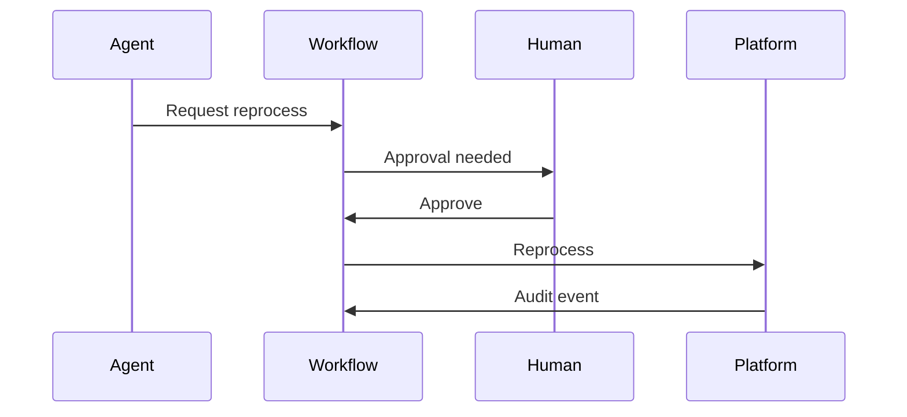

# Lesson 15.9 — Human-in-the-Loop

**Module:** 15 — Integration Architecture for AI Agents  
**Duration:** 25–35 minutes  
**BayLearn philosophy:** WHY → WHEN → HOW. Pattern first. Technology second.

---

## Learning outcomes

By the end of this lesson you will be able to:

1. Writes require approval commensurate with risk.
2. Approval is a recorded event with identity.
3. The workflow, not the model, enforces the wait.

---

## Enterprise scenario

“Reprocess failed payment file” is the spec’s example. If the model can do it alone, you built a very polite attacker.

> **Fiction notice:** Named companies in this course (Northbridge Bank, Harbor Retail, CareMesh Health, Atlas Manufacturing) are instructional fictions.

---

## WHY this exists

HITL: agent requests action → durable approval record → human (or policy engine) approves → workflow runs → audit. Reads can skip HITL if authorized. Dual control for high-value files. Timeouts on pending approvals. The agent may remind; it may not self-approve.

---

## WHEN an Enterprise Architect uses it

- Reprocess, replay DLQ, refund, retry supplier transaction.
- Anything irreversible or externally visible.

### When NOT to use it

- Rubber-stamp bots.
- Approvals in chat without a system of record.

---

## HOW — the pattern (vendor-neutral)

DynamoDB approval items, Step Functions wait for task token, UI or console for approvers. Lab 15 demonstrates this. Capstones require it for writes.

### Architecture diagram

---

## HOW — AWS implementation (after the pattern)

Step Functions callback, SNS to approver, API to approve. IAM so only approver role can send the task success.

Do not start here. If you cannot explain the requirement and pattern without naming an AWS service, you are not ready to select technology.

---

## Anti-patterns

- Approval prompt that the model answers itself.
- No expiry, pending approvals forever.

---

## Tradeoffs

| Dimension | Benefit | Cost / risk |
|-----------|---------|-------------|
| HITL | Control | Latency to recover |
| Auto-write | Fast | High blast radius |

---

## Architecture decision prompt

Who is not allowed to approve their own agent-initiated reprocess?

Write four sentences: the requirement, the integration characteristics, the pattern, and why the rejected options fail the NFRs.

---

## Knowledge check

**Q1.** Where is approval stored?

*Answer.* In a durable workflow/store with identity and timestamp—not only in chat history.

---

## Architect's note

If it is not in the audit table, it did not happen.

---

## Next

Complete any architecture challenge attached to this lesson in the course player. Record an ADR fragment if the decision would survive a design review.
