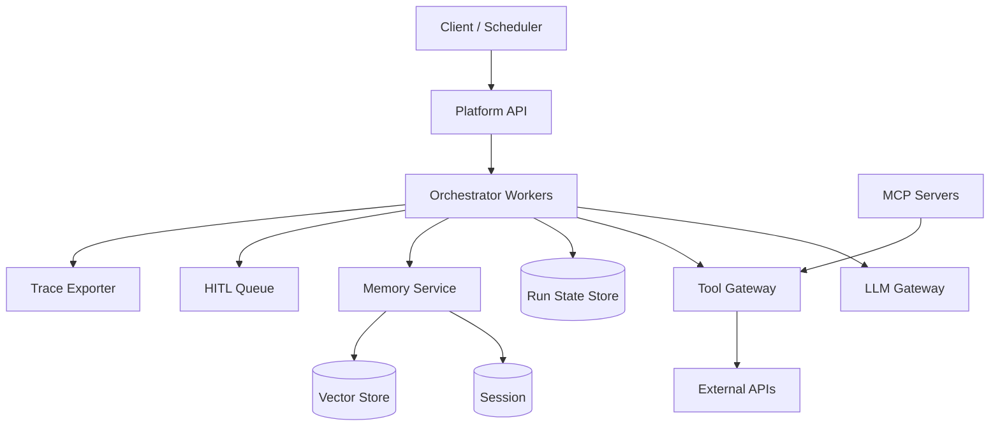
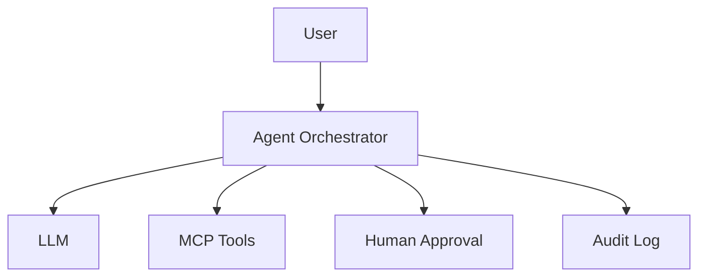

# Enterprise Agentic AI Platform

## 1. Business Context

An **agentic AI platform** enables organizations to deploy **autonomous LLM workflows** that plan, invoke tools, maintain memory, and complete multi-step tasks within policy bounds. Unlike a chatbot endpoint that returns one completion per request, agents run **loops**: observe context → reason → select tool → execute → incorporate results → repeat until termination, escalation, or timeout.

Enterprise adoption drivers include **IT automation** (ticket routing, infra changes), **developer productivity** (code review bots, incident triage), **customer support** augmentation, and **data analysis** pipelines. Business value is measured in **task completion rate**, **cost per successful run**, **mean time to resolution**, and **auditability**—not model benchmark scores alone.

For principal architects, agent platforms are **distributed control systems** with action side effects. Failure modes include **unbounded tool loops** burning inference budget, **over-privileged tools** enabling prompt-injection-driven data exfiltration, **non-idempotent retries** double-charging customers, and **missing traces** making incidents undebuggable. 2025–2026 interview bars expect ReAct vs plan-and-execute, **Model Context Protocol (MCP)** standardization, durable execution (Temporal-class), and **human-in-the-loop (HITL)** governance.

Canonical in-repo design: [Agentic AI Platform Design](/docs/system-design/agentic-ai-platform-design), [Agent Platform Architecture](/docs/agentic-ai-architecture/agent-platform-architecture), [Agent Governance and Safety](/docs/agentic-ai-architecture/agent-governance-and-safety).

## 2. Scale

Reference enterprise platform targets from system-design chapter (tune per organization):

| Dimension | Scale consideration |
|-----------|---------------------|
| Agent definitions | 200+ registered agents with versioning |
| Concurrent runs | 5K+ parallel orchestrations |
| Tool catalog | Hundreds of tools across teams |
| LLM calls per run | 5–50 steps typical; cap at policy max |
| Trace volume | Every tool call = spans; TB/month |
| Tenants | Hard isolation for multi-team platforms |

**Scale failure modes**: **orchestrator queue backlog**, **LLM gateway rate limits**, **tool API throttling** from shared credentials, **vector memory** hot partitions, **HITL queue** human bottleneck, and **eval pipeline** blocking deployments.

Principal framing separates **scheduling scale** (orchestrator workers) from **inference scale** ([LLM Gateway](/docs/system-design/llm-gateway)) from **tool blast radius** (downstream SaaS APIs).

## 3. Functional Requirements

| Capability | Mechanism |
|------------|-----------|
| Agent registry | Versioned definitions: prompt, tools, budgets |
| Run execution | `POST /agents/{id}/runs` with input + session |
| Tool gateway | Schema validation, auth, idempotency keys |
| Orchestration | State machine / durable workflow runtime |
| Memory tiers | Session (Redis), episodic, org knowledge (RAG) |
| HITL | Pause on risk threshold; approval UI |
| MCP integration | Standard tool provider protocol |
| Kill switch | Per-run and global stop |
| Eval harness | Benchmark gates before promotion |
| Audit | Immutable tool invocation log |

Platform APIs must support **sync** (short runs) and **async** (long runs with webhook/callback)—see [Workflow Engine](/docs/system-design/workflow-engine) patterns.

## 4. Non-Functional Requirements

| NFR | Target |
|-----|--------|
| Orchestrator availability | 99.9%+ |
| Schedule latency | p99 &lt; 200 ms excluding LLM/tool time |
| Trace completeness | 100% tool calls exported |
| Safety | No destructive tool without policy + optional HITL |
| Liveness | Every run terminates, escalates, or hits wall clock |
| Tenant isolation | Separate creds, memory namespaces, quotas |

**Consistency**: orchestration state **strongly consistent** per run_id; **memory** eventually consistent; **tool side effects** at-least-once unless idempotent.

[Message Delivery Semantics](/docs/messaging-and-streaming/message-delivery-semantics) applies to event buses feeding audit and analytics.

## 5. Architecture Overview

*Figure 1: Orchestrator as control plane; LLM and tools as data plane side effects.*

**Platform API** authenticates tenant, validates quotas, enqueues run.

**Orchestrator workers** execute agent loop steps—horizontally scaled; **partition by run_id** for affinity.

**LLM Gateway** centralizes model routing, caching, budget caps, fallback models—[LLM Serving and Model Gateways](/docs/ai-distributed-systems/llm-serving-and-model-gateways).

**Tool Gateway** enforces JSON schema, OAuth/service credentials per tenant, **idempotency keys** on mutators.

**HITL service** holds paused runs until human approval in UI or SLA timeout escalates/cancels.

### 5.1 Durable execution

Long runs checkpoint after each step—worker crash resumes from last checkpoint rather than restarting tool side effects. **Temporal**, **Restate**, or custom event-sourced run logs implement **durable execution**—mandatory for production agents with mutating tools.

### 5.2 MCP (Model Context Protocol)

MCP standardizes how **tool providers** expose capabilities to agents—reduces one-off integrations. Platform registers MCP servers into tool catalog with **health checks** and **version pinning**.

## 6. Data Model

- **AgentDefinition**: id, version, system_prompt, tool_allowlist, max_steps, timeout, risk_profile
- **Run**: run_id, agent_version, tenant_id, status, input, output, step_count, cost_tokens
- **Step**: step_id, run_id, thought, tool_call, tool_result, latency, span_id
- **Tool**: tool_id, schema, auth_binding, risk_score, idempotency_required
- **SessionMemory**: session_id, rolling context window
- **Approval**: run_id, step_id, approver, decision, timestamp

**Event-sourced run log** enables replay debugging and compliance export—immutable append.

### 6.1 Versioning

Agent changes create new **definition version**; in-flight runs pin to started version—avoid mid-run behavior mutation.

## 7. Orchestration Patterns

| Pattern | Use case | Risk |
|---------|----------|------|
| ReAct loop | General tasks | Loop drift |
| Plan-and-execute | Multi-step known workflows | Plan staleness |
| Supervisor + workers | Parallel subtasks | Merge complexity |
| Deterministic workflow + LLM nodes | Hybrid reliability | Less flexible |
| RAG-augmented | Knowledge-heavy | Retrieval errors |

[Agent Platform Architecture](/docs/agentic-ai-architecture/agent-platform-architecture) compares loop structures.

**Step budget** (`max_steps=20`) and **token budget** enforced in orchestrator—not optional client hints.

## 8. Tool Gateway and Blast Radius

Tools classified:

| Class | Examples | Policy |
|-------|----------|--------|
| Read-only | Search, GET APIs | Lower risk; rate limit |
| Mutating | POST tickets, DB writes | Idempotency + HITL optional |
| Destructive | Delete, prod deploy | HITL mandatory |

**Credential model**: per-tenant **service accounts**—never shared global API key across tenants.

**Prompt injection** defense: tools return data; model may be misled—**output validation** and **tool argument allowlists** (path prefixes, resource IDs) limit exfiltration.

[Agent Governance and Safety](/docs/agentic-ai-architecture/agent-governance-and-safety).

## 9. Consistency and Idempotency

| Component | Model |
|-----------|-------|
| Run state transitions | Single-writer per run_id |
| Tool execution | At-least-once delivery; idempotent tools required |
| LLM completions | Non-deterministic; retry may differ |
| Memory writes | Eventually consistent across sessions |
| Audit log | Append-only; strong ordering per run |

**Idempotency keys** on mutating tools map to downstream APIs (Stripe-style)—orchestrator stores `step_id` as key scope.

Link: [Idempotency](/docs/distributed-systems-foundations/idempotency).

**Exactly-once side effects** require **outbox + idempotent consumer** at tool boundary—not LLM determinism.

## 10. Availability

Multi-AZ orchestrator workers; state store replicated. **LLM provider outage** triggers **fallback model** in gateway with degraded capability flag on run.

**Degradation ladder**:

1. Disable non-critical agents
2. Read-only tool mode
3. Queue runs with SLA message
4. Global kill switch for mutating tools

[Resilience Patterns](/docs/microservices/resilience-patterns): circuit breakers on tool gateway per downstream.

**Regional**: data residency may pin runs and memory to EU cell—no cross-region tool calls without policy.

## 11. Failure Handling

| Failure | Handling |
|---------|----------|
| Tool timeout | Retry with backoff; step retry cap |
| LLM rate limit | Queue; alternate model |
| Infinite loop | max_steps termination |
| Bad tool args | Schema reject; model re-prompt |
| HITL timeout | Auto-deny or escalate |
| Poison run | Kill switch; quarantine agent version |

**Runaway cost**: token budget hard stop; finance alert on tenant anomaly.

[Failure Analysis Methodology](/docs/production-failures/failure-analysis-methodology) for agent-caused production incidents—treat as **SEV** when prod tools misfire.

## 12. Security

- **Tenant isolation** at orchestrator, memory, and credentials
- **RBAC** on agent registration and tool binding
- **Secrets** in vault; never in prompts
- **Audit** every tool call with args hash for sensitive fields
- **Prompt injection** testing in eval harness
- **Output filtering** for PII leakage
- **Network policies** restricting tool gateway egress

[Zero Trust Architecture](/docs/security/zero-trust-architecture) for service-to-service auth on internal platform APIs.

SOC2-style evidence: immutable audit + HITL records for destructive actions.

## 13. Observability

| Signal | Use |
|--------|-----|
| Run success/fail rate | Product SLO |
| Cost per run (tokens + tools) | FinOps |
| Step latency breakdown | LLM vs tool vs queue |
| Tool error taxonomy | Downstream health |
| HITL queue age | Human bottleneck |
| Eval score regression | Release gate |

[Distributed Tracing](/docs/observability/distributed-tracing): span per LLM call and tool invocation with `run_id` attribute—non-negotiable for debug.

**Eval traces** compared to production traces for drift detection.

## 14. Cost Model

Cost drivers:

- **LLM inference** (dominant variable)—input/output tokens per step
- **Orchestrator compute** (modest vs inference)
- **Vector memory** storage and query
- **Tool API** per-call fees (SaaS)
- **Human HITL** labor—often overlooked in TCO
- **Trace storage** volume

**Cost levers**:

- Smaller models for planning vs execution tiers
- Prompt caching in gateway
- Step and token budgets per agent tier
- Batch read tools vs chatty loops
- Eval-gated promotion avoids expensive bad agents in prod

[Cloud Cost Optimization](/docs/cost-and-finops/cloud-cost-optimization) for GPU/TPU inference fleets.

## 15. Evolution of Architecture

2023–2026 arc (industry synthesis):

- Ad-hoc LangChain scripts → **central platforms**
- Function calling APIs standardized across OpenAI, Anthropic, Google
- **MCP** emergence for tool portability
- **Durable execution** adoption from workflow engine maturity
- **Evals** as CI gates (Braintrust, custom harnesses)
- **Governance** boards for production agent permissions

In-repo evolution ties to [Agentic AI Architecture Overview](/docs/agentic-ai-architecture/overview) and [AI Distributed Systems](/docs/ai-distributed-systems/overview).

Future: **multi-agent** coordination with shared blackboards—complexity explosion requiring stricter policy engines.

## 16. Important Tradeoffs

| Tradeoff | Detail |
|----------|--------|
| Autonomy vs safety | More steps = more risk |
| Flexibility vs determinism | Workflows reliable; ReAct flexible |
| Central platform vs team freedom | Governance vs velocity |
| RAG freshness vs cost | Index update pipelines |
| HITL thoroughness vs latency | Human cost |
| Multi-model vs single vendor | Fallback complexity |

**PACELC for agents**: under partition (tool unreachable), choose **consistency** (pause run) vs **availability** (degrade)—default **pause** for mutating tools.

## 17. Known Limitations

- LLM **non-determinism** breaks traditional test assumptions—eval statistical
- **Long-horizon** tasks exceed context windows—memory compression lossy
- **Tool coverage** never complete—agents hallucinate tools
- **Cross-run learning** risks data leakage without tenant walls
- Regulatory **automated decision** restrictions in finance/health

## 18. Interview Lessons

**Strong signals**:

- Orchestrator + tool gateway separation
- Idempotency on mutators; durable checkpoints
- HITL for destructive class
- Token/step budgets and kill switch
- Eval before promotion; trace per step

**Red flags**:

- "Agent calls prod DB with user OAuth token"
- No termination condition
- Treating agent as stateless chat API
- Ignoring cost model

## 19. Redesign Exercise

**Prompt**: Incident response agent with tools: `search_logs`, `create_ticket`, `restart_service`. On-call reports agent restarted wrong service twice during flaky LLM afternoon.

Design:

1. Tool risk classes; `restart_service` requires HITL
2. Idempotency key on restart tied to incident_id
3. Dry-run tool mode in staging agent version
4. Eval set with injection attacks attempting restart
5. Post-incident: replay run trace; block agent version
6. Fallback: deterministic workflow for known runbooks

### Deep dive: RAG memory tier

Long-term memory via [RAG Architecture](/docs/ai-distributed-systems/rag-architecture): embed run summaries and org docs into vector store. **Retrieval errors** cause wrong tool args—include **citation verification** step before mutating tools.

**Tenant isolation**: separate vector namespaces; never shared index without ACL filter at query time.

### Deep dive: eval harness

CI runs agent against **golden tasks** with scoring functions (task success, no forbidden tools, cost cap). **Regression** blocks deploy—analogous to unit tests but statistical thresholds.

**Red team evals** inject prompt attacks in tool outputs.

### Interview scoring rubric (principal)

| Dimension | Weight | Strong signal |
|-----------|--------|---------------|
| Safety / blast radius | 25% | Tool classes, HITL |
| Durability | 25% | Checkpoints, idempotency |
| Architecture | 20% | Orchestrator, gateway split |
| Observability | 15% | Traces, audit |
| Cost / eval | 15% | Budgets, promotion gates |

## Supplementary Diagram

*Figure: Enterprise agentic platform with HITL and audit.*

## 20. References

- Anthropic, OpenAI function calling and agent documentation
- Model Context Protocol (MCP) specification
- [Agentic AI Platform Design](/docs/system-design/agentic-ai-platform-design)
- [Agent Platform Architecture](/docs/agentic-ai-architecture/agent-platform-architecture)
- [Agent Governance and Safety](/docs/agentic-ai-architecture/agent-governance-and-safety)
- [LLM Gateway](/docs/system-design/llm-gateway)
- [RAG Architecture](/docs/ai-distributed-systems/rag-architecture)
- [Workflow Engine](/docs/system-design/workflow-engine)
- [Event-Driven Architecture](/docs/messaging-and-streaming/event-driven-architecture)

### Appendix: agent platform vs LLM gateway

| Layer | Responsibility |
|-------|----------------|
| LLM Gateway | Model routing, rate limits, caching |
| Agent Platform | Loops, tools, state, policy, HITL |
| App agent | Business prompt and tool selection |

### Appendix: principal question bank

1. Design tool gateway for 500 tools across 50 teams—discovery and auth.
2. Agent loop 40 steps—detect and stop without false positives on legitimate long tasks.
3. Compare Temporal vs custom event log for orchestrator.
4. Customer data in tool response—prompt injection exfil path and mitigations.
5. Multi-agent supervisor—when does policy engine replace LLM routing?

Agents are **production distributed systems**—action, audit, and blast radius first.

### Appendix: organizational governance model

Enterprise agent platforms require **Agent Review Board** charter: new tools undergo **security review**; agent definitions require **owner team** and **on-call rotation**—agents page humans when HITL or failures spike. **Shared tool credentials** forbidden; **credential rotation** automated with vault integration. **Kill switch** authority defined: SRE global stop vs team-scoped agent disable. Architecture documentation links agents to **architecture decision records (ADRs)** for blast-radius acceptance—see [Architecture Governance](/docs/architecture-leadership/architecture-governance).

### Appendix: streaming and event bus integration

Agent runs emit **domain events** (`run.completed`, `tool.invoked`) to [Kafka Architecture](/docs/messaging-and-streaming/kafka-architecture)-class buses for analytics and downstream automation. **Ordering per run_id** preserved via partition key. **Consumers** must be idempotent—replay after bus failure must not duplicate billing actions. **Dead-letter** topic for runs that exceed retry budget with full trace pointer for manual replay.

### Appendix: comparison to traditional workflow engines

[Workflow Engine](/docs/system-design/workflow-engine) systems (Temporal, Airflow) excel at **deterministic** steps; agents add **non-deterministic LLM** nodes. Hybrid pattern: **deterministic workflow** wraps agent sub-runs with fixed inputs/outputs; LLM only invoked inside bounded **activity**. Principal architects resist **full agent** replacement of proven workflows—use agents for **unstructured** decision points; use workflows for **known** state machines. Migration path: start with workflow + single tool call; add agent loop only where branching explosion makes static workflow unmaintainable.

### Appendix: multi-tenant quota and fairness

Platform **quota dimensions**: concurrent runs per tenant, tokens per hour, tool QPS per downstream integration, HITL queue depth. **Weighted fair queuing** prevents one tenant's batch agent from starving interactive agents sharing orchestrator workers. **Noisy neighbor** detection: tenant exceeding 3× median cost per successful run triggers **automatic throttle** and platform owner notification. Quota breaches return **429** with retry-after—clients must not infinite-retry agent runs (amplifies cost). FinOps dashboard ties quota tiers to **SKU pricing** for internal chargeback.

### Appendix: incident response for agent-caused outages

When agent invokes destructive tool in production: **immediate global kill** for tool class; **preserve run trace** before deletion for postmortem; **rollback tool side effects** via compensating transactions where idempotency keys exist; **notify** agent owner and security. Postmortem template per [Postmortem Culture](/docs/production-failures/postmortem-culture): distinguish **model error** vs **missing policy** vs **tool bug**—remediation differs. **Eval gap**: add failing scenario to CI harness before re-enabling agent version.
