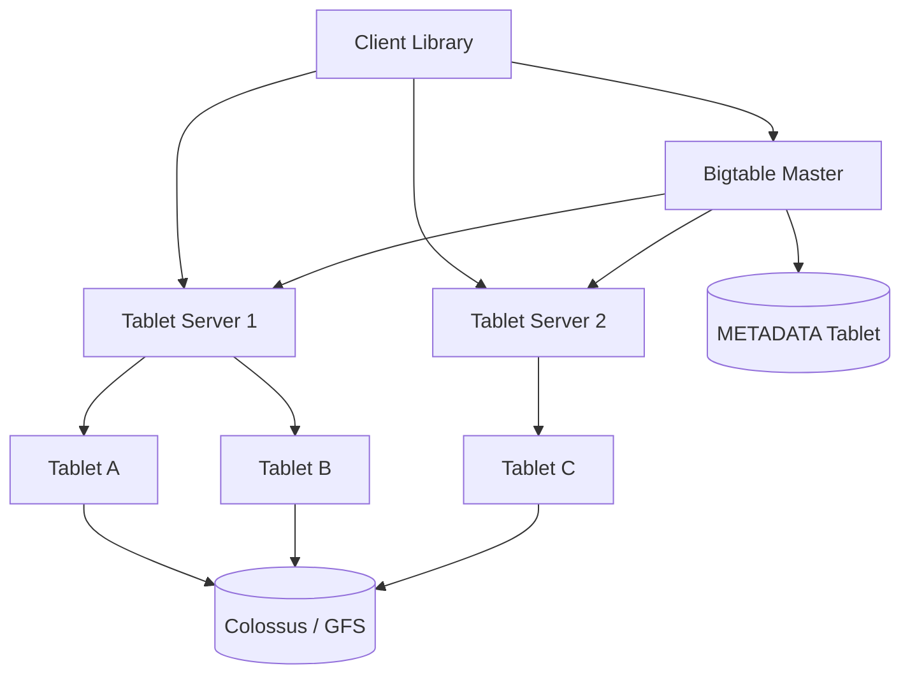
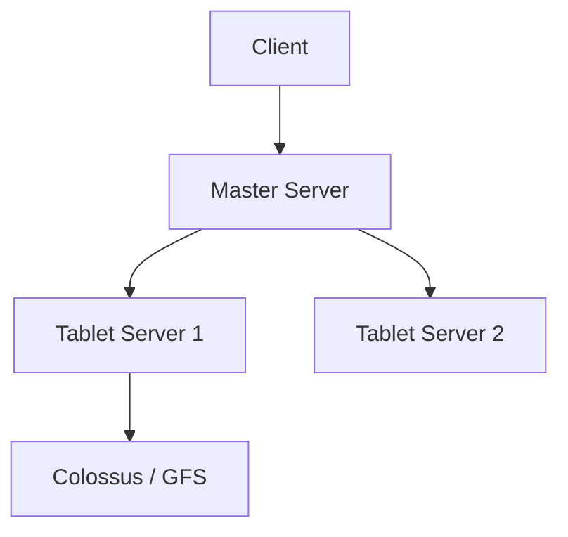

# Google Bigtable Wide-Column Storage

## 1. Business Context

Google **Bigtable** is a distributed storage system for managing **structured data** at petabyte scale across thousands of machines. Announced in the 2006 paper (Chang et al.), it became the foundation for many Google services: **web indexing**, **Google Earth**, **Google Analytics**, and historically **App Engine** backends. Externally, **Cloud Bigtable** offers a managed wide-column service on GCP with HBase-compatible APIs.

Bigtable is **not** a relational database: it is a **sparse, distributed multi-dimensional sorted map** indexed by row key, column key, and timestamp. It targets **very large datasets** with **high sustained write throughput** and **range scans** on row keys—not complex joins or multi-row transactions.

For principal architects, Bigtable is the canonical study of **LSM-backed wide-column design**, **row key as sole partition key**, **single-row atomicity**, and the **evolution path** to **Spanner** (SQL + TrueTime + cross-row transactions). Interview depth covers row key design, hotspot avoidance, compaction debt, and when Bigtable beats OLTP RDBMS vs when Spanner or Dynamo-style stores fit better.

Foundational reading: Chang et al., "Bigtable: A Distributed Storage System for Structured Data" (2006). In-repo: [LSM Trees](/docs/storage-engines/lsm-trees), [Google Spanner](/docs/distributed-databases/google-spanner).

## 2. Scale

Google internal deployments historically spanned **thousands of tablets** (partitions) across **hundreds of clusters** (paper-era figures—verify for modern scale). Cloud Bigtable scales to **petabytes** per table with automatic splitting.

| Dimension | Implication |
|-----------|-------------|
| Row key space | 64-bit range; lexicographic sort |
| Tablet size | ~100 MB–1 GB target before split |
| Column families | Separate compaction/GC policies |
| Timestamps | Multiple versions per cell |
| Read patterns | Range scans on row keys |
| Write patterns | Sustained sequential writes to LSM |

**Scale failure modes**: **hot row keys** (sequential IDs, popular entities), **compaction storms** after bulk load, **scan amplification** on wide rows, **tablet server imbalance**, and **mis-sized column families** mixing hot/cold data.

Principal analysis always starts with **row key schema**—wrong keys are irreversible without migration.

## 3. Functional Requirements

| Capability | Mechanism |
|------------|-----------|
| Put/Get cell | Row + column + timestamp |
| Range scan | Start/end row keys |
| Column families | Group columns; storage policies |
| Timestamps | Versioning; GC by age |
| Atomic row mutation | Single-row transaction |
| Conditional mutations | Compare-and-swap on row |
| MapReduce integration | SSTable input splits (historical) |
| HBase API (Cloud) | Compatibility layer |
| Replication (Cloud) | Cross-cluster async replication |

**Non-goals** (by design): cross-row ACID transactions, secondary indexes (native), rich SQL queries—Spanner and BigQuery address different layers.

## 4. Non-Functional Requirements

| NFR | Behavior |
|-----|----------|
| Write throughput | Very high sustained (LSM append) |
| Read latency | ms class for single row; scans vary |
| Durability | Replicated via GFS/Colossus under storage |
| Availability | Tablet failover; METADATA tablet recovery |
| Consistency | Single-row atomic; scans may see partial tablets |
| Elasticity | Tablet splits and load balancing |

**Latency SLOs** depend on row key locality—random scatter improves write spread but hurts range queries.

## 5. Architecture Overview



*Figure 1: Master assigns tablets to tablet servers; data in immutable SSTables on distributed file system.*

**Master** (small group): tablet assignment, schema, load balance—not on data path for reads/writes.

**Tablet server** serves **tablets** (contiguous row ranges); holds **memtable** + **SSTables** per tablet—classic **LSM** structure detailed in [LSM Trees](/docs/storage-engines/lsm-trees).

**METADATA tablet** stores tablet location mappings—**bootstrap** dependency; highly available.

**Chubby** (Google lock service) used for master election and coordination in original design.

### 5.1 Tablet lifecycle

Tablet **splits** when size threshold exceeded; **merges** rare. **Load balancer** moves tablets between servers for CPU/disk equity. **Split** chooses midpoint row key—architects pre-split for known load (import jobs).

### 5.2 Storage under Colossus

Modern Google stack uses **Colossus** (GFS successor) for SSTable files—erasure-coded, globally distributed blob layer. Architects outside Google reason analogously: **immutable files + compaction** on shared object/block storage.

## 6. Data Model

**Table** → **Column families** → **Columns** → **Cells** (value + timestamp).

Example (analytics style):

```
Row: "com.cnn.www"
  family "anchor":
    "cnnsi.com" @ t1 → ""
    "my.looksmart.com" @ t2 → ""
  family "contents":
    "html" @ t3 → "&lt;html&gt;..."
```

**Row key** determines **tablet assignment**—only partition dimension.

**Column qualifier** is opaque bytes—application encodes structure.

**Timestamps** microsecond resolution; client or server assigned—**version GC** per column family policy (`max_versions`, `max_age`).

### 6.1 Sparse vs dense

Millions of columns per row possible (web index)—**wide rows** hurt read amplification if family scanned entirely. Design **narrow hot families** separate from **cold archival families**.

## 7. Row Key Design and Partitioning

**The dominant architectural task** for Bigtable users.

| Pattern | Row key | Risk |
|---------|---------|------|
| Reverse domain | `com.google.mail/user` | Good for domain locality |
| Sequential ID | `0000001`, `0000002` | **Hot tablet** on writes |
| Hash prefix | `hash(user)%100/user_id` | Spread writes; harder range queries |
| Time-series | `metric#timestamp` | End of keyspace hot unless reversed |

**Salting** with prefix buckets trades scan complexity for write spread—common in Cloud Bigtable guidance.

Link: [Google Spanner](/docs/distributed-databases/google-spanner) interview drills on row key vs primary key in SQL.

**Hotspot symptoms**: single tablet server CPU pegged; others idle during monotonic key ingest.

## 8. Replication

Original Bigtable relied on **GFS replication** (3 copies) for durability—not cross-region product feature.

**Cloud Bigtable** adds:

- **Cluster replication** (async) between clusters
- **Multi-region** instances with **eventually consistent** replication between clusters
- **Single-cluster** multi-AZ durability within region

**Replication lag** means **failover** may lose recent writes—applications must tolerate **RPO &gt; 0** unless dual-write patterns used.

See [Replication Overview](/docs/replication/overview).

## 9. Consistency

| Scope | Guarantee |
|-------|-----------|
| Single row mutation | Atomic read-modify-write |
| Cross-row | No native transaction |
| Scan | Not snapshot isolated across entire range in one instant—tablet boundaries |
| Replication | Eventual across clusters |

**Read-your-writes**: single client routing to same tablet server helps; not a global product guarantee.

Compare [Linearizability](/docs/consistency/linearizability): Bigtable does not provide linearizable multi-row operations.

[PACELC](/docs/consistency/pacelc) classifies Bigtable as **PC/EL**—under partition, consistency favored; else latency.

**Percolator** (Google) layered **cross-row transactions** atop Bigtable for indexing pipelines—precursor patterns to Spanner's transaction layer.

## 10. Availability

**Tablet server failure**: tablets reassigned; short unavailability during failover.

**Master failure**: standby promotion via Chubby lock.

**Corrupt SSTable**: rare; restore from replica blocks in Colossus.

**Cloud SLA**: regional service tier defines uptime—architects document **maintenance windows** and **zonal failures**.

[Disaster Recovery and Multi-Region](/docs/reliability-and-resilience/disaster-recovery-and-multi-region) for application-level dual-write vs async replication acceptance.

## 11. Failure Handling

| Failure | Handling |
|---------|----------|
| Hot tablet | Split; redesign row key; emergency salt |
| Compaction backlog | Throttle writes; add nodes; tune CF |
| Master split-brain | Chubby prevents (design) |
| Client retry storm | Backoff; idempotent row ops |
| Bulk import | Pre-split tablets; sorted load |
| Schema change | Column family adds cheap; key migration hard |

**Bulk load** best practice: **sorted row keys** aligned with tablet boundaries—unsorted parallel load creates **split thrash**.

**GC** of old cell versions—misconfigured `max_versions` causes **space amplification**.

## 12. Security

Cloud Bigtable:

- **IAM** roles at project/instance/table granularity
- **VPC Service Controls** for exfiltration bounds
- **Customer-managed encryption keys** (CMEK)
- **Audit logs** for admin operations

Internal Google: **cell-level security** not native—application enforces in higher layers.

[Zero Trust Architecture](/docs/security/zero-trust-architecture) for service accounts accessing Bigtable from GKE workloads—least privilege per table.

Row keys may embed **PII**—encryption at rest does not prevent authorized reader seeing data.

## 13. Observability

| Metric | Meaning |
|--------|---------|
| Per-tablet CPU/disk | Hotspot detection |
| Compaction queue | Write stall risk |
| Read/write QPS per node | Load balance |
| Latency p99/p999 | SLO tracking |
| Replication lag | DR readiness |
| Block cache hit rate | Read efficiency |

Cloud Monitoring integrates native dashboards—alert on **hot tablet** and **latency SLO burn**.

[Distributed Tracing](/docs/observability/distributed-tracing) for microservices calling Bigtable—identify chatty scan patterns.

## 14. Cost Model

Cloud Bigtable pricing drivers:

- **Nodes** (compute serving capacity)
- **Storage** (GB-month including SSD)
- **Replication** clusters multiply cost
- **Network egress** for scans to analytics

**Cost levers**:

- Right-size nodes via load tests (not over-provision)
- Column family GC policies reduce storage
- Avoid unbounded version history
- Export cold data to **BigQuery** / GCS for analytics instead of wide scans on hot tables

[Cloud Cost Optimization](/docs/cost-and-finops/cloud-cost-optimization).

Self-hosted HBase on Bigtable-like stores: operational headcount dominates.

## 15. Evolution of Architecture

Timeline (synthesis):

- 2006 **Bigtable paper** — LSM + tablet model
- **HBase**, **Cassandra** (different partition model) ecosystem forks
- **Percolator** — transactions atop Bigtable
- 2012 **Spanner paper** — TrueTime + SQL + cross-row ACID
- **Cloud Bigtable** GA — managed ops, HBase API
- Integration with **Dataflow**, **Beam**, **BigQuery** export

Architectural lesson: Bigtable **won the wide-column layer** inside Google; **Spanner** addresses relational needs without abandoning distributed storage lessons.

## 16. Important Tradeoffs

| Tradeoff | Detail |
|----------|--------|
| Row key design vs query flexibility | Only one sort order |
| Write throughput vs read amplification | LSM compaction debt |
| Wide rows vs scan cost | Family design critical |
| Bigtable vs Spanner | Transactions vs scale/cost |
| Async replication vs RPO | Failover windows |
| HBase compatibility vs native API | Feature gaps |

## 17. Known Limitations

- No native SQL (use BigQuery federated or export)
- No cross-row transactions (use Spanner or app-level sagas)
- Secondary index patterns require **denormalization** or **Percolator-style** layers
- Row key migration is **painful**
- Scan-heavy analytics can starve OLTP tablets—separate clusters

## 18. Interview Lessons

**Strong signals**:

- Row key design with hotspot mitigation
- LSM write path and compaction impact
- Single-row atomicity scope
- When Spanner replaces Bigtable
- Tablet split and pre-split import

**Red flags**:

- Sequential UUID as row key for write-heavy ingest
- Expecting JOIN across tables
- Ignoring column family GC

**Google interview**: compare [Bigtable vs Spanner for time-series metrics](/docs/company-specific-preparation/google) style questions.

## 19. Redesign Exercise

**Prompt**: IoT platform—1M devices each reporting 10 metrics/sec; dashboard range scans last hour per device; alerts on latest value.

Design:

1. Row key: `device_id#reverse_timestamp` or `salt#device#ts`
2. Column family `latest` with GC max_versions=1
3. Column family `history` with max_age=7d
4. Separate Bigtable cluster for analytics export to BigQuery
5. Hot device isolation via key prefix salt
6. Alert path: read `latest` only—no scan

### Deep dive: LSM write amplification

Each write appends to memtable → flush SSTable → compaction merges runs. **Write amplification (WA)** affects disk and latency during compaction spikes—see [LSM Trees](/docs/storage-engines/lsm-trees) for leveled vs tiered strategies.

**Bulk load** bypasses memtable with SSTable import—operations win for one-time history backfill.

### Deep dive: scan vs get

`GetRow` single row: one tablet lookup + few SSTables with bloom filters.

`Scan` across range: **O(rows)** in range—expensive at million-row ranges; push to **BigQuery** for warehouse queries.

### Interview scoring rubric (principal)

| Dimension | Weight | Strong signal |
|-----------|--------|---------------|
| Row key | 30% | Salt, reverse ts, hotspot aware |
| LSM mechanics | 25% | Memtable, compaction, WA |
| Consistency scope | 20% | Single-row only explicit |
| Product fit | 15% | vs Spanner, vs BigQuery |
| Operations | 10% | Splits, imports, monitoring |

## Supplementary Diagram


*Figure: Bigtable master-tablet-storage layering.*

## 20. References

- Chang, Dean, Ghemawat et al., "Bigtable" (2006 OSDI)
- Google Cloud Bigtable documentation (schema design, replication)
- [LSM Trees](/docs/storage-engines/lsm-trees)
- [Google Spanner](/docs/distributed-databases/google-spanner)
- [Distributed Databases Overview](/docs/distributed-databases/overview)
- [PACELC](/docs/consistency/pacelc)
- [Replication Overview](/docs/replication/overview)

### Appendix: Bigtable vs HBase vs Cassandra

| Dimension | Bigtable | HBase | Cassandra |
|-----------|----------|-------|-----------|
| Partition | Row range tablets | Regions | Hash ring |
| Consistency | Single-row atomic | Row | Tunable per query |
| Transactions | Row only | Row | Lightweight transactions |
| Ops model | Managed (Cloud) | Self-hosted typical | Self-hosted |

### Appendix: principal question bank

1. Redesign Twitter user timeline in Bigtable—row keys for write vs read.
2. Compaction lag doubles write latency—diagnosis steps.
3. When migrate table from Bigtable to Spanner—decision criteria.
4. Multi-region active-active user profiles—consistency story.
5. Explain Percolator's role relative to Bigtable.

Mechanism, tradeoffs, and **row keys first**.

### Appendix: Cloud Bigtable node sizing workflow

Load testing methodology for managed Bigtable: start with **recommended nodes per GB storage** baseline from vendor docs (verify current guidance), then stress **single-row QPS** and **scan QPS** separately—they scale differently. **CPU overload** manifests as rising **frontend server queue** latency before storage saturates. **Node reduction** after traffic drop saves cost but requires **24–48 hour** observation—compaction debt may lag. Autoscaling policies must cap **maximum nodes** to prevent runaway cost during attack traffic on hot keys.

### Appendix: integration with Google analytics pipeline

Historical Bigtable role in **web indexing** and analytics: **MapReduce** (and later Dataflow) read SSTable exports for batch transforms while live serving stays on tablet servers. Modern analog: **BigQuery export** or **Change Streams** (verify Cloud Bigtable feature availability) feed warehouse without scan-loading production tablets. Architects never run **full table scan** on OLTP Bigtable cluster for daily reporting—dedicated export path mandatory.

### Appendix: HBase API compatibility caveats

Teams choosing **HBase API** on Cloud Bigtable inherit HBase mental models (coprocessors, filters) that may not map 1:1 to managed service capabilities. **Filter pushdown** efficiency varies—wide scans with complex filters still amplify reads. Migration from self-hosted HBase requires **row key audit** first; coprocessor logic reimplemented in **Dataflow** or application layer.

### Appendix: time-series row key reversal pattern

For device metrics with natural key `device_id + timestamp`, naive ascending timestamp clustering writes to **end of keyspace**—single hot tablet. **Reverse timestamp** (`device_id + (MAX_TS - ts)`) spreads recent writes across tablets while preserving **per-device recent-first** scan for dashboards. Tradeoff: historical range scans need **two-step** query or separate BigQuery table. Interviewers reward explicit **read vs write** hotspot analysis on same schema.

### Appendix: Spanner migration triggers

Migrate row-oriented workload from Bigtable to [Google Spanner](/docs/distributed-databases/google-spanner) when product requires **secondary indexes**, **SQL ad-hoc queries**, or **multi-row transactions** with serializable isolation—and when budget accepts higher per-operation cost. **Stay on Bigtable** for append-only ingest exceeding Spanner write economics, simple get/scan by known key, or **bulk analytics export** pipelines already built on tablet exports. Hybrid architectures keep **hot OLTP** on Spanner and **cold archive** on Bigtable or GCS—never dual-write without reconciliation job.

### Appendix: Bloom filters and block cache tuning

Tablet servers use **Bloom filters** per SSTable to skip absent keys during `Get`—false positives only cost extra SSTable read. **Block cache** size relative to hot row set determines read tail latency after deploy cold start. **Cache warming** for known hot keys (dashboard launch) can pre-read row ranges during low-traffic window. Misconfigured **block size** in column family options trades index granularity vs read amplification—principal tuning exercise on staging cluster before Black Friday ingest.
