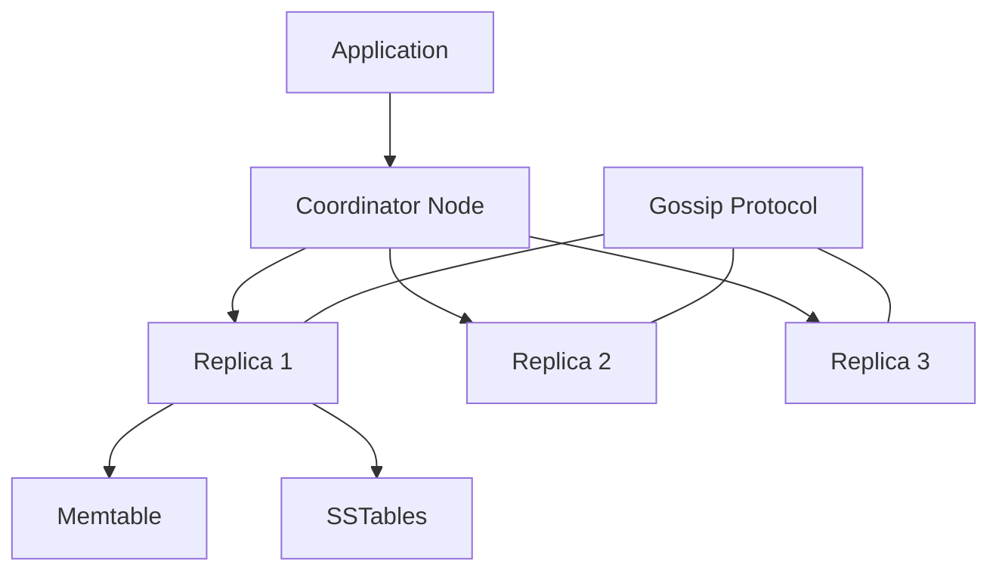
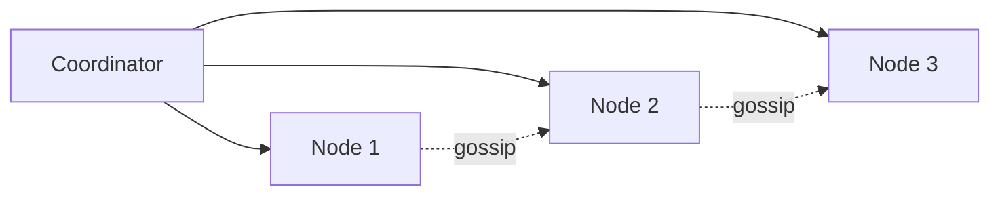

# Apache Cassandra at Scale

## 1. Business Context

Apache Cassandra is an open-source, distributed **wide-column** database designed for **high write throughput**, **multi-datacenter availability**, and **linear scale-out** on commodity hardware or managed offerings (DataStax Astra, Amazon Keyspaces, ScyllaDB-compatible deployments). Born from Facebook's inbox search needs and influenced by the Dynamo paper, Cassandra powers time-series telemetry, user activity feeds, product catalogs, messaging metadata, and session stores at organizations that need **self-managed control** or **multi-cloud portability** without a single-vendor lock-in.

Organizations adopt Cassandra when they require **always-on writes** during datacenter failures, predictable horizontal scaling by adding nodes, and **tunable consistency** per query rather than a one-size-fits-all model. The business value is **operational resilience** and **cost-effective ingest** at billions of events per day—when teams commit to query-first schema design and continuous repair operations.

For principal architects, Cassandra is a case study in **explicit tradeoffs**: availability and partition tolerance are first-class; default conflict resolution is **last-write-wins (LWW)** by timestamp; multi-row ACID is absent unless you use lightweight transactions (Paxos) sparingly. Interview and production discussions center on consistency levels, compaction strategy, tombstone pathology, and when Cassandra loses to DynamoDB, Scylla, or a relational store.

See [Apache Cassandra](/docs/distributed-databases/apache-cassandra) and lineage context in [Amazon Dynamo](/docs/distributed-databases/amazon-dynamo).

## 2. Scale

Cassandra scales **horizontally by adding nodes** to a cluster; each node owns a portion of the token ring via **vnodes** (virtual nodes). There is no single master for writes—any node can act as **coordinator** for a client request.

**Order-of-magnitude framing** (cluster-dependent; verify with benchmarks):

| Dimension | Scale consideration |
|-----------|---------------------|
| Cluster size | Hundreds of nodes in large deployments (operational complexity grows) |
| Write throughput | LSM append path favors sustained high ingest |
| Partition size | Keep partitions bounded; wide rows have limits |
| Multi-DC | `NetworkTopologyStrategy` with per-DC `RF` |
| Read latency | Depends on CL, compaction, and cache hit rate |
| LWT (Paxos) | Orders of magnitude lower throughput than normal writes |

Scale failures are rarely "cluster cannot accept more nodes" and more often **unbounded tombstones**, **hot partitions**, **`ALLOW FILTERING` in production**, or **repair debt** causing stale reads. Principal-level analysis models queries before schema and defines repair SLAs before launch.

## 3. Functional Requirements

Cassandra must support:

| Capability | Mechanism |
|------------|-----------|
| Wide-column storage | Partition key + clustering columns |
| Tunable reads/writes | Consistency level per operation |
| Multi-DC replication | `NetworkTopologyStrategy` |
| CQL API | SQL-like syntax; partition-scoped execution |
| Secondary indexes | Limited; fan-out cost |
| Lightweight transactions | `IF` conditions via Paxos |
| TTL expiration | Automatic cell deletion |
| Materialized views | Denormalized projections (operational caveats) |
| Change capture | CDC (version-dependent) or external dual-write |

**Query discipline**: every production query should include a **partition key** restriction. Full scans are operational emergencies, not application patterns.

## 4. Non-Functional Requirements

| NFR | Target / behavior |
|-----|-------------------|
| Availability | AP-leaning; lower CL maintains progress during failures |
| Latency | `LOCAL_QUORUM` avoids cross-DC RTT on every operation |
| Durability | `QUORUM`/`LOCAL_QUORUM` with RF≥3 typical |
| Elasticity | Add nodes; rebalancing via streaming |
| Security | RBAC, TLS, encryption at rest (version/plug-in dependent) |
| Operability | Requires repair, compaction tuning, capacity planning |

**Consistency** is per-query via CL—see [Quorum Systems](/docs/consistency/quorum-systems) for R+W>N intersection math.

## 5. Architecture Overview



*Figure 1: Coordinator routes request to replicas satisfying consistency level; storage is LSM-based.*

**Cluster membership**: nodes discover state via **gossip**—no central coordinator for cluster health.

**Write path**: commit log → memtable → flush to immutable **SSTables** → **compaction** merges files.

**Read path**: memtable + SSTables merged; **read repair** fixes divergence opportunistically.

Link [LSM Trees](/docs/storage-engines/lsm-trees) for compaction and amplification vocabulary.

## 6. Data Model

Tables are defined with:

- **Partition key**: determines token placement and replica set
- **Clustering columns**: sort order within partition
- **Static columns**: shared per partition (use carefully)

Example time-series sensor data:

```sql
CREATE TABLE sensor_readings (
  tenant_id uuid,
  sensor_id uuid,
  recorded_at timestamp,
  value double,
  PRIMARY KEY ((tenant_id, sensor_id), recorded_at)
) WITH CLUSTERING ORDER BY (recorded_at DESC);
```

**Denormalization** is normal: one query → one partition read. Joins are application-side or duplicate tables per access pattern.

**Counters** are legacy anti-pattern for hot keys—prefer external aggregation or idempotent event counting.

### 6.1 UDTs and collections

User-defined types and collections (sets, lists, maps) enable nested structures but can create **wide partition** risk if unbounded. Principal architects cap collection sizes and prefer frozen types for immutability semantics where appropriate.

## 7. Partitioning

**Partitioner** (Murmur3 default) hashes partition key to token on ring. **vnodes** split token ownership across physical nodes for even distribution.

| Technique | Use when |
|-----------|----------|
| High-cardinality partition key | Natural spread (user_id, device_id) |
| Composite partition key | Multi-tenant isolation |
| Time bucketing | Prevent unbounded time-series partitions |
| ByteOrderedPartitioner | Avoid unless legacy—Murmur3 preferred |

**Hot partition symptoms**: single node CPU saturation, elevated latencies on one key, coordinator overload.

**Mitigations**: salt partition key with shard suffix; separate table per hot entity; cache hot reads in [Distributed Caching](/docs/caching/distributed-caching).

## 8. Replication

**Replication factor (RF)** copies data to N nodes. **NetworkTopologyStrategy** places replicas per datacenter:

```
{'class': 'NetworkTopologyStrategy', 'DC1': 3, 'DC2': 3}
```

**Hinted handoff**: coordinator stores write for temporarily down replica—improves write availability; hints expire.

**Repair** (full, incremental, nodetool options): mandatory background process to converge replicas—neglect causes **data drift**.

Contrast [Leaderless Replication](/docs/replication/leaderless-replication) with Dynamo-style quorums.

## 9. Consistency

| CL | Behavior |
|----|----------|
| `ONE` | Fast; stale reads possible |
| `LOCAL_QUORUM` | Majority in local DC—common for multi-DC |
| `QUORUM` | Global majority—cross-DC RTT |
| `EACH_QUORUM` | Quorum in every DC—expensive writes |
| `SERIAL` / LWT | Linearizable compare-and-set per partition |

**LWW**: conflicting writes resolve by timestamp—**not** application merge. Clock skew causes surprises; use **synchronized NTP** and avoid client-generated timestamps unless disciplined.

**R+W>N** (with matching scope): quorum reads overlap quorum writes for monotonic read guarantee under stable membership.

Deep dive: [Eventual Consistency](/docs/consistency/eventual-consistency) and [Session Guarantees](/docs/consistency/session-guarantees).

## 10. Availability

Cassandra prioritizes **write availability** during partial failures. A down replica does not block `ONE` writes; `LOCAL_QUORUM` may still succeed if local DC quorum intact.

Failure modes visible to operators:

- **Node loss**: remaining replicas serve with RF headroom
- **DC loss**: if RF per DC maintained, other DCs continue
- **Split-brain risk**: mitigated by proper CL + RF design—not by default LWW alone
- **Gossip partition**: mis-routing until healed—monitor cluster views

**PACELC** per [PACELC](/docs/consistency/pacelc): Cassandra typically chooses **latency and availability** (lower CL) over strong consistency unless quorums or LWT specified.

## 11. Failure Handling

| Failure | Response |
|---------|----------|
| `UnavailableException` | Retry; check RF and CL vs live nodes |
| `ReadTimeout` / `WriteTimeout` | Tune timeouts; investigate load |
| Tombstone overflow | Lower TTL; run repair; fix delete patterns |
| Compaction backlog | Change strategy (STCS/LCS/TWCS/UCS) |
| Paxos contention | Reduce LWT scope; redesign hot keys |
| Schema disagreement | Rolling restart; gossip stabilization |

**Idempotent writes** with natural keys prevent duplicate side effects on retry—[Idempotency](/docs/distributed-systems-foundations/idempotency).

**Partial failures** in multi-service flows use sagas per [Sagas](/docs/transactions/sagas)—Cassandra does not coordinate cross-partition transactions.

## 12. Security

- **Authentication**: PasswordAuthenticator or LDAP integration
- **Authorization**: CQL GRANT on keyspaces/tables
- **TLS**: inter-node and client encryption
- **Encryption at rest**: enterprise or OS-level solutions
- **Network isolation**: private subnets; firewall gossip ports

Principal review: separate prod/stage clusters, least privilege service accounts, audit logging to SIEM, and PII column encryption at application layer where required.

See [Security Architecture Fundamentals](/docs/security/security-architecture-fundamentals).

## 13. Observability

| Signal | Source |
|--------|--------|
| Read/write latency | nodetool tablestats, Prometheus exporters |
| Compaction pending | Disk and compaction metrics |
| Repair status | nodetool repair history |
| Tombstone counts | sstable metadata, tracing |
| GC pauses | JVM metrics—heap tuning critical |
| Client errors | Driver metrics per keyspace |

**Tracing**: request tracing for slow queries—identify unbounded partitions.

**SLO design**: p99 read/write latency per CL, repair completion weekly—[SLO, SLI, and Error Budgets](/docs/reliability-and-resilience/slo-sli-error-budgets).

## 14. Cost Model

| Driver | Notes |
|--------|-------|
| Nodes | CPU, RAM, NVMe—size for heap + off-heap |
| Storage | SSTable footprint; compaction temporary disk |
| Cross-DC bandwidth | `QUORUM` writes replicate across WAN |
| Operations | Engineer time for repair, upgrades, tuning |
| Managed service | Shift ops to vendor; different $ curve |

**Cost optimization**:

- Right-size RF per DC—avoid over-replication
- TWCS for time-series TTL workloads
- Archive cold data to object storage per [Data Lakehouse Architecture](/docs/data-platforms/data-lakehouse-architecture)
- Prefer `LOCAL_QUORUM` over `QUORUM` when business allows

FinOps: [Cloud Cost Optimization](/docs/cost-and-finops/cloud-cost-optimization).

## 15. Evolution of Architecture

**Lineage**: Dynamo paper → Cassandra at Facebook (2010) → Apache project → 3.x storage engine improvements → 4.x+ features (verify release notes).

Notable evolution:

- **vnodes** default for balanced ownership
- **SSTable formats** and improved compression
- **Incremental repair**
- **CDC** for change capture
- Ecosystem: Spark, Kafka connectors, DataStax drivers

Architecturally, Cassandra influenced **ScyllaDB** (C++ rewrite, shard-per-core) and cloud **Keyspaces** (managed Cassandra API). The lesson: **operational maturity** is part of the product—clusters fail from neglected repair, not theoretical CAP proofs.

## 16. Important Tradeoffs

| Choice | Benefit | Cost |
|--------|---------|------|
| `LOCAL_QUORUM` | Fast multi-DC without global quorum RTT | Possible stale cross-DC reads |
| `QUORUM` | Stronger intersection | WAN latency on every op |
| LWT | Compare-and-set correctness | Throughput collapse on hot keys |
| STCS compaction | Write-optimized | Read amplification over time |
| LCS | Better read amp | Write amplification |
| TWCS | Time-series TTL | Wrong if updates span windows |
| vs DynamoDB | Control, multi-cloud | You operate repair/compaction |
| vs RDBMS | Scale-out writes | No ad-hoc joins |

## 17. Known Limitations

- No cross-partition ACID transactions (except limited LWT scope)
- Secondary indexes are not global B-trees—expensive at scale
- `ALLOW FILTERING` scans all replicas—production anti-pattern
- Tombstones can destroy read performance if deletes dominate
- LWW does not preserve intent—application merges needed for some domains
- Schema changes require careful rollout
- Expertise required—managed alternatives exist for a reason

## 18. Interview Lessons

**Strong candidates**:

- Explain `LOCAL_QUORUM` with RF=3 in two DCs
- Choose compaction strategy for metrics workload
- Design partition key for "messages by user, reverse chronological"
- Describe repair necessity and what happens if skipped
- Contrast Cassandra vs DynamoDB operational model

**Follow-ups**:

- When would you use LWT for inventory decrement?
- How do tombstones cause `ReadFailure`?
- Cassandra vs Kafka for event log?

**Red flags**:

- "Cassandra is strongly consistent"
- Proposing secondary index for high-cardinality lookup without load test
- Ignoring repair runbooks

### Interview scoring rubric (principal)

| Dimension | Weight | Strong signal |
|-----------|--------|---------------|
| Consistency levels | 25% | LOCAL_QUORUM + RF math |
| Schema / partitioning | 25% | Query-first design |
| Operations | 20% | Repair, compaction, tombstones |
| Multi-DC | 15% | NetworkTopologyStrategy |
| Alternatives | 15% | DynamoDB, Scylla, when not Cassandra |

## 19. Redesign Exercise

**Prompt**: A social app stores notifications in Cassandra. Deleting old notifications uses `DELETE` with 90-day TTL, but users report slow reads and `TombstoneOverwhelmingException` during peak.

**Tasks**:

1. Explain tombstone accumulation with TTL + explicit deletes.
2. Propose TWCS + shorter `gc_grace_seconds` tradeoffs.
3. Redesign with time-bucketed partitions to allow partition drop instead of cell tombstones.
4. Define repair and compaction SLOs.
5. Decide when to archive to S3 instead of Cassandra.

**Evaluation rubric**: tombstone/compaction understanding (35%), schema redesign (30%), operations (20%), cost (15%).

### Deep dive: multi-DC read path

Client in DC2 reads with `LOCAL_QUORUM`: coordinator in DC2 contacts local replicas only—fast but may miss very recent write in DC1 until repair/async convergence. Document **stale read window** for product owners.

### Deep dive: Paxos inventory

`UPDATE products SET qty = qty - 1 IF qty > 0` provides linearizable decrement per partition key—serializes hot SKU row. Alternative: reserve inventory in Redis with async Cassandra audit log.

### Deep dive: time-bucketed notification schema

```sql
PRIMARY KEY ((user_id, bucket_date), notification_id)
```

Drop entire partition `bucket_date < cutoff` via `DROP` or TTL on partition metadata pattern—avoids per-cell tombstones on wide partitions.

## Supplementary Diagram


*Figure: Cassandra coordinator write with gossip-based cluster membership.*

## 20. References

- Lakshman & Malik, "Cassandra: A Decentralized Structured Storage System" (2010)
- Apache Cassandra documentation (official)
- DeCandia et al., Dynamo paper (2007)
- [Apache Cassandra](/docs/distributed-databases/apache-cassandra)
- [Amazon Dynamo](/docs/distributed-databases/amazon-dynamo)
- [Quorum Systems](/docs/consistency/quorum-systems)
- [Leaderless Replication](/docs/replication/leaderless-replication)
- [LSM Trees](/docs/storage-engines/lsm-trees)

### Appendix: when not to choose Cassandra

| Workload | Better fit | Why |
|----------|------------|-----|
| Ad-hoc analytics | Snowflake, Spark | Flexible queries |
| Cross-row transactions | PostgreSQL, Spanner | ACID scope |
| Graph traversals | Graph DB | Native adjacency |
| Low-latency strong global SQL | Spanner, CockroachDB | Serializable multi-row |
| Ephemeral cache | Redis | In-memory semantics |

Principal architects document **exit paths**: Cassandra → object storage + warehouse for historical analytics without overloading OLTP cluster.

### Appendix: rolling upgrade runbook

1. Run `nodetool status`—confirm all nodes `UN` (up/normal).
2. Upgrade one rack at a time; drain with `nodetool decommission` only when removing nodes.
3. Verify gossip stability and schema agreement after each batch.
4. Run repair on upgraded nodes before next batch per organizational policy.
5. Roll back driver compatibility before server downgrade—clients and servers must match supported protocol matrix.

Link [Failure Analysis Methodology](/docs/production-failures/failure-analysis-methodology) for post-upgrade incident review.

### Appendix: capacity planning walkthrough

Target: 50k writes/sec, RF=3, `LOCAL_QUORUM`, 1 KB values, 3 DCs.

- Per-DC replicas written: 2 (quorum of 3)
- Total physical writes: 50k × 2 × 3 DCs = 300k replica writes/sec (order-of-magnitude)
- Disk: ingest rate × RF × retention with compaction overhead factor (benchmark, do not guess)
- Network: cross-DC replication if using `QUORUM` instead of `LOCAL_QUORUM` multiplies WAN traffic

Principal interviews reward **structured estimation** with explicit CL and RF assumptions—not precise hardware counts without benchmarks.

### Appendix: hinted handoff and read repair

When a replica is temporarily down, the coordinator stores a **hint** and replays the write when the replica returns—this improves **write liveness** during brief node restarts without blocking the client at `CL=QUORUM`. Hints expire per `max_hint_window_in_ms`; prolonged outages require **repair** to converge replicas—hints are not a durability substitute. Cross-datacenter hinted handoff increases WAN traffic during mass restarts; capacity plans must include hint replay storms after region-wide maintenance.

**Read repair** opportunistically fixes divergence when a quorum read detects mismatched timestamps across replicas. It heals drift between full repairs but does not replace scheduled `nodetool repair`. Principal runbooks specify weekly incremental repair minimum for production RF=3 clusters, with full repair quarterly or after major topology changes.

### Appendix: lightweight transactions operational limits

Use LWT only for **low-contention, partition-scoped** invariants—inventory decrement on a SKU with moderate concurrency, feature flag toggles, or lease acquisition. Paxos rounds add latency multipliers; a hot partition with hundreds of LWT/sec will fail interviews and production alike. Prefer external coordination (Redis with TTL lease, dedicated lock service with [Fencing Tokens](/docs/consensus/fencing-tokens)) when contention is predictable. Document **safety**: LWT provides linearizable compare-and-set for the involved partition key only—not cross-table transactions.
