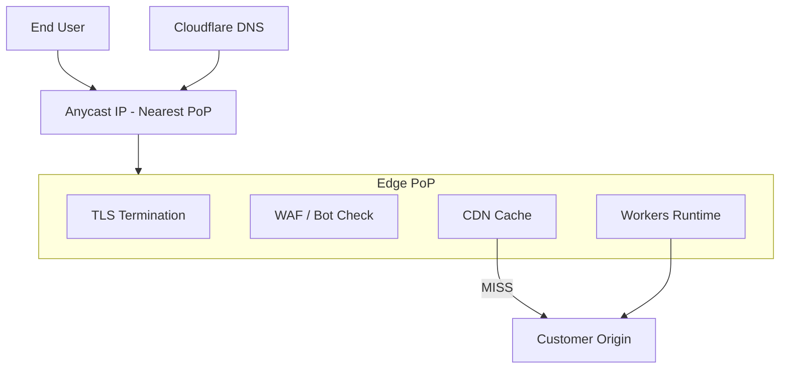
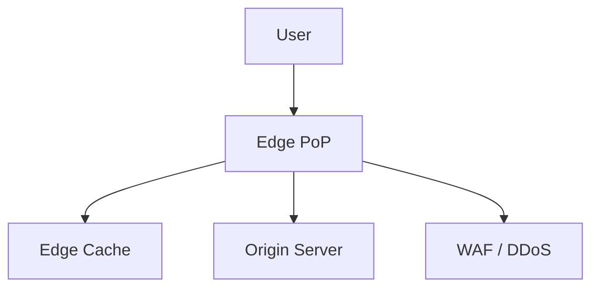

# Cloudflare Global Edge Network

## 1. Business Context

Cloudflare operates one of the world's largest **edge networks**, positioning itself as a connectivity cloud that sits between users and origin infrastructure. Core offerings include **DNS**, **CDN caching**, **DDoS mitigation**, **Web Application Firewall (WAF)**, **TLS termination**, **Workers** (edge compute), **R2** object storage, **Zero Trust** access (Access, Gateway), and **load balancing** across origins. The business model transforms security and performance from bolt-on appliances into **always-on network services** billed per domain, request, or seat.

Organizations adopt Cloudflare to reduce origin load, improve global latency, absorb volumetric attacks without provisioning spare datacenter capacity, and consolidate DNS plus certificate management. For principal architects, Cloudflare is a case study in **reverse proxy at planet scale**: anycast routing, cache hierarchy, TLS at the edge, and the operational complexity of running code milliseconds from users worldwide.

This case study synthesizes **public Cloudflare engineering content** (blog posts, system descriptions) with patterns from in-repo networking and API chapters. It is not an insider view of proprietary implementations—mark unverified internal scale numbers.

See [HTTP, TLS, and QUIC](/docs/networking/http-tls-and-quic) and [API Platform](/docs/system-design/api-platform) for complementary depth.

## 2. Scale

Cloudflare publicly describes **hundreds of cities** in its network and **millions of HTTP requests per second** aggregate across customers (verify current company metrics in investor materials and blog posts—do not invent precise figures). Scale dimensions:

| Dimension | Implication |
|-----------|-------------|
| Request rate | Per-PoP aggregation; anycast spreads load |
| Cache footprint | SSD/RAM at edge; hit ratio drives origin relief |
| DNS QPS | Authoritative and resolver infrastructure |
| Attack volume | Tbps-class mitigations claimed publicly for large events |
| Workers isolates | V8 isolates per invocation—CPU time limits |
| Configuration propagation | Global config distribution to all PoPs |

Scale failures manifest as **cache poisoning misconfigurations**, **origin overload when cache bypassed**, **WAF false positives** blocking legitimate traffic, **DNS propagation delays**, or **Workers CPU limit exceeded**—not typically "Cloudflare cannot receive more packets" due to anycast absorption.

## 3. Functional Requirements

Cloudflare's edge must support:

| Capability | Mechanism |
|------------|-----------|
| Reverse proxy HTTP/S | Terminate TLS; forward to origin |
| Static and dynamic caching | Cache rules; tiered cache |
| DNS hosting | Authoritative DNS; DNSSEC |
| DDoS protection | Scrubbing; automatic mitigation |
| WAF | OWASP rules; custom expressions |
| Rate limiting | Per-IP, per-path, advanced rules |
| Load balancing | Health checks; geo steering |
| Edge compute | Workers, Durable Objects (product) |
| Zero Trust access | Identity-aware proxy to private apps |
| Certificate management | Universal SSL; custom certs |

**Configuration discipline**: cache rules and WAF expressions are **code**—require CI/CD, staging zones, and rollback.

## 4. Non-Functional Requirements

| NFR | Target / behavior |
|-----|-------------------|
| Latency | Edge proximity reduces RTT to first byte for cache hits |
| Availability | Multi-PoP anycast; origin health independent |
| Security | Default DDoS; optional WAF/Bot Management |
| Elasticity | Absorb spikes without customer-provisioned capacity |
| Global reach | PoPs close to users worldwide |
| Config consistency | Eventual propagation to all edges |

**Consistency** at edge is **cache TTL semantics**—not database linearizability. Dynamic content requires explicit cache control headers or bypass.

## 5. Architecture Overview

*Figure 1: User traffic hits nearest PoP via anycast; cache hit avoids origin round trip.*

**Anycast BGP** advertises same IP from many locations—routing delivers to topologically nearest PoP.

**Tiered cache** (product): upper-tier PoPs aggregate origin fetches—reduces origin load for popular assets.

**Control plane** distributes zone configuration, certificates, and WAF rules to PoPs—architects treat propagation delay as operational factor.

Link [Routing, Load Balancing, and Congestion](/docs/networking/routing-load-balancing-and-congestion).

## 6. Data Model

Cloudflare's "data" spans multiple stores (conceptual—not claiming internal schema):

| Entity | Purpose |
|--------|---------|
| Zone | Domain configuration container |
| DNS record | A, AAAA, CNAME, etc. |
| Cache entry | URL + cache key → response body/metadata |
| WAF rule | Expression → action |
| Worker script | Versioned JavaScript/WebAssembly bundle |
| Analytics aggregates | Request logs rolled up per customer |

**Cache key** customization affects hit ratio—include only variants that matter (language, cookie subset). Poor keys cause **cache fragmentation**.

**Durable Objects** (product) provide strongly consistent **single-writer** coordination at edge for specific use cases—contrast with stateless Workers.

## 7. Partitioning

Edge systems partition by:

| Axis | Approach |
|------|----------|
| Customer zone | Config isolation per account |
| URL path | Cache sharding by cache key hash |
| PoP | Local cache partition; miss fetches upstream |
| Geographic | Anycast maps users to PoP |
| Workers | Isolate per request; optional Durable Object shard |

**Hot URL** (viral asset): benefits entire network via cache—origin protected if `Cache-Control` allows.

**Hot dynamic path** (uncacheable API): all requests reach origin—architects add [Distributed Rate Limiter](/docs/system-design/distributed-rate-limiter) at edge and origin.

## 8. Replication

**DNS**: authoritative records replicated across Cloudflare's DNS infrastructure with low TTL options for rapid failover.

**Cache**: each PoP holds subset of objects; **not** a strongly consistent replica set—**eventual** fill on miss with TTL expiration.

**Configuration**: zone settings replicated to PoPs—eventual consistency window during updates.

**R2 storage** (product): object storage with S3-compatible API—distinct replication model from CDN cache; see [Global Object Store](/docs/system-design/global-object-store) patterns.

**Zero Trust**: policy replicas for identity decisions—availability tied to Cloudflare control plane.

## 9. Consistency

| Layer | Consistency |
|-------|-------------|
| CDN cache | TTL-based; `stale-while-revalidate` optional |
| DNS | Propagation delay; TTL governs client cache |
| Workers KV | Eventually consistent (product docs) |
| Durable Objects | Strong per-object ordering (product) |
| Origin fetch | Depends on origin headers |

**Cache invalidation** via API purges—propagates globally with delay; architects prefer short TTL + versioned asset URLs for immutable static files.

Contrast [Linearizability](/docs/consistency/linearizability)—edge caches are AP for content delivery by design per [CAP Theorem](/docs/consistency/cap-theorem).

## 10. Availability

Cloudflare aims for always-on proxy service. Customer-visible scenarios:

- **PoP impairment**: anycast routes around failed PoP
- **Origin down**: custom error pages; load balancer failover pools
- **WAF block**: false positive appears as "outage" to users
- **DNS misconfiguration**: NXDOMAIN or wrong origin—customer responsibility boundary
- **Cloudflare incident**: rare global control plane issues—monitor status page

**Multi-origin load balancing** with health checks improves origin availability—architects document **failover order** and **session affinity** needs.

See [Disaster Recovery and Multi-Region](/docs/reliability-and-resilience/disaster-recovery-and-multi-region) for origin-side DR—not edge alone.

## 11. Failure Handling

| Failure | Response |
|---------|----------|
| Origin timeout | Retry alternate origin; cached stale if configured |
| 5xx from origin | Circuit breaker; custom fallback page |
| DDoS attack | Automatic mitigation; may challenge users (CAPTCHA) |
| Certificate expiry | Automated renewal; monitor CT logs |
| WAF false positive | Rule tuning; managed challenge vs block |
| Cache poison | Strict cache key; validate `Vary` headers |
| Worker exception | Isolate crash; return 5xx |

**Partial failures** per [Partial Failure](/docs/distributed-systems-foundations/partial-failure): edge succeeds while origin fails—users see errors unless stale cache served.

**Idempotency** for mutations must be enforced at origin—edge does not deduplicate POSTs by default.

## 12. Security

- **TLS**: Universal SSL; TLS 1.3; optional mTLS to origin
- **WAF**: OWASP CRS; custom rules; rate limiting
- **Bot management**: behavioral scoring (product tiers)
- **DNSSEC**: zone signing
- **Zero Trust**: identity before origin access per [Zero Trust Architecture](/docs/security/zero-trust-architecture)
- **DDoS**: network and application layer mitigation
- **Audit logs**: Enterprise Logpush to SIEM

Principal review: shared responsibility model—**customer** secures origin; Cloudflare secures edge path. Sensitive headers (`Authorization`) should not be cached inadvertently.

See [Security Architecture Fundamentals](/docs/security/security-architecture-fundamentals).

## 13. Observability

| Signal | Source |
|--------|--------|
| Cache hit ratio | Analytics dashboard |
| Origin latency | `originResponseTime` metrics |
| Error rate | 4xx/5xx breakdown |
| WAF events | Security analytics |
| DNS query volume | DNS analytics |
| Workers | invocation counts, CPU time |
| Logpush | Raw HTTP logs to customer SIEM |

**Distributed tracing**: optional integration with origin trace headers—link [Distributed Tracing](/docs/observability/distributed-tracing).

**SLO design**: cache hit ratio for static tier; origin p99; error budget for WAF false positives—[SLO, SLI, and Error Budgets](/docs/reliability-and-resilience/slo-sli-error-budgets).

## 14. Cost Model

| Driver | Notes |
|--------|-------|
| Plan tier | Free, Pro, Business, Enterprise |
| Workers requests & CPU | Per-invocation billing |
| Rate limiting / WAF rules | Advanced features |
| Logpush volume | Egress to logging destination |
| R2 storage & operations | Object storage class |
| Load balancing | Health check intervals |

**Cost optimization**:

- Maximize cache hit ratio—biggest origin bandwidth savings
- Use tiered cache for multi-PoP efficiency
- Workers for lightweight transforms vs round trip to origin
- Tune WAF to reduce managed challenge friction (support cost)

FinOps: [Cloud Cost Optimization](/docs/cost-and-finops/cloud-cost-optimization)—edge savings often offset origin compute reduction.

## 15. Evolution of Architecture

**Lineage**: Project Honey Pot (spam detection) → CDN launch (2010) → DNS → WAF → Workers (2018) → Zero Trust expansion → R2 storage → post-quantum TLS initiatives (public blog topics—verify dates).

Architectural themes:

- **Move logic to edge** (Workers, Snippets)
- **Integrated security** vs separate CDN + WAF vendors
- **Developer platform** beyond static CDN
- **QUIC/HTTP3** adoption per [HTTP, TLS, and QUIC](/docs/networking/http-tls-and-quic)

Industry impact: normalized **TLS everywhere**, **anycast DDoS absorption**, and **edge compute** category.

## 16. Important Tradeoffs

| Choice | Benefit | Cost |
|--------|---------|------|
| Orange-cloud proxy | Full feature set | Vendor lock-in on DNS |
| Aggressive caching | Origin savings | Stale content risk |
| WAF block mode | Security | False positive outages |
| Workers at edge | Low latency transforms | CPU limits; state complexity |
| Universal SSL | Simplicity | Shared cert considerations (historically) |
| vs self-hosted CDN | Ops savings | Less control over edge logic |
| vs cloud vendor CDN (CloudFront) | Multi-cloud neutral | Single pane if already AWS-native |

## 17. Known Limitations

- **Dynamic uncacheable APIs** gain less CDN benefit—still WAF/DDoS value
- **WebSockets** and long-lived connections—special configuration
- **Compliance data residency**: verify product options for regulated data
- **Vendor concentration risk**: DNS plus proxy single point
- **Debugging complexity**: multiple caching layers obscure origin issues
- **Workers not general replacement** for full backend—CPU/time bounds

## 18. Interview Lessons

**Strong candidates**:

- Explain anycast vs unicast load balancing
- Design cache rules for HTML vs API vs static assets
- Describe TLS termination and origin certificate validation
- Walk through DDoS absorption without origin saturation
- Articulate shared responsibility model

**Follow-ups**:

- How do you purge cache globally for emergency?
- When use Workers vs origin Lambda?
- Compare Cloudflare vs Akamai vs CloudFront for this workload?

**Red flags**:

- "CDN caches everything by default"
- Caching authenticated API responses without analysis
- Ignoring DNS TTL during migration

### Interview scoring rubric (principal)

| Dimension | Weight | Strong signal |
|-----------|--------|---------------|
| Caching strategy | 30% | Cache keys, TTL, purge |
| Security / WAF | 25% | DDoS + false positive tradeoff |
| Networking | 20% | Anycast, TLS, QUIC |
| Origin protection | 15% | Rate limit, LB failover |
| Shared responsibility | 10% | Edge vs origin boundaries |

## 19. Redesign Exercise

**Prompt**: A global API platform (`api.example.com`) behind Cloudflare suffers origin meltdown during product launch—90% requests are `GET /v1/products/{id}` but cache hit ratio is 4%.

**Tasks**:

1. Audit `Cache-Control`, cookies, and `Vary` headers breaking cache keys.
2. Propose cache rules: edge TTL, tiered cache, stale-while-revalidate.
3. Add edge rate limiting and origin circuit breaker via load balancer.
4. Define SLIs: hit ratio, origin RPS, p99 TTFB.
5. Decide what must remain dynamic (personalized pricing) vs cacheable.

**Evaluation rubric**: caching strategy (35%), security/rate limit (25%), observability (20%), origin protection (20%).

### Deep dive: HTTP/3 and QUIC

QUIC reduces connection setup latency on lossy mobile networks—Cloudflare publicly supports HTTP/3. Architects validate **UDP path** and **0-RTT replay** risks for idempotent GETs only.

### Deep dive: Zero Trust origin protection

**Cloudflare Tunnel** exposes origin without public inbound ports—identity policies gate access. Contrasts with IP allowlisting origin from Cloudflare ranges only.

## Supplementary Diagram

*Figure: Cloudflare edge-first request path with security layer.*

## 20. References

- Cloudflare engineering blog and learning center (official)
- [HTTP, TLS, and QUIC](/docs/networking/http-tls-and-quic)
- [Routing, Load Balancing, and Congestion](/docs/networking/routing-load-balancing-and-congestion)
- [TCP/IP Fundamentals](/docs/networking/tcp-ip-fundamentals)
- [API Platform](/docs/system-design/api-platform)
- [Distributed Rate Limiter](/docs/system-design/distributed-rate-limiter)
- [Zero Trust Architecture](/docs/security/zero-trust-architecture)
- [Distributed Caching](/docs/caching/distributed-caching)

### Appendix: edge vs origin responsibilities

| Concern | Edge (Cloudflare) | Origin (Customer) |
|---------|-------------------|-------------------|
| DDoS volumetric | Mitigate | N/A |
| Business logic | Limited (Workers) | Primary |
| Database consistency | No | Yes |
| PCI card data | Usually not in scope if bypass | Primary if stored |
| Cache correctness | TTL/rules | Response headers |

Principal architects document **trust boundaries** in architecture decision records—edge is not a database, not a message bus, and not a substitute for origin resilience.

### Appendix: DNS migration runbook

1. **Lower TTL** at old DNS provider to 300s (or minimum) 48 hours before cutover.
2. **Import zone** to Cloudflare; verify record parity in staging.
3. **Proxy orange-cloud** only after origin accepts Cloudflare IP ranges or Tunnel.
4. **Update nameservers** at registrar; monitor both old and new during propagation.
5. **Validate** with `dig`, external DNS checkers, and synthetic monitors from multiple regions.
6. **Rollback plan**: revert nameservers if critical mail (MX) or validation records wrong.

Misconfigured **MX** or **TXT** (SPF/DKIM) records are common migration failures—treat DNS as production code per [API Versioning and Evolution](/docs/api-and-integration-architecture/api-versioning-and-evolution) discipline for config changes.

### Appendix: cache header reference for architects

| Content type | Suggested origin headers | Edge rule |
|--------------|-------------------------|-----------|
| Immutable static assets | `Cache-Control: public, max-age=31536000, immutable` | Long TTL; version in filename |
| Public product catalog API | `public, max-age=60, stale-while-revalidate=30` | Cache key exclude `Authorization` |
| Personalized API | `private, no-store` | Bypass cache |
| HTML marketing pages | `s-maxage=300` | Edge TTL; short for content updates |
| Error responses | Avoid caching 5xx | Custom cache rules on status |

Never cache responses containing `Set-Cookie` for session establishment unless deliberately designing edge sessions—usually an anti-pattern.

### Appendix: DDoS defense in depth

| Layer | Mechanism |
|-------|-----------|
| Network volumetric | Anycast absorption; automatic mitigation |
| Application | WAF rate limits; bot scores |
| Origin | Autoscale; connection limits; [Resilience Patterns](/docs/microservices/resilience-patterns) circuit breakers |
| Business | Waiting room / queue during extreme events (product tiers) |

Architects quantify **origin capacity** as if CDN did not exist for uncacheable attack paths—attackers target origin IP if discovered; use Tunnel or firewall allowlists.
