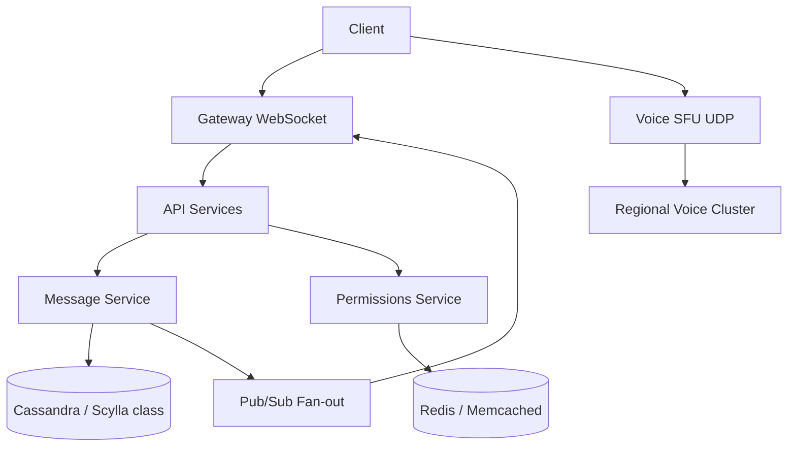
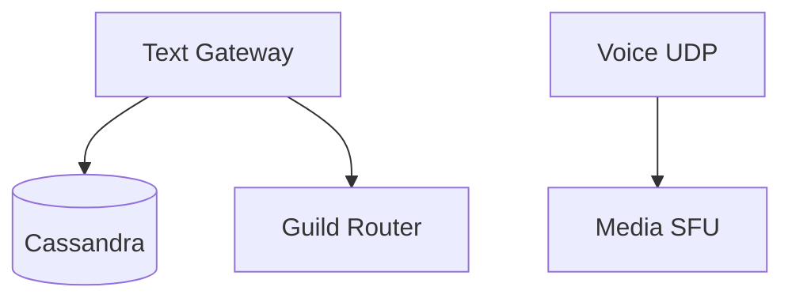

# Discord Real-Time Community Platform

## 1. Business Context

Discord began as a **voice chat** tool for gamers and evolved into a **community platform** spanning gaming guilds, study groups, creator fan servers, and enterprise-adjacent communities. The product combines **persistent text channels**, **voice and video rooms**, **roles and permissions**, **bots**, and **stage channels** for broadcast-style events. Unlike Slack's workspace-centric enterprise model, Discord's unit of tenancy is the **server (guild)**—often created by individuals with highly variable scale (10 users to hundreds of thousands).

Business drivers include **low-latency voice** for coordination during gameplay, **always-on community presence**, and **free-to-use** tiers monetized via Nitro subscriptions and server boosts. Architectural pressure comes from **spiky concurrent voice** (raid events, game launches) and **text firehoses** in popular servers—not steady enterprise workday patterns.

For principal architects, Discord is a case study in **dual media planes** (UDP/real-time voice vs. durable text), **permission-rich channel graphs**, **Cassandra-class wide-partition storage** at message scale, and **language/runtime heterogeneity** (public narratives reference Elixir, Rust, Go, Python across services). Public engineering posts discuss message storage evolution, Rust adoption for performance-critical paths, and scaling to **millions of concurrent voice connections**—figures should be verified against current disclosures.

See [Chat Platform](/docs/system-design/chat-platform) for shared text messaging patterns; voice/video aligns with [Video Streaming Platform](/docs/system-design/video-streaming-platform) SFU concepts.

## 2. Scale

Discord operates at **hundreds of millions of registered users** and **tens of millions of active servers** (verify current metrics). Peak dimensions differ from enterprise chat:

| Dimension | Implication |
|-----------|-------------|
| Concurrent voice users | Millions during global game releases |
| Mega-servers | 100k+ members; few active channels hot |
| Message rate | Spiky during events and raids |
| Bot traffic | Music bots, moderation—high egress |
| Media | Voice UDP; video screenshare bitrate |
| Global latency | Voice requires regional edge |

**Scale failure modes**: **voice region overload** when too many users land on one SFU host, **Cassandra hot partitions** on busy channel_ids, **permission cache stampedes** when role changes fan out, **gateway reconnect storms** after deploys, and **anti-abuse** pipelines lagging under spam raids.

Principal framing: model **member count distribution** (power law—most servers tiny, few enormous) and **concurrent voice** separately from registered users.

## 3. Functional Requirements

| Capability | Mechanism |
|------------|-----------|
| Guilds (servers) | Container for channels, roles, members |
| Text channels | Durable messages with id ordering |
| Voice channels | UDP/WebRTC to SFU/managed voice backend |
| Roles & permissions | Bitfield over channel categories |
| Threads | Sub-conversations (product evolution) |
| Reactions / emojis | High-churn auxiliary data |
| Bots & OAuth2 | Public API; gateway intents |
| Stage / Go Live | Broadcast semantics |
| Moderation | Auto-mod, audit log, bans |
| Discovery | Server discovery directory (optional) |

Discord is a **platform**: third-party bots are not ancillary—they are core to many servers' operation (music, leveling, moderation).

## 4. Non-Functional Requirements

| NFR | Target class |
|-----|--------------|
| Text delivery | Hundreds of ms p99 online |
| Voice latency | &lt; 150 ms mouth-to-ear ideal |
| Durability | Messages persist after ACK |
| Availability | High; voice degradation unacceptable in competitive gaming |
| Abuse resistance | Rate limits, captcha, trust scores |
| Mobile | Background connection constraints |

**Consistency**: per-channel message ordering; voice uses **jitter buffers** accepting minor packet loss. **Permissions** may be eventually consistent across edge caches—risk window if role revoked but cache stale (mitigated by TTL + version stamps).

[Message Delivery Semantics](/docs/messaging-and-streaming/message-delivery-semantics) applies to text fan-out; voice is **best-effort UDP** with forward error correction strategies.

## 5. Architecture Overview

*Figure 1: Split text (durable, WebSocket) and voice (UDP, regional) paths.*

**Gateway** maintains session state, dispatches events (`MESSAGE_CREATE`, `PRESENCE_UPDATE`), and speaks JSON over WebSocket—clients often use **ETL-compressed** session protocols in production evolutions.

**Message service** writes to **wide-column** store partitioned by channel; IDs are often **snowflake** (timestamp-ordered, globally unique).

**Voice** terminates on **regional SFU clusters** selected by voice state endpoint—users in same channel should share region when possible.

**Permissions** computed from guild roles + channel overrides; results cached aggressively.

### 5.1 Snowflake IDs

Discord-style IDs embed timestamp + worker + sequence—enables **rough time ordering** and **unique keys** without central allocator per insert. Architects trade **clock dependency** for allocation simplicity—monitor clock skew on workers.

### 5.2 Gateway intents and bot sharding

Bots declare **intents** (which events they receive). Large bots must **shard** gateway connections across multiple gateway sessions per guild count limits—platform enforces sharding rules to protect infrastructure.

## 6. Data Model

- **User**: global account
- **Guild**: server; settings, roles, emoji
- **Channel**: text, voice, category, stage types
- **Message**: id, channel_id, author_id, content, embeds, attachments
- **Member**: guild_id + user_id; nickname, roles
- **Role**: permission bitfield
- **VoiceState**: channel_id, mute/deafen, session_id—ephemeral

**Permission bitfield** approach packs dozens of flags into integers—fast evaluation but **hard for humans**—architects document effective permission resolution order: **@everyone → role denies/allows → channel overrides**.

**Embeds** and **stickers** increase payload size variance—compression on gateway links matters.

## 7. Partitioning and Hot Channels

Primary partition key for messages: **`channel_id`**. Mega-server hot channels (e.g., `#general` during game launch) create **write-heavy partitions**.

Mitigations (conceptual patterns from public discussions and Cassandra best practices):

| Technique | Application |
|-----------|-------------|
| Per-channel sequence | Ordering without cross-channel coordination |
| Write coalescing | Batch ancillary updates |
| Rate limits per user | Anti-spam during raids |
| Read offloading | Cache recent messages per channel |
| Separate event types | Reactions decoupled from message body |

Link: [Distributed Caching](/docs/caching/distributed-caching) for hot key mitigation—recent message windows often cached in Redis with TTL.

**Guild sharding** for bots is product-level partitioning—distinct from storage shards.

Compare [PACELC](/docs/consistency/pacelc): Cassandra partition favors **availability and latency** with **eventual** cross-replica visibility.

## 8. Replication

**Cassandra-class storage**: replication factor across AZs in a region; tunable consistency (`LOCAL_QUORUM` for writes). Cross-region multi-master is **non-trivial**—Discord historically focused regional stacks with user routing.

**Voice servers**: stateful; fewer replicas; **N+1** capacity for failover within region—users may need **quick reconnect** to backup SFU.

**Gateway layer**: horizontal; state in memory + optional external session store for resume tokens.

See [Replication Overview](/docs/replication/overview).

## 9. Consistency

| Surface | Model |
|---------|-------|
| Message history | Per-channel total order by id |
| Cross-channel | None |
| Permissions | Cached; target bounded staleness |
| Presence | Ephemeral; loss acceptable |
| Voice | Real-time; not durable transcript by default |

**Read repair** and **hinted handoff** in Cassandra influence tail latency on reads after node failures—ops must monitor **p99 read latency** not just mean.

**Audit log** for moderation actions may require **stronger durability** than casual chat—possibly separate store.

## 10. Availability

Multi-AZ within region for text path. **Voice** prioritizes **degraded audio** over complete failure—codec bitrate adaptation.

**Regional isolation**: voice must be **geo-proximate**; text can be more centralized per cell.

**DDoS and raid response**: feature flags to disable invites, raise verification level, enable **slowmode** per channel—product features backed by **rate limiters** at gateway.

[Disaster Recovery and Multi-Region](/docs/reliability-and-resilience/disaster-recovery-and-multi-region) for cells and failover narratives.

**Chaos testing** on gateway and voice—[Chaos Engineering](/docs/reliability-and-resilience/chaos-engineering).

## 11. Failure Handling

| Failure | Response |
|---------|----------|
| Cassandra node loss | RF tolerates; repair post-incident |
| Hot partition | Emergency slowmode; channel lock |
| Voice host crash | Migrate users to new SFU session |
| Gateway deploy | Resume tokens; staggered rollout |
| Bot runaway loop | Kill app credentials; isolate guild |
| Spam raid | Auto-mod + captcha + staff tools |

**Voice state desync** (user appears in channel but no audio): clients implement **ICE restart** and visible reconnect UX.

**Message loss perception** from cache staleness vs. true data loss—incident comms must distinguish.

## 12. Security

- **OAuth2** for bots; granular scopes
- **Token theft** risk on client mods—rate limits, anomaly detection
- **NSFW / CSAM** scanning pipelines—legal compliance
- **IP bans**, phone verification, **RAID** protection
- **E2E** not default for text—moderation and safety require server-side visibility

[Zero Trust Architecture](/docs/security/zero-trust-architecture) for internal admin tools—support staff access highly audited.

Voice **DDoS**: UDP amplification protections at edge; regional capacity caps.

## 13. Observability

| Metric | Purpose |
|--------|---------|
| Gateway events/sec | Load |
| Voice packet loss / jitter | Quality |
| Cassandra p99 latency | Storage health |
| Permission cache hit rate | Auth path efficiency |
| Bot API error codes | Integration health |
| Anti-abuse queue depth | Raid detection |

[Distributed Tracing](/docs/observability/distributed-tracing) across API → storage → fan-out.

**Client telemetry** for voice quality (MOS estimates) regional—server metrics alone miss last-mile ISP issues.

## 14. Cost Model

- **Voice egress and compute** dominates during peak concurrent voice
- **Message storage** at billions/day—compaction and TTL policies
- **CDN** for attachments and emoji
- **Cassandra** cluster disk and cross-AZ replication traffic
- **Abuse fighting** ML inference and human review queues

**Cost levers**: audio bitrate caps, inactive server archival policies, attachment size limits, efficient embed delivery.

## 15. Evolution of Architecture

Public engineering arc (verify):

- Early monolith → service extraction
- **Elixir** for real-time gateway patterns (fault tolerance, supervision)
- **Rust** for performance-critical services (public "Why Discord is switching to Rust" narrative)
- Message storage on **Cassandra** at scale
- Video/screenshare expansion stresses SFU fleet
- Moderation and safety investments post-growth

Future pressure: **events at 100k+ concurrent** stage viewers—hybrid CDN + SFU similar to live streaming platforms.

## 16. Important Tradeoffs

| Tradeoff | Detail |
|----------|--------|
| UDP voice vs TCP text | Different failure modes |
| Permission cache vs correctness | Speed vs immediate revoke |
| Bot ecosystem vs platform risk | Bots drive engagement + abuse |
| Free tier vs infra cost | Nitro offsets; voice expensive |
| Snowflake IDs vs DB sequences | Clock skew risk |
| Moderation visibility vs E2E | Product choice |

## 17. Known Limitations

- Text search historically weaker than Slack-class enterprise search
- Voice quality varies with user network—architecture cannot fully fix
- **Sharding** burden on large bot developers
- Permission model complexity for admins
- Regional data rules evolving with user base age diversity

## 18. Interview Lessons

**Strong signals**:

- Separate voice (UDP, regional) from text (durable, Cassandra partition)
- channel_id hot partition mitigations
- Snowflake properties and clock skew
- Gateway fan-out and bot sharding rules
- Raid/abuse as architectural load

**Red flags**:

- Single global MySQL for Discord-scale messages
- Ignoring voice entirely in "design Discord"
- Linearizable permissions at global scale

## 19. Redesign Exercise

**Prompt**: Game launch—500k users in one guild voice channel (product allows large stages); 200k concurrent voice; text `#general` at 5k msg/sec.

Design:

1. Voice: SFU tree or selective forwarding; regional placement
2. Text: rate limits, slowmode, auxiliary partition strategy
3. Gateway: guild-specific event coalescing
4. Moderation: auto-flag + staff queue
5. Degradation ladder: reduce video → reduce voice quality → text-only
6. Post-incident: storage compaction and cost reconciliation

### Deep dive: voice SFU scaling

**Selective Forwarding Unit** receives streams from each participant and forwards subsets to others—CPU scales with **N²** in naive full mesh; SFU reduces to **O(N)** per user downstream. **Simulcast** layers let SFU pick resolution per receiver bandwidth.

**Region selection** API returns optimal voice endpoint; crossing oceans doubles latency—unacceptable for competitive voice.

### Deep dive: permission evaluation

Effective permissions = f(guild roles, channel overrides, user-specific denies). **Cache key** `(guild_id, channel_id, user_id, version)` with **version bump** on role change invalidates stale entries—without version, mass TTL causes **thundering herd** on popular guilds.

### Interview scoring rubric (principal)

| Dimension | Weight | Strong signal |
|-----------|--------|---------------|
| Dual plane (voice/text) | 25% | Clear protocol split |
| Hot channel | 25% | Cassandra partition mitigations |
| Real-time gateway | 20% | Event fan-out, sharding |
| Abuse / raids | 15% | Rate limits, slowmode |
| Operability | 15% | Voice quality metrics |

## Supplementary Diagram

*Figure: Discord dual-plane architecture — text vs voice.*

## 20. References

- Discord Engineering Blog (scaling, Rust, Cassandra, voice)
- Cassandra architecture documentation
- [Chat Platform](/docs/system-design/chat-platform)
- [Video Streaming Platform](/docs/system-design/video-streaming-platform)
- [Message Delivery Semantics](/docs/messaging-and-streaming/message-delivery-semantics)
- [Distributed Caching](/docs/caching/distributed-caching)
- [Resilience Patterns](/docs/microservices/resilience-patterns)

### Appendix: Discord vs Slack (interview)

| Dimension | Discord | Slack |
|-----------|---------|-------|
| Tenancy | Guild (user-created) | Workspace (org) |
| Voice | Core | Secondary (huddles) |
| Typical channel size | Huge public channels | Usually smaller |
| Permissions | Role bitfields | Enterprise ACL models |
| Compliance | Community safety focus | eDiscovery, Grid |

### Appendix: principal question bank

1. Why Cassandra for messages vs PostgreSQL?
2. Design permission cache invalidation on role delete.
3. User reports one-way audio—debug checklist across client, SFU, ISP.
4. Bot needs all guild messages—shard math for 3M guilds.
5. Stage event 100k listeners—SFU vs HLS broadcast tradeoff?

Mechanism and operations over trivia.

### Appendix: gateway event coalescing

High-rate guilds generate redundant `PRESENCE_UPDATE` and typing events. **Coalescing** at gateway reduces fan-out CPU: aggregate presence bursts into periodic snapshots for offline members while preserving immediate delivery for active channel subscribers. Architects document **event priority tiers**: `MESSAGE_CREATE` never coalesced; presence may be. During raids, **dynamic tier downgrade** sheds lowest-priority events first—product-visible as delayed typing indicators rather than message loss.

### Appendix: Cassandra compaction and read repair operations

Operations runbooks for Discord-class storage include weekly **compaction strategy review** (STCS vs LCS vs TWCS for time-series auxiliary tables). **Read repair** percentage tuning trades background repair load vs consistency tail latency. **Hinted handoff** windows must exceed typical node restart time—too short causes unnecessary read failures during rolling deploys. Principal architects pair storage SLOs with **client retry policy**: idempotent message ids prevent duplicate rendering when Cassandra returns timeout on write path retry.

### Appendix: Nitro and media quality tiers

Monetization features (higher bitrate voice, larger upload limits) map to **QoS classes** on voice SFU and attachment pipelines—not merely billing flags. **Fair queuing** prevents free-tier voice from starving entirely on congested SFU hosts while still prioritizing paid streams within policy bounds. Capacity plans separate **baseline** from **Nitro peak** assumptions for game launch weekends.

### Appendix: client protocol resilience

Mobile clients face **OS background suspension**—gateway sessions drop without user awareness. **Resume tokens** and **session sequence gaps** let clients request `GUILD_MESSAGES` catch-up since last acknowledged event id. **Zlib-stream** transport compression reduces battery and bandwidth on sustained connections. Architects model **reconnect QPS** during cellular tower flaps as fraction of DAU—often exceeds deploy-driven reconnect and requires **client-side jitter** plus **server-side token bucket** per device to protect gateway fleet.

### Appendix: moderation audit trail storage

Moderation actions (ban, delete message, role strip) require **append-only audit** with stronger durability than casual chat—often separate **compliance store** with longer retention. **Automated mod bots** must use same tool gateway rate limits as user bots to prevent **mod loop** deleting legitimate history during API glitch. Principal review: mod bot credentials are **high privilege**—short-lived tokens and mandatory HITL for mass-delete tools.
