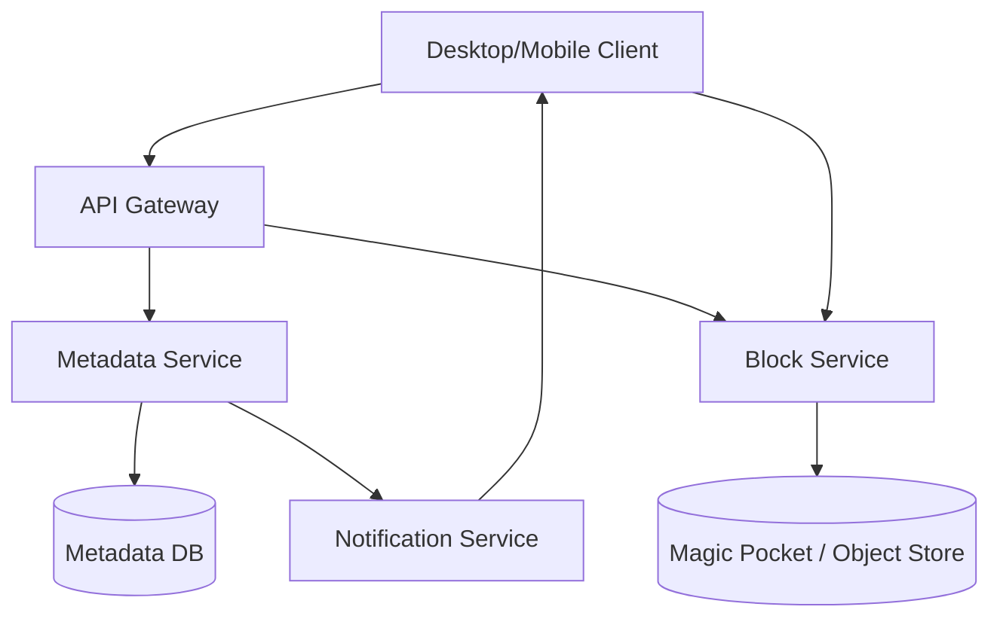
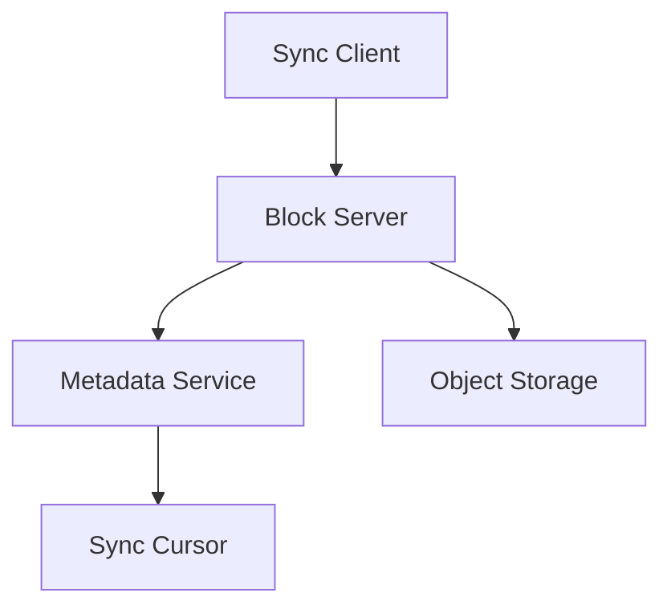

# Dropbox Global File Sync Platform

## 1. Business Context

Dropbox provides **cloud file synchronization** and sharing: users install a desktop or mobile client that mirrors selected folders to the cloud and to other linked devices. The core promise is **transparent sync**—edit a file locally, and changes propagate to teammates with minimal latency and bandwidth. Unlike generic object storage (S3), Dropbox optimizes for **fine-grained updates**, **namespace hierarchy** (folders), **multi-device consistency**, and **shared folders** with ACLs.

Business drivers include replacing USB drives, enabling remote work collaboration, and **reducing bandwidth costs** via aggressive **block-level deduplication**. Dropbox's engineering is famous for early **Python/Go** services, custom **Magic Pocket** migration from AWS S3 to exabyte-scale in-house object storage (public 2016 narrative), and the classic **system design interview** framing of sync protocol + metadata + block store separation.

For principal architects, Dropbox is the canonical case study for **content-addressed block storage**, **sync cursors**, **conflict policies**, **notification fan-out** on metadata changes, and **storage economics** at trillion-block scale. Interview loops probe delta sync, content-defined chunking, ref-counting, and split-brain offline edits—not "upload file to S3."

Deep design reference: [Dropbox Design](/docs/system-design/dropbox-design) and [File Storage System](/docs/system-design/file-storage-system).

## 2. Scale

Public narratives reference **hundreds of millions of users** and **exabyte-scale** stored data after Magic Pocket (verify current figures). Scale dimensions:

| Dimension | Implication |
|-----------|-------------|
| Files per user | Millions for heavy users |
| Block store | Trillions of content hashes |
| Metadata ops | High QPS on namespace tree |
| Sync notifications | Push to many devices per change |
| Deduplication | Cross-user savings for popular files |
| Bandwidth | Delta sync reduces egress |

**Scale failure modes**: **sync loops** (client bug re-uploading), **metadata DB hotspots** on popular shared folders, **block store imbalance**, **notification storms** on bulk renames, **conflict storms** after offline team edits, and **garbage collection** lag causing storage cost drift.

## 3. Functional Requirements

| Capability | Mechanism |
|------------|-----------|
| Folder sync | Namespace metadata tree |
| Block upload | Content-addressed immutable blocks |
| Delta sync | Exchange block lists; upload missing only |
| Versioning | Retain history snapshots |
| Shared folders | ACL on namespace subtrees |
| Selective sync | Per-device folder inclusion |
| Offline edit | Local queue; reconcile on reconnect |
| Public links | Tokenized read access |
| Conflict handling | Conflict copies or LWW policies |
| Mobile background | Resumable uploads |

## 4. Non-Functional Requirements

| NFR | Target |
|-----|--------|
| Sync latency | Seconds for online clients (p99) |
| Metadata availability | 99.99%+ |
| Durability | No acknowledged block loss |
| Dedup rate | 30–60% typical (workload-dependent) |
| Client offline | Weeks of local operation |
| Security | TLS, at-rest encryption, sharing controls |

**Consistency**: metadata service is **source of truth** for namespace; block store is **immutable content** referenced by metadata. **Eventual consistency** across devices is bounded by sync propagation—not linearizable global filesystem.

See [Replication Overview](/docs/replication/overview) for block replication vs metadata quorum patterns.

## 5. Architecture Overview

*Figure 1: Metadata path (tree, ACLs) separate from content path (blocks).*

**Client** maintains local index: file path → block hash list + sync cursor.

**Metadata service** tracks **file entries**, **folder hierarchy**, **permissions**, **sync cursors**, and **journal** of changes.

**Block service** accepts block uploads keyed by **SHA-256** (or stronger) hash; **dedup** skips store if hash exists.

**Notification** (long-poll, WebSocket, or push) tells clients **cursor advanced**—fetch delta.

### 5.1 Sync cursor protocol

Client holds cursor `C_k`; server journal entries `C_k+1 ... C_n` describe namespace mutations. Client applies deltas, fetches missing blocks, uploads new blocks, commits metadata update transaction. **Idempotent** client retries with same cursor prevent double-apply via entry ids.

### 5.2 Magic Pocket

Dropbox's in-house exabyte store (public architecture) emphasizes **erasure coding**, **custom hardware**, and **multi-region** placement—economics at scale exceeded leased S3 for their workload (implementation-specific; not universal advice).

Compare [Global Object Store](/docs/system-design/global-object-store) design patterns.

## 6. Data Model

**Namespace entry**:

- `path` or internal id
- `parent_id`, `name`
- `type`: file | folder
- `content_hash` or block list for files
- `revision`, `mtime`, `size`
- `permissions`: user/team ACL bitmap

**Block**:

- `hash` (content address)
- `size`, `ref_count`
- `storage_key` in object store
- **Immutable**—delete only when ref_count zero

**File version history**: snapshot metadata pointing to block lists per revision.

**Shared folder mount**: namespace link with inherited ACL.

### 6.1 Block list as file identity

Files are **ordered sequences of block hashes**—enables **incremental sync** when one block changes in a 10 GB file. Contrast with whole-file hashing that forces full re-upload on any byte change.

## 7. Chunking and Deduplication

**Fixed-size chunking** is simple but shifts boundaries on insertions—**content-defined chunking** (Rabin fingerprint) produces **stable boundaries** under edits, improving dedup on documents and VMs.

| Strategy | Pros | Cons |
|----------|------|------|
| Fixed 4 MB blocks | Simple | Poor dedup on small edits |
| Content-defined | Edit-resilient boundaries | CPU on client |
| Whole file hash | Fast for small files | No partial update |

**Cross-user dedup**: same hash → same physical block with ref_count &gt; 1—**privacy consideration**: encryption per user may disable cross-user dedup (Dropbox product evolution includes encryption options—verify current offering).

Link: [File Storage System](/docs/system-design/file-storage-system) for chunking deep dive.

## 8. Replication

**Block store**: erasure-coded replicas across racks/regions; durability via **n+k** encoding—see object store patterns in [Global Object Store](/docs/system-design/global-object-store).

**Metadata DB**: strongly consistent primary with sync replicas; **sharded** by user_id or namespace root. Failover must preserve **journal ordering**.

**Client local cache**: blocks on disk—another replication tier with **cache invalidation** on remote delete.

## 9. Consistency

| Operation | Consistency |
|-----------|-------------|
| Block upload | Appears after commit + ref_count |
| Metadata commit | Atomic per transaction (file move + block ref) |
| Cross-device view | Eventual within sync latency |
| Shared folder | All members converge via journal |
| Delete | Tombstone in metadata; block GC async |

**Offline conflicts**: two editors offline on same file → **conflict copies** (`file (User's conflicted copy)`) or explicit merge UI—product policy choice documented for support burden.

**CAP at partition**: clients continue local edits; server accepts updates with **vector clock** or **revision** checks—reject stale commits with refresh.

## 10. Availability

Metadata tier multi-AZ; block store tolerates rack loss via erasure coding. **Read path** can use CDN edge for popular blocks (less common for private files).

**Degradation**: disable versioning UI; slow background GC; throttle bulk API.

[Disaster Recovery and Multi-Region](/docs/reliability-and-resilience/disaster-recovery-and-multi-region) for block replication across geographies—latency vs durability tradeoff.

## 11. Failure Handling

| Failure | Handling |
|---------|----------|
| Partial block upload | Resumable sessions; hash verify |
| Metadata transaction conflict | Client refresh + retry |
| Sync loop | Server-side rate limit; client bug flag |
| GC bug deleting live blocks | **Hold** refs until audit; restore from coding shards |
| Notification loss | Client periodic full cursor check |
| Corrupt local cache | Re-download block list from server |

**Split brain** rare on metadata if single primary—client-side divergence resolved on sync merge.

[Failure Analysis Methodology](/docs/production-failures/failure-analysis-methodology) for postmortems on data loss incidents—file sync bugs are **high severity**.

## 12. Security

- **TLS** for all transport
- **Encryption at rest** on block store
- **Sharing links** with expiring tokens and password options
- **Team admin** controls, device approvals
- **Ransomware detection** heuristics (product feature class)
- **Hash verification** prevents malicious block injection

[Zero Trust Architecture](/docs/security/zero-trust-architecture) for internal access to user data—support tooling heavily audited.

Client holds **OAuth tokens**—compromise equals file access; **short-lived tokens** + device binding.

## 13. Observability

| Metric | Meaning |
|--------|---------|
| Sync latency E2E | Product SLO |
| Metadata QPS / p99 | DB health |
| Dedup hit rate | Storage efficiency |
| Block upload bytes | Bandwidth cost |
| GC queue depth | Storage leak risk |
| Client error codes | Platform vs client bugs |

[Distributed Tracing](/docs/observability/distributed-tracing) on metadata transactions spanning block ref updates.

**Per-user sync dashboards** for enterprise support—correlate cursor stuck states.

## 14. Cost Model

- **Storage**: physical blocks after dedup (not logical user sum)
- **Egress**: minimized by delta sync
- **Metadata DB**: SSD, replication, sharding ops
- **GC compute**: CPU for ref counting and compaction
- **Magic Pocket** hardware amortization vs cloud lease (Dropbox-specific)

**Cost levers**: dedup-friendly chunking, tiered storage for cold blocks, retention limits on versions, aggressive GC of orphaned blocks.

[Cloud Cost Optimization](/docs/cost-and-finops/cloud-cost-optimization) when hybrid cloud/on-prem.

## 15. Evolution of Architecture

- 2007–2012: AWS S3 backend (public)
- **Magic Pocket** exabyte migration—in-house erasure-coded store
- **Go** services for performance paths
- Team/enterprise features: shared team folders, admin console
- **Paper** collaboration (Dropbox Paper) separate doc model—integration points
- Continuous client optimization (kernel extensions, streaming uploads)

Architectural invariant: **separate metadata control plane from bulk data plane**—applies beyond Dropbox to YouTube, S3, and CDN designs.

## 16. Important Tradeoffs

| Tradeoff | Detail |
|----------|--------|
| Dedup vs encryption | E2E may limit cross-block dedup |
| Content-defined chunk CPU vs bandwidth | Client battery on mobile |
| Conflict copies vs auto-merge | Support cost vs data loss risk |
| Notification vs polling | Battery vs latency |
| Version retention vs storage cost | Enterprise compliance needs history |
| Custom object store vs S3 | Capex/opex break-even at scale |

## 17. Known Limitations

- Not a real-time **collaborative editor** like Google Docs (different OT/CRDT problem)
- Very large files stress client chunk index memory
- **LAN sync** (local peer) adds another consistency mode
- Legal hold complicates GC
- Selective sync mistakes confuse users ("file missing" support tickets)

## 18. Interview Lessons

**Strong signals**:

- Block hash content addressing + ref count
- Sync cursor delta protocol
- Conflict handling after offline edit
- Metadata vs block split
- Dedup and chunking tradeoffs

**Red flags**:

- "Store whole files in PostgreSQL"
- No conflict strategy
- Ignoring notification fan-out to N devices

## 19. Redesign Exercise

**Prompt**: 10-person team shares folder; each offline over weekend edits same Excel file; all reconnect Monday 9am; 50 MB file.

Design:

1. Revision vectors or centralized revision counter
2. Conflict detection at metadata commit
3. Block-level merge not attempted—conflict copies
4. Notification batching to 10 clients × 5 devices
5. Support tooling to inspect revision tree
6. Enterprise policy: admin chooses LWW vs conflict copies

### Deep dive: ref counting and GC

On file delete, metadata tombstone → decrement block refs → **async GC** removes blocks with ref_count=0. **GC must be idempotent**—double decrement is catastrophic. **Tracing refs** across shared folders requires **transitive ref** from each namespace pointer.

**GC lag** inflates storage bills—SLO on orphaned block age.

### Deep dive: move/rename efficiency

Rename is **metadata-only** if block list unchanged—O(1) journal entry vs re-upload. Interviewers test whether candidate treats rename as copy+delete.

### Interview scoring rubric (principal)

| Dimension | Weight | Strong signal |
|-----------|--------|---------------|
| Block model | 25% | Content hash, immutability |
| Sync protocol | 25% | Cursor, delta, idempotency |
| Conflicts | 20% | Offline merge policy |
| Scale | 15% | Metadata shard, dedup |
| Operations | 15% | GC, monitoring, data loss |

## Supplementary Diagram

*Figure: Dropbox block-level sync and metadata separation.*

## 20. References

- Dropbox Tech Blog (Magic Pocket, sync protocol)
- Nassim et al., public Dropbox architecture talks
- [Dropbox Design](/docs/system-design/dropbox-design)
- [File Storage System](/docs/system-design/file-storage-system)
- [Global Object Store](/docs/system-design/global-object-store)
- [Replication Overview](/docs/replication/overview)
- [Idempotency](/docs/distributed-systems-foundations/idempotency)

### Appendix: Dropbox vs Google Drive (interview)

| Dimension | Dropbox | Drive |
|-----------|---------|-------|
| Core metaphor | Sync folder | Cloud-first docs |
| Chunk dedup | Central to design | Less emphasized publicly |
| Collaboration | File-level | Real-time docs |
| Offline | Strong sync client | Variable |

### Appendix: principal question bank

1. Design block store for 10T blocks—hash lookup at scale.
2. User reports file reverts—debug cursor vs client cache.
3. Malicious client uploads wrong hash for block—server defense.
4. Cross-user dedup with per-user encryption—possible?
5. Migrate region—block copy vs metadata cutover order?

Focus on **correctness and economics**, not brand facts.

### Appendix: LAN sync and peer discovery

Dropbox historically explored **LAN sync** where clients on same network exchange blocks directly—reduces cloud egress but introduces **split-brain** risk if LAN peer serves stale blocks. Architecture requires **hash verification** against cloud metadata authority before accepting peer blocks. **Multicast discovery** vs fixed peer lists affects enterprise firewall compatibility. Principal takeaway: every optimization that bypasses central metadata adds **consistency verification** obligations on the client.

### Appendix: enterprise team namespaces and legal hold

Team accounts introduce **org admin** overlays on personal namespaces: offboarding must **transfer ownership** without breaking shared folder refs. **Legal hold** pins block refs regardless of user deletion—GC queues must tag held hashes and exclude from decrement paths. **eDiscovery export** walks metadata journal + block store asynchronously—export jobs compete with live sync for metadata DB IOPS; schedule during off-peak or dedicated read replicas.

### Appendix: bandwidth mathematics for delta sync

Interview calculation: 1 MB file, 4 KB changed, fixed 1 MB chunking → whole-file hash change may force **full re-upload**; content-defined chunking with stable boundaries → **one block upload** plus metadata journal entry. Architects quantify **client CPU** for chunking on mobile vs **cellular bandwidth** saved—product decision for default chunk algorithm per platform.

### Appendix: trash and recovery semantics

Deleted files enter **trash namespace** with retention window before permanent delete—blocks remain referenced until trash expires. **Restore** reverses tombstone with new journal entry; **permanent delete** decrements refs. **Admin restore** for ransomware response may bulk-revert namespace to prior cursor—requires **point-in-time metadata backup** independent of block store immutability. Recovery RTO dominated by metadata replay speed, not block copy (blocks still exist if refs intact).

### Appendix: sharing link security model

Public links encode **unguessable token** plus optional password; **scope** read-only vs edit must be enforced at metadata commit—not merely hidden URL. **Link revocation** propagates via journal entry; clients polling cursor learn access removed. **Hotlinking** CDN URLs without auth check risks data leak—use **short-lived signed URLs** tied to user session for block download even when link sharing enabled.

### Appendix: client sync state machine

Desktop clients implement explicit states: `SYNCED`, `SYNCING`, `ERROR`, `OFFLINE`. **Stuck SYNCING** often indicates cursor divergence or block upload hang—support tooling reads **last successful cursor**, **pending upload queue**, and **local block index integrity**. **Kernel extension** paths (historical Dropbox innovation) bypass user-space copy for performance but complicate **error attribution**—architecture separates kernel vs user-space telemetry streams for triage.

### Appendix: competitive sync latency SLO

Enterprise buyers benchmark **time-to-sync** after save: measure **metadata journal commit** to **last client ACK** across geographic regions. **Asia-Pacific users** on US-central metadata leader pay RTT on every cursor advance—**regional metadata cells** or **read replicas with local notification fan-out** reduce perceived latency without splitting block store globally. SLO dashboards split **upload bytes** vs **metadata-only** changes—rename-heavy workloads should not alert on bandwidth.
