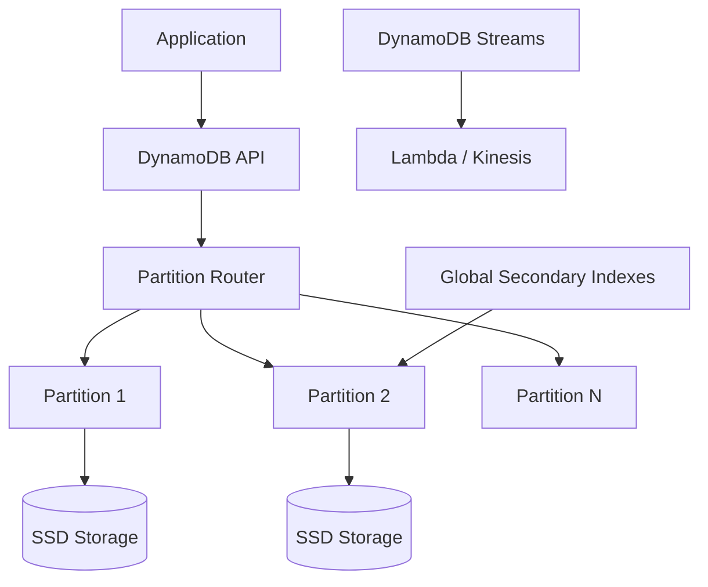
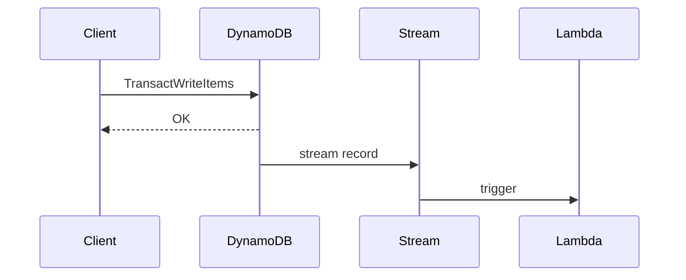

# Amazon DynamoDB at Scale

## 1. Business Context

Amazon DynamoDB is AWS's fully managed, serverless key-value and document database, positioned as the default operational data store for cloud-native applications on AWS. It inherits **partitioning and availability ideas** from the 2007 Dynamo paper but is a **distinct product** with its own API, consistency surface, and operational model—not an open-source reimplementation of the research system.

Organizations adopt DynamoDB when they need predictable single-digit millisecond latency at scale (AWS marketing claim; always validate against your workload), minimal operational overhead, and tight integration with the AWS ecosystem (Lambda, Kinesis, S3, IAM). Typical workloads include session stores, shopping carts, gaming leaderboards, IoT device state, metadata catalogs, and high-throughput event indexing. The business value proposition is **velocity and elasticity**: teams ship features without provisioning database servers, patching, or capacity planning in on-demand mode.

For principal architects, DynamoDB represents a case study in **designing for known access patterns** rather than ad-hoc query flexibility. The product succeeds when partition keys distribute load and item sizes remain bounded; it fails when teams treat it as a general-purpose relational replacement without modeling discipline. Interview and production discussions center on partition key design, hot partitions, capacity economics, global tables semantics, and when to layer caches (DAX, ElastiCache) or export to analytics (S3, Athena, Redshift).

See also the in-repo chapter [Amazon DynamoDB](/docs/distributed-databases/dynamodb) and lineage context in [Amazon Dynamo](/docs/distributed-databases/amazon-dynamo).

## 2. Scale

DynamoDB is designed for **horizontal scale across partitions** within a region. AWS publishes that tables can grow to any size with automatic partition splitting as storage and throughput demand increase. Exact partition count and split thresholds are implementation details not fully disclosed; architects reason about **per-partition throughput limits** rather than global table limits.

**Order-of-magnitude framing** (verify current AWS quotas for your account):

| Dimension | Typical scale consideration |
|-----------|----------------------------|
| Item size | 400 KB hard limit per item |
| Partition throughput | Hot partitions throttle before table limits |
| On-demand scaling | Soft account/region limits; request increases via support |
| Global tables | Multi-region replication; per-region tables linked |
| Streams | Ordered per shard; 24-hour retention |

Scale failures in production are rarely "DynamoDB cannot handle our total QPS" and more often **a single partition key absorbs disproportionate traffic** (celebrity product, viral post, sequential ID). Principal-level analysis quantifies **partition key cardinality**, **write sharding** strategies, and **GSI** projection costs before launch.

## 3. Functional Requirements

DynamoDB must support:

| Capability | Mechanism |
|------------|-----------|
| Key-value and document access | `GetItem`, `PutItem`, `UpdateItem`, `DeleteItem` |
| Range queries within partition | Sort key + `Query` |
| Secondary access patterns | GSI, LSI |
| Conditional writes | `ConditionExpression` for optimistic locking |
| Atomic counters | `UpdateItem` with `ADD` |
| Multi-item atomicity | `TransactWriteItems` / `TransactGetItems` (bounded) |
| Change capture | DynamoDB Streams |
| TTL expiration | Attribute-driven automatic deletion |
| Backup/restore | On-demand and PITR |
| Global replication | Global tables |

**Access pattern discipline** is implicit: every hot path must resolve to `GetItem` or `Query` with a key condition—not `Scan`. Scans are operational tools, not application hot paths.

## 4. Non-Functional Requirements

| NFR | Target / behavior |
|-----|-------------------|
| Latency | Single-digit ms for well-designed keys (measure p99) |
| Availability | Regional service SLA (see AWS SLA docs) |
| Durability | Replicated within region across AZs |
| Elasticity | On-demand or auto-scaling provisioned capacity |
| Security | IAM, VPC endpoints, encryption at rest/in transit |
| Compliance | Regional data residency; shared responsibility model |

**Consistency** is not one knob: default reads are eventually consistent; strongly consistent reads cost more in provisioned mode. Global tables replicate **asynchronously** across regions—no cross-region linearizability.

## 5. Architecture Overview



*Figure 1: Logical request path—partition key determines physical partition.*

**Control plane** (AWS-managed): partition management, splits, health, replication within region.

**Data plane**: `GetItem`/`Query`/`PutItem` routed by internal partition key hash.

**Optional layers**:

- **DAX**: microsecond read cache; coherency is application responsibility
- **Global tables**: multi-master async replication per table
- **Streams**: change feed for event-driven pipelines

Contrast with [Quorum Systems](/docs/consistency/quorum-systems): DynamoDB does not expose client-tunable N/R/W; the service enforces replication internally.

## 6. Data Model

Items are schemaless documents keyed by:

- **Partition key** (required): hash key determining partition
- **Sort key** (optional): range ordering within partition

**Single-table design** colocates related entities with composite keys (`PK`, `SK`) and overloaded GSIs—common in AWS Well-Architected guidance. Example adjacency list for e-commerce:

```
PK=USER#42, SK=PROFILE     → user profile
PK=USER#42, SK=ORDER#9001  → order header
PK=ORDER#9001, SK=LINE#1   → line item
```

**GSI** projects alternate partition/sort keys—each GSI is a **separate index partition space** with its own throughput consumption.

**Item size** and **attribute count** affect cost and latency; large blobs belong in S3 with pointer attributes.

### 6.1 Conditional writes and optimistic locking

`UpdateItem` with `ConditionExpression: version = :expected` implements optimistic concurrency. Failed conditions return `ConditionalCheckFailedException`—clients retry with refreshed state. This pattern supports inventory decrement, workflow state machines, and seat holds without distributed locks.

`TransactWriteItems` provides all-or-nothing writes across up to 25 items (within documented API limits). Use for tightly coupled records; avoid as default due to contention surface and transaction conflict rates under load.

### 6.2 DAX positioning

DynamoDB Accelerator (DAX) is an in-memory cache for microsecond reads. Architects document **coherency assumptions**: external writers bypassing DAX require TTL or explicit invalidation. DAX is not a substitute for partition key design—it optimizes read latency for already-well-modeled access patterns.


Internal partitioning hashes the **partition key** (not GSI key for base table routing). When a partition exceeds storage or throughput thresholds, AWS splits partitions (implementation detail).

**Hot partition symptoms**:

- `ProvisionedThroughputExceededException` on one key pattern
- CloudWatch `ConsumedReadCapacityUnits` skewed per key (where observable)
- Uneven latency spikes on specific entities

**Mitigations**:

| Technique | Use when |
|-----------|----------|
| High-cardinality partition key | Natural distribution (userId, tenantId) |
| Write sharding | Monotonic keys (timestamp, sequential ID) |
| Random suffix + scatter-gather read | Extreme hot keys |
| DAX / ElastiCache | Read-heavy hot keys |
| SQS buffer for writes | Burst absorption |

Link: [Distributed Caching](/docs/caching/distributed-caching) for hot-key patterns.

## 8. Replication

Within a region, DynamoDB replicates data across Availability Zones for durability and availability. The exact replication protocol is not published; architects treat it as **managed quorum-like durability** without client visibility.

**Global tables** maintain replicas in multiple regions with **last-writer-wins (LWW)** conflict resolution based on timestamps (AWS documentation). This is **not** CRDT merge or application-level conflict resolution unless you implement it atop version attributes.

**Streams** expose per-shard ordered change sequences for downstream consumers—at-least-once delivery semantics require idempotent consumers per [Idempotency](/docs/distributed-systems-foundations/idempotency).

## 9. Consistency

| Operation | Consistency |
|-----------|-------------|
| `GetItem` (default) | Eventually consistent |
| `GetItem` (`ConsistentRead=true`) | Strongly consistent (per item, same region) |
| `Query` / `Scan` | Follows read consistency flag |
| `TransactWriteItems` | ACID across items in same account/region within limits |
| Global tables cross-region | Eventual; LWW on conflict |

**Linearizability** is not offered globally. Strong reads help read-your-writes for a single item after write in-region; they do not solve cross-region ordering.

Session guarantees and sticky routing patterns are discussed in [Session Guarantees](/docs/consistency/session-guarantees).

## 10. Availability

DynamoDB targets high regional availability. Failure modes visible to clients:

- Throttling (capacity exceeded)
- Regional impairment (rare; multi-region architectures use global tables + failover runbooks)
- Dependency on IAM / STS for auth

**Adaptive capacity** (provisioned mode) can redirect unused partition capacity to hot partitions—helpful but not a substitute for key design.

**On-demand** mode auto-scales with soft limits; sudden spikes may still throttle until limits adjust (behavior documented by AWS; measure in load tests).

## 11. Failure Handling

| Failure | Client / ops response |
|---------|----------------------|
| Throttling | Exponential backoff, jitter, SDK retries |
| Hot key | Redesign partition key; cache; shard writes |
| GSI throttling | Separate capacity; projection minimization |
| Stream iterator lag | Scale consumers; parallelize per shard |
| Global table conflict | Design idempotent LWW-safe writes or version checks |
| Transaction conflicts | `TransactionConflict` retry with backoff |

**Transactional outbox** pattern ([Transactional Outbox](/docs/transactions/transactional-outbox)) often pairs with Streams instead of dual writes to downstream systems.

## 12. Security

- **IAM policies** on table/index ARNs; fine-grained access via IAM conditions
- **Encryption**: AWS owned, AWS managed, or customer managed KMS keys
- **VPC endpoints** for private connectivity
- **Resource-based policies** (where supported) for cross-account access
- **Audit**: CloudTrail for control plane; Streams for data change pipelines

Principal review questions: least privilege per microservice, encryption key rotation, separation of prod/stage tables, and PII attribute handling in streams/Lambda consumers.

See [Security Architecture Fundamentals](/docs/security/security-architecture-fundamentals).

## 13. Observability

| Signal | Source |
|--------|--------|
| Capacity consumption | CloudWatch `ConsumedReadCapacityUnits`, `ConsumedWriteCapacityUnits` |
| Throttles | `ThrottledRequests`, `UserErrors` |
| Latency | `SuccessfulRequestLatency` |
| Errors | `SystemErrors`, client exceptions |
| Streams | `IteratorAge` on consumers |

**Distributed tracing**: AWS X-Ray SDK integration for end-to-end latency attribution.

**SLO design**: Define SLIs on successful `GetItem`/`PutItem` p99 latency and throttle rate—see [SLO, SLI, and Error Budgets](/docs/reliability-and-resilience/slo-sli-error-budgets).

## 14. Cost Model

| Mode | Cost driver |
|------|-------------|
| Provisioned | RCU/WCU hours + storage + optional DAX |
| On-demand | Per-request pricing + storage |
| GSI | Additional read/write capacity on index |
| Streams | Shard hours + Lambda invocations |
| Global tables | Cross-region replication write propagation |
| Backup/PITR | Storage for backups |

**Cost optimization**:

- Right-size provisioned vs on-demand for predictable vs spiky workloads
- Minimize GSI projections (`KEYS_ONLY`, `INCLUDE` vs `ALL`)
- TTL to expire ephemeral data
- Export cold data to S3 Glacier via PITR/export features

FinOps linkage: [Cloud Cost Optimization](/docs/cost-and-finops/cloud-cost-optimization).

## 15. Evolution of Architecture

**Lineage**: Dynamo paper (2007) → Amazon DynamoDB service (2012 launch, evolving feature set).

Notable product evolution (verify dates in AWS announcements):

- On-demand capacity mode
- Transactions API
- Global tables v2
- DAX caching layer
- PartiQL support
- Kinesis streaming destination for exports

Architecturally, DynamoDB moved from **provisioned-only** toward **serverless economics** while adding **stronger single-region primitives** (transactions, PITR) without exposing Dynamo-style tunable quorums.

## 16. Important Tradeoffs

| Choice | Benefit | Cost |
|--------|---------|------|
| Single-table design | Efficient access patterns, fewer tables | Steeper learning curve |
| On-demand | No capacity planning | Higher $ at steady high throughput |
| Provisioned | Cost predictability | Throttling if mis-provisioned |
| Strongly consistent reads | Fresher reads | 2× RCU in provisioned mode |
| Global tables | Multi-region active-active | Async replication; LWW conflicts |
| DAX | Ultra-low read latency | Cache invalidation complexity |
| Streams + Lambda | Event-driven integration | At-least-once; ordering per shard only |

**PACELC** framing: DynamoDB within a region often optimizes for **low latency + consistency choice per read**; across regions it is **AP** with eventual convergence.

## 17. Known Limitations

- No ad-hoc SQL joins; relational patterns require modeling or ETL
- `Scan` does not scale for production hot paths
- 400 KB item limit
- Transaction item/size/count limits
- Cross-partition transactions not spanning arbitrary keys without careful key design
- Global tables do not provide application merge semantics
- Vendor lock-in to AWS API and ecosystem

## 18. Interview Lessons

**Strong candidates**:

- Walk through partition key selection for a concrete workload (e.g., multi-tenant SaaS)
- Calculate RCU/WCU for peak traffic order-of-magnitude
- Explain when **not** to use DynamoDB (heavy analytics, graph traversals)
- Describe global table conflict scenario and mitigation with version attributes
- Contrast Dynamo paper vs DynamoDB product

**Follow-ups**:

- Design GSI for inverted lookup pattern
- How would you implement leaderboard?
- DynamoDB vs Cassandra vs Cockroach for this workload?

**Red flags**:

- "DynamoDB is always strongly consistent"
- Proposing `Scan` for user-facing search
- Ignoring hot partition risk on sequential IDs

## 19. Redesign Exercise

**Prompt**: A social app stores feeds in DynamoDB. A celebrity post creates 500k writes/sec to one partition key `POST#viral123`.

**Tasks**:

1. Identify the hot partition failure mode.
2. Propose write sharding for fan-out counters vs comment threads.
3. Choose between Streams+Lambda fan-out vs pre-sharded counters in ElastiCache.
4. Define SLIs and alarms for throttle rate.
5. Estimate cost delta between on-demand spike vs provisioned baseline.

**Evaluation rubric**: partitioning strategy (40%), consistency story (20%), operability (20%), cost (20%).

### Deep dive: single-table design patterns

**Adjacency list** colocates related items under one partition key:

```
PK=USER#42  SK=PROFILE
PK=USER#42  SK=ORDER#2026-07-25#9001
PK=ORDER#9001 SK=LINE#1
```

**GSI inversion** swaps PK/SK for alternate lookups—each GSI consumes separate write capacity on every base table write touching projected attributes.

**Write sharding** for hot counters:

```
PK=POST#viral123#SHARD#0  SK=COUNTER  → increment
PK=POST#viral123#SHARD#1  SK=COUNTER  → increment
...
```

Read path aggregates shards (parallel `BatchGetItem` or periodic rollup to `POST#viral123 SK=SUMMARY`).

### Deep dive: DynamoDB Streams integration

Streams emit **ordered change records per shard** with `INSERT`, `MODIFY`, `REMOVE`. Consumers (Lambda, Kinesis) must handle:

- **At-least-once delivery** — idempotent processing by `eventID`
- **Iterator lag** — scale consumers; one concurrent consumer per shard (Lambda parallelization factor)
- **TTL deletes** appear as REMOVE events

Compare to [Transactional Outbox](/docs/transactions/transactional-outbox) when downstream needs guaranteed delivery with business transaction.

### Deep dive: global tables conflict scenario

Region A writes `version=1, title="Foo"`; Region B concurrently writes `version=1, title="Bar"`. Global tables LWW picks higher timestamp—**last write wins**, not merge.

Mitigations architects specify:

- Application-level `version` attribute with `ConditionExpression`
- Route writes for same entity to single home region
- Use global tables only for **disjoint keyspaces** per region when possible

### Capacity calculation walkthrough (interview)

1000 writes/sec, 2 KB items, strongly consistent reads at 500/sec (4 KB items):

- WCU per write: 2 (2 KB rounded up)
- Write capacity: 1000 × 2 = 2000 WCU
- RCU per strong read: 1 (4 KB item)
- Read capacity: 500 × 1 = 500 RCU

Discuss on-demand vs provisioned breakeven qualitatively—on-demand wins for spiky/unknown; provisioned for steady state with reserved capacity discounts.

### Operational alarms

| Metric | Threshold idea | Action |
|--------|----------------|--------|
| `ThrottledRequests` | > 0 sustained | Key design review |
| `UserErrors` ConditionalCheckFailed | Spike | Optimistic lock contention |
| `SuccessfulRequestLatency` p99 | Regression | Hot partition or GSI issue |
| Stream `IteratorAge` | > 60s | Scale consumer |

### Interview scoring rubric (principal)

| Dimension | Weight | Strong signal |
|-----------|--------|---------------|
| Partition key design | 30% | Cardinality + hot key mitigation |
| Consistency model | 20% | Strong vs eventual; global tables LWW |
| Cost/capacity | 20% | RCU/WCU order-of-magnitude |
| Integration | 15% | Streams, DAX tradeoffs |
| Anti-patterns | 15% | Scan, relational modeling on Dynamo |

## Supplementary Diagram


*Figure: Write path with DynamoDB Streams triggering downstream processing.*

## 20. References

- DeCandia et al., "Dynamo: Amazon's Highly Available Key-value Store" (2007)
- AWS DynamoDB Developer Guide (official documentation)
- [Amazon DynamoDB](/docs/distributed-databases/dynamodb)
- [Amazon Dynamo](/docs/distributed-databases/amazon-dynamo)
- [Quorum Systems](/docs/consistency/quorum-systems)
- [Transactional Outbox](/docs/transactions/transactional-outbox)
- Vogels, "All Things Distributed" — DynamoDB launch and evolution posts (AWS)

### Appendix: when not to choose DynamoDB

| Workload | Better fit | Why |
|----------|------------|-----|
| Ad-hoc SQL analytics | Snowflake, Redshift, Athena on S3 | Flexible queries |
| Graph traversals | Neptune, native graph DB | Index-free adjacency |
| Heavy cross-entity transactions | RDBMS, Spanner | Relational ACID scope |
| Full-text search primary | OpenSearch, Elasticsearch | Inverted indexes |
| Unbounded scan reporting | Warehouse | OLTP scan cost/latency |

Principal architects articulate **exit strategy**: DynamoDB → S3 export → lakehouse for analytics without coupling OLTP to BI queries.

### Appendix: migration patterns

**Phase 1**: Dual-write to DynamoDB and legacy store with verification job comparing reads.

**Phase 2**: Shift read traffic percentage with feature flags.

**Phase 3**: Decommission legacy after reconciliation period.

Use DMS or custom CDC where source is relational—map access patterns to single-table design **before** migration, not after.
