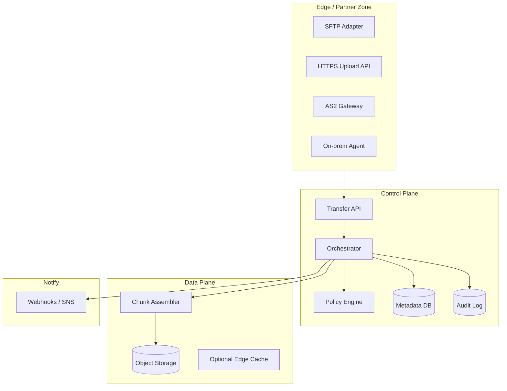
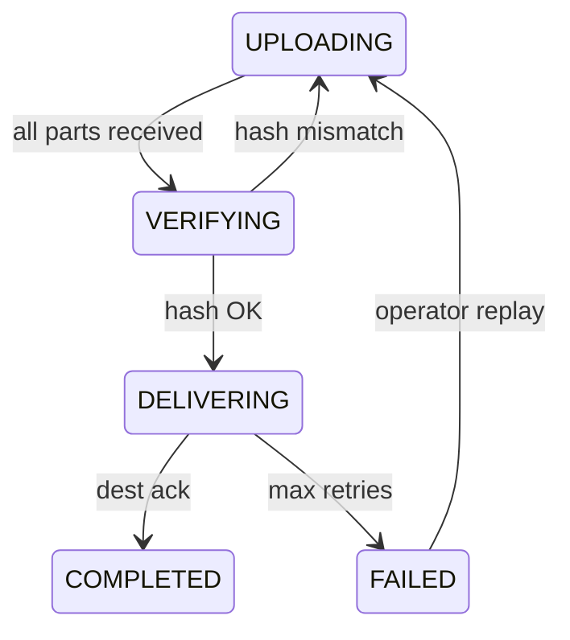

# Global Enterprise File Transfer Platform

## 1. Business Context

Enterprise organizations move **large files**—gigabytes to terabytes—between partners, business units, cloud regions, and on-premises systems daily. Unlike consumer file sharing (Dropbox, Google Drive), **managed file transfer (MFT)** platforms must satisfy **SLA windows**, **regulatory audit trails**, **protocol heterogeneity** (SFTP, HTTPS, AS2, S3 API), **non-repudiation**, and **operator recoverability** when transfers fail mid-stream.

Industries driving demand: healthcare (HL7/FHIR bulk, imaging), financial services (SWIFT file exchanges, regulatory filings), retail (EDI with suppliers), media (master footage), and public sector (classified or citizen data with residency rules).

Principal architects encounter this pattern when:

- Designing **data platforms** with nightly partner file drops
- Building **multi-region DR** for blob replication
- Evaluating **buy vs build** against IBM Sterling, GoAnywhere, AWS Transfer Family, or custom orchestration
- Answering interviews testing **resumable uploads**, **integrity verification**, and **bandwidth fairness**

This case study extends the reference architecture in [Global File Transfer Platform](/docs/system-design/global-file-transfer-platform) with production operations, cost, and interview depth. It presents a **generic architecture** without vendor-confidential implementation claims.

## 2. Scale

Typical enterprise scale dimensions:

| Dimension | Order-of-magnitude framing |
|-----------|---------------------------|
| Daily file volume | Thousands to millions of files |
| File size | 1 MB – 5 TB (multipart mandatory at upper range) |
| Peak throughput | Limited by WAN, not CPU—parallelism required |
| Partners | Hundreds with distinct credentials and schemas |
| Retention | 7+ years audit in regulated sectors |
| Regions | 2–6 for residency and DR |

**Scale failures**: single-threaded upload saturating one TCP connection; metadata DB becoming hot spot on status polling; certificate expiry breaking AS2 partners; **egress cost shock** on cross-cloud replication; incomplete multipart uploads filling storage.

## 3. Functional Requirements

| Capability | Description |
|------------|-------------|
| Ingest | Accept uploads via HTTPS, SFTP, AS2, agent-based sync |
| Egress | Deliver to partner endpoint, bucket, or filesystem |
| Scheduling | Cron, event-driven, SLA time windows |
| Resumable transfer | Checkpoint and continue after network blip |
| Integrity | Per-chunk and composite hash verification |
| Transformation | Optional virus scan, format validation, PGP encrypt/decrypt |
| Routing | Policy-based destination by tenant/content type |
| Audit | Immutable log of who sent what when |
| Replay | Operator-initiated re-delivery from manifest |
| Notifications | Webhook/email on success/failure |

**Non-goals** in minimal MVP: real-time collaborative editing; POSIX filesystem semantics.

## 4. Non-Functional Requirements

| NFR | Target |
|-----|--------|
| Durability | No acknowledged file loss; checksum proof |
| Availability | 99.9%+ control plane; transfers retry automatically |
| Integrity | SHA-256 or stronger end-to-end verification |
| Security | TLS 1.2+, mTLS for partners, encryption at rest |
| Compliance | GDPR/HIPAA/SOX controls as tenant policy |
| Observability | Per-transfer state machine visibility |
| Fairness | Bandwidth quotas per tenant/partner |

**Delivery semantics**: **at-least-once** with **idempotent completion** handlers per [Idempotency](/docs/distributed-systems-foundations/idempotency).

## 5. Architecture Overview



*Figure 1: Protocol adapters normalize to internal transfer job model.*

**Control plane** owns state transitions; **data plane** moves bytes with minimal coordination per chunk.

### 5.1 Transfer job orchestration

The orchestrator is a **workflow engine** (Temporal/Cadence, Step Functions, or custom) executing activities:

1. `ValidatePolicy` — residency, encryption, partner auth
2. `AllocateStorage` — presigned URLs or staging path
3. `AwaitChunks` — wait for upload completion with heartbeat timeouts
4. `VerifyCompositeHash` — constant-time compare
5. `RouteToDestination` — protocol-specific delivery adapter
6. `EmitAudit` — append-only before marking COMPLETED
7. `NotifyWebhook` — async to partner systems

Each activity **idempotent** by `(job_id, activity_name, attempt)` — retries safe after worker crash.

### 5.2 WAN optimization techniques

| Technique | Benefit | Caveat |
|-----------|---------|--------|
| Parallel TCP streams | Saturate high-BDP links | Fairness policies required |
| Compression (gzip/zstd) | Reduce bytes | CPU cost; only for compressible formats |
| Delta sync | Skip unchanged blocks | Requires prior manifest/hash on both sides |
| Edge staging | Shorter last mile | Extra storage cost |
| Scheduled off-peak | Lower contested bandwidth | SLA window alignment |

### 5.3 Compliance audit trail design

Audit events stored in **append-only** store (WORM bucket Object Lock, or immutable DB table). Hash chain optional: each event includes `hash(prev_event || payload)` for tamper evidence. Retention policies per regulatory regime (7 years financial, HIPAA access logs). **Right to erasure** (GDPR) may conflict with audit retention—legal review defines pseudonymization vs deletion boundaries.

## 6. Data Model

**Transfer job**:

```
job_id, tenant_id, source_uri, dest_uri, status, bytes_total,
bytes_complete, checksum_algo, composite_hash, created_at, completed_at,
idempotency_key, retry_count, policy_id
```

**Chunk manifest**:

```
job_id, part_number, offset, size, part_hash, storage_key, status
```

**Partner profile**: credentials, IP allowlist, protocol prefs, rate limits.

**Audit event** (append-only): `event_id, job_id, actor, action, timestamp, details_json`.

State machine: `PENDING` → `UPLOADING` → `VERIFYING` → `ROUTING` → `DELIVERING` → `COMPLETED` | `FAILED` | `CANCELLED`.

## 7. Partitioning

- **Metadata DB**: shard by `tenant_id` for large multitenant deployments
- **Object storage**: prefix `/{tenant}/{yyyy}/{mm}/{dd}/{job_id}/part-{n}`
- **Orchestrator workers**: partition job queue by hash(job_id)
- **SFTP adapters**: scale horizontally; sticky sessions only if required by protocol semantics

Avoid hot prefix: randomize job_id (UUID) in object keys.

## 8. Replication

| Layer | Strategy |
|-------|----------|
| Object storage | Regional replication (S3 CRR) or erasure coding |
| Metadata | Multi-AZ RDBMS or distributed SQL with backups |
| Audit log | WORM storage; cross-region async replica for DR |
| Secrets | HSM-backed; replicate keys per compliance policy |

RPO/RTO: metadata RPO minutes with PITR; blob RPO depends on replication lag (async).

Link: [Disaster Recovery and Multi-Region](/docs/reliability-and-resilience/disaster-recovery-and-multi-region).

## 9. Consistency

- **Job state**: strong consistency within control plane transaction per transition
- **Chunk visibility**: write-after-complete per part; composite hash only after all parts verified
- **Cross-region**: eventual for replicated blobs; do not mark `COMPLETED` until destination ack per policy
- **Audit**: append-only; read-after-write for compliance queries

Not linearizable across global job index and all replicas simultaneously—**per-job serializability** suffices.

## 10. Availability

- Multi-AZ orchestrator and API
- Queue-backed workers survive instance loss
- **Idempotent chunk PUT** to object storage with same part number
- Degrade: pause non-critical tenant transfers under regional stress

Certificate monitoring with automated renewal prevents silent AS2 outages.

## 11. Failure Handling

| Failure | Handling |
|---------|----------|
| Network blip mid-upload | Resume from last checkpoint part |
| Corrupt chunk | Reject part; client retransmit |
| Destination down | Retry with backoff; DLQ after max attempts |
| Duplicate job submit | Idempotency key returns existing job |
| Operator error | Replay from manifest without re-upload if blobs retained |
| Storage full | Alert; lifecycle policies; abort with clear error |



## 12. Security

- **mTLS** for partner authentication
- **PGP** or **AES-GCM** for payload encryption at application layer when required
- **Least privilege** IAM per tenant prefix in object storage
- **Secrets rotation** without transfer downtime (dual credential window)
- **Virus/malware scan** in isolated sandbox before egress to internal zones
- **Data residency**: policy engine routes storage region before first byte lands

See [Security Architecture Fundamentals](/docs/security/security-architecture-fundamentals).

## 13. Observability

| Signal | Use |
|--------|-----|
| `transfer_duration_seconds` | SLA tracking |
| `bytes_in_flight` | Capacity planning |
| `chunk_retry_total` | Network quality |
| `jobs_stuck_in_state` | Operator alerts |
| Distributed trace | Cross-adapter latency |

Dashboards per tenant and per partner; SLO on `% jobs completed within SLA window`.

[Observability Fundamentals](/docs/observability/observability-fundamentals).

## 14. Cost Model

| Driver | Notes |
|--------|-------|
| Object storage GB-month | Dominant for large retention |
| Egress / cross-region | Often largest surprise |
| API requests | LIST minimized; inventory jobs instead |
| Compute | Workers for hash/encrypt/virus scan |
| Managed SFTP endpoints | Per-hour + data transfer |

**Optimization**: lifecycle to Glacier; compress before transfer; schedule off-peak; deduplicate identical partner files via content hash (careful with compliance).

[Cloud Cost Optimization](/docs/cost-and-finops/cloud-cost-optimization).

## 15. Evolution of Architecture

Typical maturity path:

1. **Cron + rsync** scripts per partner (operational debt)
2. Central SFTP server with manual monitoring
3. **Orchestrated MFT** with metadata DB and dashboards
4. **Cloud-native** (Transfer Family + Step Functions + Lambda) for elastic scale
5. **Global platform** with policy engine, self-service partner onboarding, and FinOps chargeback

Architectural inflection: when partner count > 50 or compliance audit fails manual processes.

## 16. Important Tradeoffs

| Tradeoff | Guidance |
|----------|----------|
| Push vs pull | Partners vary; support both |
| Sync vs async delivery | Async for large files; webhooks on completion |
| Strong audit vs performance | Audit async but durable before ack |
| Build vs buy | Buy for compliance certs; build for deep integration |
| Single region vs multi | Residency may force multi |

## 17. Known Limitations

- SFTP is not horizontally trivial for single logical endpoint IP
- AS2 partner onboarding is slow (cert exchange)
- Very small files inefficient vs API overhead
- Cross-cloud egress expensive
- Real-time sub-second delivery not goal

## 18. Interview Lessons

**Strong candidates**:

- Multipart upload state machine on whiteboard
- Idempotent completion with idempotency keys
- Integrity: per-part vs composite hash tradeoff
- Partner onboarding security checklist

**Prompt**: 100 GB file, 1% packet loss WAN—design resume strategy.

**Red flags**: Load entire file in app memory; no audit trail; skip checksum.

## 19. Redesign Exercise

**Prompt**: Healthcare tenant requires HIPAA BAA, data never leaves `us-east-1`, but DR in `us-west-2` with encrypted async replication. Partners use AS2 and SFTP. Design policy engine rules, audit immutability, and failover drill without PHI exposure.

Deliver: architecture diagram, RPO/RTO table, cost estimate drivers, runbook outline.

### Deep dive: resumable upload protocol

Client initiates transfer job via API → receives `job_id` and presigned URLs per part (or single streaming endpoint with byte range).

```
PUT /v1/jobs/{id}/parts/{n}
Header: Content-MD5: <base64>
Body: <binary chunk>
```

Server records part hash in manifest. On reconnect:

```
GET /v1/jobs/{id}/status → { completed_parts: [1,2,5], missing: [3,4] }
```

Client uploads only missing parts. **Safety**: composite hash verified only after all parts present—prevents premature delivery.

**Idempotency**: same `part_number` + same `Content-MD5` → 200 OK without duplicate storage.

### Deep dive: AS2 vs SFTP adapter boundaries

| Protocol | Strengths | Architecture notes |
|----------|-----------|-------------------|
| SFTP | Ubiquitous; batch friendly | Long-lived connections; IP allowlists; SSH key rotation |
| AS2 | Signed/encrypted HTTP B2B | Certificate expiry monitoring; MDN async acks |
| HTTPS presigned | Cloud-native; mobile | S3-compatible multipart |
| On-prem agent | Air-gapped sources | Outbound-only TLS; local spool queue |

Each adapter normalizes to internal `TransferJob` model—**do not** leak protocol semantics into orchestrator core.

### Deep dive: policy engine

Rules evaluated top-down:

```yaml
- match: { tenant: acme, content_type: phi }
  action: { region: us-east-1, encrypt: kms:arn:..., scan: mandatory }
- match: { partner: supplier-42 }
  action: { protocol: as2, endpoint: https://..., mdn: async }
```

Policy changes versioned; in-flight jobs pinned to policy version at creation—**safety** against retroactive routing changes.

### Bandwidth fairness and QoS

Token bucket per `tenant_id` and per `partner_id` on egress workers. Large jobs chunked across multiple TCP connections (`parallel_streams` config) bounded by fair share so one 5 TB job does not starve SLA-critical 10 MB regulatory filings.

### DR drill without PHI exposure

1. Replicate encrypted blobs to `us-west-2` (CRR with KMS multi-region keys or replicate ciphertext only)
2. Metadata DB async replica; RPO measured via replication lag alarm
3. Failover: mark `us-east-1` read-only; promote `us-west-2` metadata; DNS flip for API
4. Validate: synthetic non-PHI canary file round-trip; audit log continuity hash chain

### Interview scoring rubric

| Dimension | Weight | Strong signal |
|-----------|--------|---------------|
| State machine / resume | 25% | Part manifest + idempotent PUT |
| Security/compliance | 25% | mTLS, encryption, audit immutability |
| Protocol adapters | 15% | Normalized job model |
| DR/cost | 20% | RPO/RTO + egress awareness |
| Operability | 15% | Stuck job alerts, DLQ replay |

## 20. References

- [Global File Transfer Platform](/docs/system-design/global-file-transfer-platform)
- [Idempotency](/docs/distributed-systems-foundations/idempotency)
- [Disaster Recovery and Multi-Region](/docs/reliability-and-resilience/disaster-recovery-and-multi-region)
- AWS Transfer Family, SFTP/FTPS documentation
- AS2 specification (RFC 4130)
- NIST SP 800-53 controls for audit and encryption (compliance framing)

### Appendix: partner onboarding runbook (outline)

1. Legal/compliance review (data classification, BAA/DPA)
2. Exchange credentials (SSH keys, AS2 certs) via secure channel
3. Configure IP allowlists and rate limits in policy engine
4. Canary transfer with test file + checksum verification
5. Enable production routing in change window
6. Monitor first 24h: error rate, duration p99, audit completeness

Principal architects treat partner onboarding as **product workflow**, not one-off ops tickets—self-service portals reduce time-to-integration.

### Appendix: build vs buy decision matrix

| Factor | Buy MFT (Sterling, GoAnywhere, AWS Transfer) | Build custom |
|--------|-----------------------------------------------|--------------|
| Time to market | Fast | Slow |
| Compliance certs | Vendor provides | You obtain |
| Custom protocols | Limited | Full control |
| Integration depth | API adapters | Native to your data platform |
| TCO at scale | License + per-connection | Engineering + ops headcount |

Build when file transfer is **core product** (data platform company) or requirements exceed vendor adapters. Buy when compliance and standard protocols dominate and differentiation is elsewhere.

### Appendix: observability SLO examples

| SLI | SLO target (example) |
|-----|---------------------|
| Job completion within SLA window | 99.5% monthly |
| Data integrity (hash mismatch rate) | 0 per million jobs |
| API availability for job submission | 99.9% |
| Mean time to detect stuck job | < 15 minutes |

Error budgets gate risky changes (protocol adapter refactors) during peak business filing seasons—coordinate with [SLO, SLI, and Error Budgets](/docs/reliability-and-resilience/slo-sli-error-budgets).

### Appendix: integration with data platform ingest

File transfer platforms often feed **downstream lakehouse** pipelines:

```
Partner SFTP → MFT → S3 landing → Glue Crawler → Iceberg table → dbt models
```

Architects define **landing zone contracts**: file naming, manifest sidecar JSON, schema version, and SLA for `READY` marker file appearance. Downstream Spark jobs must not start on incomplete multipart uploads—check `COMPLETED` audit event or zero-byte `_SUCCESS` marker pattern.

Link: [Data Lakehouse Architecture](/docs/data-platforms/data-lakehouse-architecture) and the detailed [Global File Transfer Platform](/docs/system-design/global-file-transfer-platform) system design chapter.

### Appendix: security incident response

If partner credentials leak:

1. Rotate keys immediately; maintain dual-key window if partners slow to update
2. Query audit log for anomalous `job_id` sources/destinations
3. Block IP ranges via policy engine emergency rule
4. Notify compliance if regulated data potentially exfiltrated
5. Post-incident: enforce mTLS-only, shorten credential TTL, add anomaly detection on bytes egress per partner
