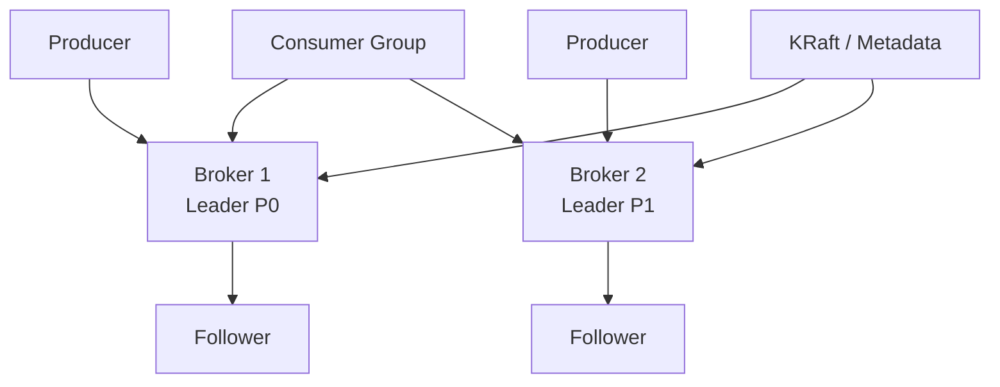
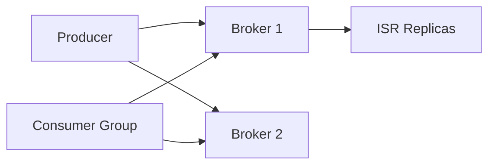

# Apache Kafka as a Distributed Log Platform

## 1. Business Context

Apache Kafka is an open-source **distributed commit log** used as the nervous system for event-driven architectures. Organizations adopt Kafka when they need durable, high-throughput **publish-subscribe** and **stream processing** with horizontal scale, replay capability, and decoupling between producers and consumers. Unlike traditional message queues optimized for per-message deletion after ack, Kafka retains ordered, partitioned logs—consumers track **offsets** and can rewind.

Business drivers include real-time analytics pipelines, microservice integration, CDC (change data capture), log aggregation, fraud detection streams, and ML feature pipelines. LinkedIn originated Kafka; today it underpins ecosystems at thousands of companies and cloud offerings (Confluent Cloud, Amazon MSK, Azure Event Hubs Kafka API).

For principal architects, Kafka is a case study in **log-centric design**: trading per-queue message lifecycle for **partition-scaled throughput**, **at-least-once default semantics**, and **operational complexity** of cluster tuning, rebalancing, and schema evolution. Interview depth spans partitioning, replication, ISR (in-sync replicas), consumer groups, exactly-once semantics (EOS), and failure modes during broker loss or unclean leader election.

See [Kafka Architecture](/docs/messaging-and-streaming/kafka-architecture) and [Message Delivery Semantics](/docs/messaging-and-streaming/message-delivery-semantics).

## 2. Scale

Kafka clusters scale by **adding brokers** and **increasing partitions** for topics. Throughput is bounded per partition for ordering guarantees—more parallelism requires more partitions, not larger messages on one partition.

**Framing dimensions**:

| Dimension | Scale consideration |
|-----------|----------------------|
| Throughput | MB/s per broker depends on hardware, replication, acks |
| Partitions | More partitions → more parallelism; metadata overhead |
| Retention | Time/size policies; disk is primary capacity driver |
| Consumer groups | One consumer per partition per group for active read |
| Replication factor | RF=3 common for production durability |

**Order-of-magnitude**: individual brokers handle tens to hundreds of MB/s depending on configuration (verify with benchmarking—not universal constants). Cluster limits include partition count per broker (Confluent/Apache guidance suggests avoiding excessive partitions per broker for ZooKeeper/KRaft metadata load).

Scale failures: **hot partitions** (skewed keys), **consumer lag** during deploys, **disk saturation** from retention, **rebalance storms** on consumer group membership changes.

## 3. Functional Requirements

| Capability | Mechanism |
|------------|-----------|
| Publish records | Producer → topic partition |
| Subscribe / replay | Consumer groups with offset commits |
| Durability | Replicated log segments on disk |
| Ordering | Per-partition total order |
| Retention | Time and/or size policies; compaction for changelog topics |
| Stream processing | Kafka Streams, ksqlDB, Flink, Spark |
| Schema management | Schema Registry (Confluent ecosystem) |
| Security | SASL, SSL, ACLs |
| Multi-tenant isolation | Quotas, ACLs, separate clusters |

Kafka is **not** a database: it is a log with configurable retention. Materialized views require stream processors or external stores.

## 4. Non-Functional Requirements

| NFR | Typical target |
|-----|----------------|
| Durability | `acks=all` + min.insync.replicas=2 with RF=3 |
| Availability | Survive broker loss without data loss (ISR policies) |
| Latency | ms–tens of ms producer ack path |
| Throughput | Horizontal via partitions |
| Elasticity | Add brokers; reassign partitions (operational) |

**Delivery semantics** are application-defined: at-most-once, at-least-once, exactly-once (transactions + idempotent producer)—see [Idempotency](/docs/distributed-systems-foundations/idempotency).

## 5. Architecture Overview

*Figure 1: Topics split into partitions; each partition has one leader broker.*

**Brokers** store log segments (`.log`, `.index`, `.timeindex`).

**Cluster controller** (KRaft or legacy ZooKeeper mode) manages leader election and metadata.

**Producers** choose partition via key hash or sticky partitioning.

**Consumers** in a group divide partitions via cooperative/ eager rebalancing protocols.

### 5.1 KRaft metadata quorum

KRaft mode embeds Raft consensus for cluster metadata in Kafka brokers themselves, eliminating ZooKeeper. **Metadata quorum** (typically 3 or 5 controller nodes) must remain available for partition leader elections and configuration changes. Data plane partition leadership is separate from metadata quorum health—architects distinguish **broker failure** (affects subset of partitions) from **metadata outage** (cluster-wide control impact).

### 5.2 Log segment storage internals

Partitions append to **segment files** rolled by size or time. Segments are immutable once sealed; compaction (for delete retention) or cleanup (for time retention) reclaims disk. Slow disk I/O manifests as **fetch latency** and **replica lag**—disk is the primary broker scaling dimension after network.

### 5.3 Connect and stream processing boundary

Kafka Connect moves data between Kafka and external systems (DB CDC, S3 sink). Stream processors (Flink, Kafka Streams) maintain **state stores** changelogged to compacted topics. Principal architects position Kafka as the **durable log spine** while queryable state lives in derived stores—violating this leads to treating Kafka as a database.

## 6. Data Model

- **Topic**: named log category
- **Partition**: ordered, immutable sequence of records with monotonic **offset**
- **Record**: key, value, timestamp, headers
- **Offset**: opaque position within partition

**Compaction** retains latest record per key for changelog topics (Kafka Streams state stores, CDC).

**Key choice** determines partition assignment—null keys use round-robin/sticky strategies.

## 7. Partitioning

`partition = hash(key) % numPartitions` (murmur2 by default for keyed messages).

**Implications**:

- Same key → same partition → ordering for that key
- Hot keys → hot partitions
- Increasing partition count does not redistribute existing keys without custom tooling

**Mitigation**: salt keys for write spread (loses per-key ordering), more partitions at topic creation (hard to reduce later), dead-letter topics for poison messages.

Link: partitioning parallels [Consistent Hashing](/docs/caching/distributed-caching) concepts but Kafka uses fixed partition count mod hash.

## 8. Replication

Each partition has **one leader** and **N-1 followers**. Producers write to leader; followers replicate.

**ISR (in-sync replicas)**: followers caught up within `replica.lag.time.max.ms`.

**`acks` setting**:

| acks | Behavior |
|------|----------|
| 0 | Fire-and-forget |
| 1 | Leader ack; follower loss risk |
| all | Wait for ISR ack |

**`min.insync.replicas`**: minimum ISR size for `acks=all` to succeed—prevents ack when only leader alive.

**Unclean leader election** (`unclean.leader.election.enable`): availability vs data loss tradeoff—principal architects usually disable for production data loss risk.

## 9. Consistency

Kafka provides **order consistency per partition**, not global topic order.

**Consumer offset commits** create consistency windows: process-then-commit vs commit-then-process defines at-least-once vs at-most-once.

**Exactly-once** (EOS): idempotent producer + transactions + `read_committed` consumers—higher latency and operational constraints.

Cross-partition transactions are limited; global ordering requires single partition or external coordination.

Compare [Sequential Consistency](/docs/consistency/sequential-consistency) vs Kafka's per-partition guarantee.

## 10. Availability

Broker failure triggers leader election from ISR. Cluster remains available if majority metadata quorum healthy (KRaft) and ISR non-empty.

**Rack awareness** spreads replicas across failure domains.

**MirrorMaker / cluster linking** for DR—async replication between clusters.

Consumer availability: rebalance on member join/leave—**stop-the-world** rebalances cause lag spikes; cooperative sticky assignors reduce impact.

## 11. Failure Handling

| Failure | Handling |
|---------|----------|
| Broker crash | Leader election; clients metadata refresh |
| Disk full | Broker offline; urgent retention/ops |
| Producer retry | Idempotent producer avoids duplicates (PID + sequence) |
| Poison message | DLQ pattern; skip with manual offset |
| Rebalance storm | Session timeouts, static membership, cooperative protocol |
| ZooKeeper loss (legacy) | Cluster metadata unavailable—migrate to KRaft |

**Chaos testing**: [Chaos Engineering](/docs/reliability-and-resilience/chaos-engineering) practices for broker kill drills.

## 12. Security

- **TLS** for wire encryption
- **SASL** (SCRAM, OAuth/OIDC via extensions) for authentication
- **ACLs** per topic/group/cluster operations
- **Multi-tenant**: separate clusters vs shared with strict ACLs and quotas

Principal review: PII in payloads, encryption at rest (broker disk, cloud KMS), audit logging.

## 13. Observability

| Metric | Meaning |
|--------|---------|
| `UnderReplicatedPartitions` | ISR shrink risk |
| `OfflinePartitionsCount` | Critical availability |
| Consumer lag | Processing backlog per partition |
| Request rate / latency | Broker load |
| Log flush latency | Disk pressure |

**OpenTelemetry** and JMX exporters integrate with Prometheus/Grafana.

Tracing: propagate headers in record headers for distributed traces across microservices.

## 14. Cost Model

Self-hosted costs: broker VMs, disk (often largest), networking cross-AZ, operations headcount.

Managed (MSK, Confluent): partition-hour + storage + ingress/egress + connect/stream processing units.

**Cost levers**:

- Retention reduction
- Compression (lz4, zstd, snappy)
- Tiered storage (vendor features) for cold data
- Right-size replication factor per topic criticality

## 15. Evolution of Architecture

- ZooKeeper dependency → **KRaft** (Kafka Raft metadata mode) simplifies ops
- Idempotent producer and transactions for EOS
- Tiered storage and improved rebalancing protocols (ongoing community work)

Architecturally Kafka remains a **log**; ecosystem shifted toward **stream-table duality** (ksqlDB, Flink) and **governance** (Schema Registry, data contracts).

## 16. Important Tradeoffs

| Tradeoff | Detail |
|----------|--------|
| Partitions vs ordering | More partitions = more parallelism, less global order |
| acks=all vs latency | Durability wins cost latency |
| Retention vs disk | Long retention = replay capability + cost |
| Compact vs delete | Compaction for changelog; delete for event streams |
| Kafka as source of truth | Usually requires external store for query models |

**PACELC**: Kafka prioritizes **availability and partition tolerance** with **latency** tied to replication ack path; consistency is **per-partition order**, not linearizable storage.

## 17. Known Limitations

- Not a replacement for OLTP database query models
- Partition count hard to decrease
- Rebalancing operational pain at large consumer counts
- Exactly-once complexity and performance overhead
- Cross-region strong consistency not native

## 18. Interview Lessons

**Strong signals**:

- Explain ISR and why `min.insync.replicas=2` with RF=3
- Design topic/partition plan for 1M events/sec order-of-magnitude
- Consumer group rebalancing impact and mitigations
- When to use Kafka vs SQS vs Kinesis

**Red flags**:

- "Kafka guarantees exactly-once everywhere by default"
- Unbounded partition growth without broker impact analysis

## 19. Redesign Exercise

**Prompt**: E-commerce order events topic; checkout spike 20× on Black Friday; consumer lag exceeds 1 hour.

Design:

1. Partition and key strategy
2. Consumer autoscaling limits (partitions bound parallelism)
3. Backpressure and degradation (shed non-critical consumers)
4. DLQ and replay runbook
5. SLO for lag and error budget policy

### Deep dive: consumer group mechanics

When a consumer joins or leaves a group, the **group coordinator** triggers a **rebalance** that reassigns partition ownership. During rebalance, consumers stop processing—creating a **stop-the-world** window if not using cooperative protocols. At principal level, articulate the difference between **range**, **round-robin**, and **sticky** assignors, and why **CooperativeStickyAssignor** reduces partition movement.

**Static group membership** (`group.instance.id`) reduces unnecessary rebalances on rolling deploys by keeping member identity across restarts. Pair with **incremental cooperative rebalancing** so only revoked partitions pause while others continue.

**Offset commit strategy** defines failure semantics:

| Strategy | Behavior on crash after processing |
|----------|-------------------------------------|
| Auto commit (default interval) | May lose or duplicate messages |
| Sync commit after process | At-least-once if commit fails after process |
| Commit before process | At-most-once risk |

For order events, **at-least-once + idempotent consumer** (store processed offset + business idempotency key in DB) is the pragmatic production default—not EOS unless audit mandates justify latency.

### Deep dive: producer tuning and backpressure

Producers buffer records in memory (`buffer.memory`). When `max.block.ms` elapses waiting for metadata or buffer space, `send()` throws—this is **backpressure** propagating to the application thread. Architects must size:

- `batch.size` and `linger.ms` for throughput vs latency
- `compression.type` (lz4/zstd) for cross-AZ bandwidth
- `max.in.flight.requests.per.connection` — values > 1 without idempotency reorder on retry

**Idempotent producer** assigns PID and sequence numbers per partition, collapsing duplicate retries on the broker—a **safety** mechanism for single-partition ordering during retries.

### Operational playbook snapshot

| Alert | Likely cause | First action |
|-------|--------------|--------------|
| `UnderReplicatedPartitions` > 0 | Slow follower or broker down | Check disk/CPU on follower; ISR logs |
| Consumer lag spike | Deploy rebalance or slow handler | Check rebalance metrics; scale consumers to partition count |
| Request queue time high | Broker overload | Add brokers; investigate hot partition |
| Log dir failure | Disk corruption/full | Replace broker; restore from replica |

### Interview scoring rubric (principal)

| Dimension | Weight | Strong signal |
|-----------|--------|---------------|
| Partition/key design | 25% | Orders keyed by `order_id`; avoid hot `country` key |
| Failure semantics | 25% | ISR, acks, idempotent consumer spelled out |
| Operability | 20% | Rebalance, lag SLO, DLQ replay |
| Cost/scale | 15% | Retention, compression, RF per topic tier |
| Alternatives | 15% | When SQS/Kinesis/Pulsar fits better |

## Supplementary Diagram

*Figure: Kafka broker cluster with ISR replication and consumer groups.*

## 20. References

- Kreps, "The Log" (LinkedIn engineering blog)
- Kafka documentation: replication, producer configs, KRaft
- [Kafka Architecture](/docs/messaging-and-streaming/kafka-architecture)
- [Event-Driven Architecture](/docs/messaging-and-streaming/event-driven-architecture)
- Narkhede, Rao, Kreps — Kafka: The Definitive Guide (O'Reilly)

### Appendix: Kafka vs managed queue comparison (interview)

| Dimension | Kafka | SQS | Kinesis |
|-----------|-------|-----|---------|
| Ordering | Per partition | FIFO queue only (limited) | Per shard |
| Retention | Configurable log | Short (days) | 1–365 days |
| Replay | Native offset rewind | No native replay | Iterator reset |
| Consumer model | Pull, consumer groups | Push/poll | Pull, enhanced fan-out |
| Ops complexity | High (cluster) | None (managed) | Low (managed) |

Choose Kafka when **multiple consumers** need independent replay of the same stream, retention is long, and stream processing joins are central. Choose SQS for simple task queues with minimal ops. Choose Kinesis when tight AWS integration and shard-hour pricing fit video/analytics ingest.

### Appendix: broker sizing heuristics (verify with benchmarks)

Disk throughput and page cache effectiveness dominate broker performance. Rule-of-thumb starting points for interviews (not universal constants):

- Keep network below 60% sustained on 10 GbE brokers under RF=3
- Monitor `LogFlushRateAndTimeMs` — spikes precede ISR shrink
- Limit partitions per broker to avoid metadata and file handle pressure (community guidance often cites low thousands per broker as upper bound—validate for your Kafka version)

Operational maturity requires **regular disaster recovery drills**: restore metadata backup (KRaft), reassign partitions, verify consumer offset recovery plan documented.

### Appendix: schema evolution and data contracts

Kafka payloads without schema governance become **protobuf/JSON compatibility traps**. Schema Registry enforces **backward/forward/full** compatibility modes. Principal architects mandate:

- Schema review in CI for breaking changes
- `record` headers carrying `schema_id`
- Dead-letter quarantine for deserialization failures

Link: [Event-Driven Architecture](/docs/messaging-and-streaming/event-driven-architecture) for contract testing between producers and consumers.

### Appendix: multi-datacenter replication patterns

**Cluster linking** and **MirrorMaker 2** replicate topics between Kafka clusters asynchronously. Use cases: disaster recovery, geo-proximate consumption, regulatory data residency. Architects document:

- Offset mapping is not always 1:1 across clusters
- Consumer failover requires explicit runbook (reset offsets or dual consume)
- Latency = produce + cross-link + consume—unsuitable for synchronous cross-DC transactions

Treat mirrored topics as **eventually consistent event copies**, not a single logical log.

### Appendix: principal-level interview question bank

1. Design order events for 50k orders/sec—partitions, keys, retention, compaction?
2. Broker disk full at 3 AM—immediate steps and long-term fix?
3. Consumer lag 6 hours—how to catch up without overloading DB sink?
4. When does Kafka violate your microservice boundaries?
5. Compare log compaction vs tiered retention for changelog topic storing user profiles.

Each question tests **mechanism + operations**, not definition recitation.
