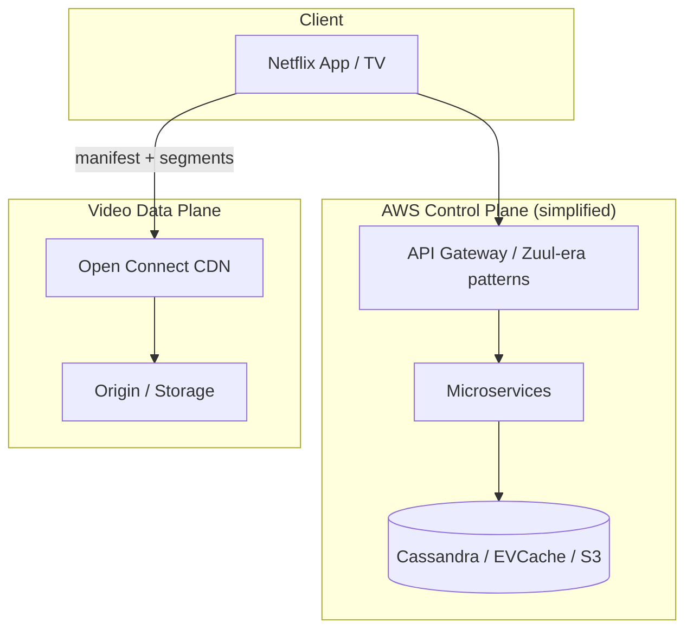
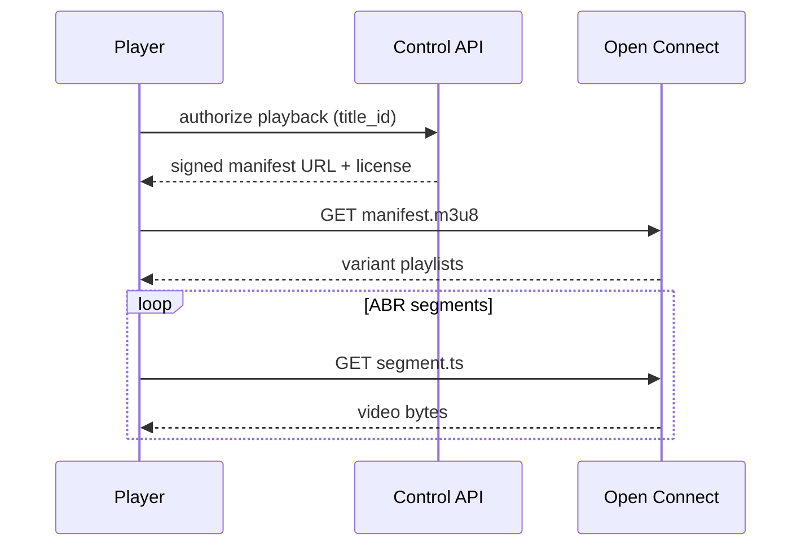

# Netflix Global Video Streaming Architecture

## 1. Business Context

Netflix operates one of the world's largest subscription video streaming services, delivering on-demand and (increasingly) live content to hundreds of millions of members globally. The business model depends on **reliable playback**, **personalized discovery**, and **cost-efficient bandwidth** at planetary scale. Unlike a greenfield system design exercise, Netflix's architecture evolved through **AWS migration** (circa 2008–2016 public narrative), **custom CDN (Open Connect)**, and **microservices decomposition** of the control plane while keeping the **data plane (video bytes)** CDN-centric.

For principal architects, Netflix is the canonical case study for:

- **Separating metadata/control plane from byte delivery**
- **Building proprietary CDN when economics and scale justify it**
- **Chaos engineering as an organizational capability** (Chaos Monkey, Simian Army)
- **Regional failure isolation** and graceful degradation
- **Culture of freedom and responsibility** influencing architecture ownership

This case study synthesizes **publicly documented** Netflix engineering (tech blog, presentations) with generic streaming platform patterns from [Video Streaming Platform](/docs/system-design/video-streaming-platform). It does not claim access to confidential internal metrics or unreleased systems.

## 2. Scale

Public narratives reference **hundreds of millions of subscribers** and **very large fractions of peak internet traffic** in some regions during prime time. Exact current numbers change quarterly—treat figures as order-of-magnitude for interview reasoning.

| Dimension | Architectural implication |
|-----------|---------------------------|
| Concurrent streams | Millions at peak; CDN absorbs bulk |
| Catalog size | Massive metadata graph; not one database row |
| Encoding | Thousands of titles × many renditions |
| Regions | Multi-region AWS + Open Connect POPs globally |
| Devices | Smart TVs, mobile, web—ABR player diversity |

**Scale failure modes** at Netflix-class systems: CDN origin overload, recommendation service latency affecting browse (not playback), regional AWS impairment, encoding backlog on new content launches, **thundering herd** on popular title releases.

## 3. Functional Requirements

| Capability | Architectural home |
|------------|-------------------|
| Browse / search | Microservices + Cassandra/EVCache (historical patterns—verify evolution) |
| Playback authorization | Playback API issues licenses/URLs |
| Video delivery | Open Connect CDN + encoded assets |
| Encoding / transcoding | Media pipeline (async jobs) |
| Personalization | Recommendation ML pipelines |
| Account / billing | Separate bounded context |
| A/B testing | Experimentation platform |
| Downloads (offline) | DRM + device storage |

**Non-goals** for byte path: synchronous database lookup per video segment—manifest and CDN URLs are precomputed/cached.

## 4. Non-Functional Requirements

| NFR | Target pattern |
|-----|----------------|
| Playback availability | CDN-first; multi-origin shield |
| Start time | Low time-to-first-frame via edge cache |
| Rebuffer ratio | ABR + sufficient CDN capacity |
| Browse latency | Aggressive caching; fallback degradation |
| Fault isolation | Bulkheads between services |
| Operability | Chaos experiments; automated remediation |

Netflix famously prioritizes **availability of streaming** over perfect browse experience during incidents—an explicit product/architecture tradeoff documented in resilience narratives.

## 5. Architecture Overview

*Figure 1: Control plane on AWS; video bytes served from Open Connect.*

**Open Connect**: Netflix-owned CDN appliances at ISP locations; reduces transit costs and improves latency by caching popular content near users.

**Microservices**: Hundreds of services (public count evolved over years)—domain-driven decomposition (billing, recommendations, playback, etc.).

Link: [Service Decomposition and DDD](/docs/microservices/service-decomposition-and-ddd).

### 5.1 Playback session flow (simplified)

Bytes never traverse the microservice mesh—only **authorization and metadata** do. Principal candidates must draw this boundary in the first two minutes of a streaming design interview.

### 5.2 Encoding and quality ladder

Source masters (high bitrate) feed transcoding farms producing **bitrate ladder** rungs (e.g., 4K HEVC, 1080p H.264, 720p, audio-only). Packaging generates HLS/DASH manifests referencing segments. **Per-title encoding** optimizes bits per quality—Netflix public talks reference per-shot encoding complexity; architects at smaller scale still need **ladder spacing** and **codec licensing** awareness (HEVC, AV1).

### 5.3 Recommendation system isolation

Personalization ML pipelines batch-train offline; serving layer returns ranked title IDs to browse APIs. Failure or latency in recommendations must **not** block playback start—circuit breakers return popular/trending fallbacks. This is explicit **degradation hierarchy**: revenue-critical path (play) > engagement path (browse) > experimental features.

## 6. Data Model

**Catalog metadata**: titles, seasons, episodes, artwork URLs, entitlements, regional rights.

**Playback assets**: per-title encoding ladder (4K, 1080p, …), manifests (HLS/DASH), DRM keys.

**Member state**: profiles, viewing history, preferences, my list.

**Separation**: hot playback paths use **precomputed manifest URLs** and **CDN cache keys**; relational joins at request time are avoided on critical path.

## 7. Partitioning

- **Microservices** partition by bounded context, each with own data stores.
- **Cassandra** (historically) partitions wide-column data by partition key for availability.
- **CDN** partitions traffic geographically—content replicated to POPs based on popularity predictions.
- **S3** (or equivalent) stores masters and encoded objects with prefix strategies.

Hot title: **many replicas** on Open Connect appliances via proactive caching algorithms.

## 8. Replication

| Layer | Replication |
|-------|-------------|
| Video objects | Multi-POP CDN replication; origin in cloud |
| Databases | Multi-AZ / multi-region per service policy |
| Config | Chained deployment pipelines; regional copies |

Playback **does not require strong cross-region consistency** for manifests if eventual propagation acceptable for minutes-old encodes.

## 9. Consistency

- **Browse data**: eventual consistency acceptable with caching.
- **Billing / entitlements**: stronger consistency requirements; isolated services.
- **Playback tokens**: short-lived, signed URLs; clock skew managed.
- **A/B experiments**: sticky assignment; consistency per member session.

See [Session Guarantees](/docs/consistency/session-guarantees) and [Eventual Consistency](/docs/consistency/eventual-consistency).

## 10. Availability

Netflix **chaos engineering** ([Chaos Engineering](/docs/reliability-and-resilience/chaos-engineering)) proactively terminates instances and injects latency to validate resilience.

**Fallback strategies**:

- Degrade non-critical microservices (recommendations) while keeping playback
- Static browse caches
- Regional isolation—failure in one AWS region should not globalize

**Hystrix** (historical circuit breaker library from Netflix) popularized bulkhead patterns—see [Resilience Patterns](/docs/microservices/resilience-patterns).

## 11. Failure Handling

| Scenario | Response |
|----------|----------|
| Microservice timeout | Circuit breaker; cached response |
| CDN miss storm | Origin shield; rate limit |
| Encoding failure | Retry job; alert content ops |
| DRM license failure | Client retry; alternate license path |
| Regional AWS outage | Failover runbooks; DNS/traffic shift |

**Postmortem culture**: blameless analysis; architectural follow-ups.

## 12. Security

- **DRM** (Widevine, PlayReady, FairPlay) protects content.
- **TLS** everywhere for API and CDN where applicable.
- **Tokenized playback URLs** with expiration.
- **Account security**: credential stuffing defenses; device limits.
- **PII minimization** in logs; GDPR data subject requests.

## 13. Observability

Netflix contributed to **Atlas** (metrics), **Edgar** (troubleshooting), distributed tracing practices.

Key SLIs:

- Playback start failures
- Rebuffer events per session
- API error rates per service
- CDN cache hit ratio

[SLO, SLI, and Error Budgets](/docs/reliability-and-resilience/slo-sli-error-budgets) align teams to user-visible metrics.

## 14. Cost Model

Major cost buckets:

- **CDN bandwidth** — motivator for Open Connect investment
- **AWS compute** for microservices and encoding
- **Storage** for masters and encoded tiers
- **ML** for recommendations

**Encoding economics**: generate only renditions devices need; per-title optimization.

**Open Connect tradeoff**: capital expense + ISP partnerships vs ongoing transit fees.

## 15. Evolution of Architecture

Public timeline (verify in Netflix tech blog):

- DVD era → streaming startup
- Monolith in datacenter → AWS migration
- Microservices explosion; tooling (Chaos Monkey, Spinnaker CI/CD)
- Open Connect buildout
- Continued codec evolution (AV1, etc.) and live streaming expansion

Architectural lesson: **each scale tier forced new specialization**—generic cloud CDN insufficient economically at their traffic share.

## 16. Important Tradeoffs

| Tradeoff | Netflix direction |
|----------|-------------------|
| Build vs buy CDN | Build Open Connect at scale |
| Microservices vs monolith | Microservices with tooling tax |
| Availability vs consistency | Playback over perfect browse |
| Personalization vs privacy | Regional regulation influence |
| Single cloud vs multi | AWS primary; CDN hybrid |

## 17. Known Limitations

Public docs do not expose all current internals—avoid claiming specific database choices without citation.

General limitations of streaming at scale:

- Live low-latency vs cost
- Global rights complexity
- Device fragmentation
- Encoding backlog on catalog growth

## 18. Interview Lessons

**Strong answers**:

- Draw control vs data plane separation first
- Explain ABR and CDN cache hit ratio
- Discuss chaos engineering as process, not just tools
- Quantify origin protection (shield, rate limits)

**Questions**:

- Design Netflix for 10× live sports traffic spike
- How to test disaster recovery without customer impact?

## 19. Redesign Exercise

**Prompt**: New live sports tier requires 5-second latency globally while maintaining 4K for VOD.

Compare LL-HLS, WebRTC, multicast (where available). Identify which components change (packager, CDN, player). Estimate cost delta vs standard HLS.

### Deep dive: adaptive bitrate (ABR) mechanics

Clients download a **manifest** listing variant streams (bitrates/resolutions) and **segments** (typically 2–6 seconds). The player buffer monitors download throughput and switches variants to minimize rebuffering. Architecture must provide:

- **Encoding ladder** spaced so switches are meaningful (not 100 kbps steps)
- **CDN cache** of both manifests and segments with correct `Cache-Control`
- **Origin shield** to collapse mid-tier cache misses during viral title launch

**Thundering herd** on new episode: millions of clients request same manifest simultaneously. Mitigations: staggered rollout by region, manifest prefetch in app, signed URL TTL aligned with cache, **pre-positioning** on Open Connect based on release schedule.

### Deep dive: Open Connect economics

Netflix ships **Open Connect Appliances (OCA)** to ISP networks. Content popular in a region replicates to local OCAs, reducing:

- Netflix → ISP transit costs
- End-user latency and rebuffer risk
- Core origin load during peak

Tradeoff: capital and operational cost of hardware program vs pure cloud CDN pricing. At sufficient scale, **proprietary CDN** becomes rational—below that scale, CloudFront/Akamai/Fastly is correct.

### Microservices operational tax

Hundreds of services imply:

- **Contract testing** between teams
- **Dependency graphs** for blast radius analysis
- **Fallback defaults** when recommendation service fails (show static rows)
- **Deployment** velocity via Spinnaker/canary patterns

Principal lesson: microservices are not free—they purchase **team autonomy** at **operational complexity** cost. Netflix invested heavily in platform tooling (Chaos Monkey, Atlas, deployment pipelines) to pay that tax.

### Failure scenario walkthrough

**Scenario**: AWS `us-east-1` impairment during prime time.

1. Traffic DNS/geo shift to healthy regions (where architecture supports)
2. Degrade browse personalization; serve cached catalog slices
3. Playback continues if OCAs have hot content cached
4. Incident comms: status page; error budget consumption tracked per [SLO, SLI, and Error Budgets](/docs/reliability-and-resilience/slo-sli-error-budgets)

### Interview scoring rubric

| Dimension | Weight | Strong signal |
|-----------|--------|---------------|
| Control vs data plane | 30% | First diagram separates bytes from metadata |
| CDN/ABR | 25% | Segments, manifests, cache hit ratio |
| Resilience | 20% | Chaos, circuit breakers, degradation |
| Cost | 15% | Open Connect rationale at scale |
| Live vs VOD | 10% | Latency tradeoffs articulated |

## 20. References

- Netflix Technology Blog (https://netflixtechblog.com/)
- Open Connect documentation (Netflix ISP partner materials)
- [Video Streaming Platform](/docs/system-design/video-streaming-platform)
- [Chaos Engineering](/docs/reliability-and-resilience/chaos-engineering)
- [Resilience Patterns](/docs/microservices/resilience-patterns)
- Hamilton, "The Philosophy of Engineering" (Netflix chaos origins)

### Appendix: live vs VOD architecture divergence

| Aspect | VOD | Live |
|--------|-----|------|
| Ingest | Batch upload → transcode | RTMP/SRT continuous |
| Packaging | Offline packager | Real-time packager |
| CDN caching | Long TTL segments | Short TTL; low latency path |
| Failure impact | Retry transcode job | Buffering/blackout visible instantly |
| Cost driver | Storage + encode once | Egress per viewer minute |

Principal architects propose **separate pipelines** sharing only player and DRM components—do not route live through batch transcode queues.

### Appendix: device and DRM matrix

Smart TVs, iOS, Android, and web players support different DRM schemes (Widevine L1/L3, PlayReady, FairPlay). License servers issue per-device licenses bound to security level. **Offline downloads** add key rotation and expiration complexity—architects scope security reviews per platform team.

### Appendix: capacity planning conversation

Peak concurrent streams × average bitrate ≈ CDN egress demand. Add 30–50% headroom for viral events. Coordinate with Open Connect **prefetch lists** before major title launches—operations runbooks include "content prep" milestones days before release, not only software deploys.

### Appendix: interview whiteboard sequence (recommended)

1. Clarify VOD vs live, subscriber scale, device targets (2 min)
2. Draw control plane vs CDN data plane (3 min)
3. Walk upload → transcode → manifest → ABR playback (5 min)
4. State failure modes: CDN miss, transcode backlog, regional outage (3 min)
5. Cost drivers: egress, encode, storage tiers (2 min)
6. Tradeoffs: proprietary CDN vs commercial (2 min)

This sequence demonstrates **principal-level structure** before diving into codec bitrates.

### Appendix: relationship to generic reference design

This Netflix-focused case study complements the vendor-neutral [Video Streaming Platform](/docs/system-design/video-streaming-platform) chapter—use both: generic chapter for interview methodology, Netflix case study for real-world evolution and organizational practices (chaos engineering, Open Connect economics).

### Appendix: organizational lessons for architects

Netflix's public engineering culture emphasizes **freedom and responsibility**: teams own services end-to-end including paging. Architecture implications:

- Platform teams provide paved roads (deployment, observability, chaos tools)
- Product teams choose data stores within guardrails
- Incident response prioritizes customer-visible streaming over internal metrics

Principal candidates discussing Netflix should connect **technical patterns** to **organizational enablers**—chaos engineering fails without leadership mandate.

### Appendix: principal-level interview question bank

1. New region launch—what do you replicate first: catalog, encodes, or OCAs?
2. Recommendation model deploy causes 500ms browse latency—playback impact?
3. Design DRM key rotation without invalidating offline downloads.
4. Compare Netflix Open Connect vs using only CloudFront—decision criteria?
5. How measure CDN efficiency beyond cache hit ratio?

### Appendix: content security and geo-restriction

Licensing agreements require **geo-fencing** titles—metadata includes allowed regions; CDN edge checks entitlement token claims before serving segments. VPN circumvention is a product/legal problem with technical mitigations (IP reputation, device attestation)—architects scope fraud vs piracy controls separately from playback reliability engineering.

### Appendix: sustainability and encoding efficiency

Per-title encoding reduces bits delivered without perceptual quality loss—directly lowers CDN energy and carbon footprint. At principal level, connect **codec efficiency (AV1)** decisions to **cost and sustainability OKRs**, not only quality metrics.

### Appendix: metrics that matter to executives vs engineers

| Audience | Metric | Why |
|----------|--------|-----|
| Executive | Hours streamed, churn correlation | Revenue linkage |
| Product | Start play success rate | UX friction |
| Engineering | Rebuffer ratio, p99 TTFB | Technical health |
| Finance | CDN $ per streamed hour | Unit economics |

Architects translate between tables in steering committees—principal skill beyond drawing boxes.
