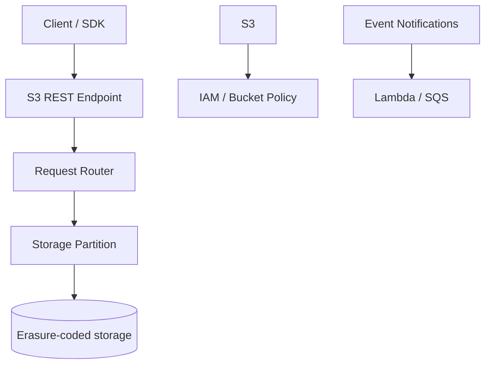
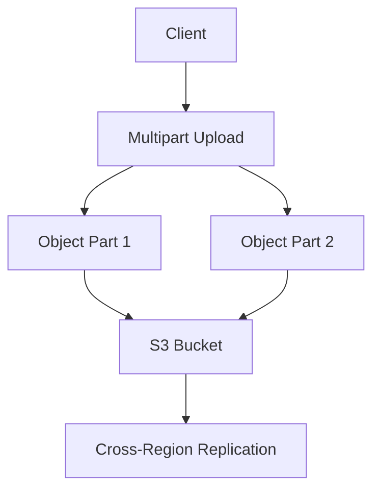

# Amazon S3 Object Storage at Planetary Scale

## 1. Business Context

Amazon Simple Storage Service (S3) is AWS's **object storage** platform, designed to store arbitrary binary objects (files) addressed by key within buckets. It underpins data lakes, backup/restore, static website hosting, ML datasets, media assets, log archives, and as the durability layer behind many AWS services (DynamoDB backups, Redshift Spectrum, Athena, Glacier transitions).

The business value is **extreme durability and elasticity** without capacity planning: customers pay for storage, requests, and data transfer rather than provisioning disks. S3's consistency model evolution (read-after-write for new objects, strong read-after-overwrite for existing keys—per AWS documentation) made it viable as a primary data lake substrate.

Principal architects study S3 for **11-nines durability marketing** (verify AWS SLA and design assumptions), **prefix scaling behavior**, **lifecycle economics**, **security boundaries** (bucket policies, ACL deprecation), and **multi-region patterns** (CRR, MRAP). S3 is often the **system of record** for immutable artifacts while databases hold operational state.

## 2. Scale

S3 is engineered for **virtually unlimited storage** per bucket and high request rates when keys are well-distributed. AWS documents that prefixes scale horizontally—historical guidance of 3,500 PUT/5,500 GET per prefix per second has evolved; consult current AWS S3 performance documentation for partition scaling behavior.

| Dimension | Consideration |
|-----------|---------------|
| Object size | Single PUT up to 5 GB; multipart for larger (up to 5 TB) |
| Bucket count | Soft limits per account; increase via support |
| Listing | `ListObjects` not for hot paths at huge scale |
| Request rate | Randomized key prefixes improve parallelism |
| Storage classes | Standard, IA, Glacier tiers, Intelligent-Tiering |

Scale failures: **hot prefixes** on sequential keys, **listing bottlenecks**, **egress cost shock**, **lifecycle misconfiguration** deleting production data.

## 3. Functional Requirements

| Capability | API / feature |
|------------|---------------|
| Put/get/delete objects | REST API, SDKs |
| Versioning | Object version history |
| Multipart upload | Large object assembly |
| Server-side encryption | SSE-S3, SSE-KMS, SSE-C |
| Lifecycle rules | Transition, expiration |
| Replication | CRR, SRR, batch replication |
| Event notifications | SNS, SQS, Lambda, EventBridge |
| Access points | Per-application endpoints with policies |
| Object Lock | WORM compliance retention |
| Inventory / analytics | Storage Lens, inventory reports |

S3 is **not** a filesystem: no partial byte-range writes in place (overwrite whole object), eventual listing consistency historically (now strong for new objects listing in many cases—verify docs).

## 4. Non-Functional Requirements

| NFR | Target |
|-----|--------|
| Durability | 99.999999999% (11 nines) for Standard (AWS claim) |
| Availability | 99.99% Standard (regional SLA—verify) |
| Latency | ms–100ms depending on region/size |
| Throughput | Scale with parallel requests and prefix design |

**Consistency** (AWS documentation summary):

- New object PUT: read-after-write consistency
- Overwrite DELETE/PUT on existing key: strong read-after-overwrite
- List operations: design for eventual consistency historically; check current guarantees

## 5. Architecture Overview



*Figure 1: Logical S3 request path—internal partitioning opaque to clients.*

Internal implementation (not fully published) uses distributed storage with **erasure coding** and replication across facilities within a region for durability.

**Multi-Region Access Points (MRAP)** provide global endpoint routing to replicated buckets.

### 5.1 Request path and strong consistency milestones

Understanding S3's consistency evolution matters for interview accuracy: AWS announced **read-after-write consistency for PUTS of new objects** and **strong read-after-overwrite** for deletes/overwrites—eliminating many historical "eventual listing" pitfalls for new keys. Architects still design defensively: **list + get** patterns for verification should not assume instantaneous list visibility for all operations—consult current AWS documentation for list consistency guarantees.

### 5.2 Storage class decision tree

```
Access frequency?
├─ Frequent → S3 Standard (or Intelligent-Tiering if unknown)
├─ Monthly → Standard-IA / One Zone-IA (AZ failure risk accepted)
└─ Archive → Glacier Flexible / Deep Archive (minutes–hours retrieval)
```

**Minimum storage duration** charges apply for IA/Glacier—architects model lifecycle transitions with total cost, not headline per-GB rate.

### 5.3 Event-driven integration patterns

S3 Event Notifications to SQS/Lambda/EventBridge enable **reactive pipelines** (virus scan, thumbnail, index). Design for **at-least-once** events; deduplicate by object version ID and event time. Fan-out storms on bulk upload prefixes require SQS buffering and concurrency limits on Lambda.

## 6. Data Model

- **Bucket**: global unique name namespace; region-affiliated
- **Object key**: UTF-8 string (up to 1024 bytes); logical hierarchy via `/` delimiter
- **Object**: data + metadata + version ID (if versioning on)
- **Metadata**: user-defined and system metadata

**Data lake pattern**: `s3://bucket/year=2026/month=07/day=25/hour=12/uuid.parquet` — partition discovery via Athena/Glue, not S3 native partitions.

Link: [Data Lakehouse Architecture](/docs/data-platforms/data-lakehouse-architecture).

## 7. Partitioning

S3 partitions the keyspace internally for scale. **Application-level prefix randomization** (`hash(uuid)/object`) avoids hot spots on sequential `uploads/00001`, `uploads/00002`.

**List performance**: avoid monolithic directories with millions of list operations; use inventory or catalog (Glue Data Catalog).

## 8. Replication

| Type | Use case |
|------|----------|
| Same-Region Replication (SRR) | Log aggregation, compliance copy |
| Cross-Region Replication (CRR) | DR, latency to distant readers |
| Batch Replication | Backfill existing objects |
| MRAP | Global applications with local performance |

Replication is **asynchronous**; RPO > 0. Conflict handling uses last-writer-wins on same key (with versioning exposing multiple versions).

## 9. Consistency

Architects must separate:

- **Single-object read-after-write** for new uploads
- **Cross-object consistency** not guaranteed (no multi-object transaction except batch delete limitations)
- **Versioning** for audit and rollback

Patterns requiring **atomic multi-object updates** use manifest files, DynamoDB metadata, or lakehouse transaction logs (Iceberg/Delta).

See [Eventual Consistency](/docs/consistency/eventual-consistency) for catalog-level semantics.

## 10. Availability

Regional service; Multi-AZ durability within region. Regional outage requires cross-region replicas and failover runbooks ([Disaster Recovery](/docs/reliability-and-resilience/disaster-recovery-and-multi-region)).

**Versioning + MFA delete** protects against accidental mass deletion (operator safety).

## 11. Failure Handling

| Failure | Mitigation |
|---------|------------|
| Accidental delete | Versioning, Object Lock, cross-region replica |
| Incomplete multipart | Lifecycle abort incomplete MPU rules |
| Throttling (503 Slow Down) | Exponential backoff, prefix spread |
| KMS key unavailable | SSE-KMS dependency failure—runbook |
| Replication lag | Monitor `ReplicationLatency` metrics |

## 12. Security

- **Block Public Access** account defaults
- **Bucket policies** and IAM policies (prefer over legacy ACLs)
- **SSE-KMS** with CMK rotation and least privilege key policies
- **VPC endpoints** for private access
- **Access logging** and CloudTrail data events (cost awareness)

Principal review: tenant isolation in shared buckets via prefix policies and access points.

## 13. Observability

- CloudWatch metrics: `BucketSizeBytes`, `NumberOfObjects`, request metrics
- Storage Lens organization-wide visibility
- Server access logs (latency/cost tradeoff)
- CloudTrail for API audit

SLO example: 99.9% successful GET p99 < 200ms for Standard class in-region.

## 14. Cost Model

| Component | Driver |
|-----------|--------|
| Storage | GB-month per class |
| Requests | PUT/GET/LIST pricing |
| Data transfer | Egress to internet/AZ cross |
| Replication | Inter-region transfer + storage |
| Lifecycle transitions | Per-request transition fees |

**FinOps**: Intelligent-Tiering for unknown access; Glacier for archives; minimize LIST; compress objects; CloudFront for egress reduction.

## 15. Evolution of Architecture

- Strong read-after-write for new objects (2015 announcement—historical context)
- Versioning, lifecycle, replication maturation
- S3 Glacier integration and Instant Retrieval tier
- S3 Express One Zone (low-latency single-AZ class—verify use cases)
- Table buckets / analytics integrations (evolving AWS features—verify current catalog)

## 16. Important Tradeoffs

| Choice | Tradeoff |
|--------|----------|
| Standard vs IA vs Glacier | Cost vs retrieval latency |
| SSE-S3 vs SSE-KMS | Simplicity vs key control/audit |
| Versioning on | Protection vs storage multiplication |
| CRR | DR vs replication lag and cost |
| Many small objects | Metadata overhead vs large concatenated files |

## 17. Known Limitations

- No POSIX filesystem semantics
- Listing at billions of keys requires external catalog
- Cross-object ACID not native
- Latency unsuitable for some low-latency mutable workloads
- Egress costs dominate at scale

## 18. Interview Lessons

Design a photo storage backend; justify S3 vs EBS vs EFS. Explain multipart upload failure recovery. Calculate storage + egress cost order-of-magnitude. Describe data lake partition strategy.

**Red flags**: Using LIST in request hot path; assuming cross-object consistency.

## 19. Redesign Exercise

**Prompt**: Migrate 10 PB on-prem NAS to S3 with minimal downtime and verify integrity.

Plan: transfer appliance vs DataSync, checksum verification, prefix layout, IAM least privilege, cutover DNS, rollback strategy, cost model for Standard vs Glacier.

### Deep dive: multipart upload lifecycle

Multipart upload (MPU) is mandatory for large objects and recommended for parallel throughput on medium objects. The lifecycle:

1. `CreateMultipartUpload` → `uploadId`
2. `UploadPart` for each part (minimum 5 MB except last—verify current AWS limits)
3. `CompleteMultipartUpload` with ordered ETag list
4. Or `AbortMultipartUpload` on failure

**Failure modes**: client crash after parts uploaded but before complete leaves **orphan parts** billing storage until lifecycle `AbortIncompleteMultipartUpload` rule runs. Principal architects mandate abort rules in every bucket policy template.

**Integrity**: ETags for parts are not always MD5 of content for SSE-KMS—use client-side checksums (`ChecksumSHA256` in AWS SDK where supported) for audit trails.

### Deep dive: data lake layout on S3

Hive-style partitioning (`s3://bucket/table/year=2026/month=07/`) enables partition pruning in Athena/Spark. Design rules:

- Avoid too many small files (metadata overhead in query engines)
- Target 128 MB–1 GB Parquet files for analytics
- Use **S3 Inventory** or Glue Crawler instead of `ListObjectsV2` in application hot paths
- **Lake Formation** for fine-grained access control over prefixes

Link: [Stream and Batch Processing](/docs/data-platforms/stream-and-batch-processing) for compaction jobs.

### Security architecture review checklist

1. Block Public Access enabled at account level
2. Bucket policy denies insecure transport (`aws:SecureTransport`)
3. SSE-KMS with CMK per environment; key policy least privilege
4. Access Points per application team with scoped prefixes
5. CloudTrail data events sampled (cost-aware) for sensitive buckets
6. Object Lock for WORM compliance buckets
7. Cross-account access via role assumption, not long-lived keys

### Cost scenario (order-of-magnitude exercise)

Assume 1 PB Standard storage us-east-1, 10M PUT/month, 100M GET/month, 20% egress to internet monthly. Walk through storage GB-month, request, and egress line items in an interview without exact pricing—identify **egress** as dominant risk and mitigations (CloudFront, same-region processing, S3 Select only when appropriate).

### Interview scoring rubric

| Dimension | Weight | Strong signal |
|-----------|--------|---------------|
| Durability/consistency story | 20% | Per-object vs list; versioning for rollback |
| Performance design | 25% | Prefix randomization; MPU; no LIST hot path |
| Security/compliance | 25% | IAM, encryption, Object Lock awareness |
| Cost | 15% | Storage class lifecycle |
| DR/multi-region | 15% | CRR lag; MRAP when justified |

## Supplementary Diagram


*Figure: S3 multipart upload and replication topology.*

## 20. References

- AWS S3 User Guide and Well-Architected Framework
- [AWS Fundamentals](/docs/16-cloud-architecture/aws-fundamentals)
- [Multi-Region Architecture](/docs/16-cloud-architecture/multi-region-architecture)
- [Data Lakehouse Architecture](/docs/data-platforms/data-lakehouse-architecture)
- Garfinkel, S3 original design talks (historical)

### Appendix: S3 request rate and prefix design (interview)

AWS documents that S3 scales prefix partitions automatically—sequential key anti-patterns (`uploads/000001`, `uploads/000002`) historically caused hotspots. Modern guidance still recommends **hex hash or UUID prefixes** for write-heavy workloads:

```
s3://bucket/a3/f9/2026-07-25/{uuid}.parquet
```

For **list-heavy** admin tools, use S3 Inventory daily reports instead of paginating entire buckets in tight loops.

### Appendix: cross-account access patterns

**Pattern A**: Central logging bucket; member accounts write via role assumption with bucket policy `aws:PrincipalOrgID` condition.

**Pattern B**: S3 Access Points per account/application with scoped IAM—reduces blast radius vs shared bucket ACLs.

Principal architects diagram **trust direction** (who assumes whom) and **KMS key policy** when SSE-KMS spans accounts—encryption failures are a common production outage class.

### Appendix: disaster recovery table

| Component | RPO | RTO | Mechanism |
|-----------|-----|-----|-----------|
| Object data | Minutes–hours | Hours | CRR to secondary region |
| Bucket policy/IAM | Hours | Minutes | IaC redeploy from git |
| Application config | Zero | Minutes | Parameter Store replication |

Validate DR by **game day**: restore sample objects, verify checksums, measure time-to-read from failover region.

### Appendix: S3 Select and Glacier retrieval planning

S3 Select pushes predicate evaluation to storage—useful for ad-hoc CSV/JSON slice without full download. Not a replacement for lakehouse query engines at scale.

Glacier retrieval tiers (Expedited, Standard, Bulk) trade cost vs hours-to-first-byte—architects document **retrieval SLA** in runbooks when ops must restore archived compliance data under legal hold.

### Appendix: FinOps chargeback model

Allocate S3 costs by **bucket tag** `cost-center` and `tenant` via Cost Explorer. Chargeback formula:

`storage_gb_month × class_rate + requests + egress + replication_transfer`

Surprise bills often trace to **cross-region replication** of high-churn buckets—monitor `ReplicationBytes` metrics weekly.

### Appendix: S3 as event sourcing artifact store

Immutable event logs archived to S3 (JSON Lines, Parquet) support **compliance replay** and ML training datasets. Pattern:

- Kafka → S3 sink (hourly partitions)
- Athena/Glue catalog for SQL access
- Lifecycle to Glacier after 90 days

Contrast hot path OLTP in DynamoDB/RDS vs **cold authoritative archive** in S3—architects articulate which store answers which query class.

### Appendix: principal-level interview question bank

1. Design photo backup for 500M users—key layout, storage class, integrity checks?
2. Partner reports missing file in bucket—debugging steps without LIST scan?
3. Calculate when Intelligent-Tiering beats Standard for 80/20 access pattern?
4. Cross-account bucket policy vs role assumption—draw trust diagram.
5. MPU orphan parts—how prevent and detect?

### Appendix: S3 Access Analyzer and public exposure

AWS IAM Access Analyzer for S3 flags buckets accessible from internet or external accounts. Run continuous checks in CI for `public-read` ACL drift—many data breaches involve misconfigured bucket policies discovered days later by security researchers.

### Appendix: integration with CloudFront

Origin Access Control (OAC) restricts S3 reads to CloudFront distribution—eliminates public bucket website anti-pattern. Architects calculate **cache hit ratio** impact on S3 GET costs; one percentage point improvement at Netflix-scale saves meaningful spend (order-of-magnitude reasoning in interviews suffices).

### Appendix: object metadata and tagging strategy

Mandatory tags: `Environment`, `Owner`, `DataClassification`, `CostCenter`. Lifecycle policies filter on tags—`DataClassification=ephemeral` auto-expires after 30 days. Enforce via SCP and pre-commit hooks on Terraform modules deploying buckets.

### Appendix: legal hold and litigation readiness

S3 Object Lock in **COMPLIANCE** mode prevents deletion until hold expires—even root cannot override. Legal teams place holds during litigation; architects ensure backup and lifecycle automation **respect** legal hold flags to avoid spoliation risk. Runbooks document who can place/release holds and audit trail requirements.

### Appendix: performance testing methodology

Before launch, load test with **randomized key prefixes** matching production distribution—not single-prefix benchmarks that mislead stakeholders about achievable RPS. Document SDK client configuration (connection pooling, regional endpoint) alongside bucket design in performance test reports.

### Summary for principal interviews

S3 succeeds when architects treat it as **durable object storage with explicit consistency per operation type**, not as a database or filesystem. Lead with prefix design, MPU lifecycle, security defaults (Block Public Access), and cost drivers (egress, replication)—then layer compliance (Object Lock, audit) and integration (events, CloudFront) as requirements dictate.
