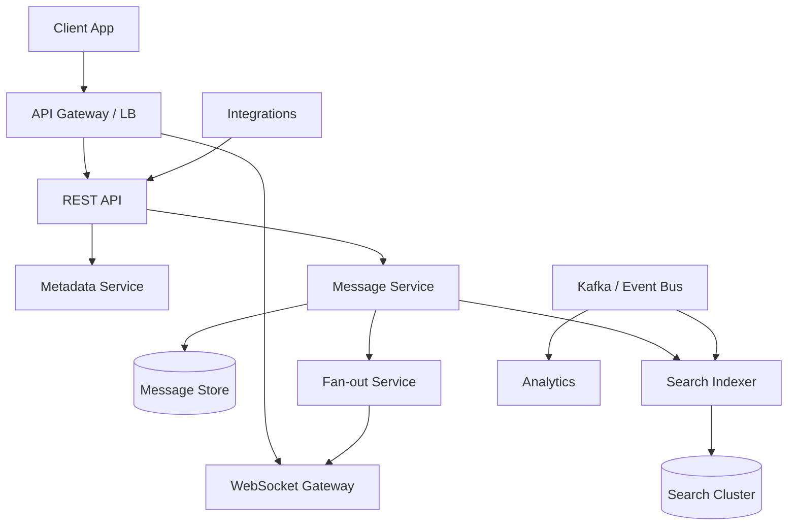
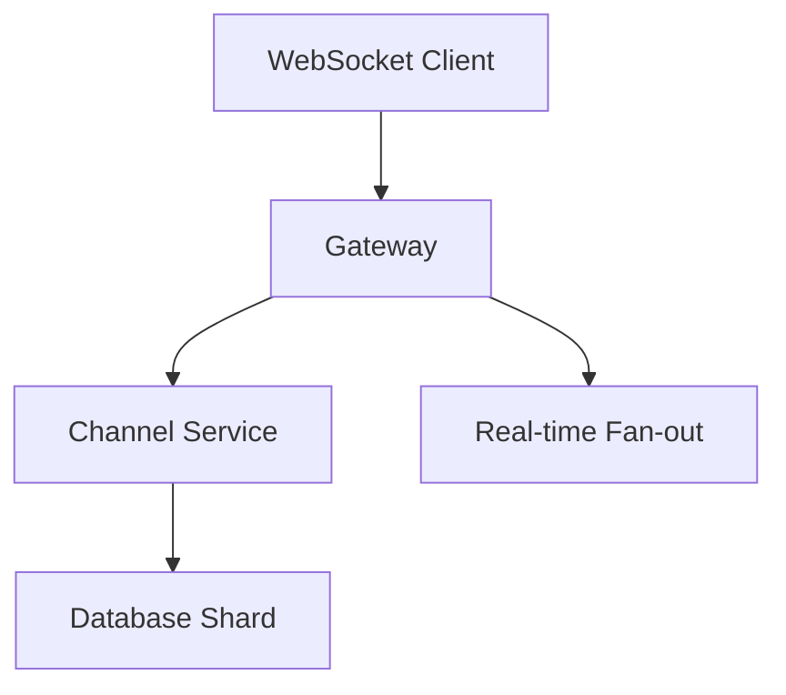

# Slack Enterprise Collaboration Platform

## 1. Business Context

Slack is an enterprise **team collaboration** platform combining persistent chat channels, direct messages, threads, file sharing, search, and a vast **integration ecosystem** (bots, workflows, third-party apps). Unlike consumer messaging apps optimized for 1:1 mobile chat, Slack's product surface targets **organized team communication** inside organizations: public channels for transparency, private channels for restricted topics, and shared context via links, files, and app notifications.

Business drivers include reducing email overload, centralizing operational alerts (CI/CD, monitoring, sales CRM), and enabling async work across time zones. Slack's architecture must satisfy **enterprise buyers**: SSO/SAML, data residency expectations, eDiscovery, audit logs, and contractual uptime SLAs. The 2021 acquisition by Salesforce further positioned Slack as a **workflow hub** within a broader enterprise CRM and automation portfolio.

For principal architects, Slack is a case study in **hybrid real-time and durable messaging**, **multi-tenant workspace isolation**, **search at message scale**, and **fan-out economics** in channels with thousands of members. Public engineering narratives reference sharded relational metadata (Vitess/MySQL patterns), caching layers, Kafka for event pipelines, and WebSocket gateways for push delivery—exact internal topology evolves; this chapter synthesizes **public sources** with generic chat-platform patterns from [Chat Platform](/docs/system-design/chat-platform).

Interview depth spans WebSocket connection scaling, per-channel ordering, integration webhook storms, and enterprise compliance boundaries—not merely "store messages in a database."

## 2. Scale

Slack operates at **hundreds of millions of registered users** and **millions of organizations** (verify current public figures). Peak load is bursty: Monday morning channel activity, incident response rooms during outages, and viral internal announcements in large enterprises.

| Dimension | Architectural implication |
|-----------|---------------------------|
| Messages/day | Billions; write-heavy with strong durability expectations |
| Workspaces | Hard multi-tenant boundary; metadata per org |
| Channel size | Small teams vs. company-wide channels (10k+ members) |
| Integrations | Webhook ingress can exceed human message rates |
| Search | Full-text over years of history per workspace |
| Connections | Millions of concurrent WebSocket sessions globally |

**Scale failure modes** at Slack-class systems: **hot channels** during incidents (write amplification on fan-out), **connection registry** pressure during mass reconnect after gateway deploy, **search index lag** making recent messages invisible, **integration storms** from misconfigured bots, and **shard hotspots** on metadata for mega-workspaces.

Principal analysis quantifies **online ratio** (what fraction of channel members need real-time push), **message size distribution** (short text vs. file attachments), and **read:write ratio** (history sync dominates mobile cold start).

## 3. Functional Requirements

| Capability | Mechanism |
|------------|-----------|
| Channels & DMs | Workspace-scoped namespaces; membership ACLs |
| Threads | Parent message anchor; reply sequence |
| Real-time delivery | WebSocket push to online clients |
| Offline / multi-device | Durable store + sync API with cursors |
| File attachments | Object storage + CDN; metadata in message |
| Search | Indexed message body and metadata |
| Integrations | Incoming webhooks, OAuth apps, Bot API |
| Presence & typing | Best-effort ephemeral signals |
| Enterprise SSO | SAML/OIDC; SCIM provisioning |
| Compliance | Export, retention policies, legal hold |
| Workflows | Workflow builder; scheduled triggers |

Slack is **not** only chat: the **platform API** turns Slack into an event bus for enterprises—architects must treat app traffic as first-class load, not edge case.

## 4. Non-Functional Requirements

| NFR | Typical target |
|-----|----------------|
| Delivery latency | p99 &lt; 500 ms for online recipients (product-class) |
| Durability | No message loss after server ACK |
| Availability | 99.99% class for messaging path |
| Multi-tenant isolation | Workspace data never crosses tenant boundary |
| Search freshness | Near-real-time index (seconds–minutes) |
| Security | Encryption in transit; enterprise key management options |

**Consistency** is nuanced: **per-channel (or per-conversation) ordering** is the usual guarantee—not global ordering across a workspace. Read receipts and presence are **eventually consistent**. Enterprise exports require **point-in-time** consistency snapshots—a different problem from live chat.

Link: [Message Delivery Semantics](/docs/messaging-and-streaming/message-delivery-semantics) for at-least-once vs exactly-once consumer design.

## 5. Architecture Overview

*Figure 1: Logical Slack-class architecture—durable write before fan-out ACK.*

**WebSocket gateways** maintain connection registries (user → gateway mapping), often sharded by user or workspace. **Sticky routing** or gateway affinity keeps reconnect paths predictable.

**Message service** assigns monotonic **sequence numbers per channel**, persists durably, then triggers delivery.

**Fan-out service** pushes to online subscribers; offline users rely on **push notifications** via [Notification Platform](/docs/system-design/notification-platform) patterns.

**Metadata service** holds workspaces, channels, users, permissions—typically relational with horizontal sharding.

**Search** is a derived index; not on the critical ACK path.

### 5.1 Write path invariant

Principal correctness rule: **durable write before ACK to sender**. The client must not receive `message_sent` until the message is persisted in the authoritative store (or replicated to a quorum). Fan-out to recipients can be asynchronous but loss after ACK is unacceptable—users trust Slack as a **system of record** for work communication.

### 5.2 Integration ingress path

Bots and webhooks hit REST endpoints that validate OAuth scopes and workspace context, then enqueue to the same message pipeline as human sends. Rate limits per app and per workspace prevent **noisy neighbor** integration from starving human chat.

## 6. Data Model

Core entities:

- **Workspace (team)**: tenant root; billing, policies, SSO config
- **User**: global identity; workspace membership via **Member**
- **Channel**: `C` prefix IDs; public/private; optional shared channels across workspaces
- **Message**: channel_id, user_id, text, blocks (rich layout), ts (timestamp sort key), thread_ts
- **Thread**: messages sharing `thread_ts` anchor
- **File**: object storage pointer + metadata
- **Reaction**: emoji on message; high cardinality edge data

**Message timestamp (`ts`)** often encodes microsecond-precision ordering within a channel—architects treat it as client-visible sequence, not wall-clock truth across channels.

**Block Kit** structured messages complicate search indexing (JSON payloads) and rendering pipelines.

### 6.1 Shared channels and org graph

Enterprise Grid introduces **multiple workspaces** under one organization with **shared channels** spanning workspace boundaries. Authorization becomes a graph problem: effective permissions union across linked workspaces. Metadata queries for "who can read this channel" must be cached carefully—permission changes are low frequency but high impact.

## 7. Partitioning and Sharding

Partition keys typically follow **workspace_id** or **channel_id** depending on service:

| Service | Partition strategy | Risk |
|---------|-------------------|------|
| Message store | channel_id | Hot channel during incidents |
| Metadata | workspace_id | Mega-enterprise workspace |
| Connection registry | user_id hash | Reconnect storms |
| Search index | workspace_id | Large workspace reindex |

**Hot channel mitigation**:

- Hybrid fan-out: push to online subset; pull for others
- Rate limit non-human posters in incident channels
- Separate **announcement channel** product patterns (read-optimized)

Link: [Distributed Caching](/docs/caching/distributed-caching) for caching membership lists and presence.

Vitess-style **sharded MySQL** (public Slack engineering references) splits relational metadata horizontally while preserving SQL semantics for complex permission queries—contrast with naive per-service micro-databases that complicate joins.

## 8. Replication

Message store replication provides **durability across AZs**. Exact protocol (single-leader per partition vs. quorum) is implementation-specific; architects assume **regional durability** with async cross-region for DR in enterprise tiers.

**Search replicas** lag primary ingestion; **Kafka** (or similar log) often forms the **changelog** between message store and search/analytics consumers—enabling replay after indexer bugs.

**Cache layers** (Memcached/Redis class) replicate for availability but are **not sources of truth**—cache miss must reconstruct from durable store.

See [Replication Overview](/docs/replication/overview) for leader-follower vs quorum framing.

## 9. Consistency

| Surface | Consistency |
|---------|-------------|
| Per-channel message order | Total order via sequence/ts |
| Cross-channel | No guarantee |
| Search | Eventual; bounded staleness |
| Presence / typing | Best-effort ephemeral |
| Permissions | Read-your-writes after ACL update (target) |
| File uploads | Strong after commit pointer in message |

**Multi-device sync** uses **cursor-based history APIs**: client supplies last seen sequence; server returns gap fill. Duplicate delivery on reconnect is handled client-side with message id deduplication—**at-least-once** push is normal.

Compare [Linearizability](/docs/consistency/linearizability): Slack does not offer linearizable reads across the entire workspace—nor should it at this scale.

## 10. Availability

**Regional deployment** with multi-AZ within region. WebSocket gateways are **stateful**—deployments use gradual rollouts and connection draining to avoid mass disconnect.

**Degradation modes**:

- Disable typing/presence under load
- Delay search freshness
- Throttle integration webhooks
- Read-only mode for metadata changes (rare; high severity)

**Chaos and game days** validate gateway failure, database failover, and Kafka consumer lag—see [Chaos Engineering](/docs/reliability-and-resilience/chaos-engineering).

Enterprise contracts may require **data residency** in EU—logical cell per region with federation at org admin layer, not global single table.

## 11. Failure Handling

| Failure | Handling |
|---------|----------|
| Gateway crash | Clients reconnect; another gateway; duplicate push OK |
| Message DB primary loss | Failover to replica; brief write pause |
| Fan-out backlog | Consumer lag; prioritize human over bot traffic |
| Search indexer stuck | Replay from Kafka offset |
| Integration loop | Circuit breaker per app_id |
| Shard hotspot | Emergency channel read-only; ops redirect |

**Incident channel dynamics**: during company-wide outages, thousands of users join `#incident` simultaneously—membership fan-out and connection subscribe storms overlap. Runbooks include **pre-provisioned incident infrastructure** and **feature flags** to reduce auxiliary traffic (link unfurling, analytics).

**Poison messages** (oversized blocks, malicious JSON) rejected at API validation before persistence.

## 12. Security

- **TLS** everywhere; [HTTP, TLS, and QUIC](/docs/networking/http-tls-and-quic) evolution for edge
- **OAuth 2.0** for apps; scoped tokens per workspace
- **SSO/SAML** for enterprise; session management at edge
- **EKM** (enterprise key management) options for encryption at rest
- **Audit logs** for admin actions; separate high-integrity store
- **SSRF** risks in link unfurling and webhook callbacks—sandbox fetches

Principal review: **shared channel** authorization, **guest accounts** with reduced permissions, **retention policies** vs. legal hold (deletion must not violate hold).

[Zero Trust Architecture](/docs/security/zero-trust-architecture) applies to internal service-to-service auth as Slack-scale companies adopt mTLS and service identity.

## 13. Observability

| Signal | Use |
|--------|-----|
| Message ACK latency | Core SLO |
| Fan-out queue lag | Delivery delays |
| WebSocket connection count | Capacity planning |
| Gateway CPU / FD usage | Stateful scaling |
| DB shard QPS skew | Hot tenant detection |
| Search indexing lag | Stale search incidents |
| Integration error rate per app | Noisy bot isolation |

**Distributed tracing** from API through message persist to fan-out—see [Distributed Tracing](/docs/observability/distributed-tracing). **Client-side metrics** (desktop/mobile) detect regional edge issues invisible server-side.

**Synthetic probes** post messages in canary workspaces every minute—catch end-to-end regressions before customer reports.

## 14. Cost Model

Major cost drivers:

- **Message storage** (years of retention per paying workspace)
- **Search index** size (often larger than raw text due to analyzers)
- **WebSocket gateway** fleet (always-on connections)
- **File storage** and CDN egress for attachments
- **Kafka** retention for analytics pipelines
- **Enterprise features** (compliance export compute)

**Cost levers**:

- Tiered retention policies (free vs. paid)
- Compression of cold message archives to object storage
- Efficient fan-out (don't push to 10k offline users)
- Integration rate limits reducing junk messages

[Cloud Cost Optimization](/docs/cost-and-finops/cloud-cost-optimization) frameworks apply when Slack-class workloads run on leased cloud vs. owned metal.

## 15. Evolution of Architecture

Public narrative arc (verify against current posts):

- Early: centralized DB → pain at scale
- **Vitess** sharding for MySQL metadata at scale
- Separation of **real-time** path from **search/analytics**
- **Enterprise Grid** multi-workspace org layer
- Workflow automation and platform expansion
- Mobile offline sync improvements

Architectural constant: **log-shaped ingestion** (Kafka) feeding derived systems while **OLTP path** stays lean.

Evolution pressure in 2025–2026: **AI features** (summaries, search answers) add GPU inference and RAG pipelines—new read paths without weakening durability invariants on write.

## 16. Important Tradeoffs

| Tradeoff | Detail |
|----------|--------|
| Fan-out on write vs read | Large channels favor hybrid |
| Rich messages vs search | Structured blocks harder to index |
| Real-time vs durability | ACK only after persist |
| Platform openness vs abuse | Integrations need rate limits |
| Global product vs data residency | Cell-based regions |
| Search freshness vs cost | Near-real-time indexing expensive |

**PACELC**: Under partition, Slack prioritizes **availability** of message accept and **latency** of delivery; **consistency** is scoped to per-channel order—not global.

## 17. Known Limitations

- Not a real-time **voice/video** primary platform (huddles exist but different media stack)
- Search not identical to OLTP truth at every instant
- **Guest** and **shared channel** permission complexity for admins
- Bot and workflow errors can spam channels—product + arch limits help but not eliminate
- Export and eDiscovery are **batch** processes—not live API paths

## 18. Interview Lessons

**Strong signals**:

- Durable write before ACK; per-channel sequence
- WebSocket scaling: registry, sticky sessions, reconnect storm
- Hybrid fan-out for 5k-member channel
- Workspace as tenancy boundary for sharding
- Integration traffic as DDoS surface

**Red flags**:

- "Use Firebase for Slack scale" without sharding plan
- Global message order across all channels
- Ignoring enterprise compliance and SSO

**Follow-up probes**: design `#incident` during AWS outage; compare Slack vs email for durability expectations; how thread replies avoid cross-thread ordering bugs.

## 19. Redesign Exercise

**Prompt**: Enterprise customer with 50k employees; `#all-company` channel; CEO post during town hall; 40k members online; must deliver &lt; 2 s p99 without dropping messages.

Design:

1. Channel partition and sequence service isolation from small channels
2. Fan-out: online subset push + async notification for mobile background
3. Gateway capacity model: connections, messages/sec per gateway
4. Rate limits on reactions during town hall (secondary storm)
5. Degradation: disable link previews first
6. Post-event: search index catch-up SLO

### Deep dive: WebSocket connection registry

Each gateway instance holds local connection maps; a **distributed registry** (Redis/Dynamo-style) maps `user_id → gateway_id` for cross-gateway fan-out when recipient connects elsewhere. On gateway failure, **mass reconnect** hits DNS/LB; use **jittered backoff** on clients to prevent **thundering herd**.

**Sticky sessions** via consistent hashing on user_id reduce cross-gateway chatter but complicate deploys—**gradual drain** required.

### Deep dive: thread consistency

Thread replies share parent `thread_ts` but have their own sub-sequence. **Main channel feed** shows parent messages; thread panel loads reply stream. Architects must prevent **reply appearing before parent** in thread view (parent always first) while parent channel shows "N replies" count **eventually updated**.

### Interview scoring rubric (principal)

| Dimension | Weight | Strong signal |
|-----------|--------|---------------|
| Durability / ACK | 25% | Persist before ACK explicit |
| Fan-out economics | 25% | Hybrid model for megachannel |
| Stateful scaling | 20% | WebSocket registry mechanics |
| Enterprise | 15% | SSO, residency, export |
| Operability | 15% | SLOs, integration limits |

## Supplementary Diagram

*Figure: Slack message path — gateway, sharding, and fan-out.*

## 20. References

- Slack Engineering Blog (public posts on scaling, Vitess, infrastructure)
- Chang et al., "Virtual Channels" and Slack platform documentation
- [Chat Platform](/docs/system-design/chat-platform)
- [Notification Platform](/docs/system-design/notification-platform)
- [Message Delivery Semantics](/docs/messaging-and-streaming/message-delivery-semantics)
- [Resilience Patterns](/docs/microservices/resilience-patterns)
- [Event-Driven Architecture](/docs/messaging-and-streaming/event-driven-architecture)

### Appendix: Slack vs consumer chat

| Dimension | Slack | WhatsApp-class |
|-----------|-------|----------------|
| Tenancy | Workspace/org | Phone-centric |
| Channel size | Thousands | Small groups |
| Integrations | Core product | Secondary |
| Search | Enterprise-critical | Variable |
| Compliance | eDiscovery, hold | E2E focus |

### Appendix: principal question bank

1. Design message storage for 10-year retention with legal hold.
2. Bot posts 10k msgs/min—isolate without banning all integrations.
3. Cross-region workspaceDR—what consistency does user see?
4. Why Vitess/sharded SQL vs Cassandra for metadata?
5. Add AI summary feature—where in architecture without blocking ACK path?

Each tests **mechanism + tradeoffs**, not product trivia.
