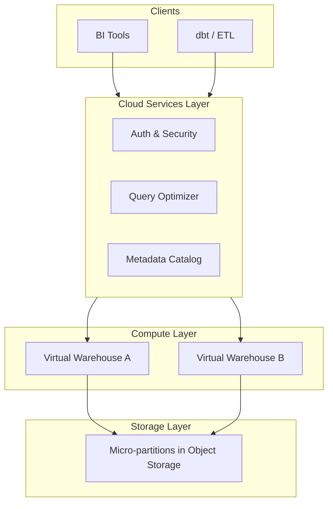
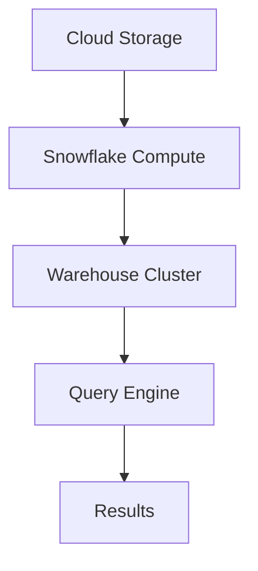

# Snowflake Data Cloud at Scale

## 1. Business Context

Snowflake is a cloud-native **analytical data warehouse** delivered as a managed service, built on the architectural insight that **storage**, **compute**, and **metadata services** can be disaggregated and scaled independently. Enterprises adopt Snowflake to consolidate fragmented data marts, accelerate BI and ELT workloads, enable secure data sharing across business units and partners, and reduce operational burden compared to self-managed Hadoop or rigid on-prem warehouses.

The business value proposition is **elastic analytics**: spin up compute for month-end reporting, suspend warehouses overnight, clone production data for sandbox testing without duplicating storage, and query semi-structured JSON alongside relational tables. Snowflake targets **SQL practitioners** and **data engineers**—not OLTP application hot paths.

For principal architects, Snowflake exemplifies **FinOps-as-architecture**: credit consumption, warehouse sizing, multi-cluster policies, and time-travel retention are design decisions with direct P&L impact. Interview and production discussions center on micro-partition pruning, workload isolation via virtual warehouses, Snowpipe ingest patterns, and when Snowflake loses to BigQuery, Redshift, or a lakehouse engine like Databricks.

See [Snowflake Architecture](/docs/distributed-databases/snowflake-architecture) and [Data Lakehouse Architecture](/docs/data-platforms/data-lakehouse-architecture).

## 2. Scale

Snowflake scales to **petabyte-scale** storage in customer accounts with **independent virtual warehouses (VWs)** executing queries in parallel. Concurrency and query performance depend on **warehouse size**, **multi-cluster configuration**, and **micro-partition pruning**—not a single "max QPS" figure.

**Order-of-magnitude framing** (verify current Snowflake documentation):

| Dimension | Scale consideration |
|-----------|---------------------|
| Storage | Compressed micro-partitions in cloud object storage |
| Compute | XS to 6X-Large warehouses; multi-cluster auto-scale |
| Concurrent queries | Queued when warehouse saturated |
| Ingest | Bulk load via stages; Snowpipe for continuous |
| Data sharing | Metadata pointers without physical copy |
| Time travel | Retention days drive storage cost |

Scale failures appear as **credit burn spikes**, **query queues** during BI peak hours, **full table scans** from poor clustering, or **runaway time travel** storage—not inability to store petabytes.

## 3. Functional Requirements

Snowflake must support:

| Capability | Mechanism |
|------------|-----------|
| SQL analytics | Cloud services optimizer + VW execution |
| Semi-structured data | VARIANT, OBJECT, ARRAY types |
| Bulk load | COPY INTO from staged files |
| Continuous ingest | Snowpipe from cloud events |
| Transactions | ACID on tables (metadata-coordinated) |
| Zero-copy clone | Metadata-only duplication |
| Time travel | Historical query within retention |
| Fail-safe | Additional recovery window post time travel |
| Secure data sharing | Cross-account read access |
| External tables | Query data lake files in place |
| Streams & tasks | CDC and scheduled SQL |

**Workload discipline**: OLTP row-by-row updates are anti-patterns; batch and append-heavy patterns fit the engine.

## 4. Non-Functional Requirements

| NFR | Target / behavior |
|-----|-------------------|
| Query latency | Seconds to minutes for analytics— not ms OLTP |
| Elasticity | Scale warehouses up/down; auto-suspend |
| Durability | Replicated storage; fail-safe recovery |
| Isolation | Separate VWs per workload class |
| Security | RBAC, masking, row access policies |
| Compliance | SOC2, HIPAA options—verify current attestations |

**Consistency**: ACID within transactions; readers see committed state—distinct from global OLTP linearizability. See [ACID and Isolation](/docs/transactions/acid-and-isolation).

## 5. Architecture Overview



*Figure 1: Three-layer separation—clients interact with cloud services; VWs execute against shared storage.*

**Cloud services layer**: authentication, query parsing, optimization, transaction coordination, infrastructure management.

**Compute layer**: ephemeral MPP clusters (virtual warehouses) billed in **credits**.

**Storage layer**: immutable **micro-partitions** (~50–500 MB compressed columnar objects) with rich per-partition metadata for pruning.

Link [Stream and Batch Processing](/docs/data-platforms/stream-and-batch-processing) for ingest pipeline patterns.

## 6. Data Model

Snowflake schemas follow dimensional modeling, normalized staging, or **medallion** lakehouse layers (bronze/silver/gold):

```sql
CREATE TABLE events (
  event_id STRING,
  user_id STRING,
  event_type STRING,
  payload VARIANT,
  event_ts TIMESTAMP_NTZ
);
```

**Clustering keys** (or automatic clustering service) co-locate related rows in micro-partitions for pruning—distinct from traditional static partitions.

**VARIANT** enables schema-on-read for JSON logs; consider flattening hot paths for performance.

**Secure views** and **row access policies** enforce multi-tenant analytics governance per [Data Governance and Lineage](/docs/data-platforms/data-governance-and-lineage).

### 6.1 Medallion architecture alignment

Bronze tables ingest raw files; silver applies cleansing; gold serves BI. Each layer can use **separate virtual warehouses** so heavy ELT does not starve dashboards.

## 7. Partitioning

Snowflake uses **automatic micro-partitions** created on load—no explicit `PARTITION BY` like Hive. Pruning depends on:

| Mechanism | Purpose |
|-----------|---------|
| Micro-partition metadata | Min/max stats per column per partition |
| Clustering key | Co-locate related rows over time |
| Automatic clustering | Background reorganization (credit cost) |
| Search optimization | Point lookup acceleration (select workloads) |

**Poor pruning symptoms**: full table scans, high bytes scanned metrics, long-running queries.

**Mitigations**: filter on high-cardinality columns loaded in sort order; redefine clustering key; pre-aggregate into mart tables.

## 8. Replication

Snowflake storage is **durable and replicated** within the cloud provider region (implementation managed by Snowflake). **Replication** features (account replication, failover) support **disaster recovery** and multi-region accounts—verify current product docs for RPO/RTO claims.

**Zero-copy clone** replicates metadata pointers—clones share underlying micro-partitions until diverging writes.

**Data sharing** provides read-only cross-account access without physical data movement—governance via share contracts.

See [Disaster Recovery and Multi-Region](/docs/reliability-and-resilience/disaster-recovery-and-multi-region).

## 9. Consistency

| Operation | Semantics |
|-----------|-----------|
| Single-table DML transaction | ACID committed |
| Multi-statement transaction | Supported within session |
| Concurrent writers | Metadata service serializes conflicts |
| Streams (CDC) | Change tracking offset semantics |
| External tables | Consistency of underlying object store listings |

Snowflake is **not** a linearizable global row store. Architects do not use it for inventory decrement concurrent with OLTP—use operational DB + ELT into Snowflake.

Contrast [Eventual Consistency](/docs/consistency/eventual-consistency) in ingest pipelines feeding Snowflake.

## 10. Availability

Snowflake is a managed SaaS—customers rely on Snowflake's regional availability and SLAs. Client-visible issues:

- **Warehouse queueing**: insufficient compute—scale warehouse or multi-cluster
- **Cloud provider outage**: regional impairment—DR replication if configured
- **Account suspension**: billing or policy—operational not technical

**Multi-cluster warehouses** add clusters during concurrency spikes—trade credits for queue reduction.

## 11. Failure Handling

| Failure | Response |
|---------|----------|
| Query timeout | Optimize SQL; increase warehouse; prune partitions |
| Warehouse queue | Scale up; separate workloads |
| Failed pipe ingest | Snowpipe error notifications; dead letter stages |
| Transaction conflict | Retry batch job |
| Runaway spend | Resource monitors; hard suspend |
| Accidental DROP | Time travel UNDROP within retention |

**Idempotent loads**: use `MERGE` or staged deduplication keys—[Idempotency](/docs/distributed-systems-foundations/idempotency).

**Pipeline failures** should trigger alerts per [Observability Fundamentals](/docs/observability/observability-fundamentals).

## 12. Security

- **RBAC**: roles, grants, role hierarchy
- **Network policies**: IP allowlists
- **Private Link**: cloud-private connectivity
- **Encryption**: at rest and in transit; Tri-Secret Secure option
- **Masking policies**: dynamic data masking
- **Row access policies**: tenant isolation in shared tables
- **Audit**: access history views

Principal review: separation of duties (admin vs analyst), share agreements with external partners, and classification of PII in VARIANT fields.

See [Security Architecture Fundamentals](/docs/security/security-architecture-fundamentals).

## 13. Observability

| Signal | Source |
|--------|--------|
| Query history | `QUERY_HISTORY` views |
| Credits used | `WAREHOUSE_METERING_HISTORY` |
| Bytes scanned | Query profile—pruning effectiveness |
| Pipe status | `COPY_HISTORY`, pipe notifications |
| Storage growth | Table/storage usage views |
| Query tags | Cost chargeback by team |

**Query profiling**: identify spilling to remote storage—warehouse undersized.

**SLO design**: p95 query completion for dashboard tier; monthly credit budget—[SLO, SLI, and Error Budgets](/docs/reliability-and-resilience/slo-sli-error-budgets).

## 14. Cost Model

| Driver | Notes |
|--------|-------|
| Virtual warehouse uptime | Credits per second by size |
| Storage | Monthly per TB (active + time travel + fail-safe) |
| Serverless features | Snowpipe, automatic clustering, search optimization |
| Data transfer | Egress to clients or other clouds |
| Replication | Additional account costs |

**Cost optimization**:

- Auto-suspend warehouses (e.g., 1–5 minutes idle)
- Right-size warehouses—bigger is not always faster (diminishing returns)
- Resource monitors with hard caps per [Cloud Cost Optimization](/docs/cost-and-finops/cloud-cost-optimization)
- Reduce time travel retention where compliance allows
- Materialized views for repeated expensive aggregates
- Query tags for chargeback to business units

Principal architects treat **credit anomalies** as incidents requiring postmortems.

## 15. Evolution of Architecture

**Lineage**: Traditional MPP appliances → cloud storage cheapening → Snowflake founding (2012) → separation of storage/compute patent narrative → data cloud positioning with marketplace and native apps.

Notable product evolution (verify announcements):

- Multi-cluster warehouses
- Snowpark (Python/Java/Scala in-engine)
- Iceberg external tables interoperability
- Cortex AI functions
- Horizon governance branding

Industry impact: forced competitors toward **disaggregated warehouse** designs; normalized **FinOps** literacy among data teams.

## 16. Important Tradeoffs

| Choice | Benefit | Cost |
|--------|---------|------|
| Separate VWs per workload | Isolation | More idle credit risk without auto-suspend |
| Larger warehouse | Faster single query | Higher $/second |
| Multi-cluster | Concurrency | Credit multiplication |
| Long time travel | Recovery window | Storage $ |
| Zero-copy clone | Instant env copy | Shared lineage complexity |
| VARIANT vs flattened | Flexibility | Query performance |
| vs BigQuery | Different pricing model | Vendor comparison needed |
| vs lakehouse Spark | Managed SQL | Less code flexibility for some ML |

## 17. Known Limitations

- Not for high-frequency OLTP or sub-second keyed lookups at massive QPS
- Costs can spike unpredictably without governance
- Vendor-specific SQL extensions reduce portability
- Very small queries still incur warehouse startup latency if suspended
- Streaming analytics at lowest latency may need complementary systems (Kafka, Flink)
- Deep ML training often better on Spark/GPU clusters—Snowpark has bounds

## 18. Interview Lessons

**Strong candidates**:

- Draw three-layer architecture from memory
- Explain micro-partition pruning with min/max metadata
- Size warehouses for ETL vs BI concurrency separately
- Describe zero-copy clone and time travel tradeoffs
- Articulate FinOps controls (resource monitors, tags)

**Follow-ups**:

- How does Snowflake compare to Databricks for this workload?
- Design ingest from Kafka to Snowflake
- Customer reports 3× credit bill—debug approach?

**Red flags**:

- "Snowflake replaces operational databases"
- No mention of bytes scanned or warehouse queues
- Ignoring auto-suspend

See [Snowflake and Databricks Interview Preparation](/docs/company-specific-preparation/snowflake-databricks).

### Interview scoring rubric (principal)

| Dimension | Weight | Strong signal |
|-----------|--------|---------------|
| Architecture layers | 20% | Storage/compute/services separation |
| Pruning / clustering | 25% | Bytes scanned reasoning |
| FinOps | 25% | Warehouses, monitors, tags |
| Workload fit | 15% | OLTP vs analytics boundary |
| DR / sharing | 15% | Clone, time travel, secure share |

## 19. Redesign Exercise

**Prompt**: A retailer runs all analytics (ETL, BI dashboards, data science ad hoc SQL) on one `LARGE` warehouse 24/7. Month-end ETL causes dashboard timeouts; credits doubled last quarter.

**Tasks**:

1. Propose warehouse topology (ETL, BI, ad hoc) with auto-suspend.
2. Identify why shared warehouse causes queueing.
3. Add resource monitors and query tags for chargeback.
4. Recommend clustering key for `sales_fact` filtered by `sale_date` and `region`.
5. Estimate qualitative credit savings—not invented precise dollars.

**Evaluation rubric**: workload isolation (30%), pruning/clustering (25%), FinOps (25%), governance (20%).

### Deep dive: Snowpipe ingest

Cloud storage events trigger Snowpipe serverless loads—decouples ingest compute from warehouse billing. Architects define **file sizing**, **error handling**, and **deduplication** for at-least-once file delivery.

### Deep dive: stream-task pattern

`STREAM` on staging table + `TASK` scheduled `MERGE` into fact table implements incremental ELT without external orchestrator—for moderate complexity pipelines.

### Deep dive: debugging 3× credit bill

1. Query `WAREHOUSE_METERING_HISTORY` grouped by warehouse and week.
2. Join `QUERY_HISTORY` on warehouse—find top bytes scanned and longest runners.
3. Check auto-suspend disabled or suspend timeout too high.
4. Identify new automatic clustering or search optimization spend.
5. Present findings to domain owners with query tags—tie spend to team.

## Supplementary Diagram


*Figure: Snowflake storage/compute separation architecture.*

## 20. References

- Snowflake architecture whitepapers and official documentation
- [Snowflake Architecture](/docs/distributed-databases/snowflake-architecture)
- [Data Lakehouse Architecture](/docs/data-platforms/data-lakehouse-architecture)
- [Stream and Batch Processing](/docs/data-platforms/stream-and-batch-processing)
- [Cloud Cost Optimization](/docs/cost-and-finops/cloud-cost-optimization)
- [Snowflake and Databricks Interview Preparation](/docs/company-specific-preparation/snowflake-databricks)
- Armbrust et al., "Above the Clouds: A Berkeley View of Cloud Computing" (context)

### Appendix: Snowflake vs operational stores

| Requirement | Snowflake | OLTP (Spanner, PostgreSQL) |
|-------------|-----------|----------------------------|
| Row-level updates at 10k RPS | Poor fit | Strong fit |
| Petabyte scan analytics | Strong fit | Poor fit |
| Sub-second BI on aggregates | Strong with tuning | Not primary use |
| Cross-row ACID at scale | Batch scope | Native |

Principal architects position Snowflake as **analytics system of record** fed by operational systems via CDC—not a dual-write replacement for OLTP.

### Appendix: Kafka to Snowflake ingest

Common pattern: Kafka → stream processor (Flink, Kafka Connect) → staged files in object storage → Snowpipe or `COPY INTO` → bronze table → dbt silver/gold.

Architects document **latency budget** (minutes acceptable for analytics), **schema registry** for Avro/Protobuf evolution, and **deduplication keys** in `MERGE` because Kafka delivery is at-least-once. Link [Kafka Architecture](/docs/messaging-and-streaming/kafka-architecture) for offset and consumer group semantics.

Do not run Kafka consumers directly on virtual warehouses for high-volume ingest—separate ingest compute from query warehouses.

### Appendix: dbt workload patterns on Snowflake

| Pattern | Warehouse | Rationale |
|---------|-----------|-----------|
| `dbt run` nightly ELT | `WH_ETL` MEDIUM | Predictable batch window |
| `dbt test` post-run | Same or smaller WH | Short duration |
| BI tool queries | `WH_BI` SMALL multi-cluster | Concurrency isolation |
| CI ephemeral PR schemas | `WH_CI` X-SMALL auto-suspend 60s | Cost cap |

Use zero-copy clone of production gold layer for CI validation—not full production warehouse. Tag dbt queries with `query_tag` for lineage alignment with [Data Governance and Lineage](/docs/data-platforms/data-governance-and-lineage).

### Appendix: external tables and lakehouse federation

**External tables** query Parquet, Iceberg, or Delta files in customer object storage without loading into native micro-partitions first. Benefits: single copy of data in the lake, interoperability with Spark pipelines. Tradeoffs: query performance may lag native tables without careful file layout; metadata refresh lag when underlying files change.

Architects define **refresh policies** for external table metadata and **partition columns** matching lake directory structure (`year/month/day`). For hot BI paths, materialize into native Snowflake tables via incremental `COPY` or `MERGE`. Iceberg interoperability (product evolution—verify docs) blurs warehouse/lakehouse boundary—principal interviews compare **open table format governance** vs Snowflake-native storage per [Data Lakehouse Architecture](/docs/data-platforms/data-lakehouse-architecture).

### Appendix: secure data sharing governance

Cross-account **secure shares** expose live data without copy—revoke instantly when partnership ends. Architects document **consumer responsibilities** (no re-export), **row access policies** on shared views, and **audit** via access history on both provider and consumer accounts. Shares are not backups—provider outage affects consumers; define contractual SLAs separately from Snowflake platform SLA.
