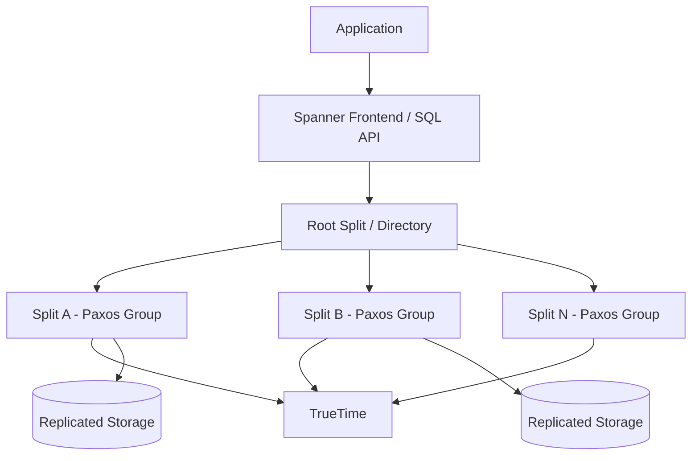
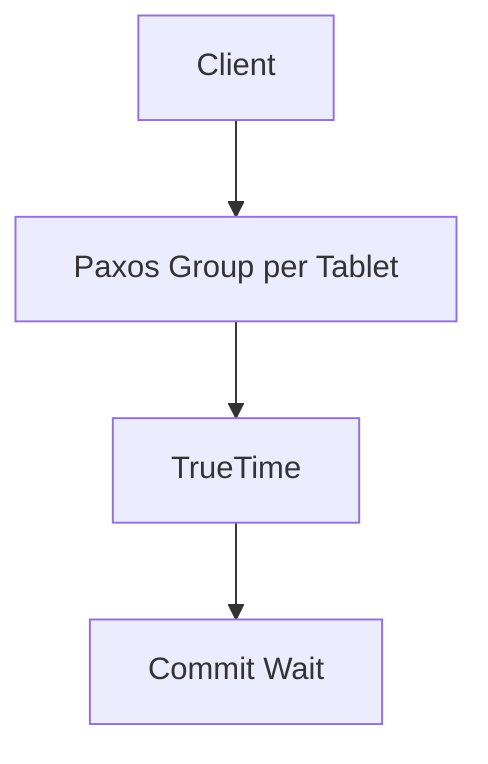

# Google Cloud Spanner at Scale

## 1. Business Context

Google Cloud Spanner is a globally distributed, horizontally scalable **relational database** that offers SQL semantics with **externally consistent** transactions across regions. It originated from Google's internal Spanner system (Corbett et al., OSDI 2012) and represents a product bet that many enterprise workloads—financial ledgers, global inventory, identity graphs, metadata catalogs—require **strong consistency** without surrendering horizontal scale or familiar SQL.

Organizations adopt Spanner when regional databases create reconciliation nightmares: duplicate order IDs across regions, inventory oversell during partition events, or compliance mandates for **read-your-writes** and **serializable** isolation globally. The business value is **correctness at scale** and reduced application complexity—fewer compensating transactions, fewer idempotent merge jobs, fewer "eventual consistency" caveats in customer contracts.

For principal architects, Spanner is the canonical case study in **infrastructure-enabled consistency**: TrueTime (bounded clock uncertainty) plus Paxos-replicated shards plus cross-shard two-phase commit (2PC) is not a pattern you replicate on commodity NTP alone. Interview and production discussions center on when global strong consistency justifies latency and cost premiums, how to model hot rows, and how Spanner compares to CockroachDB, Aurora Global Database, and regional OLTP with async replication.

See the in-repo chapter [Google Spanner](/docs/distributed-databases/google-spanner) for mechanism depth, and [Physical and Logical Time](/docs/time-ordering-and-coordination/physical-and-logical-time) for clock foundations.

## 2. Scale

Spanner targets **planet-scale OLTP** with automatic sharding (splits/merges), multi-region configurations, and managed operations on Google Cloud. Public materials describe internal Google usage at very large scale; customer-visible scale is bounded by **shard design**, **hot keys**, and **cross-region transaction fan-out** rather than a single advertised "max QPS" number—always validate against your workload in proof-of-concept benchmarks.

**Order-of-magnitude framing** (verify current Cloud Spanner quotas and pricing):

| Dimension | Scale consideration |
|-----------|---------------------|
| Database size | Grows via automatic splits; storage billed per GB-month |
| Throughput | Per-node processing units (PUs) or processing units in autoscaling configs |
| Hot row | Single-row updates serialize through Paxos leader—throughput ceiling |
| Cross-region writes | 2PC + commit wait adds RTT and clock uncertainty latency |
| Read scaling | Read-only replicas and stale reads (bounded staleness) reduce load on leaders |
| Schema | Online DDL supported (product evolution—verify docs) |

Scale failures in production are rarely "Spanner cannot store our data" and more often **a poorly chosen primary key** concentrates traffic on one split, or **cross-shard transactions** on every request inflate latency and abort rates. Principal-level analysis quantifies access patterns, transaction boundaries, and regional placement before migration.

## 3. Functional Requirements

Spanner must support:

| Capability | Mechanism |
|------------|-----------|
| SQL queries | Distributed query processor with statistics |
| Primary and secondary indexes | Global or per-index interleaving options |
| Serializable transactions | Locking + timestamps + 2PC across shards |
| Externally consistent reads/writes | TrueTime commit wait |
| Horizontal scale | Automatic split/merge of ranges |
| Multi-region durability | Geo-replicated Paxos groups per split |
| Online schema changes | Managed DDL (product feature set) |
| Change streams | Product feature for CDC-style consumption |
| Backup / PITR | Managed backup offerings (verify docs) |

**Access pattern discipline** remains critical: secondary indexes and joins have cost; architects model **interleaved tables** to colocate parent-child rows in the same split when access is hierarchical.

## 4. Non-Functional Requirements

| NFR | Target / behavior |
|-----|-------------------|
| Consistency | Serializable; external consistency with TrueTime assumptions |
| Latency | Cross-region writes higher than single-region; commit wait adds ε-bound delay |
| Availability | Regional and multi-region SLAs per Google Cloud (see current SLA docs) |
| Durability | Synchronous replication within Paxos quorum before ack |
| Security | IAM, CMEK, VPC-SC, audit logs |
| Operability | Fully managed—no manual shard routing by customers |

**Safety vs liveness:** Under clock or quorum loss, progress may stall rather than violate consistency—architects document degradation modes per [Safety and Liveness](/docs/distributed-systems-foundations/safety-and-liveness).

## 5. Architecture Overview



*Figure 1: Logical path—SQL frontend routes to splits; each split is a Paxos-replicated shard.*

**Control plane** (Google-managed): split boundaries, replica placement, Paxos membership, TrueTime infrastructure.

**Data plane**: Reads and writes routed to split leaders; cross-split transactions use a **2PC coordinator** per [Two-Phase Commit](/docs/transactions/two-phase-commit).

**TrueTime**: GPS and atomic clocks in Google data centers provide `TT.now()` intervals with bounded uncertainty ε; **commit wait** ensures external consistency.

Contrast with [Paxos](/docs/consensus/paxos): each split is a Paxos group; Spanner composes many Paxos groups with 2PC for distributed transactions.

## 6. Data Model

Spanner uses relational schemas with:

- **Primary keys** that influence split boundaries (avoid monotonic inserts on hot leading key)
- **Interleaved tables** for parent-child locality (e.g., `Users` interleaved with `Orders`)
- **Secondary indexes** as separate distributed structures with write amplification

Example e-commerce interleaving:

```sql
CREATE TABLE Users (
  UserId INT64 NOT NULL,
  Name STRING(100),
) PRIMARY KEY (UserId);

CREATE TABLE Orders (
  UserId INT64 NOT NULL,
  OrderId INT64 NOT NULL,
  Total NUMERIC,
) PRIMARY KEY (UserId, OrderId),
  INTERLEAVE IN PARENT Users ON DELETE CASCADE;
```

**Hot row risk**: a global counter on a single row becomes a serial bottleneck. Prefer sharded counters, aggregate tables, or external stream processing for extreme increment rates.

Link: [ACID and Isolation](/docs/transactions/acid-and-isolation) for isolation level vocabulary in interviews.

## 7. Partitioning

Spanner **automatically partitions** data into splits based on size and load. Architects influence partitioning via:

| Technique | Use when |
|-----------|----------|
| Hash or UUID leading keys | Even spread for high-ingest tables |
| Avoid timestamp-leading PK | Prevents split hot spots on sequential inserts |
| Interleaving | Parent-child queries stay single-split |
| Regional instance config | Data residency; lower latency for regional workloads |

**Split hot spots** manifest as elevated latency on specific keys, transaction abort storms, or CPU saturation on one Paxos leader. Mitigations include key redesign, batching writes, or moving hot aggregates to [Apache Kafka](/docs/distributed-databases/apache-kafka) with periodic rollup.

## 8. Replication

Each split is replicated via **Paxos** across replicas configured by instance topology (regional, dual-region, multi-region). Writes commit after a quorum of replicas acknowledge the log entry—**synchronous** within the replication group.

**Multi-region configurations** place replicas in distinct geographic locations; read-write transactions may coordinate across regions when data spans splits in different locations.

**Read-only replicas** (product feature) serve stale or bounded-staleness reads without loading leaders—useful for analytics-adjacent read patterns that tolerate seconds of lag.

See [Primary-Secondary Replication](/docs/replication/primary-secondary-replication) for contrast with async replica models.

## 9. Consistency

| Guarantee | Mechanism |
|-----------|-----------|
| Serializability | Transaction scheduling + locks + timestamps |
| External consistency | TrueTime timestamps + commit wait |
| Linearizability (per object) | Stronger than serializability alone; Spanner's external consistency aligns real-time order with transaction order when clocks behave |
| Bounded staleness reads | Product option trading freshness for latency |
| Read-only transactions | Snapshot timestamp without write locks |

**Commit wait rule** (paper): transaction commits at timestamp `t` only after `TT.now().earliest > t`, ensuring no subsequent transaction receives an earlier timestamp that could violate external order.

**Not offered**: cross-cloud active-active with arbitrary merge semantics; Spanner is a single managed system with Google-controlled TrueTime.

Deep dive: [Linearizability](/docs/consistency/linearizability) and [Sequential Consistency](/docs/consistency/sequential-consistency).

## 10. Availability

Spanner targets high availability via Paxos leader election per split. Client-visible failure modes:

- **Leader loss**: brief failover within Paxos group
- **Regional outage**: depends on replica placement; multi-region configs survive single-region loss
- **Transaction aborts**: contention or 2PC participant timeout—application retries required
- **Clock infrastructure issues**: rare but can affect commit wait progress (Google-operated)

**PACELC** framing per [PACELC](/docs/consistency/pacelc): Spanner chooses **consistency and latency** (commit wait) over raw write latency when partitions are rare; under partition, Paxos quorums preserve safety.

## 11. Failure Handling

| Failure | Response |
|---------|----------|
| Transaction abort (ABORTED) | Idempotent retry with backoff |
| 2PC coordinator failure | Spanner recovery protocol (managed) |
| Hot key contention | Schema redesign; partition workload |
| Split overload | Automatic split; may lag sudden spikes |
| Clock uncertainty spike | Increased commit wait latency |
| Client timeout | Unknown commit—use idempotency tokens |

**Idempotency** is mandatory for retried transactions—see [Idempotency](/docs/distributed-systems-foundations/idempotency).

**Partial failure** across microservices calling Spanner requires sagas or outbox patterns per [Transactional Outbox](/docs/transactions/transactional-outbox) when combining with message buses.

## 12. Security

- **Cloud IAM** for instance and database administration
- **Fine-grained access**: database roles, row-level security patterns (application or policy layers)
- **Encryption**: Google-managed or customer-managed keys (CMEK)
- **VPC Service Controls** perimeter for exfiltration resistance
- **Audit logs** for admin and data access (product capabilities—verify docs)

Principal review questions: least privilege per service account, key rotation, separation of prod/stage instances, and PII handling in change streams.

See [Security Architecture Fundamentals](/docs/security/security-architecture-fundamentals).

## 13. Observability

| Signal | Source |
|--------|--------|
| Query latency | Cloud Monitoring metrics |
| CPU / storage per node | Instance dashboards |
| Transaction abort rate | Key indicator of contention |
| Lock wait time | Hot row diagnosis |
| Split heat | Google-provided heat maps (product) |

**Distributed tracing**: OpenTelemetry integration for end-to-end latency attribution—link [Distributed Tracing](/docs/observability/distributed-tracing).

**SLO design**: Define SLIs on successful read/write p99 and abort rate—see [SLO, SLI, and Error Budgets](/docs/reliability-and-resilience/slo-sli-error-budgets).

## 14. Cost Model

| Driver | Notes |
|--------|-------|
| Nodes / processing units | Largest compute cost |
| Storage | Per GB-month |
| Network egress | Cross-region replication and client egress |
| Backup storage | Retention policies |
| Multi-region premium | Higher than single-region |

**Cost optimization**:

- Right-size instance nodes; use autoscaling where appropriate
- Prefer regional deployments when global consistency is unnecessary
- Use bounded staleness reads for read-heavy dashboards
- Export cold analytics to BigQuery rather than heavy OLAP on Spanner

FinOps linkage: [Cloud Cost Optimization](/docs/cost-and-finops/cloud-cost-optimization).

## 15. Evolution of Architecture

**Lineage**: Bigtable (wide-column) + Megastore (entity groups) → Spanner paper (2012) → Cloud Spanner product.

Notable evolution (verify dates in Google announcements):

- PostgreSQL dialect compatibility layer
- Change streams for CDC
- Autoscaling processing units
- Dual-region and multi-region SLA tiers
- Graph and full-text features (product roadmap—verify)

Architecturally, Spanner influenced **CockroachDB** (Hybrid Logical Clocks instead of TrueTime) and enterprise thinking about **global SQL**. The industry learned that **clock infrastructure** is not optional for external consistency at scale.

## 16. Important Tradeoffs

| Choice | Benefit | Cost |
|--------|---------|------|
| Multi-region Spanner | Survive region loss; global consistency | Latency; cost; commit wait |
| Regional Spanner | Lower latency; simpler | No cross-region synchronous semantics |
| Interleaved schema | Efficient parent-child reads | Rigidity; migration complexity |
| Cross-shard transactions | Application simplicity | 2PC latency and abort rate |
| Strong reads everywhere | Correctness | Higher latency than stale reads |
| vs DynamoDB/Cassandra | SQL + serializable | Higher cost; not tunable AP mode |

**When Spanner wins**: global financial metadata, inventory with strict invariants, identity systems requiring serializable updates.

**When Spanner loses**: edge caching, write-heavy telemetry at lowest cost, arbitrary multi-master without coordination.

## 17. Known Limitations

- **Cost** premium vs regional open-source or NoSQL alternatives
- **Latency floor** from commit wait and cross-region 2PC
- **Hot row** throughput limits on single keys
- **Vendor lock-in** to Google Cloud and TrueTime-dependent semantics
- **Not a data warehouse**—OLAP belongs in BigQuery or lakehouse per [Data Lakehouse Architecture](/docs/data-platforms/data-lakehouse-architecture)
- **Clock trust boundary**—external consistency assumes TrueTime behavior

## 18. Interview Lessons

**Strong candidates**:

- Explain TrueTime interval, ε, and commit wait without hand-waving
- Contrast serializability vs external consistency vs linearizability
- Walk through cross-shard transaction with 2PC coordinator
- Design schema avoiding hot UUID-less counters
- Compare Spanner vs CockroachDB clock approaches

**Follow-ups**:

- What happens if GPS fails in one datacenter?
- How would you migrate from PostgreSQL with minimal downtime?
- When is Aurora Global Database sufficient?

**Red flags**:

- "Spanner uses NTP so we can build the same thing anywhere"
- Ignoring transaction abort retries
- Using Spanner as analytics warehouse

### Interview scoring rubric (principal)

| Dimension | Weight | Strong signal |
|-----------|--------|---------------|
| TrueTime / commit wait | 25% | Explains ε and external consistency |
| Schema / hot keys | 25% | Interleaving; sharded counters |
| Cross-shard 2PC | 20% | Abort retry; idempotency |
| Cost / placement | 15% | Regional vs multi-region justification |
| Alternatives | 15% | Cockroach, Aurora, DynamoDB contrast |

## 19. Redesign Exercise

**Prompt**: A global bank stores account balances in Spanner. A marketing campaign triggers 50k transfers/sec debiting the same promotional pool account `POOL#PROMO`.

**Tasks**:

1. Identify the hot row failure mode on `POOL#PROMO`.
2. Propose sharded pool accounts with aggregation or ledger entries per transfer.
3. Decide between Spanner transactions vs Kafka event sourcing with periodic reconciliation.
4. Define SLIs for abort rate and p99 write latency.
5. Choose regional vs multi-region instance config with justification.

**Evaluation rubric**: hot key mitigation (35%), consistency story (25%), operability (20%), cost (20%).

### Deep dive: cross-shard transfer

Debit `Account A` (split 1), credit `Account B` (split 2): coordinator runs prepare on both splits, commits at TrueTime timestamp `t`, waits commit window. Abort if either split contends or times out—client must retry idempotently.

### Deep dive: bounded staleness

Dashboard showing "approximate total deposits" may use stale read with `max_staleness` interval—document explicit freshness SLO to stakeholders.

### Deep dive: ledger-style pool sharding

Replace single `POOL#PROMO` balance with append-only `PoolLedger` rows keyed by `(PoolId, TransferId)` and periodic rollup job computing available balance. Writes become insert-only across many keys—throughput scales with split count. Read path for "remaining budget" uses cached aggregate with short TTL or synchronous rollup query accepting slightly stale display for marketing UI.

## Supplementary Diagram


*Figure: Spanner tablet with Paxos replication and TrueTime commit.*

## 20. References

- Corbett et al., "Spanner: Google's Globally-Distributed Database" (OSDI 2012)
- Google Cloud Spanner documentation (official)
- [Google Spanner](/docs/distributed-databases/google-spanner)
- [Paxos](/docs/consensus/paxos)
- [Two-Phase Commit](/docs/transactions/two-phase-commit)
- [Linearizability](/docs/consistency/linearizability)
- [Physical and Logical Time](/docs/time-ordering-and-coordination/physical-and-logical-time)
- Kleppmann, *Designing Data-Intensive Applications* — global transactions chapter

### Appendix: Spanner vs alternatives

| System | Consistency | Clock / coordination |
|--------|-------------|----------------------|
| Cloud Spanner | External + serializable | TrueTime |
| CockroachDB | Serializable | HLC |
| Aurora Global | Regional strong; global async | Storage-layer replication |
| DynamoDB global tables | Per-region; LWW cross-region | Timestamps |
| PostgreSQL + logical replication | Async replica lag | None |

Principal architects match **correctness requirements** to **operational clock reality**—not marketing labels.

### Appendix: migration from PostgreSQL

**Phase 1**: Translate schema with Spanner-aware primary keys (avoid serial integers); deploy dual-write with nightly reconciliation comparing row checksums.

**Phase 2**: Backfill history via bulk load or Dataflow; validate foreign-key-like invariants in application because Spanner does not enforce all relational constraints identically.

**Phase 3**: Shift read percentage with feature flags; monitor abort rate and p99 latency against PostgreSQL baseline.

**Phase 4**: Decommission PostgreSQL after rollback window; route analytics to BigQuery via change streams rather than heavy OLAP queries on Spanner.

Use [MVCC](/docs/transactions/mvcc) vocabulary when explaining snapshot reads during migration cutover.

### Appendix: operational alarms

| Metric | Threshold idea | Action |
|--------|----------------|--------|
| Transaction abort rate | > baseline + 2σ | Hot key / contention review |
| p99 write latency | Weekly regression | Split heat map analysis |
| CPU per node | Sustained > 80% | Scale nodes; optimize queries |
| Storage growth | Unexpected spike | Archival / TTL policy review |
