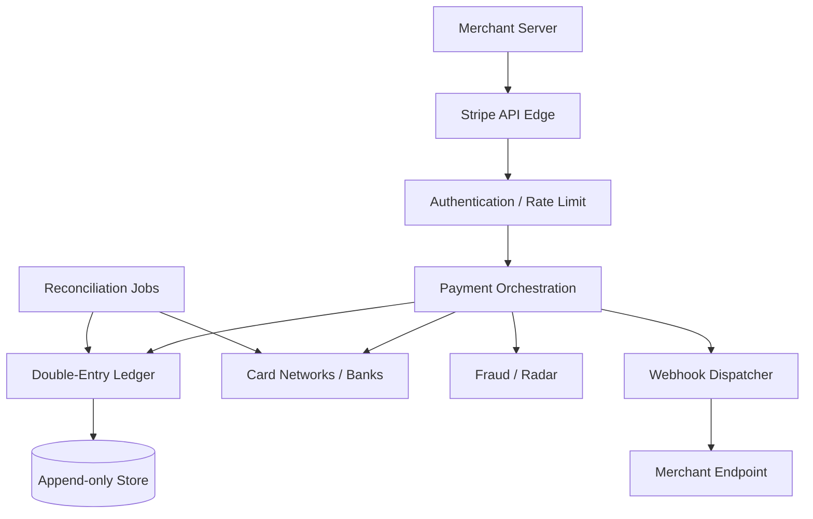
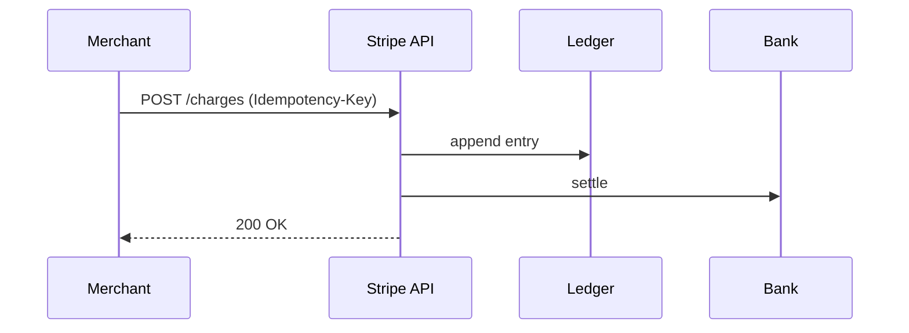

# Stripe Payment Platform Architecture

## 1. Business Context

Stripe provides **payment infrastructure as a service**, enabling businesses to accept payments, manage subscriptions, handle marketplaces, and move money globally via APIs and dashboards. Unlike consumer payment apps, Stripe's core product is **developer experience + financial correctness + regulatory coverage**—a high-stakes distributed system where bugs manifest as **lost money, duplicate charges, or compliance violations**.

Principal architects study Stripe for:

- **API-first design** with mandatory **idempotency**
- **Double-entry ledger** invariants
- **Webhook delivery** semantics and reconciliation
- **PCI scope minimization** via tokenization
- **Multi-region** deployment with strong audit trails
- **Saga-style** compensation across PSPs, banks, and internal services

This case study combines public Stripe engineering content with patterns from [Payment Platform](/docs/system-design/payment-platform). It is not an insider view of Stripe's proprietary systems.

## 2. Scale

Stripe processes **hundreds of billions of dollars** annually (public company filings—verify current 10-K). Scale dimensions:

| Dimension | Implication |
|-----------|-------------|
| API request rate | Global edge + rate limiting |
| Payment state machines | Millions of concurrent in-flight authorizations |
| Ledger entries | Append-only growth; immutable audit |
| Webhooks | At-least-once delivery to millions of endpoints |
| Reconciliation | Batch matching against card networks and banks |

Scale failures: **idempotency key collisions**, **ledger imbalance** from race bugs, **webhook storms** on merchant misconfiguration, **PSP timeout ambiguity** (charge succeeded but API timed out).

## 3. Functional Requirements

| API surface | Purpose |
|-------------|---------|
| PaymentIntents / Charges | Auth + capture flows |
| Customers, PaymentMethods | Vaulted instruments |
| Connect | Marketplace splits |
| Billing / Subscriptions | Recurring revenue |
| Payouts | Merchant settlement |
| Radar | Fraud scoring |
| Sigma / Reporting | Analytics |
| Webhooks | Event notifications |

Every mutating API must support **safe retries**—foundational requirement driving storage design.

## 4. Non-Functional Requirements

| NFR | Requirement |
|-----|-------------|
| Correctness | Zero net money creation/destruction in ledger |
| Durability | Acknowledged payments survive crashes |
| Latency | Auth p99 sub-second (card network bound) |
| Availability | 99.99%+ for payment APIs |
| Auditability | 7+ year immutable records (regulatory) |
| Security | PCI DSS Level 1 service provider |

**Safety over liveness**: during uncertainty, prefer **hold** or **manual review** over double charge.

## 5. Architecture Overview



*Figure 1: Payment orchestration with ledger as source of financial truth.*

**Control plane**: API keys, dashboard, configuration.

**Data plane**: charge path hot loop minimized for latency.

**Async plane**: webhooks, settlement files, reconciliation.

### 5.1 PaymentIntent state machine

Modern Stripe APIs center on **PaymentIntent** objects progressing through states reflecting card network reality:

`requires_payment_method` → `requires_confirmation` → `requires_action` (3DS) → `processing` → `succeeded` | `requires_capture` | `canceled`

Architects mirror external PSP state machines **internally**—never assume instant terminal states. UI and webhooks subscribe to transitions; ledger posts occur at defined boundaries (e.g., capture succeeded).

### 5.2 Connect marketplace money flow

**Connect** adds **connected accounts** for sellers. A charge may split:

- Platform fee → platform balance
- Transfer → connected account balance
- Later payout → seller bank

Each step is ledger entries with idempotent transfer IDs. **Destination charges** vs **separate charges and transfers** affect PCI and dispute liability—principal architects read Stripe Connect docs for the liability model, not only API shapes.

### 5.3 Reconciliation loop

Nightly (or continuous) jobs ingest **settlement files** from card networks. Match authorization IDs to internal PaymentIntent records. Discrepancies queue for human review—**never auto-adjust** merchant balances without audit trail. This loop closes the **unknown PSP timeout** window from the authorization path.

## 6. Data Model

**Payment object**: amount, currency, state, idempotency key, merchant, customer, payment method reference.

**Ledger entries**: accounts (merchant balance, Stripe fees, network clearing), debits/credits, transaction ID, immutable timestamp.

**Idempotency record**: key hash → response snapshot for 24h+ (Stripe documents idempotency behavior—verify current TTL).

**Events**: `charge.succeeded`, `payment_intent.payment_failed`—drives webhooks and internal consumers.

Double-entry invariant: **sum(debits) = sum(credits)** per transaction boundary.

## 7. Partitioning

- **Sharding** by merchant or payment ID for OLTP scale (implementation not fully public).
- **Ledger** often append-only per account shard with strict ordering.
- **Webhook delivery** partitioned by endpoint for parallelism and isolation.
- **Regional stacks** for data residency (EU, etc.).

Hot merchant: rate limits and dedicated capacity; fraud isolation.

## 8. Replication

- **Database replication** for durability (sync quorum within region for critical writes).
- **Cross-region**: async for DR; payments are region-affine for regulatory reasons.
- **Event log** replication for internal consumers ([Transactional Outbox](/docs/transactions/transactional-outbox) pattern).

## 9. Consistency

| Path | Consistency |
|------|-------------|
| Idempotent retry | Read-your-own-write on idempotency key |
| Ledger posting | Atomic with payment state transition |
| Webhooks | At-least-once; merchants must idempotent-process |
| Balance display | May lag settlement; document to users |
| Cross-service saga | Eventually consistent with compensation |

Not linearizable globally—**per-payment serializability** is the bar.

## 10. Availability

Degrade gracefully:

- Queue webhook retries with exponential backoff
- Circuit break unhealthy PSP routes
- Read-only mode rare—payments are revenue critical

**CAP at PSP boundary**: network partitions with card networks require **timeout rules** and reconciliation—not guessing success.

## 11. Failure Handling

| Failure | Handling |
|---------|----------|
| Client timeout after charge succeeded | Idempotency key returns same result |
| Duplicate webhook delivery | Merchant verifies event ID |
| PSP ambiguous response | Reconciliation job resolves |
| Ledger imbalance alert | Block payouts; page finance engineering |
| Chargeback after payout | Negative balance; clawback saga |

[Sagas](/docs/transactions/sagas) for multi-step flows: authorize → capture → transfer → payout with compensating refunds.

## 12. Security

- **Tokenization**: PAN never touches merchant servers (Stripe.js, Elements)
- **PCI scope reduction** for merchants using hosted fields
- **API keys** with restricted permissions; rotate regularly
- **Webhook signing** HMAC verification
- **Fraud ML** (Radar) with human review queues
- **Encryption** at rest and in transit; HSM for keys

See [Security Architecture Fundamentals](/docs/security/security-architecture-fundamentals).

## 13. Observability

- Request IDs across API and internal traces
- Metrics: authorization success rate, latency histograms, ledger imbalance detectors (should always be zero)
- Audit logs immutable for compliance
- Dashboard for merchants; internal ops tooling for support

SLI example: **successful authorization rate** excluding merchant-declined cards.

## 14. Cost Model

Stripe revenue model: **percentage + fixed fee** per transaction—architecture optimizes **cost per authorization** (compute, PSP pass-through) while maximizing reliability.

Internal cost drivers:

- Fraud ML inference
- Webhook delivery infrastructure
- Storage growth for ledger/events
- Multi-region compliance stacks

## 15. Evolution of Architecture

Public narrative highlights:

- Ruby monolith → service extraction
- API versioning and backward compatibility discipline
- Global expansion (payment methods, local rails)
- Connect and marketplace complexity
- Strong focus on **idempotency** and **state machines** in API design docs

## 16. Important Tradeoffs

| Tradeoff | Stripe bias |
|----------|-------------|
| Correctness vs latency | Reconcile ambiguous PSP responses |
| API simplicity vs surface area | Layered products (Connect, Billing) |
| Webhook reliability vs merchant load | Retries + signing |
| Strong typing in API | Extensive documentation + test mode |

## 17. Known Limitations

- External PSP/network rules constrain behavior
- Not all countries/payment methods supported uniformly
- Merchants must implement idempotent webhook handlers
- Instant payouts vs fraud risk tradeoff

## 18. Interview Lessons

**Must demonstrate**:

- Idempotency key storage and response replay
- Double-entry ledger for a $10 charge with $0.30 fee
- Handling PSP timeout (unknown state machine)
- PCI scope diagram for merchant integration

**Red flags**:

- "Just retry the charge until it works"
- No reconciliation story
- Single-entry accounting

## 19. Redesign Exercise

**Prompt**: Marketplace with 10,000 sellers; each checkout splits payment across 3 sellers + platform fee; handle partial refund when one seller fails KYC mid-payout.

Design ledger accounts, saga steps, idempotency boundaries, and reconciliation with bank files.

### Deep dive: idempotency implementation

On `POST /v1/payments` with `Idempotency-Key: uuid-v4`:

1. API gateway hashes key + merchant + route
2. Lookup idempotency table within TTL window
3. If hit: return **stored HTTP status + body** without re-executing side effects
4. If miss: begin transaction; insert key in `processing` state; execute; store response; commit

**Race**: two concurrent requests with same key—database unique constraint on `(merchant_id, idempotency_key)` ensures one wins; other waits or reads result.

**Safety**: prevents duplicate charges on client retry. **Liveness**: stuck `processing` rows need sweeper job to fail or complete after timeout.

### Deep dive: ledger worked example

Customer charged **$100.00**; Stripe fee **$2.90 + $0.30**; merchant net **$96.80**.

| Account | Debit | Credit |
|---------|-------|--------|
| Customer cash / card clearing | | $100.00 |
| Merchant payable | $96.80 | |
| Stripe revenue | $3.20 | |

Refund $20 partial: reverse proportional entries with new journal lines—never mutate original rows (append-only).

**Invariant check**: automated job sums all accounts hourly; any imbalance pages on-call.

### PSP timeout state machine

```
                    ┌─────────────┐
         timeout    │   UNKNOWN   │
    ┌──────────────►│  (no guess) │
    │               └──────┬──────┘
    │                      │ reconciliation
    ▼                      ▼
 PROCESSING            SUCCEEDED / FAILED
```

Never transition to `SUCCEEDED` without PSP confirmation or reconciliation match—**safety over user-visible latency**.

### Webhook delivery architecture

Events appended to outbox → dispatcher workers POST to merchant URL with signing secret. Retries with exponential backoff over hours/days. Merchants must:

- Verify signature
- Return 2xx quickly; process async
- Deduplicate by `event.id`

Stripe's reliability is **at-least-once**; merchant idempotency is mandatory for correct **exactly-once effect**.

### Compliance and PCI scope diagram (interview)

| Component | In PCI scope? |
|-----------|---------------|
| Merchant app using Stripe.js | Reduced SAQ A |
| Merchant server storing PAN | Full scope—avoid |
| Stripe vault | Stripe's scope as PSP |
| Webhook handler storing card data | Expands merchant scope |

### Interview scoring rubric

| Dimension | Weight | Strong signal |
|-----------|--------|---------------|
| Ledger correctness | 30% | Double-entry example on whiteboard |
| Idempotency | 25% | Key storage + concurrent retry |
| External uncertainty | 20% | PSP timeout without double charge |
| Webhooks | 15% | At-least-once + merchant dedup |
| Compliance | 10% | PCI scope boundaries |

## Supplementary Diagram


*Figure: Idempotent payment flow with ledger and settlement.*

## 20. References

- Stripe API documentation (idempotency, webhooks, PaymentIntents)
- [Payment Platform](/docs/system-design/payment-platform)
- [Idempotency](/docs/distributed-systems-foundations/idempotency)
- [Sagas](/docs/transactions/sagas)
- [Transactional Outbox](/docs/transactions/transactional-outbox)
- Kleppmann, *Designing Data-Intensive Applications* — Ch. 11 (stream processing, correctness)

### Appendix: dispute and chargeback lifecycle

Chargebacks arrive days or weeks after capture—a separate async workflow from authorization:

1. Network notifies dispute → `charge.dispute.created` webhook
2. Ledger holds merchant funds pending evidence
3. Evidence submission window (limited days)
4. Outcome: won/lost → ledger adjustment

Architects never conflate **authorization state machine** with **dispute state machine**—merchants need dashboards for both.

### Appendix: regulatory and regional considerations

Payment platforms operate under **PCI DSS** as service providers, regional licenses (e-money institutions in EU), and sanctions screening (OFAC). Architecture includes:

- Geo-fencing sensitive data storage
- Audit logs immutable per jurisdiction retention
- Data processing agreements with subprocessors

Principal interviews may ask how you'd **shard** European vs US customer data post-GDPR—payment method tokens and ledger partitions follow legal entity boundaries.

### Appendix: testing strategy

- **Test mode** API keys with deterministic card numbers triggering success/failure paths
- **Idempotency integration tests** firing duplicate concurrent POSTs
- **Ledger property tests** (generative) asserting zero imbalance after random operation sequences
- **Webhook signature verification** unit tests with rotated secrets

Financial systems invest heavily in **reconciliation simulators** replaying production traffic samples in shadow environments before deploy.

### Appendix: API versioning and backward compatibility

Stripe maintains multiple API versions via request header/date pinning. Architects at any payment company must:

- Never remove fields without deprecation window
- Additive schema changes only in minor versions
- Webhook payloads versioned separately from REST

Breaking merchants silently is unacceptable—**compatibility tests** run against top integrator SDK patterns.

### Appendix: relationship to generic payment platform design

Pair this case study with [Payment Platform](/docs/system-design/payment-platform) for interview preparation: generic chapter supplies ledger math and API shapes; Stripe case study grounds them in industry-leading idempotency and developer-experience practices observable in public documentation.

### Appendix: fraud and risk architecture (Radar)

Fraud systems score transactions **before** authorization capture using features: velocity, device fingerprint, billing geography mismatch, merchant category risk. Outcomes:

- Allow
- Block
- Require 3D Secure (`requires_action`)

Architects separate **risk service** from **ledger service**—false positive blocks lose revenue; false negatives create chargebacks. Human review queues handle edge cases with SLA.

### Appendix: principal-level interview question bank

1. API timeout after charge—merchant sees error, customer charged—fix architecture?
2. Draw ledger for $50 payment with $1.75 fee and 20% marketplace split.
3. Webhook endpoint down 6 hours—how merchant recovers state?
4. PCI scope for mobile app using Stripe SDK vs raw card form?
5. Design idempotency for `POST /refund` with network retries.

### Appendix: settlement timing and float

Card networks settle on T+1 or slower schedules—merchant **available balance** differs from **pending balance**. Architects model cash flow dashboards separately from authorization API latency; treasury teams depend on accurate pending vs available splits.

### Appendix: outage communication

Payment incidents require coordinated status page updates, merchant email, and internal war-room roles (incident commander, communications, ledger integrity verifier). Technical architecture includes **read-only mode** flags halting new captures while allowing status queries—prefer graceful degradation over silent wrong answers.

### Appendix: merchant integration patterns

| Pattern | PCI impact | Retry responsibility |
|---------|------------|---------------------|
| Hosted checkout | Lowest | Stripe + merchant webhooks |
| Elements (iframe fields) | Reduced | Merchant backend idempotency |
| Raw API with tokens | Moderate | Merchant stores customer IDs only |
| Server-side PAN | Highest—avoid | N/A |

Principal architects recommend the **lowest PCI scope** pattern meeting product requirements—security is a design constraint, not an audit afterthought.

### Appendix: multi-currency and FX

International payments involve **presentment currency**, **settlement currency**, and **FX rates** applied at network or platform layer. Ledger accounts must separate currency buckets—never sum USD and EUR without conversion metadata. Rounding rules (banker's rounding per currency exponent) must be consistent in code and reconciliation spreadsheets.

### Appendix: load testing payment paths

Load tests use test mode keys and synthetic cards—never production PANs. Scenarios include concurrent idempotent POSTs, webhook flood, and reconciliation job overlap with peak traffic. Success criteria: zero ledger imbalance, p99 auth latency within SLO, no unbounded webhook retry queue growth.

### Summary for principal interviews

Stripe-class platforms win on **correctness under retry** and **auditability under regulation**. Lead discussions with idempotency keys, double-entry ledger invariants, PSP timeout handling, and webhook at-least-once semantics—then expand to Connect splits, disputes, and PCI scope minimization as the scenario complexity increases. Treat every payment API as a state machine, not a CRUD endpoint.
