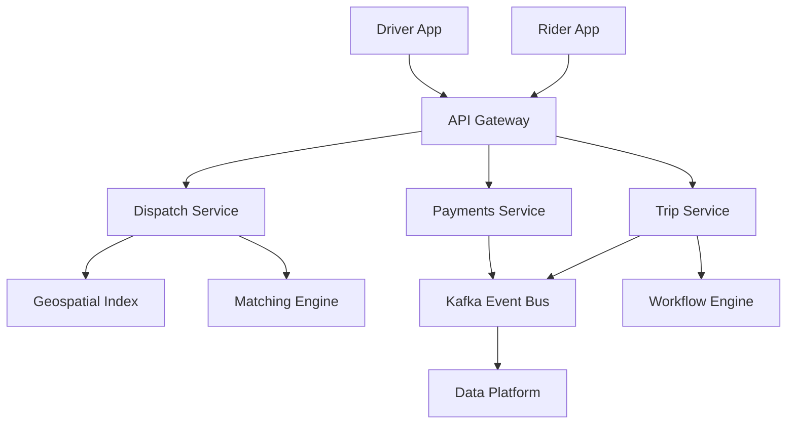
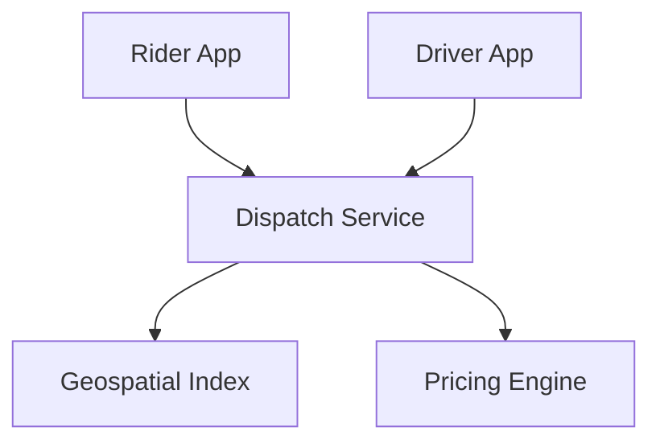

# Uber Platform Architecture at Scale

## 1. Business Context

Uber operates a **global mobility and delivery marketplace** connecting riders (or eaters) with drivers (or couriers) in real time, processing payments, pricing, mapping, fraud detection, and support at planetary scale. Unlike a single-product SaaS API, Uber is a **federation of domain services**—dispatch, trip state, pricing, maps, payments, identity—unified by mobile clients and operational tooling. Public engineering content describes evolution from a monolithic Python backend (early era) to **thousands of microservices**, **Kafka-centric data movement**, and specialized systems like **Cadence/Temporal** for workflows and **H3** for geospatial indexing.

Organizations study Uber not to copy its stack verbatim but to learn **marketplace architecture**: matching supply and demand under uncertainty, location streams at millions of updates per second, surge pricing feedback loops, and correctness when money and safety are on the line.

For principal architects, Uber is a case study in **domain-driven decomposition**, **event-driven integration**, and **graceful degradation** when GPS, networks, or human behavior violate assumptions. This document combines public Uber engineering blog posts, conference talks, and patterns from [Ride Sharing Platform](/docs/system-design/ride-sharing-platform). It is not an insider operational manual—avoid claiming unverified internal metrics.

## 2. Scale

Uber publicly discusses **billions of trips**, **millions of active drivers**, and **trillions of Kafka messages** over system lifetime in engineering materials (verify currency in primary sources). Scale dimensions:

| Dimension | Implication |
|-----------|-------------|
| Location updates | GPS every 1–4 seconds × active drivers globally |
| Match requests | Burst during events; sub-second targets in dense cities |
| Trip state | Durable lifecycle with legal and billing audit |
| Payments | Multi-currency, multi-PSP, ledger correctness |
| Data platform | Kafka → streaming/batch analytics (public lake narratives) |
| Microservices | High fan-out RPC; dependency graph risk |

Scale failures: **double driver assignment**, **surge pricing bugs** causing PR crises, **stale location matching**, **payment duplicate capture**, **cascading outage** from shared dependency (identity, maps). Principal analysis quantifies **per-city sharding** and **blast radius** per domain.

## 3. Functional Requirements

Uber-class platforms must support:

| Domain | Capabilities |
|--------|--------------|
| Rider | Request ride, track driver, pay, rate, support |
| Driver | Go online, receive offers, navigate, earnings |
| Dispatch | Match rider to driver; prevent double booking |
| Trip | State machine: requested → accepted → ongoing → completed |
| Pricing | Fare estimate, surge, tolls, promotions |
| Maps | Routing, ETA, traffic ML |
| Payments | Vault, charge, split, payout, refunds |
| Identity | Auth, fraud, device trust |
| Notifications | Push/SMS for trip events |

**Correctness hotspots**: dispatch reservation, fare finalization, driver payouts—require idempotency and audit trails per [Payment Platform](/docs/system-design/payment-platform).

## 4. Non-Functional Requirements

| NFR | Target / behavior |
|-----|-------------------|
| Match latency | Low seconds p99 in urban core (product-dependent) |
| Location freshness | Stale GPS disqualifies driver from match |
| Trip durability | Survive client crash mid-trip |
| Availability | Degrade features before total outage |
| Global | Multi-region with data residency constraints |
| Safety | Traceable trip history; SOS flows |

**Consistency** is **domain-specific**: dispatch needs atomic driver lock; analytics tolerates eventual Kafka lag. See [CAP Theorem](/docs/consistency/cap-theorem) and [PACELC](/docs/consistency/pacelc).

## 5. Architecture Overview



*Figure 1: Simplified domain view—dispatch and trip paths are latency-critical; Kafka decouples analytics.*

**Mobile clients** communicate via API gateway with authentication, rate limiting, and protocol translation (REST/gRPC).

**Dispatch path** is synchronous and latency-sensitive—geospatial index queries nearby drivers, scoring ranks candidates, transactional lock assigns driver.

**Async path** publishes trip and payment events to **Kafka** for fraud, analytics, and downstream consumers per [Kafka Architecture](/docs/messaging-and-streaming/kafka-architecture).

Link [Event-Driven Architecture](/docs/messaging-and-streaming/event-driven-architecture) for integration patterns.

## 6. Data Model

Domains own data stores (pattern—specific stores vary over time):

| Entity | Typical storage pattern |
|--------|-------------------------|
| Driver location | In-memory/geospatial index; short TTL |
| Trip | Durable row/document with state machine version |
| User profile | Document or relational service DB |
| Fare quote | Ephemeral cache + immutable trip receipt |
| Payment intent | Ledger-oriented store |
| Event log | Kafka topics with retention policies |

**Trip state machine** (conceptual):

```
REQUESTED → MATCHING → ACCEPTED → ARRIVED → ONGOING → COMPLETED
                ↓           ↓
            CANCELLED   CANCELLED
```

Each transition carries **monotonic version** for optimistic concurrency.

**H3 hexagonal index** (public Uber open source): hierarchical geospatial cells for aggregating supply/demand and surge geofences—see [Ride Sharing Platform](/docs/system-design/ride-sharing-platform).

## 7. Partitioning

Geographic **sharding** dominates:

| Axis | Approach |
|------|----------|
| City / metro | Dispatch pool scoped to operational zone |
| Geohash / H3 cell | Location index partitions |
| User ID | Profile and trip history sharding |
| Trip ID | UUID global uniqueness |
| Kafka topic | Partition by trip_id or region |

**Cross-city trips** (airport runs) require boundary handling—architects define **handoff** between regional dispatch pools.

Hot events (stadium exit) create **localized thundering herds**—pre-position supply and scale matching workers per cell.

## 8. Replication

**OLTP services**: regional databases with replication for durability—strong consistency within shard for trip state transitions.

**Kafka**: replicated partitions across brokers; consumers track offsets—at-least-once processing requires idempotent consumers.

**Caches** (driver locations): replication not authoritative—source of truth is latest GPS stream with timestamp.

**Multi-region**: active-active for read paths where possible; write routing may favor **home region** per entity for regulatory compliance.

Contrast [Primary-Secondary Replication](/docs/replication/primary-secondary-replication) vs [Leaderless Replication](/docs/replication/leaderless-replication) in different subsystems.

## 9. Consistency

| Operation | Consistency need |
|-----------|------------------|
| Driver assignment | Atomic compare-and-set; prevent double booking |
| Trip state transition | Strong per trip ID |
| Surge multiplier publish | Eventual across cells acceptable (seconds) |
| ETA display | Stale within bounded window |
| Analytics dashboards | Eventual via stream lag |

**Dispatch race**: two riders must not receive same driver—use **transactional lock** or **optimistic versioning** with retry. Failed match returns rider to pool.

**Sagas** coordinate cross-service flows (trip complete → charge → receipt) per [Sagas](/docs/transactions/sagas)—compensate on payment failure.

## 10. Availability

Uber degrades **non-critical features** before dispatch—public postmortems emphasize prioritizing trip completion over promotions.

Failure modes:

- **Maps provider outage**: fallback ETA; cached routes
- **Payment PSP timeout**: complete trip; async charge retry
- **Kafka lag**: analytics stale; core trip continues if sync path isolated
- **Identity outage**: block new sessions; allow active trips
- **Cellular loss mid-trip**: last known location; reconciliation on reconnect

**Chaos and game days** culture aligns with [Chaos Engineering](/docs/reliability-and-resilience/chaos-engineering).

## 11. Failure Handling

| Failure | Response |
|---------|----------|
| Driver rejects offer | Re-match next candidate |
| Rider cancel during match | Release driver lock |
| GPS stale | Exclude driver from pool |
| Payment decline post-trip | Debt collection workflow; account flag |
| Duplicate request | Idempotency key on trip create |
| Service timeout | Circuit breaker; partial response |

**Idempotency** on trip creation and payment APIs mandatory—[Idempotency](/docs/distributed-systems-foundations/idempotency).

**Workflow engine** (Cadence/Temporal class) recovers long-running processes after worker crash—human tasks for support escalation.

## 12. Security

- **Authentication**: OAuth tokens; device binding
- **PII**: encrypt rider/driver contact; minimize log exposure
- **Payment**: PCI scope reduction via tokenization—[Payment Platform](/docs/system-design/payment-platform)
- **Fraud**: real-time scoring on trip and payment events
- **API abuse**: rate limits per device/IP
- **Internal**: mTLS between services; zero trust direction

Principal review: trip data retention for legal holds; regional privacy (GDPR deletion propagating to Kafka compacted topics challenges).

See [Security Architecture Fundamentals](/docs/security/security-architecture-fundamentals).

## 13. Observability

Uber publicly pioneered **distributed tracing** at scale (Jaeger open source narrative):

| Signal | Use |
|--------|-----|
| Traces | End-to-end match latency breakdown |
| Metrics | QPS, error rate, pool depth per city |
| Logs | Structured trip lifecycle (PII scrubbed) |
| Real-time dashboards | Supply/demand imbalance |
| SLOs | Match latency, payment success rate |

Link [Distributed Tracing](/docs/observability/distributed-tracing) and [SLO, SLI, and Error Budgets](/docs/reliability-and-resilience/slo-sli-error-budgets).

**Cardinality caution**: high-cardinality labels (per driver) explode metrics cost—aggregate at H3 cell level.

## 14. Cost Model

| Driver | Notes |
|--------|-------|
| Compute | Microservice fleets; autoscale per city time zone |
| Kafka | Storage retention; cross-AZ bandwidth |
| Maps/routing | Per-request licensing to providers |
| Payments | Interchange and PSP fees dominate unit economics |
| Data warehouse | Trip event history for ML pricing |
| Mobile push | Notification provider costs |

**Cost optimization**:

- Archive cold trip detail to cheaper storage
- Right-size Kafka retention per topic class
- Edge caching for static rider content (CDN patterns)
- ML inference batch vs real-time tradeoffs for ETA

FinOps: [Cloud Cost Optimization](/docs/cost-and-finops/cloud-cost-optimization).

## 15. Evolution of Architecture

**Public narrative arc** (verify in primary sources):

- Monolith → microservices (2014–2016 era discussions)
- RPC framework evolution (Thrift/gRPC-class)
- Kafka as nervous system
- Jaeger tracing
- H3 open source (2018)
- Cadence workflow platform
- Domain-oriented service ownership ("DOMA" style governance in later materials)

Lesson: **decompose by business capability**, not technology fashion—each split buys autonomy at coordination cost.

See [Service Decomposition and DDD](/docs/microservices/service-decomposition-and-ddd).

## 16. Important Tradeoffs

| Choice | Benefit | Cost |
|--------|---------|------|
| Microservices | Team autonomy | Distributed debugging; dependency graphs |
| Sync dispatch path | Low match latency | Harder to scale than pure async |
| Kafka everywhere | Decoupling | Eventual consistency; schema governance |
| Surge pricing | Supply/demand balance | Customer backlash risk |
| Global platform | Economies of scale | Regulatory fragmentation |
| Strong trip lock | Safety/correctness | Contention in hot zones |
| vs modular monolith | Simpler early | Later extraction pain |

## 17. Known Limitations

- **Marketplace fairness** vs efficiency—algorithmic bias concerns
- **Regulatory** variance by jurisdiction (employee classification, data residency)
- **Operational complexity** of thousands of services
- **Testing** production-like match scenarios difficult
- **Legacy debt** in long-lived domains
- Public details incomplete—do not assume current internal stack

## 18. Interview Lessons

**Strong candidates**:

- Design geospatial index + atomic driver lock
- Separate sync dispatch from async analytics
- Explain surge as feedback control loop
- Trip state machine with idempotent APIs
- Discuss blast radius of shared Kafka cluster

**Follow-ups**:

- How handle airport queue with 500 drivers?
- Rider sees driver circling—debug trace path?
- Payment succeeded but trip not completed—saga compensation?

**Red flags**:

- Single global database for driver locations
- No idempotency on trip create
- Ignoring stale GPS

Practice with [Ride Sharing Platform](/docs/system-design/ride-sharing-platform) and [System Design Mock](/docs/mock-interviews/system-design-mock).

### Interview scoring rubric (principal)

| Dimension | Weight | Strong signal |
|-----------|--------|---------------|
| Dispatch / concurrency | 30% | Driver lock; double-book prevention |
| Geospatial design | 25% | H3/cell sharding; stale GPS |
| Event architecture | 20% | Kafka vs sync path separation |
| Payments / sagas | 15% | Idempotency; compensation |
| Degradation | 10% | Priority ordering under failure |

## 19. Redesign Exercise

**Prompt**: Uber launches in a new megacity. Launch night: match latency p99 exceeds 30 seconds; drivers report accepting one trip while app shows another.

**Tasks**:

1. Diagnose double-booking vs client sync bug vs stale index.
2. Propose H3 cell sharding with per-cell matching workers.
3. Add distributed tracing spans for match pipeline.
4. Define driver lock TTL and GPS staleness threshold.
5. Design degradation: pause promotions before dispatch.

**Evaluation rubric**: concurrency control (35%), geospatial design (25%), observability (20%), degradation (20%).

### Deep dive: match scoring

Rank drivers by ETA, acceptance rate, fairness rotation, vehicle type—not purely distance. Batch offers in high-density cells to reduce RPC churn.

### Deep dive: payment saga

Trip `COMPLETED` → emit event → payment service charges → on failure, retry with backoff → escalate to support workflow after N failures; never double-charge—idempotency key = `trip_id`.

### Deep dive: surge control loop

Supply (online drivers per H3 cell) and demand (open ride requests) feed multiplier service. Publish to dispatch and rider UI with seconds-level eventual consistency—incorrect multiplier causes fairness incidents; audit multiplier changes.

## Supplementary Diagram


*Figure: Ride-matching dispatch with geospatial indexing.*

## 20. References

- Uber Engineering Blog (official)
- Uber H3 geospatial index (open source documentation)
- Jaeger tracing project (CNCF)
- [Ride Sharing Platform](/docs/system-design/ride-sharing-platform)
- [Kafka Architecture](/docs/messaging-and-streaming/kafka-architecture)
- [Event-Driven Architecture](/docs/messaging-and-streaming/event-driven-architecture)
- [Payment Platform](/docs/system-design/payment-platform)
- [Distributed Tracing](/docs/observability/distributed-tracing)
- [Service Decomposition and DDD](/docs/microservices/service-decomposition-and-ddd)
- [Sagas](/docs/transactions/sagas)

### Appendix: Uber vs generic ride-sharing design

| Concern | Generic design | Uber-scale nuance |
|---------|----------------|-------------------|
| Geospatial index | Geohash quadtree | H3 aggregation; city ops |
| Integration | Monolith modules | Kafka + hundreds of services |
| Observability | Logs | High-cardinality tracing culture |
| Pricing | Static | ML + surge loops |
| Compliance | Single region | Multi-jurisdiction platform |

Principal architects extract **patterns** (match locking, event sourcing for analytics) without cargo-culting **organizational scale** (microservice count) inappropriate to their company stage.

### Appendix: Kafka topic design

| Topic class | Partition key | Retention | Consumers |
|-------------|---------------|-----------|-----------|
| `trip.lifecycle` | `trip_id` | Days–weeks | Fraud, analytics, support |
| `driver.location` | `driver_id` | Hours | Real-time index (compact or stream) |
| `payment.events` | `trip_id` | Years (compliance) | Ledger, reconciliation |
| `surge.updates` | `h3_cell` | Hours | Dispatch, rider app cache |

Ordering per `trip_id` requires consistent partition key. High-volume location topics may use **separate pipeline** from trip lifecycle to avoid head-of-line blocking per [Kafka Architecture](/docs/messaging-and-streaming/kafka-architecture).

Consumers must be **idempotent**—replay and at-least-once delivery are normal.

### Appendix: multi-region and DR

**Trip in progress** favors completing in home region—cross-region failover mid-trip is complex. Architectures define:

- **Regional API gateways** routing to regional dispatch pools
- **Data residency** for PII per jurisdiction
- **Read replicas** for trip history; writes pinned to region
- **Kafka mirroring** or regional clusters with aggregate analytics lag acceptable

RTO/RPO for dispatch (seconds/minutes) differs from analytics warehouse (hours)—document per tier per [Disaster Recovery and Multi-Region](/docs/reliability-and-resilience/disaster-recovery-and-multi-region).

### Appendix: service mesh and RPC at scale

Public materials reference high internal RPC volume. Principal lessons (pattern-level, not vendor-specific):

- **Timeouts and retries** with jitter on dispatch calls—avoid retry storms
- **Bulkheads** isolating maps dependency from core match path
- **mTLS** and service identity per [Service Mesh and Sidecars](/docs/microservices/service-mesh-and-sidecars)
- **Circuit breakers** when downstream rating service degrades—match still works

Over-microservicing without ownership boundaries creates **distributed monolith**—worse than modular monolith for incident response.

### Appendix: notifications and mobile client sync

Trip events trigger push notifications via a dedicated [Notification Platform](/docs/system-design/notification-platform) pattern—decoupled from dispatch hot path. **At-least-once** delivery means clients must reconcile with **trip version** on app foreground: fetch latest trip state if push missed during airplane mode.

WebSocket or gRPC streaming channels carry live driver location to rider map—separate from Kafka analytics pipeline with lower latency budget. Architects define **heartbeat** and **reconnect with exponential backoff** on flaky cellular networks. Double-booking bugs often involve **client showing stale local cache** while server assigned driver—version vectors or `ETag` on trip resource prevent UI divergence.

### Appendix: resilience patterns in marketplace peaks

During New Year's Eve or stadium events, apply [Resilience Patterns](/docs/microservices/resilience-patterns): bulkhead matching workers per H3 cell, shed load on non-critical features (promotions, referrals), and cap concurrent match attempts per rider. **Backpressure** on location ingest prevents index overload—sample or coalesce GPS updates when cell exceeds threshold. Document explicit **degradation tiers** in runbooks so incident commanders know which levers exist before total outage.
