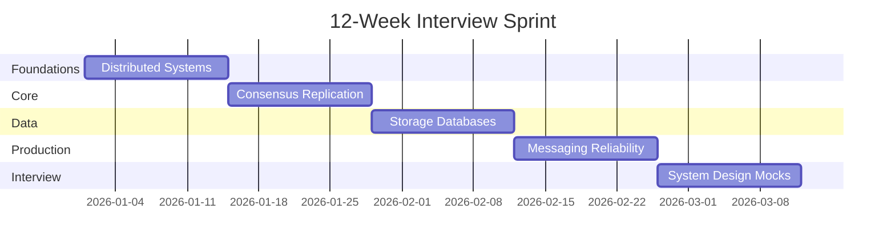

# 12-Week Interview Sprint

Best for **active applications**. This path prioritizes high-impact topics for principal-level system design and distributed-systems interviews. Each phase pairs curriculum chapters with **timed real-world scenario walkthroughs** — see [Real-World Interview Prep](/docs/start-here/real-world-interview-prep) for the STEP framework.

*Figure: 12-week sprint timeline across foundation, core, data, production, and interview phases.*

## Overview

| Weeks | Focus |
|-------|-------|
| 1–2 | Distributed-systems fundamentals, networking, time, CAP, consistency |
| 3–4 | Replication, quorums, Raft, Paxos, distributed locks |
| 5–6 | Storage engines, distributed databases, transactions |
| 7–8 | Kafka, streaming, caching, microservices, reliability |
| 9–10 | System design, multi-region, AWS, security, observability |
| 11–12 | AI platforms, leadership, behavioral, company prep, mock interviews |
| **8–9 (if coding confirmed)** | [Coding maintenance](/docs/coding-preparation/practice-routine) — design-adjacent problems, not LeetCode marathon |

## Week-by-Week Plan

### Weeks 1–2: Foundations and Consistency

**Goals:** Explain partial failure, safety vs. liveness, system models, logical time, CAP, PACELC, and consistency models from first principles.

**Read:**

- [Distributed Systems Foundations](/docs/distributed-systems-foundations/overview) — especially [Partial Failure](/docs/distributed-systems-foundations/partial-failure) and [Idempotency](/docs/distributed-systems-foundations/idempotency)
- [Time, Ordering, and Coordination](/docs/time-ordering-and-coordination/overview)
- [Consistency](/docs/consistency/overview)

**Real-world scenario (45 min timed):**

- [Stripe Payment Idempotency](/docs/real-world-scenarios/stripe-payment-idempotency) — ambiguous timeouts and duplicate-charge prevention

**Practice:**

- Draw failure scenarios for network partitions
- Answer: "What consistency model would you choose for a global notification system and why?"

**Lab:** [Vector clocks](/docs/time-ordering-and-coordination/vector-clocks#25-hands-on-exercise) (`:8097`) and [Idempotent API](/docs/distributed-systems-foundations/idempotency#25-hands-on-exercise) (`:8081` / `:8091` Docker); graduate to [Stripe full stack](/docs/real-world-scenarios/stripe-payment-idempotency#hands-on-lab-local) (`:8080`)

---

### Weeks 3–4: Replication and Consensus

**Goals:** Understand quorums, leader election, Raft, and Paxos safety arguments.

**Read:**

- [Replication](/docs/replication/overview)
- [Consensus](/docs/consensus/overview)

**Real-world scenario (45 min timed):**

- [Google Spanner Global Consistency](/docs/real-world-scenarios/google-spanner-global-consistency) — TrueTime, external consistency, global transactions

**Practice:**

- Whiteboard Raft leader election and log replication
- Answer: "How does Raft guarantee committed entries are not lost?"

**Lab:** [Raft](/docs/consensus/raft#25-hands-on-exercise) (`:8098`) and [Replicated KV](/docs/consistency/quorum-systems#25-hands-on-exercise) (`:8095`)

---

### Weeks 5–6: Storage and Databases

**Goals:** B-trees vs. LSM trees, DynamoDB/Cassandra/Spanner tradeoffs, transaction isolation.

**Read:**

- [Storage Engines](/docs/storage-engines/overview)
- [Distributed Databases](/docs/distributed-databases/overview)
- [Transactions](/docs/transactions/overview)

**Real-world scenarios (45 min each, timed):**

- [Amazon DynamoDB Eventual Consistency](/docs/real-world-scenarios/amazon-dynamodb-eventual-consistency) — partition keys, quorums, session guarantees
- [Shopify Transactional Outbox](/docs/real-world-scenarios/shopify-transactional-outbox) — dual-write problem and reliable event publishing

**Practice:**

- Compare DynamoDB vs. Cassandra for a write-heavy workload
- Design partition keys for a multi-tenant SaaS

**Lab:** [Transactional outbox](/docs/transactions/transactional-outbox#25-hands-on-exercise) (`:8092`), [Eventual consistency](/docs/consistency/eventual-consistency#25-hands-on-exercise) (`:8099`), and [Saga orchestration](/docs/transactions/sagas#25-hands-on-exercise) (`:8093`)

---

### Weeks 7–8: Messaging, Caching, and Reliability

**Goals:** Kafka delivery semantics, cache invalidation, circuit breakers, SLOs.

**Read:**

- [Messaging and Streaming](/docs/messaging-and-streaming/overview)
- [Caching](/docs/caching/overview)
- [Microservices](/docs/microservices/overview)
- [Reliability and Resilience](/docs/reliability-and-resilience/overview)

**Real-world scenarios (45 min each, timed):**

- [Netflix Cascading Failure](/docs/real-world-scenarios/netflix-cascading-failure) — circuit breakers, bulkheads, retry storms
- [Slack Message Delivery](/docs/real-world-scenarios/slack-message-delivery) — ordering, Kafka, delivery semantics

**Practice:**

- Design idempotent consumers for at-least-once delivery
- Answer: "How do you prevent cache stampede?"

**Lab:** [Kafka streams](/docs/messaging-and-streaming/kafka-architecture#25-hands-on-exercise) (`:8094`) and [Chaos testing](/docs/reliability-and-resilience/chaos-engineering#25-hands-on-exercise) (`:8103`)

---

### Weeks 9–10: System Design and Cloud

**Goals:** Complete 4+ system-design exercises. Multi-region active-active. AWS service selection with cost tradeoffs.

**Read:**

- [System Design](/docs/system-design/overview)
- [Cloud Architecture](/docs/cloud-architecture/overview)
- [Security](/docs/security/overview)
- [Observability](/docs/observability/overview)

**Real-world scenarios (45 min each, timed):**

- [Uber Ride Matching](/docs/real-world-scenarios/uber-ride-matching) — geospatial indexing, real-time dispatch
- [Airbnb Distributed Rate Limiting](/docs/real-world-scenarios/airbnb-distributed-rate-limiting) — global quotas and fairness
- [AWS S3 Multi-Region DR](/docs/real-world-scenarios/aws-s3-multi-region-dr) — durability, RPO/RTO, failover

**Practice:**

- Design a global file-transfer platform (use personal experience)
- Design a distributed rate limiter
- Complete one architecture review exercise

**Lab:** [Rate limiter](/docs/system-design/distributed-rate-limiter#25-hands-on-exercise) (`:8101`), [Multi-region DR](/docs/cloud-architecture/multi-region-architecture#25-hands-on-exercise) (`:8102`), [Observability](/docs/observability/observability-fundamentals#25-hands-on-exercise) (`:8104`), and [Distributed locks](/docs/consensus/distributed-leases#25-hands-on-exercise) (`:8100`)

**Coding (if recruiter confirms coding rounds):**

- Read [Coding Preparation](/docs/start-here/coding-preparation)
- Weeks 8–9: follow [Practice Routine](/docs/coding-preparation/practice-routine) — 3 design-adjacent problems per week
- Complete one [Coding Mock Interview](/docs/coding-preparation/coding-mock-interview) before onsite

---

### Weeks 11–12: AI, Leadership, and Interview Prep

**Goals:** AI platform architecture, leadership stories, company-specific prep, 2+ mock interviews.

**Read:**

- [AI Distributed Systems](/docs/ai-distributed-systems/overview)
- [Agentic AI Architecture](/docs/agentic-ai-architecture/overview)
- [Architecture Leadership](/docs/architecture-leadership/overview)
- [Company-Specific Preparation](/docs/company-specific-preparation/overview)
- [Real-World Interview Prep](/docs/start-here/real-world-interview-prep) — STEP framework and practice routine

**Real-world scenarios (45 min each, timed):**

- [Meta News Feed Design](/docs/real-world-scenarios/meta-news-feed-design) — fan-out, caching, hot keys
- [Dropbox File Sync Conflicts](/docs/real-world-scenarios/dropbox-file-sync-conflicts) — eventual consistency, conflict resolution
- [OpenAI LLM Gateway](/docs/real-world-scenarios/openai-llm-gateway) — routing, budgets, tail latency

**Practice:**

- Prepare 5 STAR behavioral stories from production experience
- Complete 2 timed mock system-design sessions (60 minutes each) using scenarios as prompts
- Review cheat sheets in `cheat-sheets/`

**Lab:** [RAG platform](/docs/ai-distributed-systems/rag-architecture#25-hands-on-exercise) (`:8105`) and [Agent platform](/docs/agentic-ai-architecture/agent-platform-architecture#25-hands-on-exercise) (`:8106`)

## Daily Time Commitment

- **Minimum:** 1–2 hours on weekdays, 3–4 hours on weekends
- **Recommended:** 15–20 hours per week

## Success Criteria

By week 12 you should be able to:

1. Explain consensus, consistency, and replication with safety/liveness arguments
2. Complete a principal-level system design in 45–60 minutes
3. Critique architectures for hidden failure modes
4. Communicate tradeoffs to technical and executive audiences
5. Tell 5+ credible leadership stories from production experience
6. Implement rate limiter or idempotent handler pseudo-code in 25 minutes (if coding rounds confirmed)
