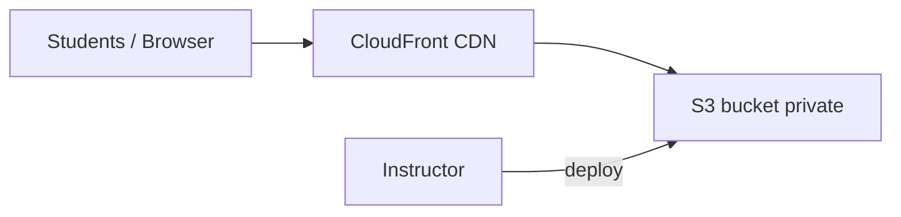
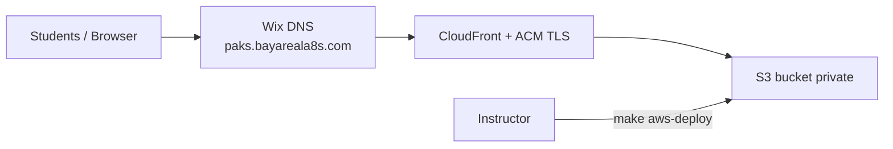

# AWS Deployment Guide

This guide covers hosting the portal on **AWS S3 + CloudFront** so you and students can access it via a public HTTPS URL (~$0–1/month for personal use).

## Architecture



## One-Time Setup

### Prerequisites

- [AWS CLI](https://aws.amazon.com/cli/) configured (`aws sts get-caller-identity`)
- Node.js 20+ and npm
- IAM permissions: CloudFormation, S3, CloudFront

### Create infrastructure

```bash
make aws-setup
```

This creates the CloudFormation stack and writes `deploy/aws.env` with your bucket, CloudFront ID, and portal URL.

**Wait 5–15 minutes** for CloudFront to become active on first run.

### Deploy the site

```bash
make aws-deploy
```

Share the **Portal URL** from the output with students (printed after setup and deploy).

## Student Access

Students only need the CloudFront URL — no AWS account required:

1. Open the portal URL (e.g. `https://d1234abcd.cloudfront.net`)
2. Click **Get Started** or go to **Start Here → Welcome**
3. Follow the [12-Week Interview Sprint](/docs/start-here/12-week-learning-path)

## Updating Content

After editing docs locally:

```bash
make aws-deploy
```

Or push to `main` on GitHub (requires [GitHub Actions secrets](https://github.com/hbhadra/principal-architect-knowledge-system/settings/secrets/actions)):

| Secret | Value |
|--------|-------|
| `AWS_ACCESS_KEY_ID` | IAM access key |
| `AWS_SECRET_ACCESS_KEY` | IAM secret key |
| `AWS_REGION` | e.g. `us-west-2` |
| `S3_BUCKET` | From `deploy/aws.env` |
| `CLOUDFRONT_DISTRIBUTION_ID` | From `deploy/aws.env` |
| `SITE_URL` | e.g. `https://d1234.cloudfront.net` |

## Custom Domain (BayLearn-style branded URL)

Host the portal on a subdomain like [BayLearn](https://baylearn.bayareala8s.com/) — e.g. **`https://paks.bayareala8s.com`** instead of the default `*.cloudfront.net` URL.

### DNS: Wix (bayareala8s.com)

**`bayareala8s.com` is hosted on Wix** (`ns0.wixdns.net`). All DNS records for subdomains like `paks` or `baylearn` are managed in:

**Wix → Domains → `bayareala8s.com` → DNS Records**

Do **not** rely on the Route 53 hosted zone in AWS for public DNS — it is not authoritative unless you migrate nameservers to Route 53.

### Recommended subdomain names

| Subdomain | Example URL | Notes |
|-----------|-------------|-------|
| **paks** | `https://paks.bayareala8s.com` | Short for Principal Architect KS |
| **knowledge** | `https://knowledge.bayareala8s.com` | Matches product name |
| **architect** | `https://architect.bayareala8s.com` | Interview-focused branding |

You need:

1. **ACM certificate** in **us-east-1** (CloudFront requirement — not your S3 region)
2. **DNS validation CNAME** in **Wix**
3. **CloudFront alternate domain name** + **CNAME in Wix** → your distribution

### Architecture (Wix DNS)



### Wix setup checklist (paks.bayareala8s.com)

**Record 1 — ACM validation** (one-time; certificate already requested in AWS):

| Wix field | Value |
|-----------|-------|
| **Host name** | `_9dbdf38ca242ddc073130aa19bbb0a6c.paks` |
| **Type** | CNAME |
| **Value / Points to** | `_4a710f4d7c8f7ba986fcb883f7e16fa7.jkddzztszm.acm-validations.aws` |

Certificate ARN: `arn:aws:acm:us-east-1:277374794397:certificate/bb3189ca-d056-4e4e-84dd-4ade6b24cba1`

Wait until ACM status is **ISSUED** (AWS Console → Certificate Manager → **us-east-1**), usually 5–30 minutes after adding the CNAME in Wix.

**Record 2 — After ACM is issued**, attach domain to CloudFront:

```bash
ACM_CERTIFICATE_ARN=arn:aws:acm:us-east-1:277374794397:certificate/bb3189ca-d056-4e4e-84dd-4ade6b24cba1 \
CUSTOM_DOMAIN=paks.bayareala8s.com \
make aws-domain

make aws-deploy
```

**Record 3 — Point subdomain to CloudFront** in Wix:

| Wix field | Value |
|-----------|-------|
| **Host name** | `paks` |
| **Type** | CNAME |
| **Value / Points to** | `d2ambt9h3ai0tg.cloudfront.net` |

Update GitHub Actions secret `SITE_URL` to `https://paks.bayareala8s.com` if using CI deploy.

### Route 53 (optional — not used for Wix-hosted domains)

If you later **migrate** `bayareala8s.com` nameservers from Wix to Route 53, `make aws-domain` can create validation and alias records automatically. Until then, use the Wix checklist above.

<details>
<summary>Manual AWS setup (advanced)</summary>

1. Request certificate in **us-east-1**:

```bash
aws acm request-certificate \
  --domain-name paks.bayareala8s.com \
  --validation-method DNS \
  --region us-east-1
```

2. Add validation CNAME in **Wix** (not Route 53 for bayareala8s.com).

3. Update CloudFormation stack (leave `Route53HostedZoneId` empty for Wix):

```bash
aws cloudformation deploy \
  --stack-name principal-architect-ks-prod \
  --template-file infrastructure/cloudfront-static-site.yaml \
  --parameter-overrides \
    ProjectName=principal-architect-ks \
    Environment=prod \
    CustomDomainName=paks.bayareala8s.com \
    AcmCertificateArn=arn:aws:acm:us-east-1:ACCOUNT:certificate/UUID \
    Route53HostedZoneId= \
  --region us-west-2
```

4. Add Wix CNAME `paks` → `d2ambt9h3ai0tg.cloudfront.net` and `make aws-deploy`.

</details>

### After custom domain is live

| Item | Action |
|------|--------|
| **Share with students** | Use `https://paks.bayareala8s.com` |
| **GitHub `SITE_URL` secret** | Update for canonical links in sitemap/OG tags |
| **CloudFront URL** | Still works — both URLs serve the same content |
| **BayLearn** | Link from [baylearn.bayareala8s.com](https://baylearn.bayareala8s.com/) to PAKS docs |

## Cost

| Usage | Monthly cost |
|-------|--------------|
| Just you | ~$0–1 |
| You + students (low traffic) | ~$1–3 |
| Custom domain (Route 53) | +$0.50 |

## Troubleshooting

| Issue | Fix |
|-------|-----|
| 403 from CloudFront | Wait for stack to finish; run `make aws-deploy` |
| Stale content after deploy | Invalidation runs automatically; wait 1–2 min |
| Broken links on deploy | Run `npm run validate:links` locally first |
| SPA routes 404 | CloudFormation template sets 403/404 → `index.html` |

## Local Development

```bash
npm start
# http://localhost:3000
```

Local dev does not require AWS. Deploy only when content is ready to share.
